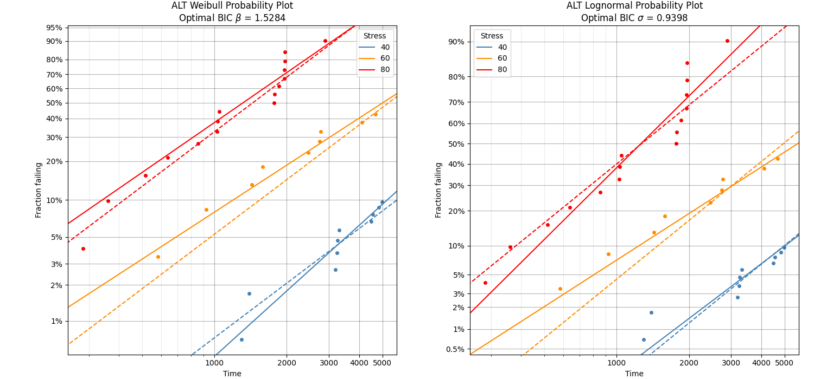
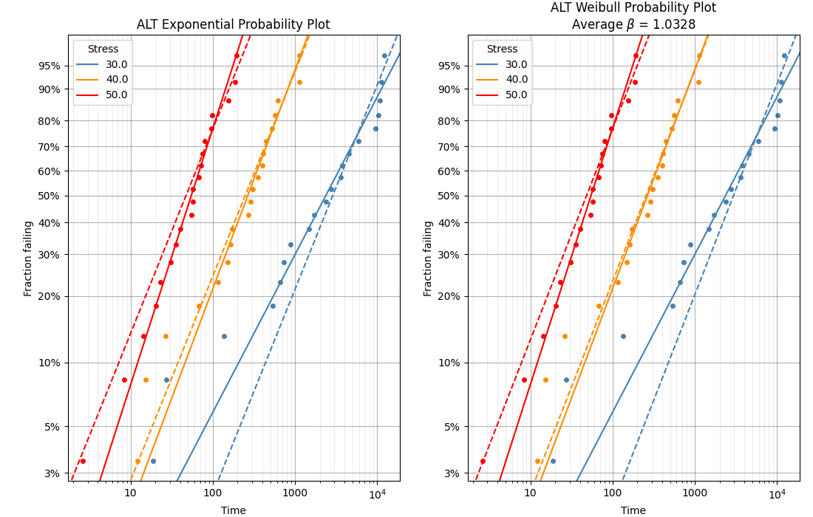
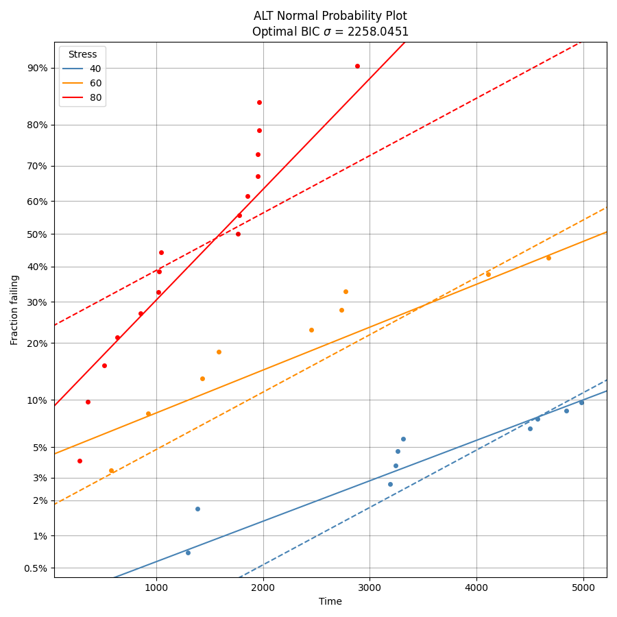

.. image:: images/logo.png

-------------------------------------

ALT probability plots
'''''''''''''''''''''

Before reading this section, you should be familiar with what a probability plot is and how to use it. For a detailed explaination, please see the section on `probability plots <https://reliability.readthedocs.io/en/latest/Probability%20plots.html>`_.

**Should I use ALT_probability_plotting or ALT_fitters?**

- ALT_probability_plotting is the ALT (Accelerated Life Testing) equivalent of the `Probability_plotting` module. It uses the probability plotting method to determine whether your data can be modelled by a particular probability distribution (Weibull, Lognormal, Normal, Exponential). The results indicate how much the shape parameter at each stress needs to be changed to reach a common shape parameter. Too much change means the model is inappropriate. You can also judge the goodness of fit from the AICc, BIC, or Log-likelihood, though this is best for comparing different models. If all ALT models are inappropriate then you'll only notice it by the high change in the common shape parameter, not the relative goodness of fit criterions. The functions in ALT_probability_plotting do not provide a means of predicting the life at a lower stress. For this you need a life-stress relationship which is provided by ALT_fitters. ALT_probability_plotting also does not accept dual stresses as these require a life-stress model which is part of ALT_fitters.
- ALT_fitters is the ALT equivalent of the `Fitters` module. It is used for fitting a life-stress model to ALT data. The functions within ALT_fitters use the functions within ALT_probability_plotting to perform their initial guess of the common shape parameter.
- If you are trying to make predictions of the life at a lower stress level or you have dual stress data, then use ALT_fitters. If you are only looking to determine how appropriate the model is by seeing how much change in the individual shape parameters at each stress was required to reach the common shape parameter, and you do not have dual stress data, then you should use ALT_probability_plotting.

The module `reliability.ALT_probability_plotting` contains four ALT probability plotting functions. These functions are:

- ALT_probability_plot_Weibull
- ALT_probability_plot_Lognormal
- ALT_probability_plot_Normal
- ALT_probability_plot_Exponential

An ALT probability plot produces a multi-dataset probability plot which includes the probability plots for the data and the fitted distribution at each stress level, as well as a refitted distribution assuming a common shape parameter at each stress level. All of these functions work in a similar way, with the main difference being the distribution that is fitted. The ALT_probability_plot_Exponential is a special case of the ALT_probability_plot_Weibull in which the common shape parameter is forced to be 1. An example of this is shown below in Example 2.

When producing the ALT probability plot, the function automates the following process; fit a distribution to the data for each unique stress level, find the common shape parameter (several methods are provided), refit the distribution to the data for each unique stress level whilst forcing the shape parameter to be equal to the common shape parameter, plot the data along with the original and new fitted distributions, calculate the change in the common shape parameter from the original shape parameter to see if the model is applicable to this dataset. Each of the ALT plotting functions listed above has the following inputs and outputs.

Inputs:

- failures - an array or list of all the failure times
- failure_stress - an array or list of the corresponding stresses (such as temperature) at which each failure occurred. This must match the length of failures as each failure is tied to a failure stress.
- right_censored - an array or list of all the right censored failure times
- right_censored_stress - an array or list of the corresponding stresses (such as temperature) at which each right_censored datapoint was obtained. This must match the length of right_censored as each right_censored value is tied to a right_censored stress.
- print_results - True/False. Default is True
- show_plot - True/False. Default is True
- common_shape_method - 'BIC', 'weighted_average', 'average'. Default is 'BIC'. This is the method used to obtain the common_shape parameter (beta for Weibull or sigma for Normal and Lognormal. Not required for Exponential as shape is always 1). 'BIC' will find the common_shape that gives lowest total BIC (equivalent to the best overall fit), 'weighted_average' will perform a weighted average based on the amount of data (failures and right censored) for each stress, 'average' is simply the average.

Outputs:

- The plot will be produced if show_plot is True
- A dataframe of the fitted distributions parameters will be printed if print_results is True
- results - a dataframe of the fitted distributions parameters and change in the shape parameter
- common_shape - the common shape parameter. This is Beta for Weibull, Sigma for Lognormal and Normal, and 1 for Exponential.
- BIC_sum - the sum of the BIC for each of the distributions when fitted using the common_shape
- AICc_sum - the sum of the AICc for each of the distributions when fitted using the common_shape

The time to run the function will be a few seconds if you have a large amount of data and the common_shape_method is set to 'BIC'. This is because the distributions need to be refitted for each iteration of the optimizer (which is usually around 20 to 30 iterations). With 100 datapoints this should take less than 5 seconds for the 'BIC' method, and less than 1 second for the 'average' and 'weighted_average' methods. The more data you have, the longer it will take, so please be patient as a lot of computation is required.

Example 1
---------

In the following example we will use a dataset from `reliability.Datasets` which contains failures and right_censored data for three stress levels. We will analyse this dataset using the Weibull and Lognormal ALT probability plots to determine which model is a better fit for the data. All other inputs are left to their default values which gives us the plot and the results dataframe. From the printed results we can see how well the model fits our data. The AICc and BIC values suggest that the Lognormal model is a slightly better fit overall for this dataset, but both models would be suitable. The fitted distributions with a common shape parameter still agree well with the majority of our data (except for the lower tail of the 40 degree data), and the amount of change to the shape parameter was within the acceptable limits. See the section `below <https://reliability.readthedocs.io/en/latest/ALT%20probability%20plots.html#what-does-an-alt-probability-plot-show-me>`_ for more details on what we are looking to get out of these plots.

.. code:: python

    from reliability.ALT_probability_plotting import ALT_probability_plot_Weibull, ALT_probability_plot_Lognormal
    from reliability.Datasets import ALT_temperature
    import matplotlib.pyplot as plt
    plt.figure()
    plt.subplot(121)
    ALT_probability_plot_Weibull(failures=ALT_temperature().failures,failure_stress=ALT_temperature().failure_stresses,right_censored=ALT_temperature().right_censored,right_censored_stress=ALT_temperature().right_censored_stresses)
    plt.subplot(122)
    ALT_probability_plot_Lognormal(failures=ALT_temperature().failures,failure_stress=ALT_temperature().failure_stresses,right_censored=ALT_temperature().right_censored,right_censored_stress=ALT_temperature().right_censored_stresses)
    plt.gcf().set_size_inches(15,7) # resize the figure
    plt.show()
    
    '''
    ALT Weibull probability plot results:
      stress  original alpha  original beta  new alpha  common beta beta change
          40           17890        1.83413    25130.5      1.52838     -16.67%
          60         6628.56        1.31574    6741.96      1.52838     +16.16%
          80         1708.49        1.39798    1834.43      1.52838      +9.33%
    Total AICc: 686.6326772090943
    Total BIC: 690.5370877972731

    ALT Lognormal probability plot results:
      stress  original mu  original sigma  new mu  common sigma sigma change
          40      9.81475         1.00834 9.71787      0.939793        -6.8%
          60      8.64407         1.18755 8.50717      0.939793      -20.86%
          80      7.14132        0.770355 7.14785      0.939793      +21.99%
    Total AICc: 683.8113391559212
    Total BIC: 687.7157497441001
    '''
    

Example 2
---------

In this second example, we examine the difference between ALT_probability_plot_Weibull and ALT_probability_plot_Exponential. A dataset is generated from several Exponential distributions. Ideally, we want to fit a distribution to this data which does not overfit, such that it should have as few parameters as necessary. Both the Weibull and Exponential distributions could be used here, but we know the Exponential is a more appropriate distribution since it was the source of the data. Upon examination of the results, we see very little difference between the common shape (from Exponential) and common beta (from Weibull) and very little difference in the plots, but the AICc and BIC are both slightly lower for the Exponential model indicating that the Exponential distribution should be used preferrentially to the Weibull distribution (this result may change if the seed is changed to produce different data). Conveniently, the function ALT_probability_plot_Exponential also provides the AICc and BIC results from Weibull and will print a warning if it finds Weibull to be a more appropriate fit than Exponential based on the BIC.

.. code:: python

    from reliability.ALT_probability_plotting import ALT_probability_plot_Weibull, ALT_probability_plot_Exponential
    import matplotlib.pyplot as plt
    import numpy as np
    from reliability.Distributions import Exponential_Distribution
    
    # create the data using an Exponential distribution
    data1 = Exponential_Distribution(Lambda=1 / 100).random_samples(20, seed=2)
    data2 = Exponential_Distribution(Lambda=1 / 500).random_samples(20, seed=3)
    data3 = Exponential_Distribution(Lambda=1 / 3000).random_samples(20, seed=4)
    f = np.hstack([data1, data2, data3])
    f_stress = np.hstack([np.ones_like(data1) * 50, np.ones_like(data1) * 40, np.ones_like(data1) * 30])
    # plot the data
    plt.subplot(121)
    ALT_probability_plot_Exponential(failures=f, failure_stress=f_stress)
    plt.subplot(122)
    ALT_probability_plot_Weibull(failures=f, failure_stress=f_stress, common_shape_method='average')
    plt.gcf().set_size_inches((11,7))
    plt.show()

    '''
    ALT Exponential probability plot results:
      stress  weibull alpha  weibull beta  new 1/Lambda  common shape shape change
          30        3811.79      0.771682        4154.5             1      +29.59%
          40        375.101       1.07223       357.669             1       -6.74%
          50        73.3716       1.25434       68.2441             1      -20.28%
    Total AICc: 864.1159226064017
    Total BIC: 866.4364527603968
    Total AICc (weibull): 864.2839993223001
    Total BIC (weibull): 866.6045294762955

    ALT Weibull probability plot results:
      stress  original alpha  original beta  new alpha  common beta beta change
          30         3811.79       0.771682    4222.24      1.03275     +33.83%
          40         375.101        1.07223    364.864      1.03275      -3.68%
          50         73.3716        1.25434    69.0101      1.03275     -17.67%
    Total AICc: 864.2839993223001
    Total BIC: 866.6045294762955
    '''

Getting your input data in the right format
-------------------------------------------

Because the ALT probability plots need failures and right censored data from many stress levels, it was not practical to make an input for each stress level. Instead, the failure times are combined in a single input and the failure_stress input provides a list of the corresponding stresses at which each failure occurred. The same is true of the right_censored and right_censored_stress inputs.

Example 3
---------

To get your data in the correct format, ensure you have combined all your failure times into a single list or numpy array and there is a corresponding list or array of the same length that provides all of the stresses. The following example illustrates one method to do this if you do not have the list already imported from Excel or another source. This is done for failures only but if you have right_censored data then you would do the same thing, but keeping it seperate to the failure data. There is no need to sort the data in any particular order as this is all done automatically. The only requirement is that the length of failures matches the length of the failure_stress, and that there are no new stresses in right_censored_stress that are not present in failure_stress.

.. code:: python

    import numpy as np
    #create the data
    failure_times_at_stress_1 = [800,850,910,940]
    failure_stress_1 = [40,40,40,40]
    failure_times_at_stress_2 = [650,670,715,740]
    failure_stress_2 = [50,50,50,50]
    failure_times_at_stress_3 = [300,320,350,380]
    failure_stress_3 = [60,60,60,60]
    #combine the data
    failures = np.hstack([failure_times_at_stress_1,failure_times_at_stress_2,failure_times_at_stress_3])
    failure_stresses = np.hstack([failure_stress_1,failure_stress_2,failure_stress_3])
    #print for inspection
    print(failures)
    print(failure_stresses)
    
    '''
    [800 850 910 940 650 670 715 740 300 320 350 380]
    [40 40 40 40 50 50 50 50 60 60 60 60]
    '''

What does an ALT probability plot show me?
------------------------------------------

An ALT probability plot shows us how well our dataset can be modeled by the chosen distribution. This is more than just a goodness of fit at each stress level, because the distribution needs to be a good fit at all stress levels and be able to fit well with a common shape parameter. If you find the shape parameter changes significantly as the stress increases then it is likely that your accelerated life test is experiencing a different failure mode at higher stresses. When examining an ALT probability plot, the main things we are looking for are:

- Does the model appear to fit the data well at all stress levels (ie. the dashed lines pass reasonably well through all the data points)
- Examine the AICc and BIC values when comparing multiple models. A lower value suggests a better fit.
- Is the amount of change to the shape parameter within the acceptable limits (generally less than 50% for each distribution).

The results provided in Example 1 show two distributions that fit well. Example 4 shows what happens if we apply the same data to the function ALT_probability_plot_Normal. From the results and associated probability plot, we can see that the model does not fit well at the higher stress (80 degrees) and the amount of change to the shape parameter was up to 93%. Also note that the total AIC and total BIC for the Normal_2P model is higher (worse) than for the Weibull_2P and Lognormal_2P models shown in Example 1. Based on these results, we would reject the Normal_2P model and try another model. If you find that none of the models work without large changes to the shape parameter at the higher stresses, then you can conclude that there must be a change in the failure mode for higher stresses and you may need to look at changing the design of your accelerated test to keep the failure mode consistent across tests.

Example 4
---------

.. code:: python

    from reliability.ALT_probability_plotting import ALT_probability_plot_Normal
    from reliability.Datasets import ALT_temperature
    import matplotlib.pyplot as plt
    ALT_probability_plot_Normal(failures=ALT_temperature().failures,failure_stress=ALT_temperature().failure_stresses,right_censored=ALT_temperature().right_censored,right_censored_stress=ALT_temperature().right_censored_stresses)
    plt.show()
    
    '''
    ALT Normal probability plot results:
      stress  original mu  original sigma  new mu  common sigma sigma change
          40      9098.63         3203.17 7763.72       2258.05      -29.51%
          60      5174.39         3021.22  4756.9       2258.05      -25.26%
          80      1599.67         1170.07 1638.73       2258.05      +92.98%
    Total AICc: 709.5115422517653
    Total BIC: 713.4159528399441
    '''

**References:**

- Probabilistic Physics of Failure Approach to Reliability (2017), by M. Modarres, M. Amiri, and C. Jackson. pp. 117-137
