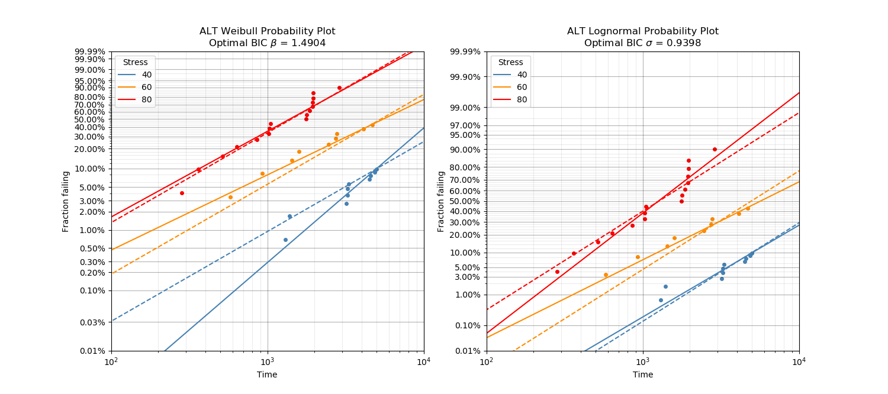
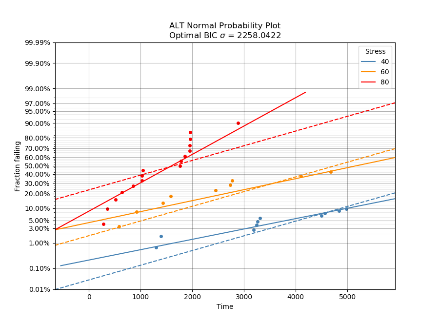

.. image:: images/logo.png

-------------------------------------

ALT probability plots
'''''''''''''''''''''

.. note:: This module is currently in development. The following documentation is correct, however, the most recent version of ``reliability`` on PyPI will not contain this module until Dec 2019.

Before reading this section, you should be familiar with what a probability plot is and how to use it. For a detailed explaination, please see the section on `probability plots <https://reliability.readthedocs.io/en/latest/Probability%20plots.html>`_.

The module ``reliability.ALT`` contains four ALT probability plotting functions. These functions are:

- ALT_probability_plot_Weibull
- ALT_probability_plot_Lognormal
- ALT_probability_plot_Normal
- ALT_probability_plot_Gamma

An ALT probability plot produces a multi-dataset probability plot which includes the probability plots for the data and the fitted distribution at each stress level, as well as a refitted distribution assuming a common shape parameter at each stress level. All of these functions perform in a similar way, with the main difference being the distribution that is fitted. The Gamma ALT probability plot will not appear parallel because of the way the Gamma distribution works, but it is still useful to judge the goodness of fit to the entire dataset using a common shape parameter. The probability plots provided do not include the Exponential distribution (because of there only being one parameter), the Beta distribution (because there are two shape parameters), or any of the location shifted distributions (because these are not typically used for ALT probability plotting).

When producing the ALT probability plot, the function automates the following process; fit a distribution to the data for each unique stress level, find the common shape parameter (several methods are provided), refit the distribution to the data for each unique stress level whilst forcing the shape parameter to be equal to the common shape parameter, plot the data along with the original and new fitted distributions, calculate the change in the common shape parameter from the original shape parameter to see if the model is applicable to this dataset. Each of the ALT plotting functions listed above has the following inputs and outputs.

Inputs:

- failures - an array or list of all the failure times
- failure_stress - an array or list of the corresponding stresses (such as temperature) at which each failure occurred. This must match the length of failures as each failure is tied to a failure stress.
- right_censored - an array or list of all the right censored failure times
- right_censored_stress - an array or list of the corresponding stresses (such as temperature) at which each right_censored datapoint was obtained. This must match the length of right_censored as each right_censored value is tied to a right_censored stress.
- print_results - True/False. Default is True
- show_plot - True/False. Default is True
- common_beta_method - 'BIC', 'weighted_average', 'average'. Default is 'BIC'. This is the method used to obtain the common_beta parameter. 'BIC' will find the common_beta that gives lowest total BIC (equivalent to the best overall fit), 'weighted_average' will perform a weighted average based on the amount of data (failures and right censored) for each stress, 'average' is simply the average. Note for the Lognormal and Normal plots, this variable is named common_sigma_method as we are forcing sigma to be a common value.

Outputs:

- The plot will be produced if show_plot is True
- A dataframe of the fitted distributions parameters will be printed if print_results is True
- results - a dataframe of the fitted distributions parameters and change in the shape parameter
- common_beta - the common beta parameter. Note in the Lognormal and Normal plots, this variable is common_sigma
- BIC_sum - the sum of the BIC for each of the distributions when fitted using the common_beta
- AICc_sum - the sum of the AICc for each of the distributions when fitted using the common_beta

The time to run the function will be a few seconds if you have a large amount of data and the common_beta_method is set to 'BIC'. This is because the distributions need to be refitted for each iteration of the optimizer (which is usually around 20 to 30 iterations). With 100 datapoints this should take less than 5 seconds for the 'BIC' method, and less than 1 second for the 'average' and 'weighted_average' methods. The more data you have, the longer it will take, so please be patient as a lot of computation is required.

In the following example we will use a dataset from ``reliability.Datasets`` which contains failures and right_censored data for three stress levels. We will analyse this dataset using the Weibull and Lognormal ALT probability plots to determine which model is a better fit for the data. All other inputs are left to their default values which gives us the plot and the results dataframe. From the printed results we can see how well the model fits our data. The AICc and BIC values suggest that the Lognormal model is a slightly better fit overall for this dataset, but both models would be suitable. The fitted distributions with a common shape parameter still agree well with the majority of our data (except for the lower tail of the 40 degree data), and the amount of change to the shape parameter was within the acceptable limits. See the section `below <https://reliability.readthedocs.io/en/latest/ALT%20probability%20plots.html#what-does-an-alt-probability-plot-show-me>`_ for more details on what we are looking to get out of these plots.

.. code:: python

    from reliability.ALT import ALT_probability_plot_Weibull, ALT_probability_plot_Lognormal
    from reliability.Datasets import ALT_temperature
    import matplotlib.pyplot as plt
    plt.figure()
    plt.subplot(121)
    ALT_probability_plot_Weibull(failures=ALT_temperature().failures,failure_stress=ALT_temperature().failure_stresses,right_censored=ALT_temperature().right_censored,right_censored_stress=ALT_temperature().right_censored_stresses)
    plt.subplot(122)
    ALT_probability_plot_Lognormal(failures=ALT_temperature().failures,failure_stress=ALT_temperature().failure_stresses,right_censored=ALT_temperature().right_censored,right_censored_stress=ALT_temperature().right_censored_stresses)
    plt.gcf().set_size_inches(15,7)
    plt.show()
    
    '''
    ALT Weibull probability plot results:
      stress  original alpha  original beta     new alpha  common beta beta change
          40    13716.624604       2.232583  22815.702436     1.490394     -33.24%
          60     7405.866698       1.248765   6813.643461     1.490394     +19.35%
          80     1801.245476       1.421726   1822.550024     1.490394      +4.83%
    Total AICc: 693.3617469774094
    Total BIC: 700.5432420343159

    ALT Lognormal probability plot results:
      stress  original mu  original sigma    new mu  common sigma sigma change
          40     9.815427        1.008857  9.717927      0.939836       -6.84%
          60     8.644293        1.187866  8.507180      0.939836      -20.88%
          80     7.140811        0.770266  7.147848      0.939836      +22.01%
    Total AICc: 690.9683703992655
    Total BIC: 698.1498654561719
    '''
    

Getting your input data in the right format
-------------------------------------------

Because the ALT probability plots need failures and right censored data from many stress levels, it was not practical to make an input for each stress level. Instead, the failure times are combined in a single input and the failure_stress input provides a list of the corresponding stresses at which each failure occurred. The same is true of the right_censored and right_censored_stress inputs.

To get your data in the correct format, ensure you have combined all your failure times into a single list or numpy array and there is a corresponding list or array of the same length that provides all of the stresses. The following example illustrates one method to do this if you do not have the list already imported from Excel or another source. This is done for failures only but if you have right_censored data then you would do the same thing, but keeping it seperate to the failure data. There is no need to sort the data in any particular order as this is all done automatically. The only requirement is that the length of failures matches the length of the failure_stress, and that there are no new stresses in right_censored_stress that are not present in failure_stress.

.. code:: python

    import numpy as np
    #create the data
    failure_times_at_stress_1 = [800,850,910,940]
    failure_stress_1 = [40,40,40,40]
    failure_times_at_stress_2 = [650,670,715,740]
    failure_stress_2 = [50,50,50,50]
    failure_times_at_stress_3 = [300,320,350,380]
    failure_stress_3 = [60,60,60,60]
    #combine the data
    failures = np.hstack([failure_times_at_stress_1,failure_times_at_stress_2,failure_times_at_stress_3])
    failure_stresses = np.hstack([failure_stress_1,failure_stress_2,failure_stress_3])
    #print for inspection
    print(failures)
    print(failure_stresses)
    
    '''
    [800 850 910 940 650 670 715 740 300 320 350 380]
    [40 40 40 40 50 50 50 50 60 60 60 60]
    '''

What does an ALT probability plot show me?
------------------------------------------

An ALT probability plot shows us how well our dataset can be modeled by the chosen distribution. This is more than just a goodness of fit at each stress level, because the distribution needs to be a good fit at all stress levels and be able to fit well with a common shape parameter. If you find the shape parameter changes significantly as the stress increases then it is likely that your accelerated life test is experiencing a different failure mode at higher stresses. When examining an ALT probability plot, the main things we are looking for are:

- Does the model appear to fit the data well at all stress levels (ie. the dashed lines pass reasonably well through all the data points)
- Examine the AICc and BIC values when comparing multiple models. A lower value suggests a better fit.
- Is the amount of change to the shape parameter within the acceptable limits (generally less than 50% for each distribution).

The image provided above shows two distributions that fit well. If we apply the same data to the function ALT_probability_plot_Normal as shown in the example below, we get the image shown below. From this image we can see that the model does not fit well at the higher stress (80 degrees) and the amount of change to the shape parameter was up to 93%. Based on these results, we would reject the Normal_2P model and try another model. If no models work without large changes to the shape parameter at the higher stresses, then you can conclude that there must be a change in the failure mode for higher stresses and you may need to look at changing your accelerated test to keep the failure mode consistent across tests.

.. code:: python

    from reliability.ALT import ALT_probability_plot_Weibull, ALT_probability_plot_Lognormal
    from reliability.Datasets import ALT_temperature
    import matplotlib.pyplot as plt
    ALT_probability_plot_Normal(failures=ALT_temperature().failures,failure_stress=ALT_temperature().failure_stresses,right_censored=ALT_temperature().right_censored,right_censored_stress=ALT_temperature().right_censored_stresses)
    plt.show()
    
    '''
    ALT Normal probability plot results:
      stress  original mu  original sigma       new mu  common sigma sigma change
          40  9098.952789     3203.855964  7764.809372   2258.042218      -29.52%
          60  5174.506831     3021.353462  4756.980072   2258.042218      -25.26%
          80  1600.117162     1169.703757  1638.730664   2258.042218      +93.04%
    Total AICc: 716.6685648106153
    Total BIC: 723.8500598675216
    '''

