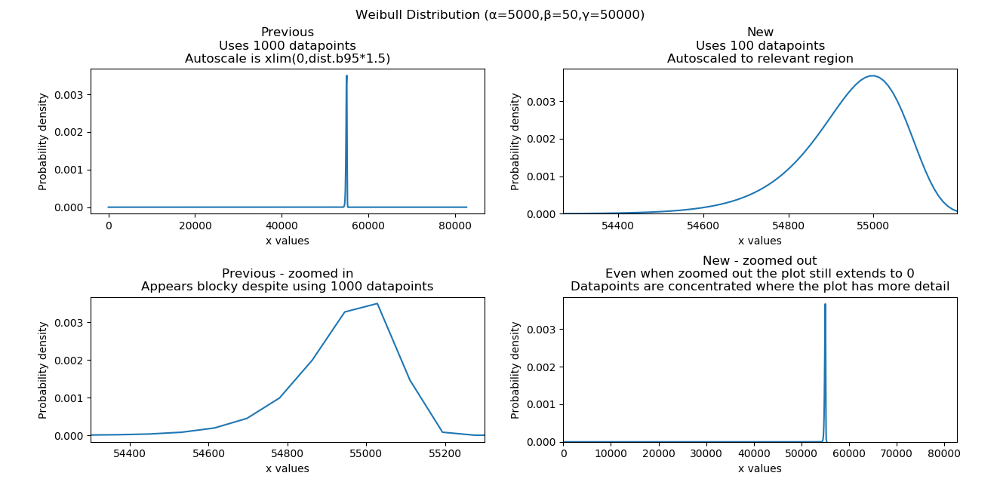

.. image:: images/logo.png

-------------------------------------

Changelog
---------

**Version: 0.5.3 --- Currently Unreleased --- Scheduled for release around the end of September**
'''''''''''''''''''''''''''''''''''''''''''''

**New features**

-    Implemented Loglogistic_Distribution
-    Added the function Reliability_testing.reliability_test_duration

**API Changes**

-    Reliability_testing.reliability_test_planner has an optional argument of two_sided which was set to True as default. This has been changed to one_sided=True, making the default calculation use the one-sided confidence interval and changing the argument name. The reason for this change was to align the function with the approach more commonly used in industry.

**Bug Fixes**

-    Fixed autoscale for cases where the HF is constant so it no longer lies along the yaxis upper limit

**Other**

-    Fixed the HF and CHF equations for Exponential_Distribution to be actual equations. The is preferred than using the HF = PDF/SF and CHF=-ln(SF) relationships which breakdown when SF=0 at high xvals. This has also been implemented for the loglogistic distribution. Can't do it for Normal, Lognormal, Gamma, and Beta distributions as these do not have closed form solutions for HF and CHF which don't involve the SF.
-    Changed the Gamma_Distribution and Weibull_Distribution mode to be self.gamma when beta < 1. Previously it was "No mode exists when beta < 1" which is true from a formula perspective but it is clear that the mode is equal to gamma as that's where the asymptote occurs. The only distribution with "no mode exists..." is the Beta distribution as it can have 2 modes for certain values of alpha and beta.
-    Updated Utils.generate_X_array to use 200 points (rather than 100) and allocated more points to the right hand side of the plot (beyond b99). This was because plots were not displaying smoothly enough for distributions with high skewness.
-    Changed default plotting upper limit to b9999. Previously it was slightly more and was not a round quantile. Done for simplicity and minimal change will be noticed.

**Version: 0.5.2 --- Released: 14 August 2020**
'''''''''''''''''''''''''''''''''''''''''''''

**New features**

-    New distributions

     - Mixture_Distribution
     - Competing_Risks_Distribution

-    A new fitter for the Weibull competing risks model (Fit_Weibull_CR)
-    The output of the Fit_Weibull_Mixture now includes a probability plot instead of a histogram of the PDF and CDF
-    The output of the Fit_Weibull_Mixture now prints the confidence interval estimates of the parameters
-    Added some datasets for use with the mean cumulative function (MCF_1 and MCF_2).

**API Changes**

-    Within Fitters.Fit_Weibull_mixture the option show_plot has been changed to show_probability_plot to align with all the other fitters.

**Bug Fixes**

-    Fixed the autoscale in Weibull and Exponential distributions that locked autoscaling when confidence intervals were plotted sequentially.
-    Automatic removal of zeros for all fitters (except Normal_2P). Previously the zeros were left in the data and resulted in NaNs and crashes. Also added a dedicated error to report input with times below zero.
-    Fixed the confidence interval bounds for Kaplan-Meier and Nelson-Aalen CHF plots. Some of the bounds were inf since the CHF = -ln(SF) which will be inf when SF=0.
-    MCF_Nonparametric and MCF_Parametric had a bug which caused crashes when the dataset included a system with only one censored time. This has now been fixed. 

**Other**

-    Minor clean up of code. Removed unnecessary imports, removed unused variables, etc. Hopefully this will have no noticable effects.
-    Within Fitters.Fit_Everything the histogram output has been improved with better formatting and it now uses the Freedman-Diaconis rule for obtaining optimal bin width.
-    Fixed Weibull HF and CHF equations to use actual equations and not PDF/SF or -ln(SF) as these result in NaN when SF=0 (an issue at high xvals). These changes are currently only implemented for Weibull_Distribution.
-    Improved creation of xvals for PDF,CDF,SF,HF,CHF within the Weibull Distribution. The changes now generate datapoints where there is more detail (between the 0.1% and 99.9% quantiles) such that only 100 datapoints are needed to show more detail than was previously achieved with 1000 datapoints. This is most noticable with Weibull distributions that have high beta values and are significantly location shifted. An example of this is shown in the plot below. These changes are only implemented for Weibull_Distribution but will be extended to all distributions in the very near future.
-    Improved autoscaling for the Weibull Distribution plots. For location shifted distributions, this zooms in on the 0.1% to 99.9% quantiles allowing users to see more detail. The HF and CHF ylimits are also limited based on the quantiles so that they do not obscure the detail if there is an asymptote to large values or infinity. An example of this is shown in the plot below. These changes are only implemented for Weibull_Distribution but will be extended to all distributions in the very near future.

**Version: 0.5.1 --- Released: 08 July 2020**
'''''''''''''''''''''''''''''''''''''''''''''

**New features**

-    More efficient method used within Other_functions.similar_distributions. Results are always consistent and more accurate now.
-    Other_functions.histogram. This plots a histogram with optimal bin width, better default formatting, and an option to shade bins white above a threshold.

**API Changes**

-    Some of the functions in reliability.Other_functions have been moved into reliability.Utils and reliability.Reliability_testing. The new layout is:

     - Utils :math:`\Rightarrow` round_to_decimals, transform_spaced, axes_transforms
     - Other_functions :math:`\Rightarrow` similar_distributions, convert_dataframe_to_grouped_lists, crosshairs, make_right_censored_data
     - Reliability_testing :math:`\Rightarrow` one_sample_proportion, two_proportion_test, sample_size_no_failures, sequential_sampling_chart, reliability_test_planner
     
-    Within Other_functions.similar_distributions the option 'monte_carlo_trials' has been removed as the distribution sampling method is no longer random.

**Bug Fixes**

-    Fixed confidence interval color inheritance for Nonparametric.Kaplan_Meier and Nonparametric.Nelson_Aalen. Previously the color was only inherited if specified rather than left as default.
-    The default axes labels for both Stress_strength.Probability_of_failure and Stress_strength.Probability_of_failure_normdist were reversed. The have now been switched to the correct labels.

**Other**

-    Documentation updates to reflect the API changes in Version 0.5.1

**Version: 0.5.0 --- Released: 04 July 2020**
'''''''''''''''''''''''''''''''''''''''''''''

**New features**

-    Confidence intervals on fitted distributions ==> this has only been implemented for Weibull and Exponential. Is is quite difficult and takes considerable time and testing. I will do Normal and Lognormal distributions next, then Gamma and Beta distributions. I hope to finish them all by September 2020.
-    Confidence intervals have been disabled in in ALT_probability_plotting and ALT_fitters to avoid cluttering on the plot.
-    The probability plot in Fit_Everything now uses the Exponential_probability_plot_Weibull_Scale instead of Exponential_probability_plot. It is much clearer to see the effectiveness of the fit using the Weibull scale.
-    Added an option to seed the random_samples functions within the Distributions module. This allows for repeatable results.
-    Improvements to rounding of all titles, labels, and stats in Distributions and Probability_plotting using a new function, round_to_decimals.
-    Added Other_functions.round_to_decimals which keeps the specified number of decimals after leading zeros. This is useful as round would make very small values appear as 0.
-    Minor improvements to color inheritance for probability_plotting.
-    Minor improvements to confidence interval color inheritance for Nonparametric.Kaplan_Meier and Nonparametric.Nelson_Aalen.
-    Within Stress_strength, the method of obtaining the solution has been changed from monte carlo to integration. Thanks to Thomas Enzinger for providing the formula for this method in response to an `Issue <https://github.com/MatthewReid854/reliability/issues/4>`_ that was raised. Using the integration method, accuracy is much higher (1e-11 error now vs 1e-3 error previously) and always consistent, and the speed is significantly improved over the monte carlo method. As noted below in API changes, there is no need to specify the number of monte_carlo_samples and no option to obtain the convergence plot.
-    Within Stress_strength, the colors used for shading have been changed to improve the style.
-    Probability_plotting.plot_points now includes the option to plot the points for the PDF and HF. These are not very useful as they appear messy due to the discontinuous nature of the function, but they are added for completeness.
-    Added Other_functions.transform_spaced. This is similar to np.linspace and np.logspace but it creates an array that is 'weibull spaced', 'normal spaced', 'exponential spaced', 'beta spaced', or 'gamma spaced'. It is used to get data points for the confidence intervals so they are as evenly spaced as possible, particularly on probability paper. This function is likely to be moved into utils.
-    Other_functions.make_right_censored_data has been added. This function accepts uncensored data and a threshold, and returns failures and right_censored arrays.
-    Added `mplcursors <https://mplcursors.readthedocs.io/en/stable/index.html>`_ to requirements in setup.py as it is needed for the crosshairs function.
-    Added crosshairs function to Other_functions. This is a very useful feature that provides interactive crosshairs to the plot using snap-to feature and also adds annotations on click events. Thanks to Antony Lee (the author of mplcursors) for help with getting this to work using his library.

**Bug fixes**

-    Within Stress_strength, there are improvements to the fill_between method as it had errors in some special cases.
-    Fixed an `Issue <https://github.com/MatthewReid854/reliability/issues/6>`_ in Lognormal_Probability_Plot that occurred for very large numbers (above 1e20)

**API Changes**

-    Within Stress_strength, the output format has changed from an object to a returned value of the probability of failure. This makes it much more simple to access the answer since the object had only one value.
-    Within Stress_strength, the method of obtaining the solution has been changed from monte carlo to integration. As a result, there is now no need to specify the number of monte_carlo_samples and no option to obtain the convergence plot.
-    Added the options initial_guess_method and optimizer to Fit_Weibull_2P and Fit_Weibull_3P. They were previously only in Fit_Weibull_2P_grouped. It is planned to add these options to all fitters.
-    There is now the option CI_type for the Weibull and Exponential fitters. This allows users to chose between confidence bounds on reliability and time. This option will be added to all fitters as the confidence intervals for the other distributions are completed.

**Other**

-    Added tests folder. This is planned to include automated tests.
-    Created utils module. I plan to move some utilities into here that are currently inside other modules where users can access them, but users should never need to access them so they just create clutter in the dropdown lists of your IDE.
-    Added Reliability_testing module. I plan to move everything related to reliability testing out of Other_functions as there is now enough functions to justify a new module dedicated to reliability testing.
-    Documentation updates to reflect the changes in Version 0.5.0

**Version: 0.4.9 --- Released: 27 April 2020**
''''''''''''''''''''''''''''''''''''''''''''''

**New features**

-    Updates to reliability_test_planner to include option for failure terminated test

**Other**

-    Addition of this Changelog to the documentation
