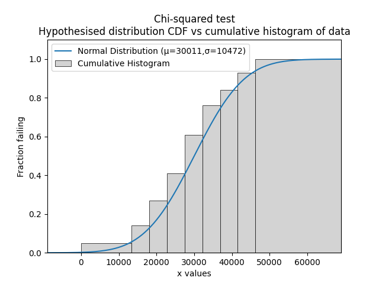

.. image:: images/logo.png

-------------------------------------

Chi-squared test
''''''''''''''''

The Chi-squared test is a statistical test for goodness of fit to determine whether we can accept or reject the hypothesis that the data is from the specified distribution at the specified level of significance. This method is not a means of comparing distributions (which can be done with AICc, BIC, and AD), but instead allows us to accept or reject a hypothesis that data come from a distribution. Note that the result is sensitive to the bins. For this reason, it is recommended to leave bins as the default value.

The procedure for the test involves comparing the fitted CDF (from a hypothesised distribution) against the empirical CDF (from a cumulative histogram of the data). As with all histograms, the exact shape of the histogram depends on the bins. The difference between the fitted CDF and the empirical CDF is used to find the chi-squared statistic. The specified level of significance (analogous to confidence level), the number of parameters in the hypothesised distribution, and the number of data points is used to obtain the chi-squared critical value from the chi-squared distribution. By comparing the chi-squared statistic with the chi-squared critical value, we can determine whether the hypothesis (that the data are from the specified distribution) should be rejected or accepted. The acceptance criteria is when the the chi-squared statistic is below the critical value.

.. admonition:: API Reference

   For inputs and outputs see the `API reference <https://reliability.readthedocs.io/en/latest/API/Reliability_testing/chi2test.html>`_.

In the example below we import a dataset called mileage which contains 100 values that appear to be normally distributed. Using the function chi2test we can determine whether we should accept the hypothesis that the data are from a Normal distribution with parameters mu=30011 and sigma=10472. This example is based on Example 2.31 (page 63) of Reliability Engineering and Risk Analysis (listed in `recommended resources <https://reliability.readthedocs.io/en/latest/Recommended%20resources.html>`_).

.. code:: python

    from reliability.Datasets import mileage
    from reliability.Distributions import Normal_Distribution
    from reliability.Reliability_testing import chi2test
    import numpy as np
    import matplotlib.pyplot as plt

    data = mileage().failures
    dist = Normal_Distribution(mu=30011, sigma=10472)
    bins = [0, 13417, 18104, 22791, 27478, 32165, 36852, 41539, 46226, np.inf] #it is not necessary to specify the bins and leaving them unspecified is usually best
    chi2test(distribution=dist, data=data, bins=bins)
    plt.show()
    
    '''
    Results from Chi-squared test:
    Chi-squared statistic: 3.1294947845652
    Chi-squared critical value: 12.591587243743977
    At the 0.05 significance level, we can ACCEPT the hypothesis that the data comes from a Normal Distribution (μ=30011,σ=10472)
    '''

