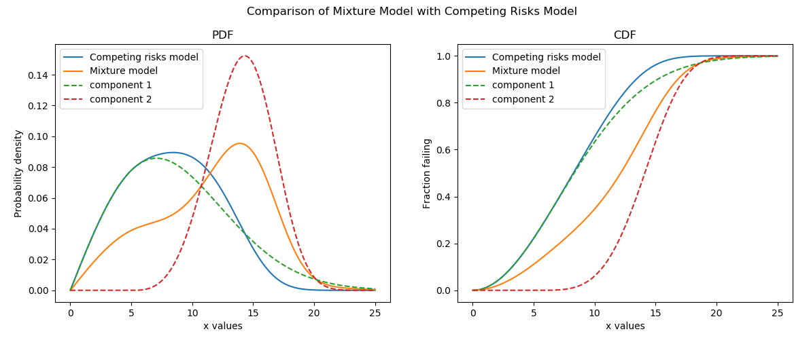
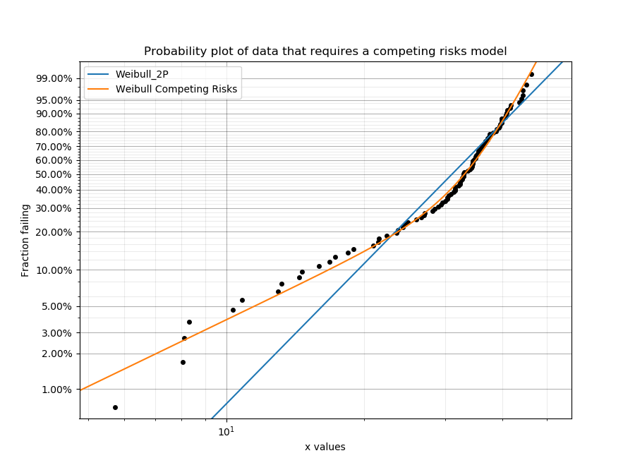
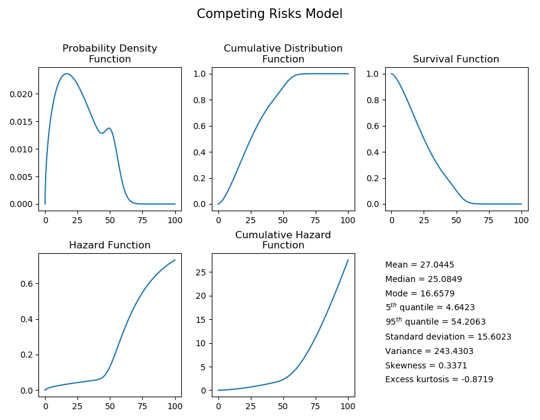
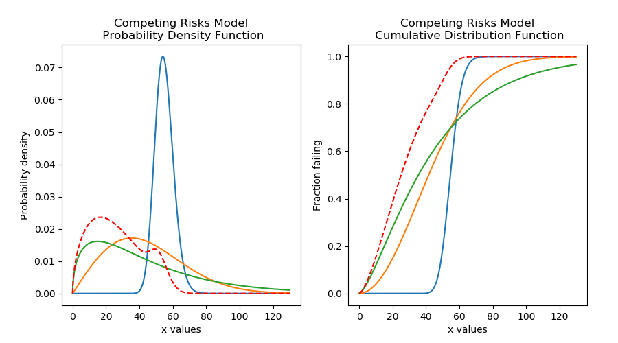
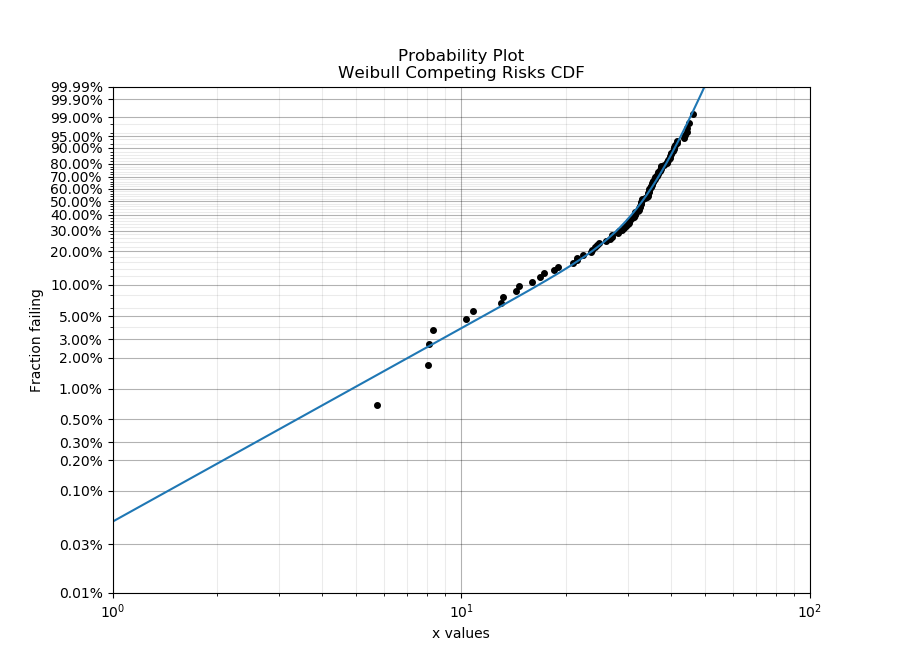
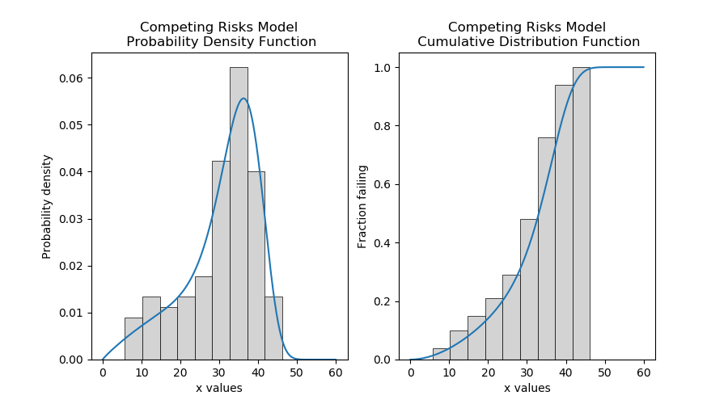
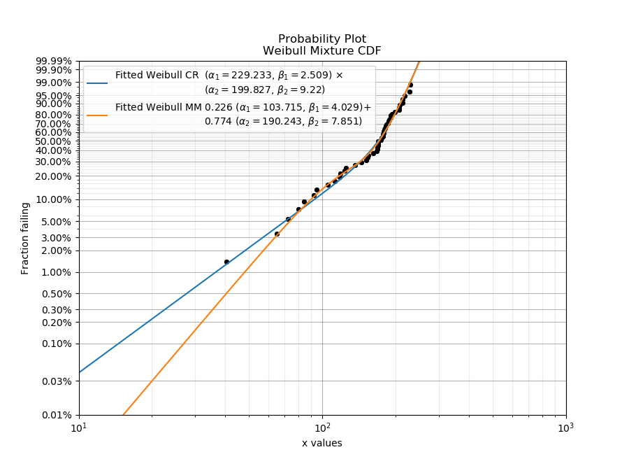

.. image:: images/logo.png

-------------------------------------

Competing risk models
'''''''''''''''''''''

.. note:: This documentation is valid for Version 0.5.2 which is currently unreleased.

What are competing risks models?
================================

Competing risks models are a combination of two or more distributions that represent failure modes which are "competing" to end the life of the system being modelled. This model is similar to a mixture model in the sense that it uses multiple distributions to create a new model that has a shape with more flexibility than a single distribution. However, unlike a mixture models, we are not adding proportions of the PDF or CDF, but are instead multiplying the survival functions. The formula for the competing risks model is typically written in terms of the survival function (SF). Since we may consider the system's reliability to depend on the reliability of all the parts of the system (each with its own failure modes), the equation is written as if the system was in series, using the product of the survival functions for each failure mode. For a competing risks model with 2 distributions, the equations are shown below:

:math:`{SF}_{Competing\,Risks} = {SF}_1 \times {SF}_2`

:math:`{CDF}_{Competing\,Risks} = 1-{SF}_{Competing\,Risks}`

Since :math:`{SF} = exp(-CHF)` we may equivalently write the competing risks model in terms of the hazard or cumulative hazard function as:

:math:`{HF}_{Competing\,Risks} = {HF}_1 + {HF}_2`

:math:`{CHF}_{Competing\,Risks} = {CHF}_1 + {CHF}_2`

:math:`{PDF}_{Competing\,Risks} = {HF}_{Competing\,Risks} \times {SF}_{Competing\,Risks}`

Another option to obtain the PDF, is to find the derivative of the CDF. This is easiest to do numerically since the formula for the SF of the competing risks model can become quite complex as more risks are added. Note that using the PDF = HF x SF method requires the conversion of nan to 0 in the PDF for high xvals. This is because the HF of the component distributions is obtained using PDF/SF and for the region where the SF and PDF of the component distributions is 0 the resulting HF will be nan.

The image below illustrates the difference between the competing risks model and the mixture model, each of which is made up of the same two component distributions. Note that the PDF of the competing risks model is always equal to or to the left of the component distributions, and the CDF is equal to or higher than the component distributions. This shows how a failure mode that occurs earlier in time can end the lives of units under observation before the second failure mode has the chance to. This behaviour is characteristic of real systems which experience multiple failure modes, each of which could cause system failure.

Competing risks models are useful when there is more than one failure mode that is generating the failure data. This can be recognised by the shape of the PDF and CDF being outside of what any single distribution can accurately model. On a probability plot, a combination of failure modes can be identified by bends in the data that you might otherwise expect to be linear. An example of this is shown in the image below. You should not use a competing risks model just because it fits your data better than a single distribution, but you should use a competing risks model if you suspect that there are multiple failure modes contributing to the failure data you are observing. To judge whether a competing risks model is justified, look at the goodness of fit criterion (AICc or BIC) which penalises the score based on the number of parameters in the model. The closer the goodness of fit criterion is to zero, the better the fit.

See also `mixture models <https://reliability.readthedocs.io/en/latest/Mixture%20models.html>`_ for another method of combining distributions using the sum of the CDF rather than the product of the SF.

Creating a competing risks model
================================

Within ``reliability.Distributions`` is the Competing_Risks_Model. This class accepts an array or list of distribution objects created using the reliability.Distributions module (available distributions are Exponential, Weibull, Normal, Lognormal, Gamma, Beta). There is no limit to the number of components you can add to the model, but is is generally preferable to use as few as are required to fit the data appropriately (typically 2 or 3). Unlike the mixture model, you do not need to specify any proportions.

As this process is multiplicative for the survival function (or additive for the hazard function), and may accept many distributions of different types, the mathematical formulation quickly gets complex. For this reason, the algorithm combines the models numerically rather than empirically so there are no simple formulas for many of the descriptive statistics (mean, median, etc.). Also, the accuracy of the model is dependent on xvals. If the xvals array is small (<100 values) then the answer will be “blocky” and inaccurate. The variable xvals is only accepted for PDF, CDF, SF, HF, and CHF. The other methods (like random samples) use the default xvals for maximum accuracy. The default number of values generated when xvals is not given is 1000. Consider this carefully when specifying xvals in order to avoid inaccuracies in the results.

The API is similar to the other probability distributions (Weibull, Normal, etc.) and has the following inputs and methods:

Inputs:

-   distributions - a list or array of probability distributions used to construct the model

Methods:

-   name - 'Competing risks'
-   name2 - 'Competing risks using 3 distributions'
-   mean
-   median
-   mode
-   variance
-   standard_deviation
-   skewness
-   kurtosis
-   excess_kurtosis
-   b5 - The time where 5% have failed. Same as quantile(0.05)
-   b95 - The time where 95% have failed. Same as quantile(0.95)
-   plot() - plots all functions (PDF,CDF,SF,HF,CHF)
-   PDF() - plots the probability density function
-   CDF() - plots the cumulative distribution function
-   SF() - plots the survival function (also known as reliability function)
-   HF() - plots the hazard function
-   CHF() - plots the cumulative hazard function
-   quantile() - Calculates the quantile (time until a fraction has failed) for a given fraction failing. Also known as b life where b5 is the time at which 5% have failed.
-   inverse_SF() - the inverse of the Survival Function. This is useful when producing QQ plots.
-   mean_residual_life() - Average residual lifetime of an item given that the item has survived up to a given time. Effectively the mean of the remaining amount (right side) of a distribution at a given time.
-   stats() - prints all the descriptive statistics. Same as the statistics shown using .plot() but printed to console.
-   random_samples() - draws random samples from the distribution to which it is applied.

The following example shows how the Competing_Risks_Model object can be created, visualised and used.

.. code:: python

    from reliability.Distributions import Lognormal_Distribution, Gamma_Distribution, Weibull_Distribution, Competing_Risks_Model
    import matplotlib.pyplot as plt

    # create the competing risks model
    d1 = Lognormal_Distribution(mu=4, sigma=0.1)
    d2 = Weibull_Distribution(alpha=50, beta=2)
    d3 = Gamma_Distribution(alpha=30,beta=1.5)
    CR_model = Competing_Risks_Model(distributions=[d1, d2, d3])

    # plot the 5 functions using the plot() function
    CR_model.plot(xmin=0,xmax=100)

    # plot the PDF and CDF
    plot_components = True # this plots the component distributions. Default is False
    plt.figure(figsize=(9, 5))
    plt.subplot(121)
    CR_model.PDF(plot_components=plot_components, color='red', linestyle='--',xmin=0,xmax=130)
    plt.subplot(122)
    CR_model.CDF(plot_components=plot_components, color='red', linestyle='--',xmin=0,xmax=130)
    plt.subplots_adjust(left=0.1, right=0.95)
    plt.show()

    # extract the mean of the distribution
    print('The mean of the distribution is:', CR_model.mean)

    '''
    The mean of the distribution is: 27.04449126275214
    '''

Fitting a competing risks model
===============================

Within ``reliability.Fitters`` is Fit_Weibull_CR. This function will fit a weibull competing risks model consisting of 2 x Weibull_2P distributions (this does not fit the gamma parameter). Just as with all of the other distributions in reliability.Fitters, right censoring is supported.

Whilst some failure modes may not be fitted as well by a Weibull distribution as they may be by another distribution, it is unlikely that a competing risks model of data from two distributions (particularly if they are overlapping) will be fitted noticeably better by other types of competing risks models than would be achieved by a Weibull competing risks model. For this reason, other types of competing risks models are not implemented.

Inputs:

-   failures - an array or list of the failure data. There must be at least 4 failures, but it is highly recommended to use another model if you have less than 20 failures.
-   right_censored - an array or list of right censored data
-   print_results - True/False. This will print results to console. Default is True.
-   CI - confidence interval for estimating confidence limits on parameters. Must be between 0 and 1. Default is 0.95 for 95% CI.
-   show_probability_plot - True/False. This will show the probability plot with the fitted Weibull_CR CDF. Default is True.

Outputs:

-   alpha_1 - the fitted Weibull_2P alpha parameter for the first distribution
-   beta_1 - the fitted Weibull_2P beta parameter for the first distribution
-   alpha_2 - the fitted Weibull_2P alpha parameter for the second distribution
-   beta_2 - the fitted Weibull_2P beta parameter for the second distribution
-   alpha_1_SE - the standard error on the parameter
-   beta_1_SE - the standard error on the parameter
-   alpha_2_SE - the standard error on the parameter
-   beta_2_SE - the standard error on the parameter
-   alpha_1_upper - the upper confidence interval estimate of the parameter
-   alpha_1_lower - the lower confidence interval estimate of the parameter
-   beta_1_upper - the upper confidence interval estimate of the parameter
-   beta_1_lower - the lower confidence interval estimate of the parameter
-   alpha_2_upper - the upper confidence interval estimate of the parameter
-   alpha_2_lower - the lower confidence interval estimate of the parameter
-   beta_2_upper - the upper confidence interval estimate of the parameter
-   beta_2_lower - the lower confidence interval estimate of the parameter
-   loglik - Log Likelihood (as used in Minitab and Reliasoft)
-   loglik2 - LogLikelihood*-2 (as used in JMP Pro)
-   AICc - Akaike Information Criterion
-   BIC - Bayesian Information Criterion
-   results - a dataframe of the results (point estimate, standard error, Lower CI and Upper CI for each parameter)

In this first example, we will create some data using a competing risks model from two Weibull distributions. We will then fit the Weibull mixture model to the data and will print the results and show the plot.

.. code:: python

    from reliability.Distributions import Weibull_Distribution, Competing_Risks_Model
    from reliability.Fitters import Fit_Weibull_CR
    from reliability.Other_functions import histogram
    import matplotlib.pyplot as plt

    # create some data that requires a competing risks models
    d1 = Weibull_Distribution(alpha=50, beta=2)
    d2 = Weibull_Distribution(alpha=40, beta=10)
    CR_model = Competing_Risks_Model(distributions=[d1, d2])
    data = CR_model.random_samples(100, seed=2)

    # fit the Weibull competing risks model
    results = Fit_Weibull_CR(failures=data)

    # this section is to visualise the histogram with PDF and CDF
    # it is not part of the default output from the Fitter
    plt.figure(figsize=(9, 5))
    plt.subplot(121)
    histogram(data)
    results.distribution.PDF(xmin=0, xmax=60)
    plt.subplot(122)
    histogram(data, cumulative=True)
    results.distribution.CDF(xmin=0, xmax=60)

    plt.show()

    '''
    Results from Fit_Weibull_CR (95% CI):
               Point Estimate  Standard Error   Lower CI   Upper CI
    Parameter                                                      
    Alpha 1         55.185550       14.385243  33.108711  91.983192
    Beta 1           1.896577        0.454578   1.185637   3.033816
    Alpha 2         38.192099        1.083595  36.126262  40.376067
    Beta 2           7.978213        1.181428   5.968403  10.664810
    Log-Likelihood: -352.47978488894165 
    '''

In this second example, we will compare the mixture model to the competing risks model. The data is generated from a competing risks model so we expect the Weibull competing risks model to be more appropriate than the Mixture model. Through comparison of the AICc or BIC we can see which model is more appropriate. Since the AICc and BIC penalise the goodness of fit criterion based on the number of parameters and the mixture model has 5 parameters compared to the competing risk model's 4 parameters, we expect the competing risks model to have a lower (closer to zero) goodness of fit than the Mixture model, and this is what we observe in the results. Notice how the log-likelihood of the mixture model indicates a better fit (because the value is closer to zero), but this does not take into account the number of parameters in the model.

.. code:: python

    from reliability.Distributions import Weibull_Distribution, Competing_Risks_Model
    from reliability.Fitters import Fit_Weibull_CR, Fit_Weibull_Mixture
    import matplotlib.pyplot as plt
    import pandas as pd

    # create some data that requires a competing risks models
    d1 = Weibull_Distribution(alpha=250, beta=2)
    d2 = Weibull_Distribution(alpha=210, beta=10)
    CR_model = Competing_Risks_Model(distributions=[d1, d2])
    data = CR_model.random_samples(50, seed=2)

    CR_fit = Fit_Weibull_CR(failures=data)  # fit the Weibull competing risks model
    MM_fit = Fit_Weibull_Mixture(failures=data)  # fit the Weibull mixture model
    plt.legend()
    plt.show()

    # create a dataframe to display the goodness of fit criterion as a table
    goodness_of_fit = {'Model': ['Competing Risks', 'Mixture'], 'AICc': [CR_fit.AICc, MM_fit.AICc], 'BIC': [CR_fit.BIC, MM_fit.BIC]}
    df = pd.DataFrame(goodness_of_fit, columns=['Model', 'AICc', 'BIC'])
    print(df)

    '''
    Results from Fit_Weibull_CR (95% CI):
               Point Estimate  Standard Error    Lower CI    Upper CI
    Parameter                                                        
    Alpha 1        229.232894       50.606249  148.717724  353.338649
    Beta 1           2.509209        0.747318    1.399663    4.498318
    Alpha 2        199.827204        8.581465  183.696232  217.374691
    Beta 2           9.220198        2.205702    5.769147   14.735637
    Log-Likelihood: -255.44381150244595 

    Results from Fit_Weibull_Mixture (95% CI):
                  Point Estimate  Standard Error    Lower CI    Upper CI
    Parameter                                                           
    Alpha 1           103.714797       14.256788   79.219721  135.783855
    Beta 1              4.029494        1.329587    2.110497    7.693363
    Alpha 2           190.242625        5.107832  180.490306  200.521884
    Beta 2              7.851357        1.365270    5.583796   11.039768
    Proportion 1        0.226028        0.084489    0.101793    0.429403
    Log-Likelihood: -254.50393768335337 

                 Model        AICc         BIC
    0  Competing Risks  519.776512  526.535715
    1          Mixture  520.371512  528.567990
    '''

.. note:: This documentation is valid for Version 0.5.2 which is currently unreleased.
