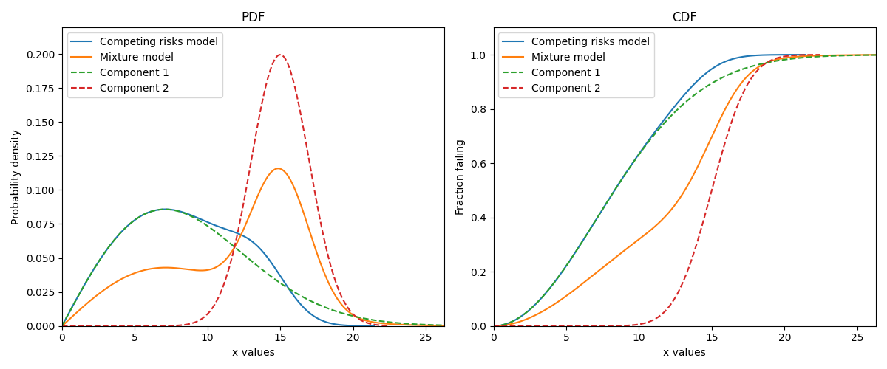
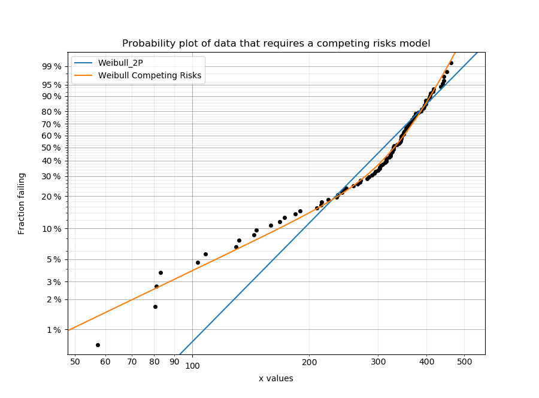
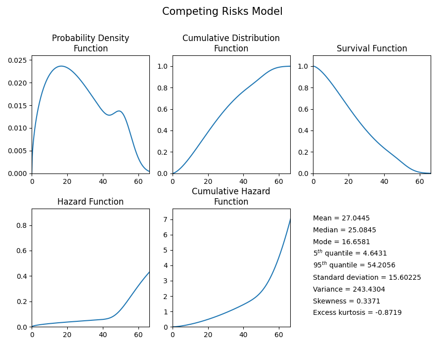
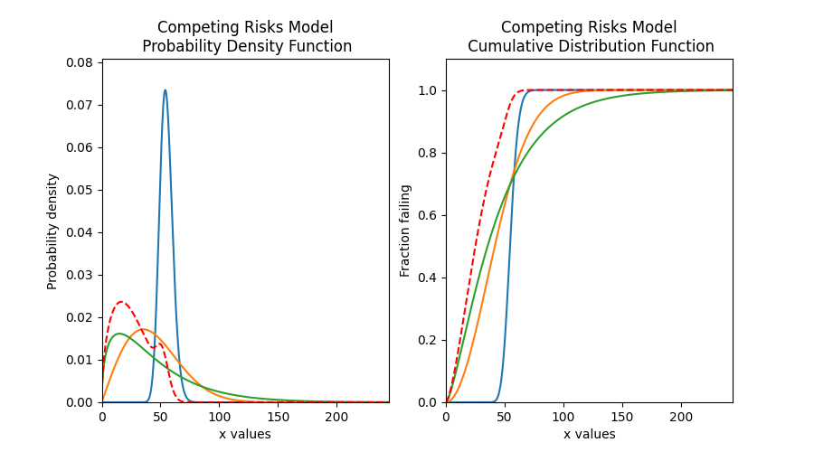
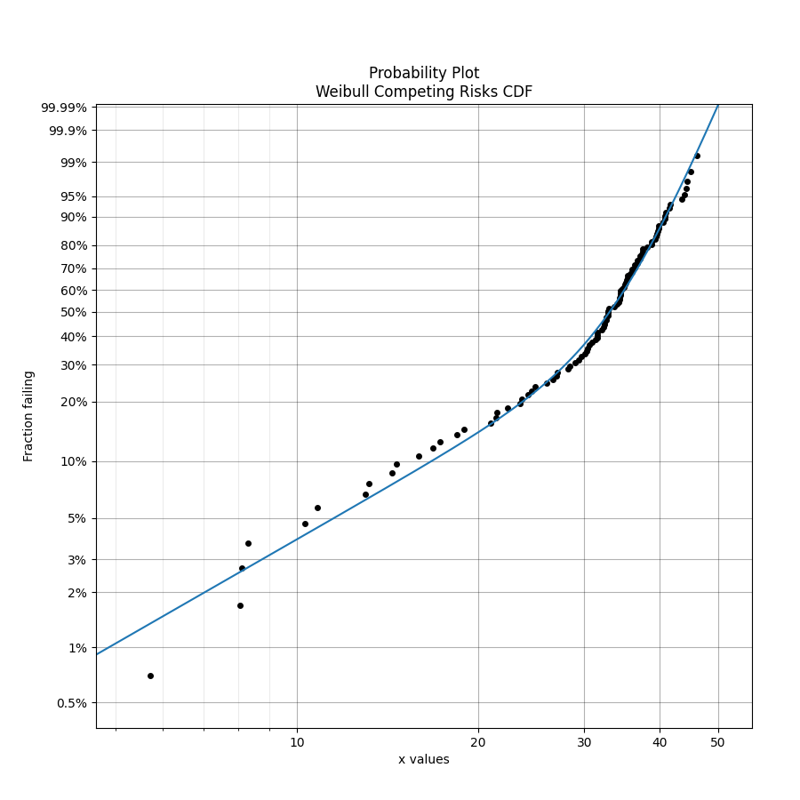
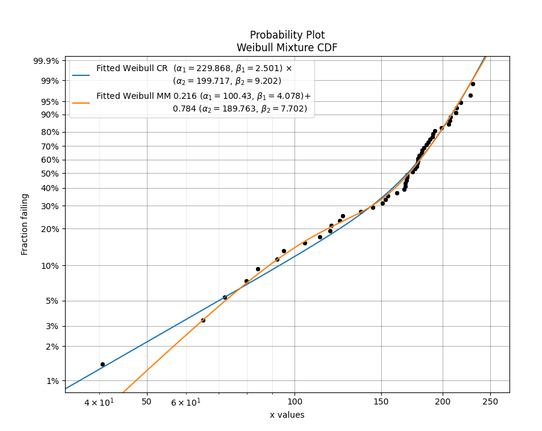

.. image:: images/logo.png

-------------------------------------

Competing risks models
'''''''''''''''''''''

What are competing risks models?
================================

Competing risks models are a combination of two or more distributions that represent failure modes which are "competing" to end the life of the system being modelled. This model is similar to a `mixture model <https://reliability.readthedocs.io/en/latest/Mixture%20models.html>`_ in the sense that it uses multiple distributions to create a new model that has a shape with more flexibility than a single distribution. However, unlike in mixture models, we are not adding proportions of the PDF or CDF, but are instead multiplying the survival functions. The formula for the competing risks model is typically written in terms of the survival function (SF). Since we may consider the system's reliability to depend on the reliability of all the parts of the system (each with its own failure modes), the equation is written as if the system was in series, using the product of the survival functions for each failure mode. For a competing risks model with 2 distributions, the equations are shown below:

:math:`{SF}_{Competing\,Risks} = {SF}_1 \times {SF}_2`

:math:`{CDF}_{Competing\,Risks} = 1-{SF}_{Competing\,Risks}`

Since :math:`{SF} = exp(-CHF)` we may equivalently write the competing risks model in terms of the hazard or cumulative hazard function as:

:math:`{HF}_{Competing\,Risks} = {HF}_1 + {HF}_2`

:math:`{CHF}_{Competing\,Risks} = {CHF}_1 + {CHF}_2`

:math:`{PDF}_{Competing\,Risks} = {HF}_{Competing\,Risks} \times {SF}_{Competing\,Risks}`

The image below illustrates the difference between the competing risks model and the mixture model, each of which is made up of the same two component distributions. Note that the PDF of the competing risks model is always equal to or to the left of the component distributions, and the CDF is equal to or higher than the component distributions. This shows how a failure mode that occurs earlier in time can end the lives of units under observation before the second failure mode has the chance to. This behaviour is characteristic of real systems which experience multiple failure modes, each of which could cause system failure.

Competing risks models are useful when there is more than one failure mode that is generating the failure data. This can be recognised by the shape of the PDF and CDF being outside of what any single distribution can accurately model. On a probability plot, a combination of failure modes can be identified by bends in the data that you might otherwise expect to be linear. An example of this is shown in the image below. You should not use a competing risks model just because it fits your data better than a single distribution, but you should use a competing risks model if you suspect that there are multiple failure modes contributing to the failure data you are observing. To judge whether a competing risks model is justified, look at the goodness of fit criterion (AICc or BIC) which penalises the score based on the number of parameters in the model. The closer the goodness of fit criterion is to zero, the better the fit. It is not appropriate to use the Log-likelihood or AD goodness of fit criterions as these do not penalise the score based on the number of parameters, therefore making the model susceptible to overfitting.

See also `mixture models <https://reliability.readthedocs.io/en/latest/Mixture%20models.html>`_ for another method of combining distributions using the sum of the CDF rather than the product of the SF.

Creating a competing risks model
================================

Within `reliability.Distributions` is the Competing_Risks_Model. This function accepts an array or list of distribution objects created using the reliability.Distributions module (available distributions are Exponential, Weibull, Gumbel, Normal, Lognormal, Loglogistic, Gamma, Beta). There is no limit to the number of components you can add to the model, but it is generally preferable to use as few as are required to fit the data appropriately (typically 2 or 3). Unlike the mixture model, you do not need to specify any proportions.

As this process is multiplicative for the survival function (or additive for the hazard function), and may accept many distributions of different types, the mathematical formulation quickly gets complex. For this reason, the algorithm combines the models numerically rather than empirically so there are no simple formulas for many of the descriptive statistics (mean, median, etc.). Also, the accuracy of the model is dependent on xvals. If the xvals array is small (<100 values) then the answer will be “blocky” and inaccurate. The variable xvals is only accepted for PDF, CDF, SF, HF, and CHF. The other methods (like random samples) use the default xvals for maximum accuracy. The default number of values generated when xvals is not given is 1000. Consider this carefully when specifying xvals in order to avoid inaccuracies in the results.

.. admonition:: API Reference

   For inputs and outputs see the `API reference <https://reliability.readthedocs.io/en/latest/API/Distributions/Competing_Risks_Model.html>`_.

Example 1
---------

The following example shows how the Competing_Risks_Model object can be created, visualised and used.

.. code:: python

    from reliability.Distributions import Lognormal_Distribution, Gamma_Distribution, Weibull_Distribution, Competing_Risks_Model
    import matplotlib.pyplot as plt

    # create the competing risks model
    d1 = Lognormal_Distribution(mu=4, sigma=0.1)
    d2 = Weibull_Distribution(alpha=50, beta=2)
    d3 = Gamma_Distribution(alpha=30,beta=1.5)
    CR_model = Competing_Risks_Model(distributions=[d1, d2, d3])

    # plot the 5 functions using the plot() function
    CR_model.plot()

    # plot the PDF and CDF
    plot_components = True # this plots the component distributions. Default is False
    plt.figure(figsize=(9, 5))
    plt.subplot(121)
    CR_model.PDF(plot_components=plot_components, color='red', linestyle='--')
    plt.subplot(122)
    CR_model.CDF(plot_components=plot_components, color='red', linestyle='--')
    plt.show()

    # extract the mean of the distribution
    print('The mean of the distribution is:', CR_model.mean)

    '''
    The mean of the distribution is: 27.04449126273065
    '''

Fitting a competing risks model
===============================

Within `reliability.Fitters` is Fit_Weibull_CR. This function will fit a Weibull Competing Risks Model consisting of 2 x Weibull_2P distributions (this does not fit the gamma parameter). Just as with all of the other distributions in `reliability.Fitters`, right censoring is supported.

Whilst some failure modes may not be fitted as well by a Weibull distribution as they may be by another distribution, it is unlikely that a competing risks model of data from two distributions (particularly if they are overlapping) will be fitted noticeably better by other types of competing risks models than would be achieved by a Weibull Competing Risks Model. For this reason, other types of competing risks models are not implemented.

.. admonition:: API Reference

   For inputs and outputs see the `API reference <https://reliability.readthedocs.io/en/latest/API/Fitters/Fit_Weibull_CR.html>`_.

Example 2
---------

In this example, we will create some data using a competing risks model from two Weibull distributions. We will then fit the Weibull mixture model to the data and will print the results and show the plot.

.. code:: python

    from reliability.Distributions import Weibull_Distribution, Competing_Risks_Model
    from reliability.Fitters import Fit_Weibull_CR
    from reliability.Other_functions import histogram
    import matplotlib.pyplot as plt

    # create some data that requires a competing risks models
    d1 = Weibull_Distribution(alpha=50, beta=2)
    d2 = Weibull_Distribution(alpha=40, beta=10)
    CR_model = Competing_Risks_Model(distributions=[d1, d2])
    data = CR_model.random_samples(100, seed=2)

    # fit the Weibull competing risks model
    results = Fit_Weibull_CR(failures=data)

    # this section is to visualise the histogram with PDF and CDF
    # it is not part of the default output from the Fitter
    plt.figure(figsize=(9, 5))
    plt.subplot(121)
    histogram(data)
    results.distribution.PDF()
    plt.subplot(122)
    histogram(data, cumulative=True)
    results.distribution.CDF()

    plt.show()

    '''
    Results from Fit_Weibull_CR (95% CI):
    Analysis method: Maximum Likelihood Estimation (MLE)
    Optimizer: L-BFGS-B
    Failures / Right censored: 100/0 (0% right censored) 
    
    Parameter  Point Estimate  Standard Error  Lower CI  Upper CI
      Alpha 1         55.2695         14.3883   33.1812   92.0615
       Beta 1         1.89484        0.452994   1.18598   3.02738
      Alpha 2          38.175         1.07992    36.116   40.3514
       Beta 2         7.97514         1.18035   5.96701   10.6591 
    
    Goodness of fit    Value
     Log-likelihood -352.479
               AICc   713.38
                BIC  723.379
                 AD 0.390325
    '''

.. image:: images/CR_fit_hist1.png

Example 3
---------

In this example, we will compare the mixture model to the competing risks model. The data is generated from a competing risks model so we expect the Weibull competing risks model to be more appropriate than the Mixture model. Through comparison of the AICc or BIC, we can see which model is more appropriate. Since the AICc and BIC penalise the goodness of fit criterion based on the number of parameters and the mixture model has 5 parameters compared to the competing risk model's 4 parameters, we expect the competing risks model to have a lower (closer to zero) goodness of fit than the Mixture model, and this is what we observe in the results. Notice how the log-likelihood and AD statistics of the mixture model indicates a better fit (because the value is closer to zero), but this does not take into account the number of parameters in the model.

.. code:: python

    from reliability.Distributions import Weibull_Distribution, Competing_Risks_Model
    from reliability.Fitters import Fit_Weibull_CR, Fit_Weibull_Mixture
    import matplotlib.pyplot as plt
    import pandas as pd

    # create some data from a competing risks model
    d1 = Weibull_Distribution(alpha=250, beta=2)
    d2 = Weibull_Distribution(alpha=210, beta=10)
    CR_model = Competing_Risks_Model(distributions=[d1, d2])
    data = CR_model.random_samples(50, seed=2)

    CR_fit = Fit_Weibull_CR(failures=data)  # fit the Weibull competing risks model
    print('----------------------------------------')
    MM_fit = Fit_Weibull_Mixture(failures=data)  # fit the Weibull mixture model
    plt.legend()
    plt.show()
    print('----------------------------------------')
    
    # create a dataframe to display the goodness of fit criterion as a table
    goodness_of_fit = {'Model': ['Competing Risks', 'Mixture'], 'AICc': [CR_fit.AICc, MM_fit.AICc], 'BIC': [CR_fit.BIC, MM_fit.BIC], 'AD': [CR_fit.AD, MM_fit.AD]}
    df = pd.DataFrame(goodness_of_fit, columns=['Model', 'AICc', 'BIC', 'AD'])
    print(df)

    '''
    Results from Fit_Weibull_CR (95% CI):
    Analysis method: Maximum Likelihood Estimation (MLE)
    Optimizer: L-BFGS-B
    Failures / Right censored: 50/0 (0% right censored) 
    
    Parameter  Point Estimate  Standard Error  Lower CI  Upper CI
      Alpha 1         229.868         51.2178   148.531   355.744
       Beta 1         2.50124        0.747103   1.39286   4.49162
      Alpha 2         199.717         8.56554   183.615   217.231
       Beta 2         9.20155         2.20135   5.75734   14.7062 
    
    Goodness of fit    Value
     Log-likelihood -255.444
               AICc  519.777
                BIC  526.536
                 AD 0.582534 
    
    ----------------------------------------
    Results from Fit_Weibull_Mixture (95% CI):
    Analysis method: Maximum Likelihood Estimation (MLE)
    Optimizer: TNC
    Failures / Right censored: 50/0 (0% right censored) 
    
       Parameter  Point Estimate  Standard Error  Lower CI  Upper CI
         Alpha 1          100.43         12.4535    78.761    128.06
          Beta 1         4.07764          1.2123   2.27689   7.30257
         Alpha 2         189.763         5.13937   179.953   200.108
          Beta 2         7.70223         1.35191   5.46024   10.8648
    Proportion 1        0.215599       0.0815976 0.0964618  0.414394 
    
    Goodness of fit    Value
     Log-likelihood -254.471
               AICc  520.306
                BIC  528.503
                 AD 0.529294 
    
    ----------------------------------------
                 Model    AICc     BIC       AD
    0  Competing Risks 519.777 526.536 0.582534
    1          Mixture 520.306 528.503 0.529294
    '''

