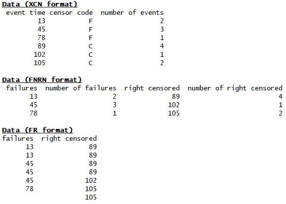

.. image:: images/logo.png

-------------------------------------

Converting data between different formats
'''''''''''''''''''''''''''''''''''''''''

The module Convert_data contains six functions for converting data between the three formats (XCN, FNRN, FR). These functions are:

Convert_data.XCN_to_FNRN
Convert_data.XCN_to_FR
Convert_data.FNRN_to_XCN
Convert_data.FNRN_to_FR
Convert_data.FR_to_XCN
Convert_data.FR_to_FNRN

The three data formats are different ways of representing the same information, just with different levels of summarisation and grouping. The following image shows the same data expressed in each format.

**XCN - event time, cesoring code, number of events** - This format is the default in most commercial software including Reliasoft and Minitab. The sequence of XCN and the names may change between different software, but the format is essentially the same. Within reliability the XCN format may be reduced to XC (and all items are assumed to have quantity of 1). Some other software accepts the further reduced form of X (where there are no censored items and all items have a quantity of 1). If you have only failure data that is not grouped, then you should use the FR format as FR has a reduced form of F which is equivalent to X from XCN.

**FNRN - failures, number of failures, right censored, number of right censored** - This format is not used as a data entry format for reliability or any commercial software (that the author has used), but is still a valid format which combines aspects of the XCN and FR formats together. FNRN is used internally within reliability as part of the MLE algorithms.

**FR - failures, right censored** - This is the standard data entry format for reliability. The FR format is the most simple, but for data with many repeated values it is not as efficient at representing the data in a table as FNRN or XCN. Python has no problems with long arrays so the FR format is chosen as the data entry format for its simplicity.

Each of the three data formats has an acceptable reduced form as follows:

- XCN reduced form is XC and all rows are assumed to have a quantity of 1
- FNRN reduced form is FN and it is assumed that there is no right censored data
- FR reduced form is F and it is assumed that there is no right censored data

For more information on these three data formats as well as how to import data from Microsoft Excel (.xlsx files) into Python, please see the section on `Importing data from Excel <https://reliability.readthedocs.io/en/latest/Importing%20data%20from%20Excel.html>`_.

**XCN_to_FR**

Inputs:

-   X - the failure or right_censored time. This must be an array or list.
-   C -  the censoring code for each X. This must be an array or list. Defaults are recognised from the lists shown below.
-   N - the quantity for each X. This must be an array or list. Optional Input. If omitted all items are assumed to have quantity (N) of 1.
-   censor_code - specify the censor code you have used if it does not appear in the defaults. Optional input. Default censor codes that will be recognised (not case sensitive): 'R', 'RC', 'RIGHT CENS', 'RIGHT CENSORED', 'C', 'CENSORED', 'CENS', 'S', 'SUSP', 'SUSPENSION', 'SUSPENDED', 'UF', 'UNFAILED', 'UNFAIL', 'NF', 'NO FAIL', 'NO FAILURE', 'NOT FAILED', 1
- failure_code - specify the failure code you have used if it does not appear in the defaults. Optional Input. Default failure codes that will be recognised (not case sensitive): 'F', 'FAIL', 'FAILED', 'FAILURE', 0

Outputs:

-   failures
-   right_censored

**XCN_to_FNRN**

Inputs:

-   X - the failure or right_censored time. This must be an array or list.
-   C -  the censoring code for each X. This must be an array or list. Defaults are recognised from the lists shown below.
-   N - the quantity for each X. This must be an array or list. Optional Input. If omitted all items are assumed to have quantity (N) of 1.
-   censor_code - specify the censor code you have used if it does not appear in the defaults. Optional input. Default censor codes that will be recognised (not case sensitive): 'R', 'RC', 'RIGHT CENS', 'RIGHT CENSORED', 'C', 'CENSORED', 'CENS', 'S', 'SUSP', 'SUSPENSION', 'SUSPENDED', 'UF', 'UNFAILED', 'UNFAIL', 'NF', 'NO FAIL', 'NO FAILURE', 'NOT FAILED', 1
- failure_code - specify the failure code you have used if it does not appear in the defaults. Optional Input. Default failure codes that will be recognised (not case sensitive): 'F', 'FAIL', 'FAILED', 'FAILURE', 0

Outputs:

-   failures
-   num_failures
-   right_censored
-   num_right_censored

**FNRN_to_XCN**

Inputs:

-   failures - array or list
-   num_failures - array or list. Length must match length of failures
-   right_censored -  array or list. Optional input.
-   num_right_censored - array or list. Optional Input. Length must match length of right_censored
-   censor_code - the int or str to use for the censored items. Optional input. Default is 'C'
-   failure_code - the int or str to use for the failed items. Optional input. Default is 'F'

Outputs:
 
-   X - event time
-   C - censor code
-   N - number of events at each event time

**FR_to_XCN**

Inputs:

-   failures - array or list
-   right_censored -  array or list. Optional input.
-   censor_code - the int or str to use for the censored items. Optional input. Default is 'C'
-   failure_code - the int or str to use for the failed items. Optional input. Default is 'F'

Outputs:
 
-   X - event time
-   C - censor code
-   N - number of events at each event time

**FNRN_to_FR**

Inputs:

-   failures - array or list
-   right_censored -  array or list. Optional input.
-   censor_code - the int or str to use for the censored items. Default is 'C'. Optional Input
-   failure_code - the int or str to use for the failed items. Default is 'F'. Optional Input

Outputs:

-   failures
-   right_censored

**FR_to_FNRN**

Inputs:

-   failures - array or list
-   right_censored - array or list. Optional Input.

Outputs:

-   failures
-   right_censored
-   censor_code
-   failure_code

All of the six conversion functions contain the following methods:

-   print() - this will print a dataframe of the data in the output format to the console
-   write_to_xlsx() - this will export the data in the output format to an xlsx file at the specified path. Ensure you specify the path string preceeded by r to indicate raw text. For example write_to_xlsx(path=r'C:\Users\Current User\Desktop\mydata.xlsx')

Example 1
---------

In the example below...

.. code:: python

    from reliability

Example 2
---------

In the example below...

.. code:: python

    from reliability
