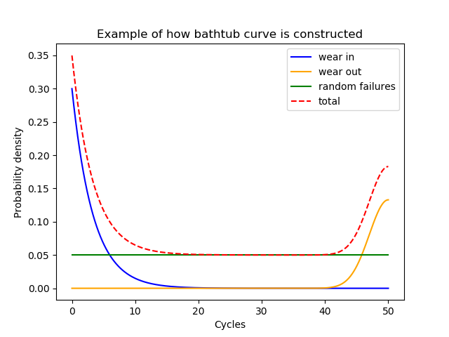

.. image:: images/logo.png

-------------------------------------

Creating and plotting distributions
'''''''''''''''''''''''''''''''''''

There are 7 different probability distributions available in ``reliability.Distributions``. These are:

-   Weibull Distribution (α, β, γ)
-   Exponential Distribution (λ, γ)
-   Gamma Distribution (α, β, γ)
-   Normal Distribution (μ, σ)
-   Lognormal Distribution (μ, σ, γ)
-   Loglogistic Distribution (α, β, γ)
-   Beta Distribution (α, β)

In all of the distributions which use γ, the γ parameter is used to location shift the distribution to the right.
The Beta distribution is only defined in the range  0 to 1. All distributions except the Normal distribution are defined in the positive domain only (x>0).

Understanding how to create and plot distributions is easiest with an example. In this first example, we will create a Weibull Distribution with parameters alpha = 50 and beta = 2. We will then plot the PDF of the distribution.

.. code:: python

    from reliability.Distributions import Weibull_Distribution
    import matplotlib.pyplot as plt

    dist = Weibull_Distribution(alpha=50, beta=2)  # this created the distribution object
    dist.PDF()  # this creates the plot of the PDF
    plt.show()

.. image:: images/weibull_plot1.png

Just as easily as we plotted the PDF in the above example, we can plot any of the 5 characteristic functions (PDF, CDF, SF, HF, CHF). If you would like to view all of these functions together, you can use the plot() method. In this second example, we will create a Lognormal Distribution with parameters mu=2 and sigma=0.5. From this distribution, we will use the plot() method to visualise the five functions and also provide a summary of the descriptive statistics.

.. code:: python

    from reliability.Distributions import Lognormal_Distribution
    
    dist = Lognormal_Distribution(mu=2,sigma=0.5)
    dist.plot()

.. image:: images/Lognormal_plot2.png

Probability distributions within ``reliability`` are Python objects, which allows us to specify just the type of distribution and its parameters. Once the distribution object is created, we can access a large number of methods (such as PDF or plot as we did above). Some of the methods require additional input and some have optional inputs.

The following methods are available for all distributions:

-   name - a string of the distribution name. Eg. 'Weibull'
-   name2 - a string of the distribution name including the number of parameters. Eg. 'Weibull_2P'
-   param_title_long - Useful in plot titles, legends and in printing strings. Varies by distribution. eg. 'Weibull Distribution (α=5,β=2)'
-   param_title - Useful in plot titles, legends and in printing strings. Varies by distribution. eg. 'α=5,β=2'
-   parameters - returns an array of parameters. These are in the order specified in the bullet points above, so for Lognormal it would return [mu,sigma,gamma].
-   alpha, beta, gamma, Lambda, mu, sigma - these vary by distribution but will return the value of their respective parameter. Eg. dist.mu would return 2 in the above example.
-   mean
-   variance
-   standard_deviation
-   skewness
-   kurtosis
-   excess_kurtosis
-   median
-   mode
-   b5 - the time at which 5% of units have failed. Same as dist.quantile(0.05)
-   b95 - - the time at which 95% of units have failed. Same as dist.quantile(0.95)
-   plot() - plots all functions (PDF, CDF, SF, HF, CHF). Also accepts xvals, xmin, xmax.
-   PDF() - plots the probability density function. Also accepts xvals, xmin, xmax, show_plot, and plot keywords (eg. color).
-   CDF() - plots the cumulative distribution function. Also accepts xvals, xmin, xmax, show_plot, and plot keywords (eg. color).
-   SF() - plots the survival function (also known as reliability function). Also accepts xvals, xmin, xmax, show_plot, and plot keywords (eg. color).
-   HF() - plots the hazard function. Also accepts xvals, xmin, xmax, show_plot, and plot keywords (eg. color).
-   CHF() - plots the cumulative hazard function. Also accepts xvals, xmin, xmax, show_plot, and plot keywords (eg. color).
-   quantile() - Calculates the quantile (time until a fraction has failed) for a given fraction failing. Also known as 'b' life where b5 is the time at which 5% have failed. You must specify the y-value at which to calculate the quantile. Eg. dist.quantile(0.05) will give the b5 life.
-   inverse_SF() - Calculates the inverse of the survival function. Useful when producing QQ plots. You must specify the y-value at which to calculate the inverse SF. Eg. dist.inverse_SF(0.8) will give the time at which 80% have not failed.
-   mean_residual_life() - Average residual lifetime of an item given that the item has survived up to a given time. Effectively the mean of the remaining amount (right side) of a distribution at a given time. You must specify the x-value at which to calculate MRL. Eg. dist.mean_residual_life(10)
-   stats() - prints all the descriptive statistics. Same as the statistics shown using .plot() but printed to console. No arguments are accepted.
-   random_samples() - draws random samples from the distribution to which it is applied. Same as rvs in scipy.stats. You must specify the number of samples. Eg. data = dist.random_samples(100) will set data as a list of 100 random samples from the distribution. If you want repeatability, specify the seed E.g data = dist.random_samples(100, seed=1).

For all of the individual plotting functions (PDF, CDF, SF, HF, CHF), all standard matplotlib plotting keywords (such as label, color, linestyle, etc.) are accepted and used. If not specified they are preset. In specifying the plotting positions for the x-axis, there are optional keywords to be used. The first of these is 'xvals' which accepts a list of x-values to use for the horizontal axis. Alternatively, the user may specify 'xmin' and/or 'xmax' if there is a desired minimum or maximum value. If left unspecified these will be set automatically. xvals overrides xmin and xmax.

Note that .plot() does not require plt.show() to be used as it will automatically show, however the other 5 plotting functions will not be displayed until plt.show() is used. This is to allow the user to overlay multiple plots on the figure or change titles, labels, and legends as required. The plot can be turned off by specifying show_plot=False.

Each of the 5 functions (PDF, CDF, SF, HF, CHF) will always return the y-values for a given set of x-values (xvals). In this example, we want to know the value of the Survival Function at x=20.

.. code:: python

    from reliability.Distributions import Weibull_Distribution
    
    dist = Weibull_Distribution(alpha=50, beta=2)
    sf = dist.SF(20)
    print('The value of the SF at 20 is', round(sf * 100, 2), '%') # we are converting the decimal answer (0.8521...) to a percentage
    
    '''
    The value of the SF at 20 is 85.21 %
    '''

As a final example, we will create a bathtub curve by creating and layering several distributions. The bathtub curve is only for the Hazard function as it shows how a variety of failure modes throughout the life of a population can shape the hazard into a bathtub shape. The three distinct regions are infant mortality, random failures, and wear out. In this example, the returned y-values are added together to produce the 'combined' array which is then plotted using matplotlib against the xvals. By specifying xvals in each HF we can ensure that the xvals used will all align. Leaving xvals unspecified would not be appropriate in this example as the default xvals will depend on the shape of the plot.

.. code:: python

    from reliability.Distributions import Weibull_Distribution, Lognormal_Distribution, Exponential_Distribution
    import matplotlib.pyplot as plt
    import numpy as np
    xvals = np.linspace(0,1000,1000)
    infant_mortality = Weibull_Distribution(alpha=400,beta=0.7).HF(xvals=xvals,label='infant mortality [Weibull]')
    random_failures = Exponential_Distribution(Lambda=0.001).HF(xvals=xvals,label='random failures [Exponential]')
    wear_out = Lognormal_Distribution(mu=6.8,sigma=0.1).HF(xvals=xvals,label='wear out [Lognormal]')
    combined = infant_mortality+random_failures+wear_out
    plt.plot(xvals,combined,linestyle='--',label='Combined hazard rate')
    plt.legend()
    plt.title('Example of how multiple failure modes at different stages of\nlife create a "Bathtub curve" for the total Hazard function')
    plt.show()

Further detail about all of the functions is available using the help function within Python. Simply type:

.. code:: python

    from reliability.Distributions import Lognormal_Distribution
    print(help(Lognormal_Distribution))
