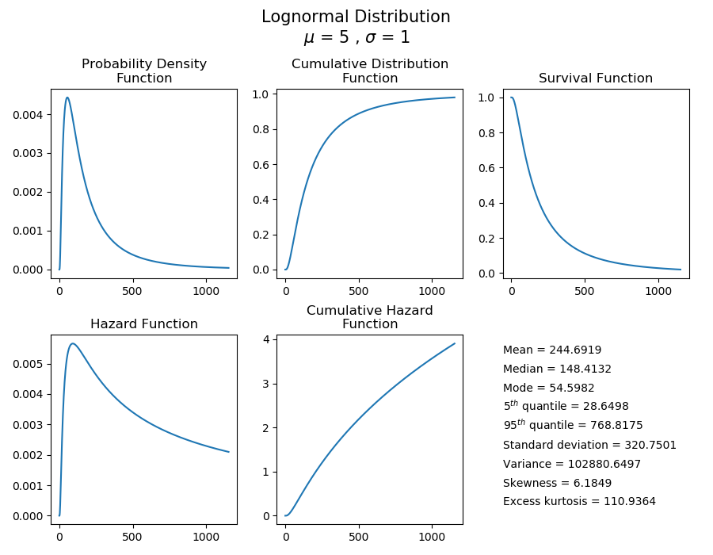

.. image:: images/logo.png

-------------------------------------

Creating and plotting distributions
'''''''''''''''''''''''''''''''''''

Probability distributions within ``reliability`` are Python objects, which allows us to specify just the type of distribution and parameters. Once the distribution object is created, we can access a large number of methods, some of which will require additional input. There are 6 different probability distributions available in ``reliability``. These are:

-   Weibull Distribution (α, β, γ)
-   Exponential Distribution (λ, γ)
-   Gamma Distribution (α, β, γ)
-   Normal Distribution (μ, σ)
-   Lognormal Distribution (μ, σ, γ)
-   Beta Distribution (α, β)

In all of the distributions which use γ, the γ parameter is used to location shift the distribution to the right.
The Beta distribution is only defined in the range {0,1}.

Understanding how to create and plot distributions is easiest with an example. The following code will create a Lognormal Distribution with parameters mu=5 and sigma=1. From this distribution, we will use the plot() method which provides a quick way to visualise the five functions and also provides a summary of the descriptive statistics.

.. code:: python

    from reliability.Distributions import Lognormal_Distribution
    dist = Lognormal_Distribution(mu=5,sigma=1)
    dist.plot()

The following methods are available for all distributions:

-   name - a string of the distribution name. Eg. 'Weibull'
-   parameter_names - varies by distribution. Eg. ['alpha','beta','gamma'] would be returned for Weibull
-   parameters - returns an array of parameters. These are in the order specified in the bullet points above, so for Lognormal it would return [mu,sigma].
-   alpha, beta, gamma, Lambda, mu, sigma - these vary by distribution but will return the value of their respective parameter. Eg. dist.mu would return 5 in the above example.
-   mean
-   variance
-   standard_deviation
-   skewness
-   kurtosis
-   excess_kurtosis
-   median
-   mode
-   plot() - plots all functions (PDF, CDF, SF, HF, CHF). No additional arguments are accepted.
-   PDF() - plots the probability density function.
-   CDF() - plots the cumulative distribution function.
-   SF() - plots the survival function (also known as reliability function).
-   HF() - plots the hazard function.
-   CHF() - plots the cumulative hazard function.
-   quantile() - Calculates the quantile (time until a fraction has failed) for a given fraction failing. Also known as 'b' life where b5 is the time at which 5% have failed. Eg. dist.quantile(0.05) will give the b5 life.
-   inverse_SF() - Calculates the inverse of the survival function. Useful when producing QQ plots.
-   mean_residual_life() - Average residual lifetime of an item given that the item has survived up to a given time. Effectively the mean of the remaining amount (right side) of a distribution at a given time. You must specify the x-value at which to calculate MRL. Eg. dist.mean_residual_life(10)
-   stats() - prints all the descriptive statistics. Same as the statistics shown using .plot() but printed to console.
-   random_samples() - draws random samples from the distribution to which it is applied. Same as rvs in scipy.stats. You must specify the number of samples. Eg. data = dist.random_samples(100) will set data as a list of 100 random samples from the distribution.

For all of the individual plotting functions (PDF, CDF, SF, HF, CHF), all standard matplotlib plotting keywords (such as xlabel, title, color, etc.) are accepted and used. If not specified they are preset. In specifying the plotting positions for the x-axis, there are optional keywords to be used. The first of these is 'xvals' which accepts a list of x-values to use for the horizontal axis. Alternatively, the user may specify 'xmin' and 'xmax' and the axis will be created using np.linspace(xmin, xmax, 1000).

Note that .plot() does not require plt.show() to be used as it will automatically show, however the other 5 plotting functions will not be displayed until plt.show() is used. This is to allow the user to overlay multiple plots on the figure or change titles, labels, and legends as required.

As another example, we will create a bathtub curve by creating and layering several distributions. The bathtub curve is only for the Hazard function as it shows how a variety of failure modes throughout the life of a population can shape the hazard into a bathtub shape. The three distrinct regions are infant mortality, random failures, and wear out.

.. code:: python

    from reliability.Distributions import Weibull_Distribution, Lognormal_Distribution, Exponential_Distribution
    import matplotlib.pyplot as plt
    import numpy as np
    xvals = np.linspace(0,1000,1000)
    infant_mortality = Weibull_Distribution(alpha=400,beta=0.7).HF(xvals=xvals,label='infant mortality [Weibull]')
    random_failures = Exponential_Distribution(Lambda=0.001).HF(xvals=xvals,label='random failures [Exponential]')
    wear_out = Lognormal_Distribution(mu=6.8,sigma=0.1).HF(xvals=xvals,label='wear out [Lognormal]')
    combined = infant_mortality+random_failures+wear_out
    plt.plot(xvals,combined,linestyle='--',label='Combined hazard rate')
    plt.legend()
    plt.title('Example of how multiple failure modes at different stages of\nlife create a "Bathtub curve" for the total Hazard function')
    plt.show()

.. image:: images/bathtub_curve.png

Further detail about all of the functions is available using the help function within Python. Simply type:

.. code:: python

    from reliability.Distributions import Lognormal_Distribution
    print(help(Lognormal_Distribution))
