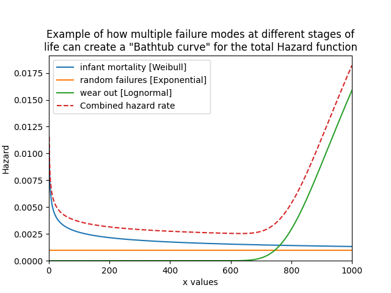
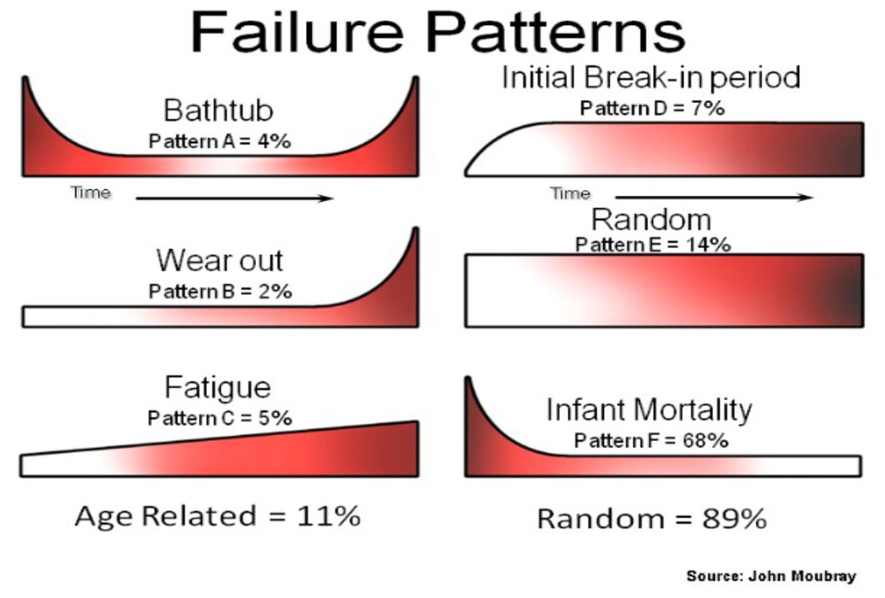

.. image:: images/logo.png

-------------------------------------

Creating and plotting distributions
'''''''''''''''''''''''''''''''''''

There are 8 standard probability `distributions <https://reliability.readthedocs.io/en/latest/Equations%20of%20supported%20distributions.html>`_ available in `reliability.Distributions`. These are:

-   Weibull Distribution (α, β, γ)
-   Exponential Distribution (λ, γ)
-   Gamma Distribution (α, β, γ)
-   Normal Distribution (μ, σ)
-   Lognormal Distribution (μ, σ, γ)
-   Loglogistic Distribution (α, β, γ)
-   Gumbel Distribution (μ, σ)
-   Beta Distribution (α, β)

.. admonition:: API Reference

   For inputs and outputs see the `API reference <https://reliability.readthedocs.io/en/latest/API/Distributions.html>`_.

Probability distributions within *reliability* are Python objects, which allows us to specify just the type of distribution and its parameters. Once the distribution object is created, we can access a large number of methods (such as PDF() or plot()). Some of the methods require additional input and some have optional inputs.

In all of the distributions which use γ, the γ parameter is used to location shift the distribution to the right. If used, the γ parameter must be greater than or equal to 0.

The Beta distribution is only defined in the range 0 to 1. All distributions except the Normal and Gumbel distributions are defined in the positive domain only (x>0).

Example 1
---------

Understanding how to create and plot distributions is easiest with an example. In this first example, we will create a Weibull Distribution with parameters alpha = 50 and beta = 2. We will then plot the PDF of the distribution.

.. code:: python

    from reliability.Distributions import Weibull_Distribution
    import matplotlib.pyplot as plt

    dist = Weibull_Distribution(alpha=50, beta=2)  # this created the distribution object
    dist.PDF()  # this creates the plot of the PDF
    plt.show()

.. image:: images/weibull_plot1.png

Example 2
---------

Just as easily as we plotted the PDF in the above example, we can plot any of the 5 characteristic functions (PDF, CDF, SF, HF, CHF). If you would like to view all of these functions together, you can use the plot() method. In this second example, we will create a Lognormal Distribution with parameters mu=2 and sigma=0.5. From this distribution, we will use the plot() method to visualise the five functions and also provide a summary of the descriptive statistics.

.. code:: python

    from reliability.Distributions import Lognormal_Distribution
    
    dist = Lognormal_Distribution(mu=2,sigma=0.5)
    dist.plot()

.. image:: images/Lognormal_plot2.png

For all of the individual plotting functions (PDF, CDF, SF, HF, CHF), all standard matplotlib plotting keywords (such as label, color, linestyle, etc.) are accepted and used. If not specified they are preset. In specifying the plotting positions for the x-axis, there are optional keywords to be used. The first of these is 'xvals' which accepts a list of x-values to use for the horizontal axis. Alternatively, the user may specify 'xmin' and/or 'xmax' if there is a desired minimum or maximum value. If left unspecified these will be set automatically. xvals overrides xmin and xmax.

Note that .plot() does not require plt.show() to be used as it will automatically show, however the other 5 plotting functions will not be displayed until plt.show() is used. This is to allow the user to overlay multiple plots on the figure or change titles, labels, and legends as required. The plot can be turned off by specifying show_plot=False.

Example 3
---------

Each of the 5 functions (PDF, CDF, SF, HF, CHF) will always return the y-values for a given set of x-values (xvals). In this example, we want to know the value of the Survival Function at x=20.

.. code:: python

    from reliability.Distributions import Weibull_Distribution
    
    dist = Weibull_Distribution(alpha=50, beta=2)
    sf = dist.SF(20)
    print('The value of the SF at 20 is', round(sf * 100, 2), '%') # we are converting the decimal answer (0.8521...) to a percentage
    
    '''
    The value of the SF at 20 is 85.21 %
    '''

Example 4
---------

As a final example, we will create a bathtub curve by creating and layering several distributions. The bathtub curve is only for the Hazard function as it shows how a variety of failure modes throughout the life of a population can shape the hazard into a bathtub shape. The three distinct regions are infant mortality, random failures, and wear out. In this example, the returned y-values are added together to produce the 'combined' array which is then plotted using matplotlib against the xvals. By specifying xvals in each HF we can ensure that the xvals used will all align. Leaving xvals unspecified would not be appropriate in this example as the default xvals will depend on the shape of the plot.

.. code:: python

    from reliability.Distributions import Weibull_Distribution, Lognormal_Distribution, Exponential_Distribution
    import matplotlib.pyplot as plt
    import numpy as np
    xvals = np.linspace(0,1000,1000)
    infant_mortality = Weibull_Distribution(alpha=400,beta=0.7).HF(xvals=xvals,label='infant mortality [Weibull]')
    random_failures = Exponential_Distribution(Lambda=0.001).HF(xvals=xvals,label='random failures [Exponential]')
    wear_out = Lognormal_Distribution(mu=6.8,sigma=0.1).HF(xvals=xvals,label='wear out [Lognormal]')
    combined = infant_mortality+random_failures+wear_out
    plt.plot(xvals,combined,linestyle='--',label='Combined hazard rate')
    plt.legend()
    plt.title('Example of how multiple failure modes at different stages of\nlife can create a "Bathtub curve" for the total Hazard function')
    plt.xlim(0,1000)
    plt.ylim(bottom=0)
    plt.show()

On the topic of the Bathtub curve generated in Example 4, it is important to understand that despite its well known name, the bathtub shape of the hazard function is actually much more uncommon than its reputation may suggest. A series of studies (United Airlines 1978, Broberg 1973, SSMD 1993, SUBMEPP 2001) have analysed the failure patterns of large numbers of components and found that there are six characteristic failure patterns (named A to F). Three of these (including the bathtub curve - pattern A) exhibit wear out, while the other three show no signs of wear out. Of all components analysed, just 4% (from the 1978 study) were found to exhibit a bathtub curve, and only 11% showed evidence of wear out (failure modes A,B,C). With 89% of components analysed showing no evidence of wear out it is surprising how many of our maintenance programs to this day still have maintenance policies based on wear out, and how ubiquitous the term "bathtub curve" has become in the maintenance community. Before assuming something is wearing out, we should let its data tell the story.

If you would like access the API Reference programatically, you can use the help function within Python. Simply type:

.. code:: python

    from reliability.Distributions import Lognormal_Distribution
    print(help(Lognormal_Distribution))
