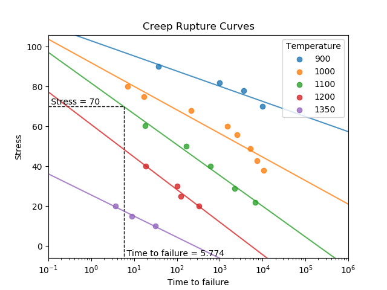

.. image:: images/logo.png

-------------------------------------

Creep
'''''

Creep is the progressive accumulation of plastic strain in a component under stress at an elevated temperature over a period of time. All creep modelling requires data that is unique to the material undergoing creep since all materials behave differently. This data may be stress, temperature, and time to failure data, or it may be material constants which are derived from the former. This secion of reliability contains two functions to determine time to failure due to creep. These functions are ``creep_rupture_curves`` and ``creep_failure_time``. Creep is generally modelled using the `Larson-Miller <https://en.wikipedia.org/wiki/Larson%E2%80%93Miller_relation>`_ relation or the Manson-Haferd relation.

The function ``creep_rupture_curves`` plots the creep rupture curves for a given set of creep data. The function also fits the lines of best fit to each temperature. The time to failure for a given temperature can be found by specifying stress_trace and temp_trace.

Inputs:

-   temp_array - an array or list of temperatures
-   stress_array- an array or list of stresses
-   TTF_array - an array or list of times to failure at the given temperatures and stresses
-   stress_trace - The stress to use for finding the time to failure (only 1 value is accepted)
-   temp_trace - The temperature to use for finding the time to failure (only 1 value is accepted)

Outputs:

-   The plot is the only output. Use plt.show() to show it.

In the following example (taken from example 2.16 of Probabilistic Physics of Failure Approach to Reliability (2017)), we provide creep data in the form of temperatures, stresses, and times to failure in order to obtain the creep rupture curves. We also are interested in the time to failure of a component at a stress of 70 and a temperature of 1100.

.. code:: python

    from reliability.PoF import creep_rupture_curves
    import matplotlib.pyplot as plt
    TEMP = [900,900,900,900,1000,1000,1000,1000,1000,1000,1000,1000,1100,1100,1100,1100,1100,1200,1200,1200,1200,1350,1350,1350]
    STRESS = [90,82,78,70,80,75,68,60,56,49,43,38,60.5,50,40,29,22,40,30,25,20,20,15,10]
    TTF = [37,975,3581,9878,7,17,213,1493,2491,5108,7390,10447,18,167,615,2220,6637,19,102,125,331,3.7,8.9,31.8]
    creep_rupture_curves(temp_array=TEMP, stress_array=STRESS, TTF_array=TTF, stress_trace=70, temp_trace=1100)
    plt.show()

The function ``creep_failure_time`` uses the Larson-Miller relation to find the time to failure due to creep. The method uses a known failure time (time_low) at a lower failure temperature (temp_low) to find the unknown failure time at the higher temperature (temp_high). This relation requires the input temperatures in Fahrenheit. To convert Celsius to Fahrenheit use F = C*(9/5)+32. Also note that the conversion between Fahrenheit and Rankine used in this calculation is R = F+459.67.

Inputs:

-   temp_low - temperature (in degrees Fahrenheit) where the time_low is known
-   temp_high - temperature (in degrees Fahrenheit) which time_high is unknown and will be found by this function
-   time_low - time to failure at temp_low
-   C - creep constant (default is 20). Typically 20-22 for metals
-   print_results - True/False

Outputs:

-   The time to failure at the higher temperature.
-   If print_results is True, the output will also be printed to the console.

In the following example (which follows on from the previous example), we will use the Larson-Miller relation to find the time to failure due to creep at 1100°F for a component which we know fails at 9878 hours when subjected to the same stress at 900°F.

.. code:: python

    from reliability.PoF import creep_failure_time
    creep_failure_time(temp_low=900,temp_high=1100,time_low=9878)
    
    '''
    The time to failure at a temperature of 1100 °F is 8.27520045913433
    The Larson-Miller parameter was found to be 32624.83162890552
    '''

**References:**

Probabilistic Physics of Failure Approach to Reliability (2017), by M. Modarres, M. Amiri, and C. Jackson. pp.81-90
