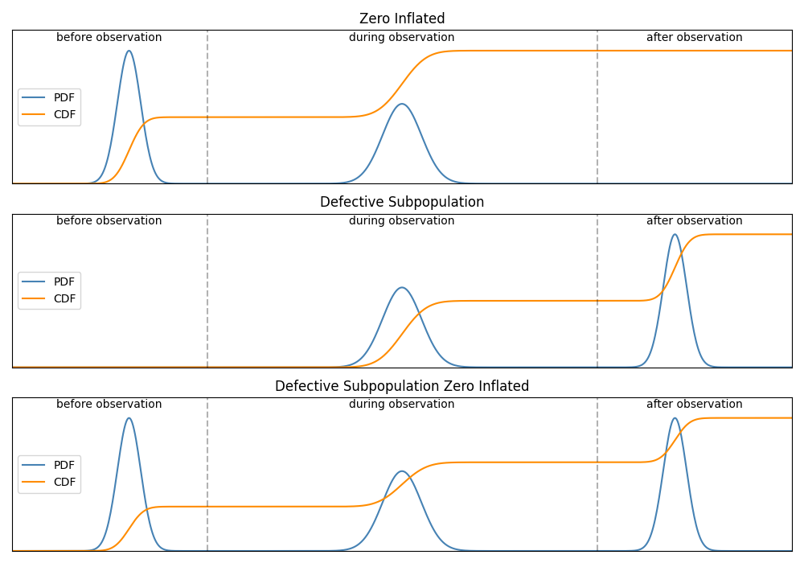
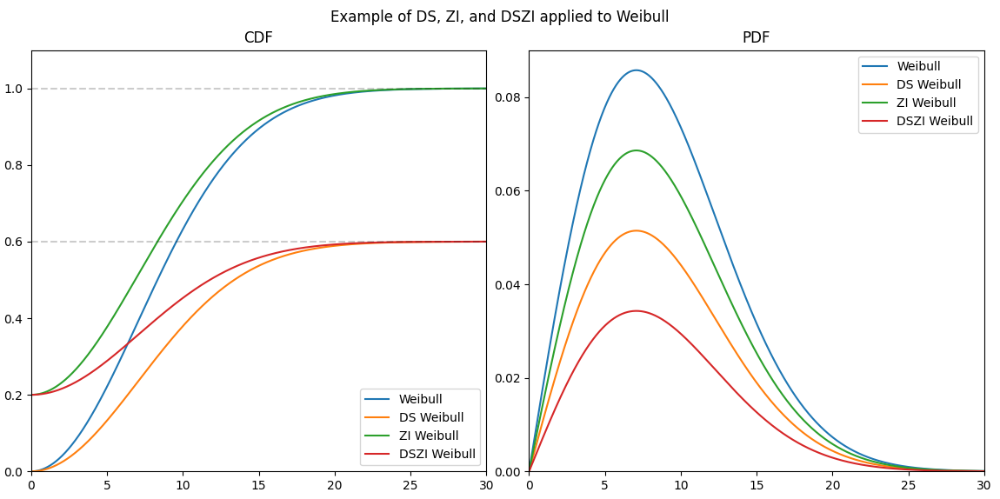
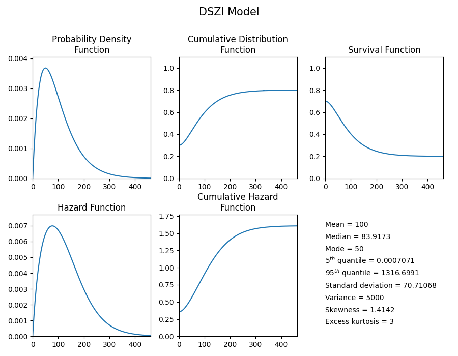
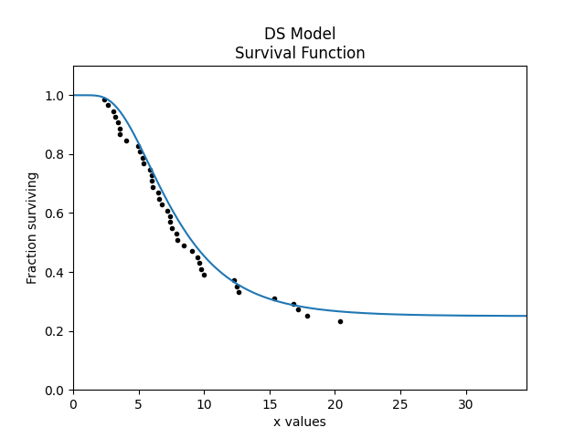
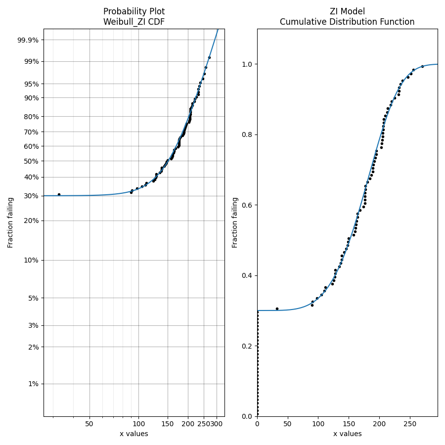
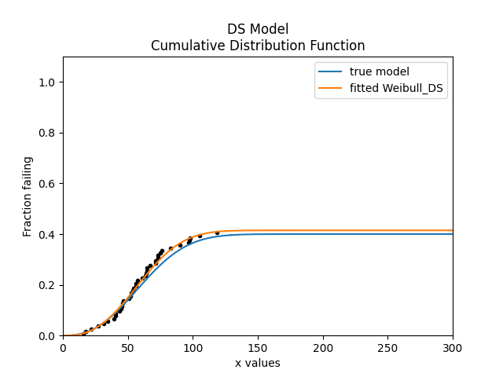
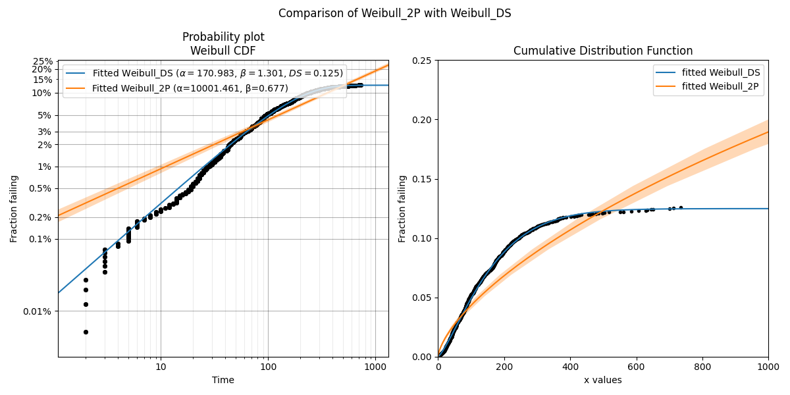

.. image:: images/logo.png

-------------------------------------

DSZI models
'''''''''''

What are DSZI models?
=====================

DSZI is an acronym for "Defective Subpopulation Zero Inflated". It is a combination of the Defective Subpopulation (DS) model and the Zero Inflated (ZI) model.

A defective subpopulation model is where the CDF does not reach 1 during the period of observation.
This is caused when a portion of the population fails (known as the defective subpopulation) but the remainder of the population does not fail (and is right censored) by the end of the observation period.

A zero inflated model is where the CDF starts above 0 at the start of the observation period.
This is caused by many "dead-on-arrival" items from the population, represented by failure times of 0.
This is not the same as left censored data since left censored is when the failures occurred between 0 and the observation time.
In the zero inflated model, the observation time is considered to start at 0 so the failure times are 0.

In a DSZI model, the CDF (which normally goes from 0 to 1) goes from above 0 to below 1, as shown in the image below.
In this image the scale of the PDF and CDF are normalized so they can both be viewed together. In reality the CDF is much larger than the PDF.

A DSZI model may be applied to any distribution (Weibull, Normal, Lognormal, etc.) using the transformations explained in the next section.
The plot below shows how a Weibull distribution can become a DS_Weibull, ZI_Weibull and DSZI_Weibull.
Note that the PDF of the DS, ZI, and DSZI models appears smaller than that of the original Weibull model since the area under the PDF is no longer 1.
This is because the CDF does not range from 0 to 1.

Equations of DSZI models
========================

A DSZI Model adds a minor modification to the PDF and CDF of any standard distribution (referred to here as the "base distribution") to transform it into a DSZI Model. The transformations are as follows:

:math:`PDF_{DSZI} = PDF_{base} × (DS-ZI)` 

:math:`CDF_{DSZI} = CDF_{base} × (DS-ZI) + ZI` 

In the above equations the base distribution (represented by :math:`PDF_{base}` and :math:`CDF_{base}`) is transformed using the parameters DS and ZI.
DS is the maximum of the CDF which represents the fraction of the total population that is defective (the defective subpopulation).
ZI is the minimum of the CDF which represents the fraction of the total population that failed at t=0 or equivalently were “dead-on-arrival” (the zero inflated fraction).
To create only a DS model we can set ZI as 0. To create only a ZI model we can set DS as 1. The parameters DS and ZI must be between 0 and 1, and DS must be greater than ZI.
The above equations can be expanded depending on the equation of the base distribution. For example, if the base distribution is a two parameter Weibull distribution, the DSZI model would be:

:math:`\text{PDF:} \hspace{11mm} f(t) = \frac{\beta}{\alpha}\left(\frac{t}{\alpha}\right)^{(\beta-1)}{\rm e}^{-(\frac{t}{\alpha })^ \beta } \left(DS - ZI \right)` 

:math:`\text{CDF:} \hspace{10mm} F(t) = \left(1 - {\rm e}^{-(\frac{t}{\alpha })^ \beta }\right) \left(DS - ZI \right) + ZI`

The SF, HF and CHF can be obtained using transformations from the CDF and PDF using the `relationships between the five functions <https://reliability.readthedocs.io/en/latest/Equations%20of%20supported%20distributions.html#relationships-between-the-five-functions>`_.

Creating a DSZI model
=====================

Within reliability, the DSZI Model is available within the Distributions module. The input requires the base distribution to be specified using a distribution object and the DS and ZI parameters to be specified if required.
DS defaults to 1 and ZI defaults to 0. The output API matches the API for the standard distributions.

.. admonition:: API Reference

   For inputs and outputs see the `API reference <https://reliability.readthedocs.io/en/latest/API/Distributions/DSZI_Model.html>`_.

Example 1
---------

In this first example, we will create a Gamma DSZI model and plot the 5 functions.

.. code:: python

    from reliability.Distributions import Gamma_Distribution, DSZI_Model
    model = DSZI_Model(distribution = Gamma_Distribution(alpha=50,beta=2), DS= 0.8, ZI=0.3)
    model.plot()

Example 2
---------

In this second example, we will create a Lognormal_DS model, draw some random samples and plot those samples on the survival function plot.

.. code:: python

    from reliability.Distributions import Lognormal_Distribution, DSZI_Model
    from reliability.Probability_plotting import plot_points
    import matplotlib.pyplot as plt
    model = DSZI_Model(distribution = Lognormal_Distribution(mu=2,sigma=0.5), DS= 0.75)
    failures, right_censored = model.random_samples(50,seed=7, right_censored_time = 50)
    model.SF()
    plot_points(failures = failures, right_censored = right_censored, func="SF")
    plt.show()

Note that in the above example, the random_samples function returns failures and right_censored values. This differs from all other Distributions which only return failures.
The reason for returning failures and right_censored data is that is is essential to have right_censored data in order to have a DS Model.

Fitting a DSZI model
====================

.. admonition:: API Reference

   For inputs and outputs see the API reference for `Fit_Weibull_DS <https://reliability.readthedocs.io/en/latest/API/Fitters/Fit_Weibull_DS.html>`_ and `Fit_Weibull_ZI <https://reliability.readthedocs.io/en/latest/API/Fitters/Fit_Weibull_ZI.html>`_.

As we saw above, the DSZI_Model can be either DS, ZI, or DSZI depending on the values of the DS and ZI parameters.
Within the Fitters module, three functions are offered, one of each of these cases with the Weibull_2P distribution as the base distribution.
The three Fitters available are Fit_Weibull_DS, Fit_Weibull_ZI, and Fit_Weibull_DSZI.
If your data contains zeros then only the Fit_Weibull_ZI and Fit_Weibull_DSZI fitters are appropriate. Using anything else will cause the zeros to be automatically removed and a warning to be printed.
Fit_Weibull_ZI does not mandate that the failures contain zeros, but if failures does not contain zeros then ZI will be 0 and the alpha and beta parameters will be equivalent to the results from Fit_Weibull_2P.
Fit_Weibull_DS does not mandate that right_censored data is provided, but if right_censored data is not provided then DS will be 1 and the alpha and beta parameters will be equivalent to the results from Fit_Weibull_2P.

Example 3
---------

In this example, we will create 70 samples of failure data from a Weibull Distribution, and append 30 zeros to it. We will then use Fit_Weibull_ZI to model the data.

.. code:: python

    from reliability.Distributions import Weibull_Distribution
    from reliability.Fitters import Fit_Weibull_ZI
    from reliability.Probability_plotting import plot_points
    import numpy as np
    import matplotlib.pyplot as plt
    
    data = Weibull_Distribution(alpha=200, beta=5).random_samples(70, seed=1)
    zeros = np.zeros(30)
    failures = np.hstack([zeros, data])
    plt.subplot(121)
    fit = Fit_Weibull_ZI(failures=failures)
    plt.subplot(122)
    fit.distribution.CDF()
    plot_points(failures=failures)
    plt.tight_layout()
    plt.show()

    '''
    Results from Fit_Weibull_ZI (95% CI):
    Analysis method: Maximum Likelihood Estimation (MLE)
    Optimizer: TNC
    Failures / Right censored: 100/0 (0% right censored) 
    
    Parameter  Point Estimate  Standard Error  Lower CI  Upper CI
        Alpha         192.931         5.33803   182.747   203.682
         Beta         4.53177        0.431272   3.76064   5.46102
           ZI             0.3       0.0458258  0.218403  0.396613 
    
    Goodness of fit    Value
     Log-likelihood -426.504
               AICc  859.259
                BIC  866.824
                 AD  5.88831 
    '''

We can see above how the fitter correctly identified that the distribution was 30% zero inflated, and it did a reasonable job of finding the alpha and beta parameters of the base distribution.

Example 4
---------

In this example, we will use Fit_Weibull_DS to model some data that is heavily right censored. The DS=0.4 parameter means that only 40% of the data is failure data, with the rest being right censored.
The original distribution is overlayed in the plot for comparison of the goodness of fit.

.. code:: python

    from reliability.Distributions import DSZI_Model, Weibull_Distribution
    from reliability.Fitters import Fit_Weibull_DS
    import matplotlib.pyplot as plt
    from reliability.Probability_plotting import plot_points
    
    model = DSZI_Model(distribution=Weibull_Distribution(alpha=70, beta=2.5), DS=0.4)
    failures, right_censored = model.random_samples(100, right_censored_time=120, seed=3)
    model.CDF(label="true model", xmax=300)
    fit_DS = Fit_Weibull_DS(failures=failures, right_censored=right_censored, show_probability_plot=False)
    fit_DS.distribution.CDF(label="fitted Weibull_DS", xmax=300)
    plot_points(failures=failures, right_censored=right_censored)
    plt.legend()
    plt.show()

    '''
    Results from Fit_Weibull_DS (95% CI):
    Analysis method: Maximum Likelihood Estimation (MLE)
    Optimizer: TNC
    Failures / Right censored: 41/59 (59% right censored)

    Parameter  Point Estimate  Standard Error  Lower CI  Upper CI
        Alpha         67.9275         4.61424   59.4599   77.6009
         Beta         2.63207        0.357826    2.0164   3.43571
           DS        0.414739       0.0500682  0.321106  0.514964 
    
    Goodness of fit    Value
     Log-likelihood -254.236
               AICc  514.721
                BIC  522.287
                 AD  374.746     
    '''

Example 5
---------

In this example, we will use some real world data from a vehicle manufacturer, which is available in the Datasets module.
This example shows how the Weibull_2P model can be an inappropriate choice for a dataset that is heavily right censored.
In addition the the visual proof provided by the probability plot (left) and the CDF (right), we can see the goodness of fit criterion indicate that Weibull_DS was much better (closer to zero) than Weibull_2P.

.. code:: python
    
    from reliability.Fitters import Fit_Weibull_DS, Fit_Weibull_2P
    import matplotlib.pyplot as plt
    from reliability.Probability_plotting import plot_points
    from reliability.Datasets import defective_sample
    
    failures = defective_sample().failures
    right_censored = defective_sample().right_censored
    
    plt.subplot(121)
    fit_DS = Fit_Weibull_DS(failures=failures, right_censored=right_censored)
    print('-------------------------------------------')
    fit_2P = Fit_Weibull_2P(failures=failures, right_censored=right_censored)
    
    plt.subplot(122)
    fit_DS.distribution.CDF(label="fitted Weibull_DS",xmax=1000)
    fit_2P.distribution.CDF(label="fitted Weibull_2P",xmax=1000)
    plot_points(failures=failures, right_censored=right_censored)
    plt.ylim(0,0.25)
    plt.legend()
    plt.title('Cumulative Distribution Function')
    plt.suptitle('Comparison of Weibull_2P with Weibull_DS')
    plt.gcf().set_size_inches(12,6)
    plt.tight_layout()
    plt.show()

    '''
    Results from Fit_Weibull_DS (95% CI):
    Analysis method: Maximum Likelihood Estimation (MLE)
    Optimizer: TNC
    Failures / Right censored: 1350/12295 (90.10627% right censored) 
    
    Parameter  Point Estimate  Standard Error  Lower CI  Upper CI
        Alpha         170.983         4.61716   162.169   180.276
         Beta         1.30109       0.0297713   1.24403   1.36077
           DS         0.12482      0.00333709  0.118425  0.131509 
    
    Goodness of fit    Value
     Log-likelihood -11977.7
               AICc  23961.3
                BIC  23983.9
                 AD  27212.4 
    
    -------------------------------------------
    Results from Fit_Weibull_2P (95% CI):
    Analysis method: Maximum Likelihood Estimation (MLE)
    Optimizer: TNC
    Failures / Right censored: 1350/12295 (90.10627% right censored) 
    
    Parameter  Point Estimate  Standard Error  Lower CI  Upper CI
        Alpha         10001.5         883.952    8410.7   11893.1
         Beta        0.677348        0.016663  0.645463  0.710807 
    
    Goodness of fit    Value
     Log-likelihood -12273.2
               AICc  24550.3
                BIC  24565.4
                 AD    27213 
    '''

Example 6
---------

This will be written soon and will show how to use Fit_Weibull_DSZI, which is a four parameter model including both the DS and ZI parameters.
