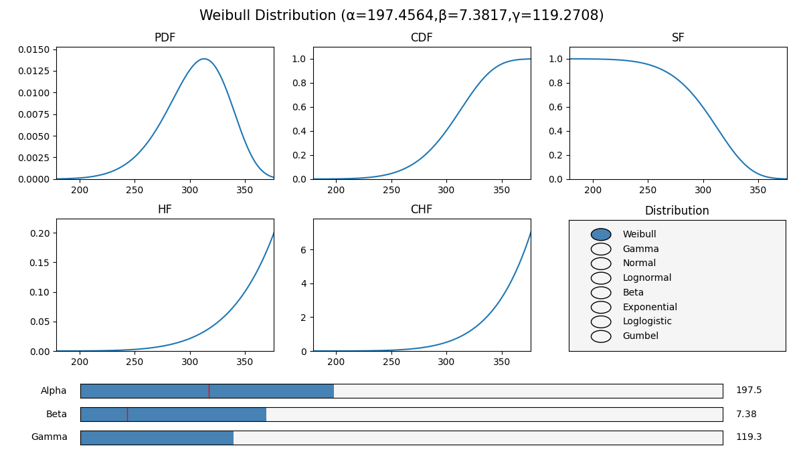

.. image:: images/logo.png

-------------------------------------

Distribution explorer
'''''''''''''''''''''

The distribution explorer is a simple way to explore the shape of each distribution based on its parameters. To achieve this, an interactive window is shown with the 5 characteristic functions (PDF, CDF, SF, HF, CHF) of each probability distribution. Parameters can be changed using slider widgets. Distributions can be changed using the radio button widget.

There are no inputs or outputs. Everything is done within the interactive matplotlib window. Please see the video for an example of the interactive features of the distribution explorer.

To open the distribution explorer, use the following code:

.. code:: python

    from reliability.Other_functions import distribution_explorer
    distribution_explorer()

.. raw:: html

    

        <iframe width="560" height="315" src="https://www.youtube.com/embed/4YYEgHDLV4I" frameborder="0" allow="accelerometer; autoplay; encrypted-media; gyroscope; picture-in-picture" allowfullscreen></iframe>
    

