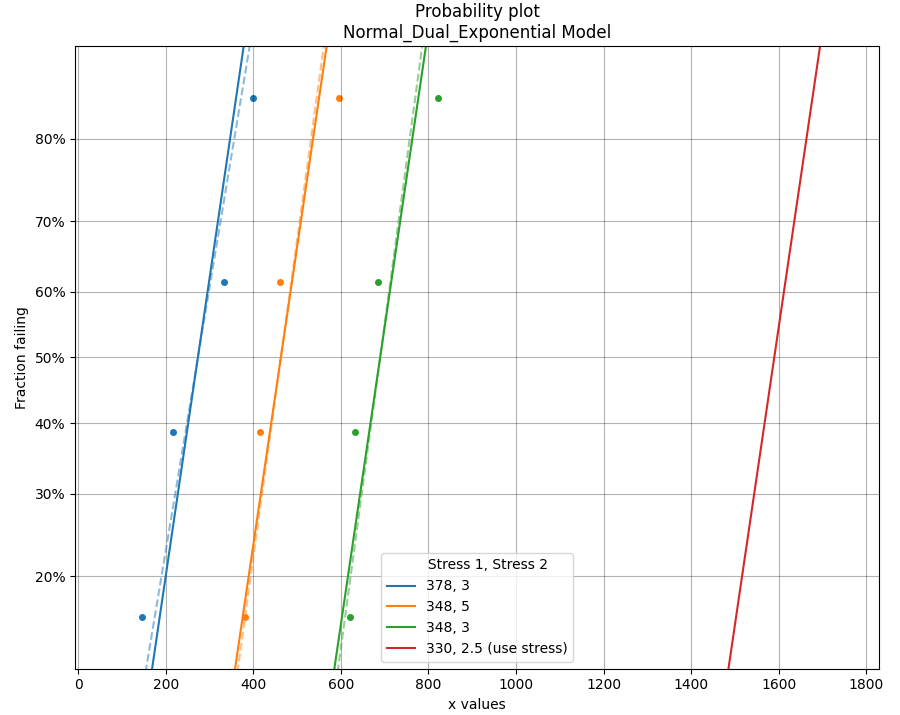
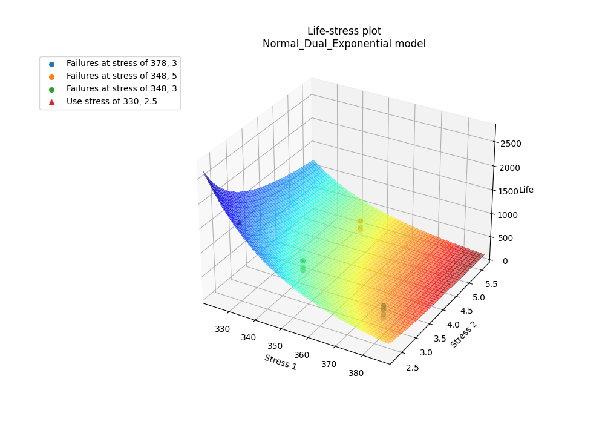
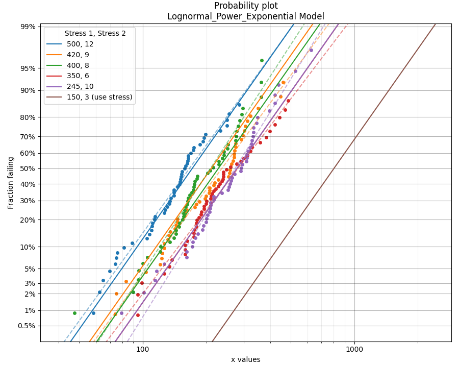
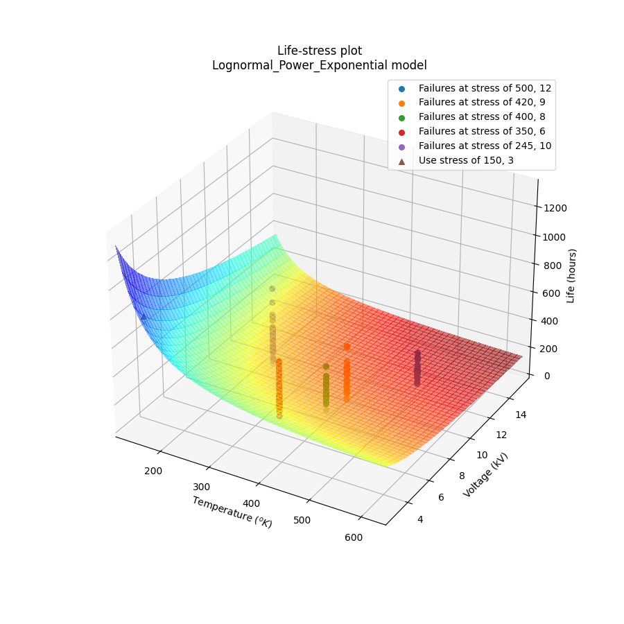

.. image:: images/logo.png

-------------------------------------

Fitting a dual stress model to ALT data
'''''''''''''''''''''''''''''''''''''''

Before reading this section it is recommended that readers are familiar with the concepts of `fitting probability distributions <https://reliability.readthedocs.io/en/latest/Fitting%20a%20specific%20distribution%20to%20data.html>`_, `probability plotting <https://reliability.readthedocs.io/en/latest/Probability%20plots.html>`_, and have an understanding of `what accelerated life testing (ALT) involves <https://reliability.readthedocs.io/en/latest/What%20is%20Accelerated%20Life%20Testing.html>`_.

The module `reliability.ALT_fitters` contains 24 `ALT models <https://reliability.readthedocs.io/en/latest/Equations%20of%20ALT%20models.html>`_; 12 of these models are for single stress and 12 are for dual stress. This section details the dual stress models, though the process for `fitting single stress models <https://reliability.readthedocs.io/en/latest/Fitting%20a%20single%20stress%20model%20to%20ALT%20data.html>`_ is similar. The decision to use a single stress or dual stress model depends entirely on your data. If your data has two stresses that are being changed then you will use a dual stress model.

The following dual stress models are available within ALT_fitters:

-    Fit_Weibull_Dual_Exponential
-    Fit_Weibull_Power_Exponential
-    Fit_Weibull_Dual_Power
-    Fit_Lognormal_Dual_Exponential
-    Fit_Lognormal_Power_Exponential
-    Fit_Lognormal_Dual_Power
-    Fit_Normal_Dual_Exponential
-    Fit_Normal_Power_Exponential
-    Fit_Normal_Dual_Power
-    Fit_Exponential_Dual_Exponential
-    Fit_Exponential_Power_Exponential
-    Fit_Exponential_Dual_Power

.. admonition:: API Reference

   For inputs and outputs see the `API reference <https://reliability.readthedocs.io/en/latest/API/ALT_fitters.html>`_.
    
Example 1
---------

In the following example, we will fit the Normal-Dual-Exponential model to an ALT dataset obtained from a temperature-voltage dual stress test. This dataset can be found in `reliability.Datasets`. We want to know the mean life at the use level stress of 330 Kelvin, 2.5 Volts so the parameter use_level_stress is specified. All other values are left as defaults and the results and plot are shown.

.. code:: python

    from reliability.Datasets import ALT_temperature_voltage
    from reliability.ALT_fitters import Fit_Normal_Dual_Exponential
    import matplotlib.pyplot as plt
    data = ALT_temperature_voltage()
    Fit_Normal_Dual_Exponential(failures=data.failures, failure_stress_1=data.failure_stress_temp, failure_stress_2=data.failure_stress_voltage,use_level_stress=[330,2.5])
    plt.show()

    '''
    Results from Fit_Normal_Dual_Exponential (95% CI):
    Analysis method: Maximum Likelihood Estimation (MLE)
    Optimizer: TNC
    Failures / Right censored: 12/0 (0% right censored) 
    
    Parameter  Point Estimate  Standard Error    Lower CI  Upper CI
            a         4056.06         752.936     2580.33   5531.78
            b         2.98949        0.851782     1.32002   4.65895
            c      0.00220837      0.00488704 2.88663e-05  0.168947
        sigma         87.3192          17.824     58.5274   130.275 
    
    stress  original mu  original sigma  new mu  common sigma sigma change  acceleration factor
    378, 3        273.5         98.7256   273.5       87.3192      -11.55%              5.81285
    348, 5          463         81.8474 463.001       87.3192       +6.69%              3.43371
    348, 3       689.75          80.176 689.749       87.3192       +8.91%              2.30492
    
     Goodness of fit    Value
     Log-likelihood -70.6621
               AICc  155.039
                BIC  151.264 
    
    At the use level stress of 330, 2.5, the mean life is 1589.81428
    '''

In the results above we see 3 tables of results; the fitted parameters (along with their confidence bounds) dataframe, the change of parameters dataframe, and the goodness of fit dataframe. For the change of parameters dataframe the "original mu" and "original sigma" are the fitted values for the Normal_2P distribution that is fitted to the data at each stress (shown on the probability plot by the dashed lines). The "new mu" and "new sigma" are from the Normal_Dual_Exponential model. The sigma change is extremely important as it allows us to identify whether the fitted ALT model is appropriate at each stress level. A sigma change of over 50% will trigger a warning to be printed informing the user that the failure mode may be changing across different stresses, or that the model is inappropriate for the data. The acceleration factor column will only be returned if the use level stress is provided since acceleration factor is a comparison of the life at the higher stress vs the use stress.

Example 2
---------

In this second example we will fit the Lognormal_Power_Exponential model. Instead of using an existing dataset we will create our own data using the function make_ALT_data. The results show that the fitted parameters agree well with the parameters we used to generate the data, as does the mean life at the use stress. This accuracy improves with more data.

Two of the outputs returned are the axes handles for the probability plot and the life-stress plot. These handles can be used to set certain values. In the example below we see the axes labels being set to custom values after the plots have been generated but before the plots have been displayed.

.. code:: python

    from reliability.Other_functions import make_ALT_data
    from reliability.ALT_fitters import Fit_Lognormal_Power_Exponential
    import matplotlib.pyplot as plt
    use_level_stress = [150,3]
    ALT_data = make_ALT_data(distribution='Lognormal',life_stress_model='Power_Exponential',a=200,c=400,n=-0.5,sigma=0.5,stress_1=[500,400,350,420,245],stress_2=[12,8,6,9,10],number_of_samples=100,fraction_censored=0.5,seed=1,use_level_stress=use_level_stress)
    model = Fit_Lognormal_Power_Exponential(failures=ALT_data.failures, failure_stress_1=ALT_data.failure_stresses_1, failure_stress_2=ALT_data.failure_stresses_2, right_censored=ALT_data.right_censored, right_censored_stress_1=ALT_data.right_censored_stresses_1,right_censored_stress_2=ALT_data.right_censored_stresses_2, use_level_stress=use_level_stress)
    # this will change the xlabel on the probability plot
    model.probability_plot.set_xlabel('Time (hours)')
    # this will change the axes labels on the life-stress plot
    model.life_stress_plot.set_xlabel('Temperature $(^oK)$')
    model.life_stress_plot.set_ylabel('Voltage (kV)')
    model.life_stress_plot.set_zlabel('Life (hours)')

    print('The mean life at use stress of the true model is:',ALT_data.mean_life_at_use_stress)
    plt.show()
    
    '''
    Results from Fit_Lognormal_Power_Exponential (95% CI):
    Analysis method: Maximum Likelihood Estimation (MLE)
    Optimizer: TNC
    Failures / Right censored: 250/250 (50% right censored) 
    
    Parameter  Point Estimate  Standard Error  Lower CI  Upper CI
            a         192.105         39.4889   114.708   269.502
            c         451.448         134.274    252.02   808.687
            n        -0.49196         0.12119 -0.729488 -0.254433
        sigma        0.491052       0.0212103  0.451191  0.534433 
    
     stress  original mu  original sigma  new mu  common sigma sigma change  acceleration factor
    500, 12      5.29465        0.496646  5.2742      0.491052       -1.13%              4.84765
     420, 9      5.54536        0.525041 5.48891      0.491052       -6.47%              3.91096
     400, 8      5.42988        0.392672 5.56972      0.491052      +25.05%              3.60733
     350, 6      5.84254        0.550746 5.77986      0.491052      -10.84%              2.92364
    245, 10      5.75338        0.457948 5.76378      0.491052       +7.23%              2.97102
    
     Goodness of fit    Value
     Log-likelihood -1596.29
               AICc  3200.66
                BIC  3217.44 
    
    At the use level stress of 150, 3, the mean life is 1067.69246
    
    The mean life at use stress of the true model is: 992.7627728988726
    '''

.. note:: In the dual-stress life stress plots, there is a known visibility issue inherent in matplotlib where the 3D surface plot and the scatter plots are drawn in layers (relative to the observer). This results in the scatter plot always appearing in front of the 3D surface, even when some of the points should actually be occluded by the surface. The layering was chosen to show the scatter plot above the 3D surface plot as this provides better visibility than the alternative.

**References:**

- Probabilistic Physics of Failure Approach to Reliability (2017), by M. Modarres, M. Amiri, and C. Jackson. pp. 136-168
- Accelerated Life Testing Data Analysis Reference - ReliaWiki, Reliawiki.com, 2019. [`Online <http://reliawiki.com/index.php/Accelerated_Life_Testing_Data_Analysis_Reference>`_].
