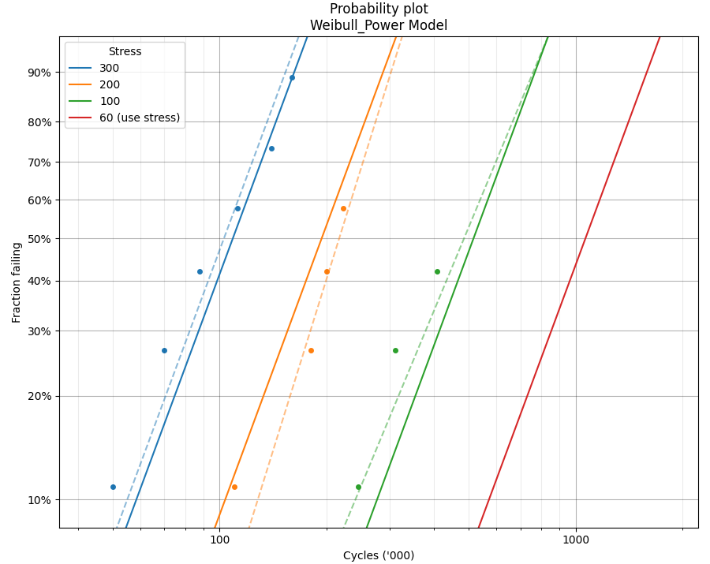
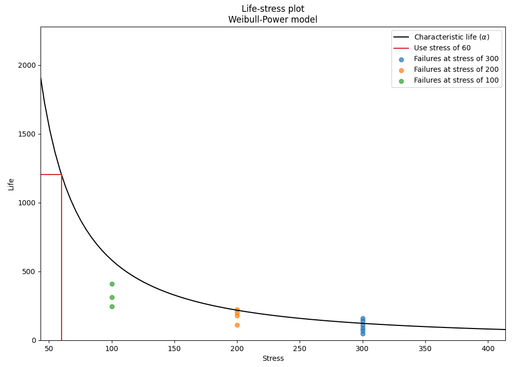
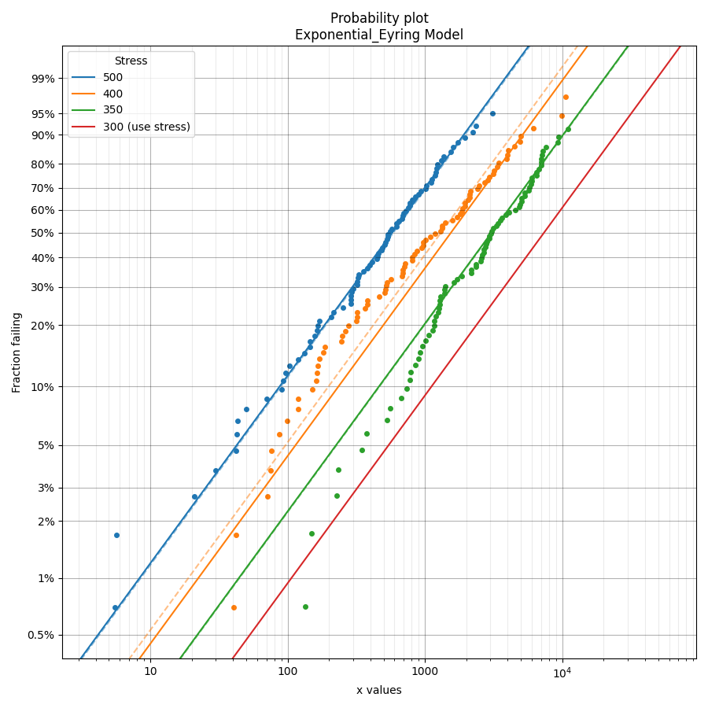
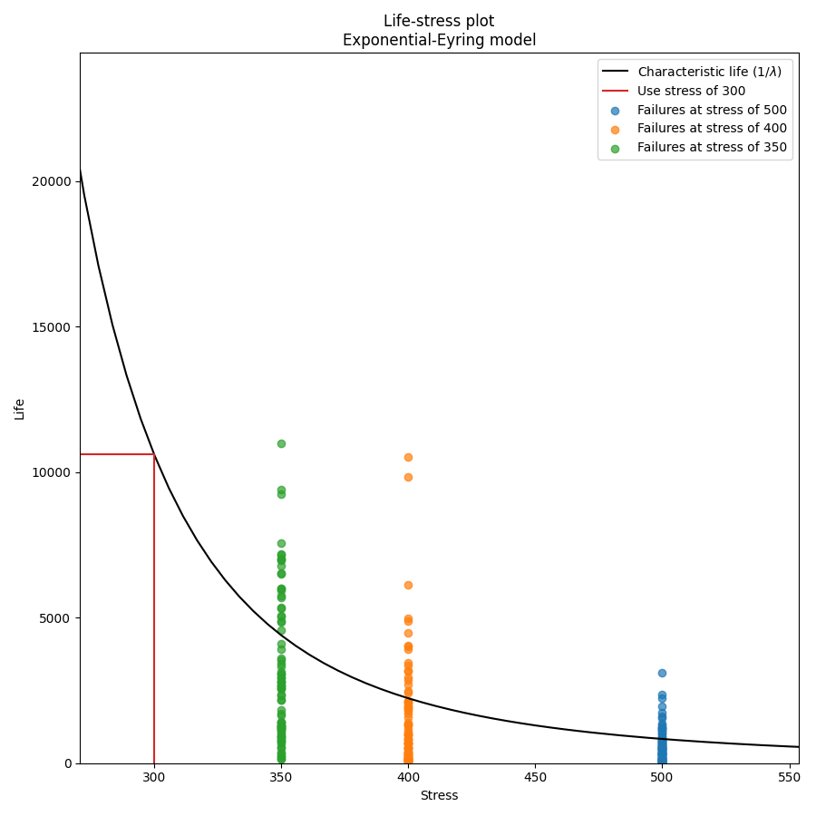

.. image:: images/logo.png

-------------------------------------

Fitting a single stress model to ALT data
'''''''''''''''''''''''''''''''''''''''''

Before reading this section it is recommended that readers are familiar with the concepts of `fitting probability distributions <https://reliability.readthedocs.io/en/latest/Fitting%20a%20specific%20distribution%20to%20data.html>`_, `probability plotting <https://reliability.readthedocs.io/en/latest/Probability%20plots.html>`_, and have an understanding of `what accelerated life testing (ALT) involves <https://reliability.readthedocs.io/en/latest/What%20is%20Accelerated%20Life%20Testing.html>`_.

The module `reliability.ALT_fitters` contains 24 `ALT models <https://reliability.readthedocs.io/en/latest/Equations%20of%20ALT%20models.html>`_; 12 of these models are for single stress and 12 are for dual stress. This section details the single stress models, though the process for `fitting dual-stress models <https://reliability.readthedocs.io/en/latest/Fitting%20a%20dual%20stress%20model%20to%20ALT%20data.html>`_ is similar. The decision to use a single stress or dual stress model depends entirely on your data. If your data only has one stress that is being changed then you will use a single stress model.

The following single stress models are available within ALT_fitters:

-    Fit_Weibull_Exponential
-    Fit_Weibull_Eyring
-    Fit_Weibull_Power
-    Fit_Lognormal_Exponential
-    Fit_Lognormal_Eyring
-    Fit_Lognormal_Power
-    Fit_Normal_Exponential
-    Fit_Normal_Eyring
-    Fit_Normal_Power
-    Fit_Exponential_Exponential
-    Fit_Exponential_Eyring
-    Fit_Exponential_Power

Each of the ALT models works in a very similar way so the documentation below can be applied to all of the single stress models with minor modifications to the parameter names of the outputs. The following documentation is for the Weibull-Power model.

Inputs:

-    failures - an array or list of the failure times.
-    failure_stress - an array or list of the corresponding stresses (such as load) at which each failure occurred. This must match the length of failures as each failure is tied to a failure stress.
-    right_censored - an array or list of all the right censored failure times.
-    right_censored_stress - an array or list of the corresponding stresses (such as load) at which each right_censored data point was obtained. This must match the length of right_censored as each right_censored value is tied to a right_censored stress.
-    use_level_stress - The use level stress at which you want to know the mean life. Optional input.
-    print_results - True/False. Default is True
-    show_probability_plot - True/False. Default is True
-    show_life_stress_plot - True/False. Default is True
-    CI - confidence interval for estimating confidence limits on parameters. Must be between 0 and 1. Default is 0.95 for 95% CI.
-    optimizer - 'TNC', 'L-BFGS-B', 'powell'. Default is 'TNC'. These are all bound constrained methods. If the bound constrained method fails, nelder-mead will be used. If nelder-mead fails the initial guess (using least squares) will be returned with a warning.

Outputs:

-    a - fitted parameter from the Power model
-    n - fitted parameter from the Power model
-    beta - the fitted Weibull_2P beta
-    loglik2 - Log Likelihood*-2 (as used in JMP Pro)
-    loglik - Log Likelihood (as used in Minitab and Reliasoft)
-    AICc - Akaike Information Criterion
-    BIC - Bayesian Information Criterion
-    a_SE - the standard error (sqrt(variance)) of the parameter
-    n_SE - the standard error (sqrt(variance)) of the parameter
-    beta_SE - the standard error (sqrt(variance)) of the parameter
-    a_upper - the upper CI estimate of the parameter
-    a_lower - the lower CI estimate of the parameter
-    n_upper - the upper CI estimate of the parameter
-    n_lower - the lower CI estimate of the parameter
-    beta_upper - the upper CI estimate of the parameter
-    beta_lower - the lower CI estimate of the parameter
-    results - a dataframe of the results (point estimate, standard error, Lower CI and Upper CI for each parameter)
-    goodness_of_fit - a dataframe of the goodness of fit criterion (Log-likelihood, AICc, BIC)
-    change_of_parameters - a dataframe showing the change of the parameters (alpha and beta) at each stress level
-    mean_life - the mean life at the use_level_stress (only provided if use_level_stress is provided)
-    alpha_at_use_stress - the equivalent Weibull alpha parameter at the use level stress (only provided if use_level_stress is provided)
-    distribution_at_use_stress - the Weibull distribution at the use level stress (only provided if use_level_stress is provided)
-    probability_plot - the axes handles for the figure object from the probability plot (only provided if show_probability_plot is True)
-    life_stress_plot - the axes handles for the figure object from the life-stress plot (only provided if show_life_stress_plot is True)

Example 1
---------

In the following example, we will fit the Weibull-Power model to an ALT dataset obtained from a fatigue test. This dataset can be found in `reliability.Datasets`. We want to know the mean life at the use level stress of 60 so the parameter use_level_stress is specified. All other values are left as defaults and the results and plot are shown.

Two of the outputs returned are the axes handles for the probability plot and the life-stress plot. These handles can be used to set certain values. In the example below we see the axes labels being set to custom values after the plots have been generated but before the plots have been displayed.

.. code:: python

    from reliability.ALT_fitters import Fit_Weibull_Power
    from reliability.Datasets import ALT_load2
    import matplotlib.pyplot as plt

    model = Fit_Weibull_Power(failures=ALT_load2().failures, failure_stress=ALT_load2().failure_stresses, right_censored=ALT_load2().right_censored, right_censored_stress=ALT_load2().right_censored_stresses, use_level_stress=60)
    model.probability_plot.axes[0].set_xlabel("Cycles ('000)")
    model.life_stress_plot.axes[0].set_xlabel('Load (kg)')
    model.life_stress_plot.axes[0].set_ylabel("Life ('000 cycles)")
    plt.show()
    
    '''
    Results from Fit_Weibull_Power (95% CI):
    Analysis method: Maximum Likelihood Estimation (MLE)
    Failures / Right censored: 13/5 (27.77778% right censored) 

    Parameter  Point Estimate  Standard Error  Lower CI    Upper CI
            a          398727          519977   30947.7 5.13716e+06
            n        -1.41726         0.24427  -1.89602     -0.9385
         beta         3.01734        0.716506    1.8945     4.80565 

     stress  original alpha  original beta  new alpha  common beta beta change  acceleration factor
        300         116.173        3.01009    123.012      3.01734      +0.24%               9.7864
        200         240.182        3.57635    218.532      3.01734     -15.63%              5.50878
        100          557.42         2.6792    583.652      3.01734     +12.62%              2.06261

     Goodness of fit    Value
     Log-likelihood -76.8541
               AICc  161.422
                BIC  162.379 

    At the use level stress of 60, the mean life is 1075.28447
    '''
    

In the results above we see 3 tables of results; the fitted parameters (along with their confidence bounds) dataframe, the change of parameters dataframe, and the goodness of fit dataframe. For the change of parameters dataframe the "original alpha" and "original beta" are the fitted values for the Weibull_2P distribution that is fitted to the data at each stress (shown on the probability plot by the dashed lines). The "new alpha" and "new beta" are from the Weibull_Power model. The beta change is extremely important as it allows us to identify whether the fitted ALT model is appropriate at each stress level. A beta change of over 50% will trigger a warning to be printed informing the user that the failure mode may be changing across different stresses, or that the model is inappropriate for the data. The acceleration factor column will only be returned if the use level stress is provided since acceleration factor is a comparison of the life at the higher stress vs the use stress.

Example 2
---------

In this second example we will fit the Exponential-Eyring model. Instead of using an existing dataset we will create our own data using the function make_ALT_data. Since the Exponential_1P distribution has only 1 parameter (Lambda), the function fits a Weibull_2P distribution and then compares the change of parameters of the Weibull alpha and beta with the Exponential 1/Lambda (obtained from the life-stress model) and the shape parameter of 1 (since a Weibull distrbution with beta=1 is equivalent to the Exponential distribution). This provides similar functionality for examining the change of parameters as we find with the models for all the other distributions (Weibull, Lognormal, and Normal).

The results show that the fitted parameters agree well with the parameters we used to generate the data, as does the mean life at the use stress. This accuracy improves with more data.

.. code:: python

    from reliability.Other_functions import make_ALT_data
    from reliability.ALT_fitters import Fit_Exponential_Eyring
    import matplotlib.pyplot as plt

    use_level_stress = 300
    ALT_data = make_ALT_data(distribution='Exponential',life_stress_model='Eyring',a=1500,c=-10,stress_1=[500,400,350],number_of_samples=100,fraction_censored=0.2,seed=1,use_level_stress=use_level_stress)
    Fit_Exponential_Eyring(failures=ALT_data.failures, failure_stress=ALT_data.failure_stresses, right_censored=ALT_data.right_censored, right_censored_stress=ALT_data.right_censored_stresses, use_level_stress=use_level_stress)
    print('The mean life at use stress of the true model is:',ALT_data.mean_life_at_use_stress)
    plt.show()
    
    '''
    Results from Fit_Exponential_Eyring (95% CI):
    Analysis method: Maximum Likelihood Estimation (MLE)
    Failures / Right censored: 240/60 (20% right censored) 

    Parameter  Point Estimate  Standard Error  Lower CI  Upper CI
            a         1527.06         180.149   1173.98   1880.15
            c        -9.88429        0.446485  -10.7594  -9.00919 

     stress  weibull alpha  weibull beta  new 1/Lambda  common shape shape change  acceleration factor
        500        849.177      0.951565       831.978             1       +5.09%              12.7676
        400         1887.8      0.910453       2231.62             1       +9.84%              4.75994
        350        4443.19       1.08453       4400.15             1       -7.79%              2.41409

     Goodness of fit    Value
     Log-likelihood -2065.89
               AICc  4135.83
                BIC   4143.2 

    At the use level stress of 300, the mean life is 10622.36269

    The mean life at use stress of the true model is: 10896.724574907037
    '''

