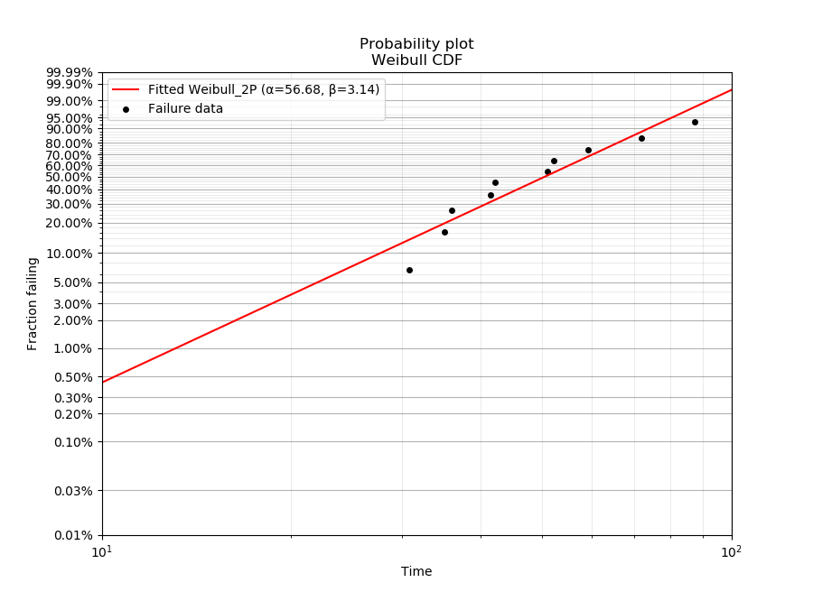
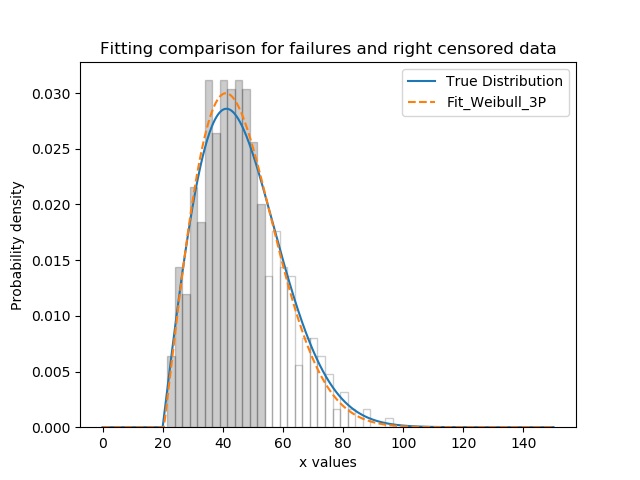
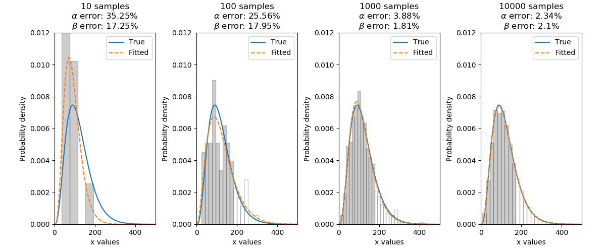

.. image:: images/logo.png

-------------------------------------

Fitting a specific distribution to data
'''''''''''''''''''''''''''''''''''''''

The module ``reliability.Fitters`` provides many probability distribution fitting functions. These functions can be thought of in two categories; non-location shifted distributions [eg. Weibull (α,β)], and location shifted distributions [eg. Weibull (α,β,γ)]. All of the distributions can be fitted to both complete and imcomplete (right censored) data. All distributions in the Fitters module are named with their number of parameters (eg. Fit_Weibull_2P uses α,β, whereas Fit_Weibull_3P uses α,β,γ). This is intended to remove ambiguity about what distribution you are fitting.

Distributions are fitted simply by using the desired function and specifying the data as failures or right_censored data. You must have at least as many failures as there are distribution parameters or the fit would be under-constrained. It is generally advisable to have at least 4 data points as the accuracy of the fit is proportional to the amount of data. Once fitted, the results are assigned to an object and the fitted parameters can be accessed by name, as shown in the examples below. The goodness of fit criterions are also available as AICc (Akaike Information Criterion corrected) and BIC (Bayesian Information Criterion), though these are more useful when comparing the fit of multiple distributions such as in the `Fit_Everything <https://reliability.readthedocs.io/en/latest/Fitting%20all%20available%20distributions%20to%20data.html>`_ function. As a matter of convenience, each of the modules in Fitters also generates a distribution object that has the parameters of the fitted distribution.

The supported distributions are:

-   Weibull_2P
-   Weibull_3P
-   Exponential_1P
-   Exponential_2P
-   Gamma_2P
-   Gamma_3P
-   Lognormal_2P
-   Lognormal_3P
-   Normal_2P
-   Beta_2P
-   Weibull_Mixture (see the `section <https://reliability.readthedocs.io/en/latest/Weibull%20mixture%20models.html>`_ on this)

.. note:: The Beta distribution is only for data in the range 0 to 1. Specifying data outside of this range will cause an error.

.. note:: If you have a very large amount of data (>100000 samples) then it is likely that your computer will take significant time to compute the results. This is a limitation of interpreted languages like Python compared to compiled languages like C++ which many commerial reliability software packages are written in. If you have very large volumes of data, you may want to consider using commercial software for faster computation time. The function Fit_Weibull_2P_grouped is designed to accept a dataframe which has multiple occurrences of some values (eg. multiple values all right censored to the same value when the test was ended). Depending on the size of the data set and the amount of grouping in your data, Fit_Weibull_2P_grouped may be much faster than Fit_Weibull_2P and achieve the same level of accuracy. This difference is not noticable if you have less than 10000 samples. For more information, see the example below on using Fit_Weibull_2P_grouped.

.. note:: Heavily censored data (>99.9% censoring) may result in a failure of the optimizer to find a solution. If you have heavily censored data, you may have a limited failure population problem. It is recommended that you do not try fitting one of these standard distributions to such a dataset as your results (while they may have achieved a successful fit) will be a poor description of your overall population statistic and you risk drawing the wrong conclusions when the wrong model is fitted. The limited failure population model is planned for a future release of reliability, though development on this model is yet to commence. In the meantime, see JMP Pro's model for `Defective Subpopulations. <https://www.jmp.com/en_my/events/ondemand/statistical-methods-in-reliability/defective-subpopulation-distributions.html>`_

If you do not know which distribution you want to fit, then please see the `section <https://reliability.readthedocs.io/en/latest/Fitting%20all%20available%20distributions%20to%20data.html>`_ on using the Fit_Everything function which will find the best distribution to describe your data. It is highly recommended that you always try to fit everything and accept the best fit rather than choosing a particular distribution for other reasons.

Each of the fitters listed above (except Fit_Weibull_Mixture and Fit_Weibull_2P_grouped) has the following inputs and outputs:

Inputs:

-   failures - an array or list of failure data
-   right_censored - an array or list of right censored data. Optional input
-   show_probability_plot - True/False. Defaults to True. Produces a probability plot of the failure data and fitted distribution.
-   print_results - True/False. Defaults to True. Prints a dataframe of the point estimate, standard error, Lower CI and Upper CI for each parameter.
-   CI - confidence interval for estimating confidence limits on parameters. Must be between 0 and 1. Default is 0.95 for 95% CI.
-   force_beta (in Fit_Weibull_2P) or force_sigma (in Fit_Normal_2P and Fit_Lognormal_2P). This allows the user to force the shape parameter to be a set value. Useful for ALT probability plotting. Optional input. Not available for Fit_Beta_2P (due to there being 2 shape parameters), Fit_Expon_1P (due to there being only 1 parameter), Fit_Gamma_2P (due to Gamma_2P not being suitable for ALT probability plotting) or any of the location shifted distributions (due to these not typically being used for ALT probability plotting).
-   keyword argumets are also accepted for the probability plot (eg. color, linestyle, marker)

Outputs (the following example outputs are for the Fit_Weibull_2P distribution but for other distributions the parameter names may be different from alpha and beta):

-   alpha - the fitted Weibull_2P alpha parameter
-   beta - the fitted Weibull_2P beta parameter
-   loglik - Log-Likelihood (as used in Minitab and Reliasoft)
-   loglik2 - Log-Likelihood*-2 (as used in JMP Pro)
-   AICc - Akaike Information Criterion
-   BIC - Bayesian Information Criterion
-   distribution - a Distribution object with the parameters of the fitted distribution
-   alpha_SE - the standard error (sqrt(variance)) of the parameter
-   beta_SE - the standard error (sqrt(variance)) of the parameter. This will be '' if the shape parameter has been forced to a set value.
-   Cov_alpha_beta - the covariance between the parameters. This will be '' for Fit_Expon_1P or if the shape parameter has been forced to a set value.
-   alpha_upper - the upper CI estimate of the parameter
-   alpha_lower - the lower CI estimate of the parameter
-   beta_upper - the upper CI estimate of the parameter. This will be '' if the shape parameter has been forced to a set value.
-   beta_lower - the lower CI estimate of the parameter. This will be '' if the shape parameter has been forced to a set value.
-   results - a dataframe of the results (point estimate, standard error, Lower CI and Upper CI for each parameter)
-   success - True/False. Indicated whether the solution was found by autograd. If success is False a warning will be printed indicating that scipy's fit was used as autograd failed. This fit will not be accurate if there is censored data as scipy does not have the ability to fit censored data. Failure of autograd to find the solution should be rare and if it occurs, it is likely that the distribution is an extremely bad fit for the data. Try scaling your data, removing extreme values, or using another distribution.

To learn how we can fit a distribution, we will start by using a simple example with 10 failure times. These times were generated from a Weibull distribution with α=50, β=2. Note that the output also provides the confidence intervals and standard error of the parameter estimates. The probability plot is generated be default (you will need to specify plt.show() to show it). See the section on `probability plotting <https://reliability.readthedocs.io/en/latest/Probability%20plots.html#what-does-a-probability-plot-show-me>`_ to learn how to interpret this plot.

.. code:: python

    from reliability.Fitters import Fit_Weibull_2P
    import matplotlib.pyplot as plt
    data = [42.1605147, 51.0479599, 41.424553, 35.0159047, 87.3087644, 30.7435371, 52.2003467, 35.9354271, 71.8373629, 59.171129]
    wb = Fit_Weibull_2P(failures=data)
    plt.show()

    '''
    Results from Fit_Weibull_2P (95% CI):
               Point Estimate  Standard Error   Lower CI   Upper CI
    Parameter                                                      
    Alpha           56.682270        6.062572  45.962661  69.901951
    Beta             3.141684        0.733552   1.987995   4.964890
    Log-Likelihood: -42.426310509309616
    '''

The above probability plot is the typical way to visualise how the CDF (the red line) models the failure data (the black points). If you would like to view the failure points alongside the CDF, SF, or CHF without the axis being scaled then you can generate the scatter plot using the function plot_points which is available within reliability.Probability_plotting. In the example below we create some data, then fit a Weibull distribution to the data (ensuring we turn off the probability plot). From the fitted distribution object we plot the Survival Function (SF). We then use plot_points to generate a scatter plot of the plotting positions for the survival function.

For the function plot_points the inputs are:

-   failures - an array or list of failure data
-   right_censored - an array or list of right censored data. Optional input
-   func - the function to be plotted. Must be 'CDF', 'SF', or 'CHF'. Default is 'CDF'
-   h1 and h2 - these are the plotting heuristics. See `probability plotting <https://reliability.readthedocs.io/en/latest/Probability%20plots.html>`_ for more details.
-   keywords for the scatterplot are also accepted.

.. code:: python

    from reliability.Distributions import Weibull_Distribution
    from reliability.Distributions import Weibull_Distribution
    from reliability.Fitters import Fit_Weibull_2P
    from reliability.Probability_plotting import plot_points
    import matplotlib.pyplot as plt
    data = Weibull_Distribution(alpha=25,beta=4).random_samples(30)
    weibull_fit = Fit_Weibull_2P(failures=data,show_probability_plot=False,print_results=False)
    weibull_fit.distribution.SF(label='Fitted Distribution',color='steelblue')
    plot_points(failures=data,func='SF',label='failure data',color='red',alpha=0.7)
    plt.legend()
    plt.show()

.. image:: images/plot_points.png

It is beneficial to see the effectiveness of the fitted distribution in comparison to the original distribution. In this second example, we are creating 500 samples from a Weibull distribution and then we will right censor all of the data above our chosen threshold. Then we are fitting a Weibull_3P distribution to the data. Note that we need to specify "show_probability_plot=False, print_results=False" in the Fit_Weibull_3P to prevent the normal outputs from the fitting functions from being displayed.

.. code:: python

    from reliability.Distributions import Weibull_Distribution
    from reliability.Fitters import Fit_Weibull_3P
    import matplotlib.pyplot as plt
    import numpy as np
    np.random.seed(2)  # this is just for repeatability in this tutorial
    a = 30
    b = 2
    g = 20
    uncensored_failure_data = Weibull_Distribution(alpha=a, beta=b, gamma=g).random_samples(500)  # create some data
    cens = []
    fail = []
    threshold = 55  # censoring cutoff
    for item in uncensored_failure_data:
        if item >= threshold:  # this will right censor any value above the threshold
            cens.append(threshold)
        else:
            fail.append(item)
    print('There are' ,len(cens) ,'censored items.')
    wbf = Fit_Weibull_3P(failures=fail, right_censored=cens,show_probability_plot=False,print_results=False)  # fit the Weibull_3P distribution
    print('Fit_Weibull_3P parameters:\nAlpha:', wbf.alpha, '\nBeta:', wbf.beta, '\nGamma', wbf.gamma)
    xvals = np.linspace(0 ,150 ,1000)
    N ,bins ,patches = plt.hist(uncensored_failure_data, density=True, alpha=0.2, color='k', bins=30, edgecolor='k')  # histogram of the data
    for i in range(np.argmin(abs(np.array(bins ) -threshold)) ,len(patches)):  # this is to shade the censored part of the histogram as white
        patches[i].set_facecolor('white')
    Weibull_Distribution(alpha=a ,beta=b ,gamma=g).PDF(xvals=xvals ,label='True Distribution')  # plots the true distribution
    Weibull_Distribution(alpha=wbf.alpha, beta=wbf.beta, gamma=wbf.gamma).PDF(xvals=xvals, label='Fit_Weibull_3P' ,linestyle='--')  # plots the fitted Weibull_3P
    plt.title('Fitting comparison for failures and right censored data')
    plt.legend()
    plt.show()

    '''
    There are 118 censored items.
    Fit_Weibull_3P parameters:
    Alpha: 28.836512482682533 
    Beta: 2.0244823663812843 
    Gamma 20.42077009102205
    '''

As a final example, we will fit a Gamma_2P distribution to some partially right censored data. To provide a comparison of the fitting accuracy as the number of samples increases, we will do the same experiment with varying sample sizes. The results highlight that the accuracy of the fit is proportional to the amount of samples, so you should always try to obtain more data if possible.

.. code:: python

    from reliability.Distributions import Gamma_Distribution
    from reliability.Fitters import Fit_Gamma_2P
    import matplotlib.pyplot as plt
    import numpy as np

    np.random.seed(2)  # this is just for repeatability in this tutorial
    a = 30
    b = 4
    xvals = np.linspace(0, 500, 1000)

    trials = [10, 100, 1000, 10000]
    subplot_id = 141
    plt.figure(figsize=(12, 5))
    for t in trials:
        uncensored_failure_data = Gamma_Distribution(alpha=a, beta=b).random_samples(t)  # create some data
        cens = []
        fail = []
        threshold = 180  # censoring cutoff
        for item in uncensored_failure_data:
            if item > threshold:  # this will right censor any value above the threshold
                cens.append(threshold)
            else:
                fail.append(item)
        gf = Fit_Gamma_2P(failures=fail, right_censored=cens, show_probability_plot=False, print_results=False)  # fit the Gamma_2P distribution
        print('\nFit_Gamma_2P parameters using', t, 'samples:', '\nAlpha:', gf.alpha, '\nBeta:', gf.beta)
        plt.subplot(subplot_id)
        num_bins = min(int(len(fail) / 2), 30)
        N, bins, patches = plt.hist(uncensored_failure_data, density=True, alpha=0.2, color='k', bins=num_bins, edgecolor='k')  # histogram of the data
        for i in range(np.argmin(abs(np.array(bins ) -threshold)) ,len(patches)):  # this is to shade the censored part of the histogram as white
            patches[i].set_facecolor('white')
        Gamma_Distribution(alpha=a, beta=b).PDF(xvals=xvals, label='True')  # plots the true distribution
        Gamma_Distribution(alpha=gf.alpha, beta=gf.beta).PDF(xvals=xvals, label='Fitted', linestyle='--')  # plots the fitted Gamma_2P
        plt.title(str(str(t) + ' samples\n'+r'$\alpha$ error: '+str(round(abs(gf.alpha-a)/a*100,2))+'%\n'+r'$\beta$ error: '+str(round(abs(gf.beta-b)/b*100,2))+'%'))
        plt.ylim([0, 0.012])
        plt.xlim([0, 500])
        plt.legend()
        subplot_id += 1
    plt.subplots_adjust(left=0.09, right=0.96, wspace=0.41)
    plt.show()

    '''
    Fit_Gamma_2P parameters using 10 samples: 
    Alpha: 19.426045595196136 
    Beta: 4.690125911226989

    Fit_Gamma_2P parameters using 100 samples: 
    Alpha: 37.668605543885036 
    Beta: 3.282138545140892

    Fit_Gamma_2P parameters using 1000 samples: 
    Alpha: 28.836133518634924 
    Beta: 4.07244603642164

    Fit_Gamma_2P parameters using 10000 samples: 
    Alpha: 30.703267251417966 
    Beta: 3.9158594820597834
    '''

Using Fit_Weibull_2P_grouped for large data sets
------------------------------------------------

The function Fit_Weibull_2P_grouped is effectively the same as Fit_Weibull_2P, except for a few small differences that make it more efficient at handling grouped data sets. Grouped data sets are typically found in very large data that may be heavily censored. The function includes a choice between two optimizers and a choice between two initial guess methods for the initial guess that is given to the optimizer. These help in cases where the data is very heavily censored (>99.9%). The defaults for these options are usually the best but you may want to try different options to see which one gives you the lowest log-likelihood. The inputs and outputs are the same as for Fit_Weibull_2P except for the following:

- dataframe - a pandas dataframe of the appropriate format. See the example below.
- initial_guess_method - 'scipy' OR 'least squares'. Default is 'least squares'. Both do not take into account censored data but scipy uses MLE, and least squares is least squares regression of the plotting positions. Least squares proved more accurate during testing.
- optimizer - 'L-BFGS-B' OR 'TNC'. These are both bound constrained methods. If the bounded method fails, nelder-mead will be used. If nelder-mead fails then the initial guess will be returned with a warning. For more information on optimizers see the `scipy documentation <https://docs.scipy.org/doc/scipy/reference/generated/scipy.optimize.minimize.html#scipy.optimize.minimize>`_.

The following example shows how we can use Fit_Weibull_2P_grouped to fit a Weibull_2P distribution to grouped data from a spreadsheet (shown below) on the Windows desktop. We change the optimiser from the default (L-BFGS-B) to TNC as it is more successful for this dataset. In 99% of cases L-BFGS-B is better but it is worth trying both if the fist does not look good.

.. image:: images/grouped_excel.png

.. code:: python

    from reliability.Distributions import Fit_Weibull_2P_grouped
    from reliability.Fitters import Fit_Weibull_2P_grouped
    import pandas as pd

    filename = 'C:\\Users\\Current User\\Desktop\\data.xlsx'
    df = pd.read_excel(io=filename)
    print(df.head(15),'\n')
    res = Fit_Weibull_2P_grouped(dataframe=df,optimizer='TNC',show_probability_plot=False)

    '''
         time  quantity category
    0     220         1        F
    1     179         1        F
    2     123         1        F
    3     146         1        F
    4     199         1        F
    5     181         1        F
    6     191         1        F
    7     216         1        F
    8       1         1        F
    9      73         1        F
    10  44798       817        C
    11  62715       823        C
    12  81474       815        C
    13  80632       813        C
    14  62716       804        C 

    Results from Fit_Weibull_2P (95% CI):
               Point Estimate  Standard Error      Lower CI      Upper CI
    Parameter                                                            
    Alpha        6.120094e+21    7.615825e+22  1.564711e+11  2.393769e+32
    Beta         1.537886e-01    4.830821e-02  8.308907e-02  2.846455e-01
    Log-Likelihood: -144.61675902805456
    Number of failures: 10 
    Number of right censored: 4072 
    Fraction censored: 99.75502 %
    '''

How does the code work with censored data?
------------------------------------------

All functions in this module work using a Python library called `autograd <https://github.com/HIPS/autograd/blob/master/README.md/>`_ to find the derivative of the log-likelihood function. In this way, the code only needs to specify the log PDF and log SF in order to apply Maximum-Likelihood Estimation (MLE) to obtain the fitted parameters. Initial guesses of the parameters are essential for autograd and are obtained using scipy.stats on all the data as if it wasn't censored (since scipy doesn't accept censored data). If the distribution is an extremely bad fit or is heavily censored (>99% censored) then these guesses may be poor and the fit might not be successful. In this case, the scipy fit is used which will be incorrect if there is any censored data. If this occurs, a warning will be printed. Generally the fit achieved by autograd is highly successful.

A special thanks goes to Cameron Davidson-Pilon (author of the Python library `lifelines <https://github.com/CamDavidsonPilon/lifelines/blob/master/README.md/>`_ and website `dataorigami.net <https://dataorigami.net/>`_) for providing help with getting autograd to work, and for writing the python library `autograd-gamma <https://github.com/CamDavidsonPilon/autograd-gamma/blob/master/README.md/>`_, without which it would be impossible to fit the Beta or Gamma distributions using autograd.
