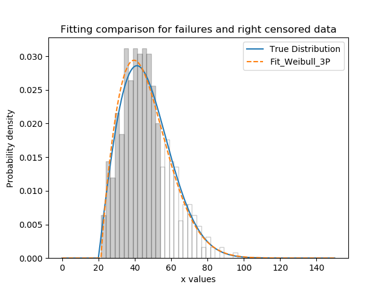
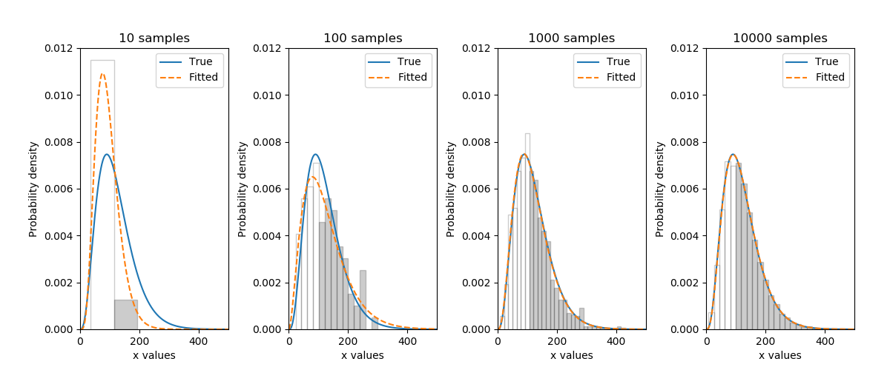

.. _code_directive:

.. image:: images/logo.png

-------------------------------------

Fitting a specific distribution to data
'''''''''''''''''''''''''''''''''''''''

The module ``reliability.Fitters`` provides many probability distribution fitting functions. Many of these functions can accept left or right censored data, although the location shifted distributions (any distribution with γ>0) will not accept left censored data. A discussion on why this is the case is presented at the end of this section. All distributions in the Fitters module are named with their number of parameters (i.e. Fit_Weibull_2P uses α,β, whereas Fit_Weibull_3P uses α,β,γ). This is intended to remove ambiguity about what distribution you are fitting.

Distributions are fitted simply by using the desired function and specifying the data as failures, right_censored, or left_censored data. You cannot specify both left and right censored data at the same time. You must have at least as many failures as there are distribution parameters or the fit would be under-constrained. Once fitted, the results are assigned to an object and the fitted parameters can be accessed by name, as shown in the examples below.

The supported distributions for failures and right censored data are:

-   Weibull_2P
-   Weibull_3P
-   Exponential_1P
-   Exponential_2P
-   Gamma_2P
-   Gamma_3P
-   Lognormal_2P
-   Normal_2P
-   Beta_2P
-   Weibull_Mixture (see the `section <https://reliability.readthedocs.io/en/latest/Weibull%20mixture%20models.html>`_ on this)

The supported distributions for failures and left censored data are:

-   Weibull_2P
-   Exponential_1P
-   Gamma_2P
-   Lognormal_2P
-   Normal_2P
-   Beta_2P
-   Weibull_Mixture (see the `section <https://reliability.readthedocs.io/en/latest/Weibull%20mixture%20models.html>`_ on this)

Note that the Beta distribution is only for data in the range {0,1}.
If you do not know which distribution you want to fit, then please see the `section <https://reliability.readthedocs.io/en/latest/Fitting%20all%20available%20distributions%20to%20data.html>`_ on using the Fit_Everything function which will find the best distribution to describe your data.

To learn how we can fit a distribution, we will start by using a simple example with 10 failure times. These times were generated from a Weibull distribution with α=5, β=2.

.. code:: python

    from reliability.Fitters import Fit_Weibull_2P
    data = [4.21605147, 5.10479599, 4.1424553, 3.50159047, 8.73087644, 3.07435371, 5.22003467, 3.59354271, 7.18373629, 5.9171129]
    wb = Fit_Weibull_2P(failures=data)
    print('Fit_Weibull_2P parameters:\nAlpha:', wb.alpha, '\nBeta:', wb.beta)

    '''
    Fit_Weibull_2P parameters:
    Alpha: 5.668221303512732 
    Beta: 3.1416809960726626
    '''

It is beneficial to see the effectiveness of the fitted distribution in comparison to the original distribution. In this second example, we are creating 500 samples from a Weibull distribution and then we will right censor all of the data above our chosen threshold. Then we are fitting a Weibull_3P distribution to the data.

.. code:: python

    from reliability.Distributions import Weibull_Distribution
    from reliability.Fitters import Fit_Weibull_3P
    import matplotlib.pyplot as plt
    import numpy as np
    np.random.seed(2) #this is just for repeatability in this tutorial
    a = 30
    b = 2
    g = 20
    uncensored_failure_data = Weibull_Distribution(alpha=a, beta=b, gamma=g).random_samples(500) #create some data
    cens = []
    fail = []
    threshold = 55 #censoring cutoff
    for item in uncensored_failure_data:
        if item>=threshold: #this will right censor any value above the threshold
            cens.append(threshold)
        else:
            fail.append(item)
    print('There are',len(cens),'censored items.')
    wb = Fit_Weibull_3P(failures=fail, right_censored=cens) #fit the Weibull_3P distribution
    print('Fit_Weibull_3P parameters:\nAlpha:', wb.alpha, '\nBeta:', wb.beta, '\nGamma', wb.gamma)
    xvals = np.linspace(0,150,1000)
    N,bins,patches = plt.hist(uncensored_failure_data, density=True, alpha=0.2, color='k', bins=30, edgecolor='k') #histogram of the data
    for i in range(np.argmin(abs(np.array(bins)-threshold)),len(patches)): #this is to shade the censored part of the histogram as white
        patches[i].set_facecolor('white')
    Weibull_Distribution(alpha=a,beta=b,gamma=g).PDF(xvals=xvals,label='True Distribution') #plots the true distribution
    Weibull_Distribution(alpha=wb.alpha, beta=wb.beta, gamma=wb.gamma).PDF(xvals=xvals, label='Fit_Weibull_3P',linestyle='--') #plots the fitted Weibull_3P
    plt.title('Fitting comparison for failures and right censored data')
    plt.legend()
    plt.show()

    '''
    There are 118 censored items.
    Fit_Weibull_3P parameters:
    Alpha: 27.732547268103584 
    Beta: 1.8418848813302022 
    Gamma 21.486647464233737
    '''

As a final example, we will fit a Gamma_2P distribution to some partially left censored data. To provide a comparison of the fitting accuracy as the number of samples increases, we will do the same experiment with varying sample sizes. The results highlight that the accuracy of the fit is proportional to the amount of samples, so you should always try to obtain more data if possible.

.. code:: python

    from reliability.Distributions import Gamma_Distribution
    from reliability.Fitters import Fit_Gamma_2P
    import matplotlib.pyplot as plt
    import numpy as np
    np.random.seed(2) #this is just for repeatability in this tutorial
    a = 30
    b = 4
    xvals = np.linspace(0, 500, 1000)

    trials = [10,100,1000,10000]
    subplot_id = 141
    plt.figure(figsize=(12,5))
    for t in trials:
        uncensored_failure_data = Gamma_Distribution(alpha=a, beta=b).random_samples(t) #create some data
        cens = []
        fail = []
        threshold = 100 #censoring cutoff
        for item in uncensored_failure_data:
            if item<=threshold: #this will left censor any value below the threshold
                cens.append(threshold)
            else:
                fail.append(item)
        wb = Fit_Gamma_2P(failures=fail, left_censored=cens) #fit the Gamma_2P distribution
        print('\nFit_Gamma_2P parameters using',t,'samples:','\nAlpha:', wb.alpha, '\nBeta:', wb.beta)
        plt.subplot(subplot_id)
        num_bins = min(int(len(fail)/2),30)
        N,bins,patches = plt.hist(uncensored_failure_data, density=True, alpha=0.2, color='k', bins=num_bins, edgecolor='k') #histogram of the data
        for i in range(0,np.argmin(abs(np.array(bins)-threshold))): #this is to shade the censored part of the histogram as white
            patches[i].set_facecolor('white')
        Gamma_Distribution(alpha=a,beta=b).PDF(xvals=xvals,label='True') #plots the true distribution
        Gamma_Distribution(alpha=wb.alpha, beta=wb.beta).PDF(xvals=xvals,label='Fitted',linestyle='--') #plots the fitted Gamma_2P
        plt.title(str(str(t)+' samples'))
        plt.ylim([0,0.012])
        plt.xlim([0,500])
        plt.legend()
        subplot_id+=1
    plt.subplots_adjust(left=0.09,right=0.96,wspace=0.41)
    plt.show()

    '''
    Fit_Gamma_2P parameters using 10 samples: 
    Alpha: 16.826016882071595 
    Beta: 5.534279313290292

    Fit_Gamma_2P parameters using 100 samples: 
    Alpha: 43.204091411221356 
    Beta: 2.84231256528535

    Fit_Gamma_2P parameters using 1000 samples: 
    Alpha: 30.23910765614133 
    Beta: 3.9312509126197566

    Fit_Gamma_2P parameters using 10000 samples: 
    Alpha: 29.911755243578337 
    Beta: 4.028977541477251
    '''

Why can't I fit a location shifted distribution to my left censored data?
-------------------------------------------------------------------------

This is because left censored data could occur anywhere to the left of the shifted start point (the gamma value), making the true location of a censored datapoint an impossibility if the gamma parameter is larger than the data. To think of it another way, for the same reason that we can't have a negative failure time on a Weibull_2P distribution, we can't have a failure time less than gamma on a Weibull_3P distribution. While it is certainly possible that left censored data come from a location shifted distribution, we cannot accurately determine what gamma is without a known minimum. In the case of no censoring or right censored data, the gamma parameter is simply set as the lowest failure time, but this convenience breaks down for left censored data.

How does the code work with censored data?
------------------------------------------

All functions in this module work using a Python library called `autograd <https://github.com/HIPS/autograd/blob/master/README.md/>`_ to find the derivative of the log-likelihood function. In this way, the code only needs to specify the log PDF, log CDF, and log SF in order to obtain the fitted parameters. Initial guesses of the parameters are essential for autograd and are obtained using scipy.stats on all the data as if it wasn't censored (since scipy doesn't accept censored data). If the distribution is an extremely bad fit or is heavily censored then these guesses may be poor and the fit might not be successful. In this case, the Scipy fit is used which will be incorrect if there is any censored data. If this occurs, a warning will be printed. Generally the fit achieved by autograd is highly successful.

A special thanks goes to Cameron Davidson-Pilon (author of the Python library `lifelines <https://github.com/CamDavidsonPilon/lifelines/blob/master/README.md/>`_ and website `dataorigami.net <https://dataorigami.net/>`_) for providing help with getting autograd to work, and for writing the python library `autograd-gamma <https://github.com/CamDavidsonPilon/autograd-gamma/blob/master/README.md/>`_, without which it would be impossible to fit the Beta or Gamma distributions using autograd.
