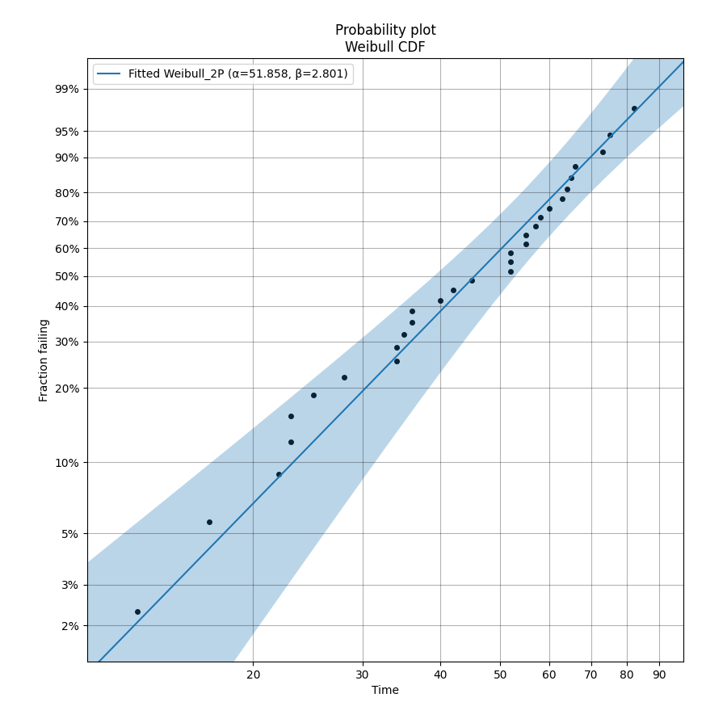
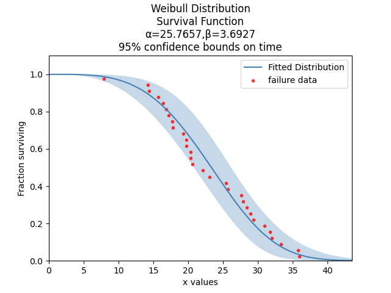
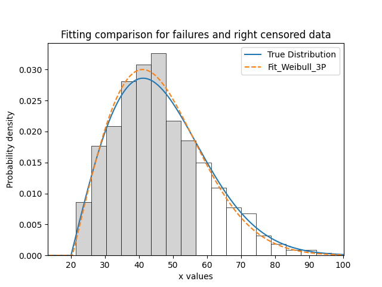
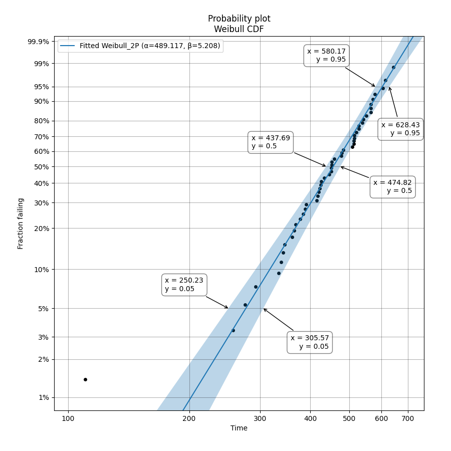

.. image:: images/logo.png

-------------------------------------

Fitting a specific distribution to data
'''''''''''''''''''''''''''''''''''''''

.. admonition:: API Reference

   For inputs and outputs see the `API reference <https://reliability.readthedocs.io/en/latest/API/Fitters.html>`_.

The module `reliability.Fitters` provides many probability distribution fitting functions as shown below.

Functions for fitting non-location shifted distributions:

-   Fit_Exponential_1P
-   Fit_Weibull_2P
-   Fit_Gamma_2P
-   Fit_Lognormal_2P
-   Fit_Loglogistic_2P
-   Fit_Normal_2P
-   Fit_Gumbel_2P
-   Fit_Beta_2P

Functions for fitting location shifted distributions:

-   Fit_Exponential_2P
-   Fit_Weibull_3P
-   Fit_Gamma_3P
-   Fit_Lognormal_3P
-   Fit_Loglogistic_3P

All of the distributions can be fitted to both complete and incomplete (right censored) data. All distributions in the Fitters module are named with their number of parameters (eg. Fit_Weibull_2P uses α,β, whereas Fit_Weibull_3P uses α,β,γ). This is intended to remove ambiguity about what distribution you are fitting.

Distributions are fitted simply by using the desired function and specifying the data as failures or right_censored data. You must have at least as many failures as there are distribution parameters or the fit would be under-constrained. It is generally advisable to have at least 4 data points as the accuracy of the fit is proportional to the amount of data. Once fitted, the results are assigned to an object and the fitted parameters can be accessed by name, as shown in the examples below. The goodness of fit criterions are also available as AICc (Akaike Information Criterion corrected), BIC (Bayesian Information Criterion), AD (Anderson-Darling), and loglik (log-likelihood), though these are more useful when comparing the fit of multiple distributions such as in the `Fit_Everything <https://reliability.readthedocs.io/en/latest/Fitting%20all%20available%20distributions%20to%20data.html>`_ function. As a matter of convenience, each of the modules in Fitters also generates a distribution object that has the parameters of the fitted distribution.

The Beta distribution is only for data in the range 0 to 1. Specifying data outside of this range will cause an error. The fitted Beta distribution does not include confidence intervals.

If you have a very large amount of data (>100000 samples) then it is likely that your computer will take significant time to compute the results. This is a limitation of interpreted languages like Python compared to compiled languages like C++ which many commerial reliability software packages are written in. If you have very large volumes of data, you may want to consider using commercial software for faster computation time. The function Fit_Weibull_2P_grouped is designed to accept a dataframe which has multiple occurrences of some values (eg. multiple values all right censored to the same value when the test was ended). Depending on the size of the data set and the amount of grouping in your data, Fit_Weibull_2P_grouped may be much faster than Fit_Weibull_2P and achieve the same level of accuracy. This difference is not noticable if you have less than 10000 samples. For more information, see the example below on `using Fit_Weibull_2P_grouped <https://reliability.readthedocs.io/en/latest/Fitting%20a%20specific%20distribution%20to%20data.html#using-fit-weibull-2p-grouped-for-large-data-sets>`_.

Heavily censored data (>99.9% censoring) may result in a failure of the optimizer to find a solution. If you have heavily censored data, you may have a limited failure population problem. It is recommended that you do not try fitting one of these standard distributions to such a dataset as your results (while they may have achieved a successful fit) will be a poor description of your overall population statistic and you risk drawing the wrong conclusions when the wrong model is fitted. The limited failure population model is planned for a future release of *reliability*, though development on this model is yet to commence. In the meantime, see JMP Pro's model for `Defective Subpopulations. <https://www.jmp.com/en_my/events/ondemand/statistical-methods-in-reliability/defective-subpopulation-distributions.html>`_

If you do not know which distribution you want to fit, then please see the `section <https://reliability.readthedocs.io/en/latest/Fitting%20all%20available%20distributions%20to%20data.html>`_ on using the Fit_Everything function which will find the best distribution to describe your data. It is highly recommended that you always try to fit everything and accept the best fit rather than choosing a particular distribution for subjective reasons.

If you have tried fitting multiple distributions and nothing seems to work well, or you can see the scatter points on the probability plot have an S-shape or a bend, then you may have data from a mixture of sources. In this case consider fitting a `Mixture model <https://reliability.readthedocs.io/en/latest/Mixture%20models.html>`_ or a `Competing Risks Model <https://reliability.readthedocs.io/en/latest/Competing%20risk%20models.html>`_.

Example 1
---------

To learn how we can fit a distribution, we will start by using a simple example with 30 failure times. These times were generated from a Weibull distribution with α=50, β=3. Note that the output also provides the confidence intervals and standard error of the parameter estimates. The probability plot is generated be default (you will need to specify plt.show() to show it). See the section on `probability plotting <https://reliability.readthedocs.io/en/latest/Probability%20plots.html#what-does-a-probability-plot-show-me>`_ to learn how to interpret this plot.

.. code:: python

    from reliability.Fitters import Fit_Weibull_2P
    import matplotlib.pyplot as plt
    data = [58,75,36,52,63,65,22,17,28,64,23,40,73,45,52,36,52,60,13,55,82,55,34,57,23,42,66,35,34,25] # made using Weibull Distribution(alpha=50,beta=3)
    wb = Fit_Weibull_2P(failures=data)
    plt.show()

    '''
    Results from Fit_Weibull_2P (95% CI):
    Analysis method: Maximum Likelihood Estimation (MLE)
    Optimizer: TNC
    Failures / Right censored: 30/0 (0% right censored) 
    
    Parameter  Point Estimate  Standard Error  Lower CI  Upper CI
        Alpha          51.858         3.55628   45.3359   59.3183
         Beta         2.80086         0.41411   2.09624   3.74233 
    
    Goodness of fit    Value
     Log-likelihood -129.063
               AICc   262.57
                BIC  264.928
                 AD 0.759805
    '''

The above probability plot is the typical way to visualise how the CDF (the blue line) models the failure data (the black points). If you would like to view the failure points alongside the PDF, CDF, SF, HF, or CHF without the axis being scaled then you can generate the scatter plot using the function plot_points which is available within reliability.Probability_plotting. In the example below we create some data, then fit a Weibull distribution to the data (ensuring we turn off the probability plot). From the fitted distribution object we plot the Survival Function (SF). We then use plot_points to generate a scatter plot of the plotting positions for the survival function.

For the function plot_points the inputs are:

-   failures - an array or list of failure data
-   right_censored - an array or list of right censored data. Optional input
-   func - the function to be plotted. Must be 'PDF', 'CDF', 'SF', 'HF', or 'CHF'. Default is 'CDF'. Note that the options for 'PDF' and 'HF' will look much more scattered as they are found using the integral of a non-continuous function.
-   a - this is the plotting heuristic. Default is 0.3. See `probability plotting <https://reliability.readthedocs.io/en/latest/Probability%20plots.html>`_ and `Wikipedia <https://en.wikipedia.org/wiki/Q%E2%80%93Q_plot#Heuristics>`_ for more details.
-   keywords for the scatter plot are also accepted.

Example 2
---------

This example shows how to use the plot_points function.

.. code:: python

    from reliability.Distributions import Weibull_Distribution
    from reliability.Fitters import Fit_Weibull_2P
    from reliability.Probability_plotting import plot_points
    import matplotlib.pyplot as plt
    
    data = Weibull_Distribution(alpha=25,beta=4).random_samples(30)
    weibull_fit = Fit_Weibull_2P(failures=data,show_probability_plot=False,print_results=False)
    weibull_fit.distribution.SF(label='Fitted Distribution',color='steelblue')
    plot_points(failures=data,func='SF',label='failure data',color='red',alpha=0.7)
    plt.legend()
    plt.show()

Example 3
---------

It is beneficial to see the effectiveness of the fitted distribution in comparison to the original distribution. In this example, we are creating 500 samples from a Weibull distribution and then we will right censor all of the data above our chosen threshold. Then we are fitting a Weibull_3P distribution to the data. Note that we need to specify "show_probability_plot=False, print_results=False" in the Fit_Weibull_3P to prevent the normal outputs of the fitting function from being displayed.

.. code:: python

    from reliability.Distributions import Weibull_Distribution
    from reliability.Fitters import Fit_Weibull_3P
    from reliability.Other_functions import make_right_censored_data, histogram
    import matplotlib.pyplot as plt

    a = 30
    b = 2
    g = 20
    threshold=55
    dist = Weibull_Distribution(alpha=a, beta=b, gamma=g) # generate a weibull distribution
    raw_data = dist.random_samples(500, seed=2)  # create some data from the distribution
    data = make_right_censored_data(raw_data,threshold=threshold) #right censor some of the data
    print('There are', len(data.right_censored), 'right censored items.')
    wbf = Fit_Weibull_3P(failures=data.failures, right_censored=data.right_censored, show_probability_plot=False, print_results=False)  # fit the Weibull_3P distribution
    print('Fit_Weibull_3P parameters:\nAlpha:', wbf.alpha, '\nBeta:', wbf.beta, '\nGamma', wbf.gamma)
    histogram(raw_data,white_above=threshold) # generates the histogram using optimal bin width and shades the censored part as white
    dist.PDF(label='True Distribution')  # plots the true distribution's PDF
    wbf.distribution.PDF(label='Fit_Weibull_3P', linestyle='--')  # plots to PDF of the fitted Weibull_3P
    plt.title('Fitting comparison for failures and right censored data')
    plt.legend()
    plt.show()

    '''
    There are 118 right censored items.
    Fit_Weibull_3P parameters:
    Alpha: 28.874745169627886 
    Beta: 2.0294944619390654 
    Gamma 20.383959629725744
    '''

Example 4
---------

As another example, we will fit a Gamma_2P distribution to some partially right censored data. To provide a comparison of the fitting accuracy as the number of samples increases, we will do the same experiment with varying sample sizes. The results highlight that the accuracy of the fit is proportional to the amount of samples, so you should always try to obtain more data if possible.

.. code:: python

    from reliability.Distributions import Gamma_Distribution
    from reliability.Fitters import Fit_Gamma_2P
    from reliability.Other_functions import make_right_censored_data, histogram
    import matplotlib.pyplot as plt

    a = 30
    b = 4
    threshold = 180  # this is used when right censoring the data
    trials = [10, 100, 1000, 10000]
    subplot_id = 221
    plt.figure(figsize=(9, 7))
    for sample_size in trials:
        dist = Gamma_Distribution(alpha=a, beta=b)
        raw_data = dist.random_samples(sample_size, seed=2)  # create some data. Seeded for repeatability
        data = make_right_censored_data(raw_data, threshold=threshold)  # right censor the data
        gf = Fit_Gamma_2P(failures=data.failures, right_censored=data.right_censored, show_probability_plot=False, print_results=False)  # fit the Gamma_2P distribution
        print('\nFit_Gamma_2P parameters using', sample_size, 'samples:', '\nAlpha:', gf.alpha, '\nBeta:', gf.beta)  # print the results
        plt.subplot(subplot_id)
        histogram(raw_data,white_above=threshold) # plots the histogram using optimal bin width and shades the right censored part white
        dist.PDF(label='True')  # plots the true distribution
        gf.distribution.PDF(label='Fitted', linestyle='--')  # plots the fitted Gamma_2P distribution
        plt.title(str(str(sample_size) + ' samples\n' + r'$\alpha$ error: ' + str(round(abs(gf.alpha - a) / a * 100, 2)) + '%\n' + r'$\beta$ error: ' + str(round(abs(gf.beta - b) / b * 100, 2)) + '%'))
        plt.ylim([0, 0.012])
        plt.xlim([0, 500])
        plt.legend()
        subplot_id += 1
    plt.subplots_adjust(left=0.11, bottom=0.08, right=0.95, top=0.89, wspace=0.33, hspace=0.58)
    plt.show()

    '''
    Fit_Gamma_2P parameters using 10 samples: 
    Alpha: 19.42603577754394 
    Beta: 4.6901283424759255
    
    Fit_Gamma_2P parameters using 100 samples: 
    Alpha: 36.26411284656554 
    Beta: 3.2929448936077534
    
    Fit_Gamma_2P parameters using 1000 samples: 
    Alpha: 28.825423280158407 
    Beta: 4.062909060146121
    
    Fit_Gamma_2P parameters using 10000 samples: 
    Alpha: 30.301232862075587 
    Beta: 3.96009153189253
    '''
    
.. image:: images/Fit_Gamma_2P_right_cens_V5.png

Example 5
---------

To obtain details of the percentiles (lower estimate, point estimate, upper estimate), we can use the percentiles input for each Fitter. In this example, we will create some data and fit a Weibull_2P distribution. When percentiles are requested the results printed includes both the table of results and the table of percentiles. Setting percentiles as True will use a default list of percentiles (as shown in the first output). Alternatively we can specify the exact percentiles to use (as shown in the second output). The use of the `crosshairs <https://reliability.readthedocs.io/en/latest/Crosshairs.html>`_ function is also shown which was used to annotate the plot manually. Note that the percentiles provided are the percentiles of the confidence intervals on time. Percentiles for the confidence intervals on reliability are not implemented, but can be accessed manually from the plots using the crosshairs function when confidence intervals on reliability have been plotted.

.. code:: python

    from reliability.Distributions import Weibull_Distribution
    from reliability.Fitters import Fit_Weibull_2P
    from reliability.Other_functions import crosshairs
    import matplotlib.pyplot as plt

    dist = Weibull_Distribution(alpha=500, beta=6)
    data = dist.random_samples(50, seed=1) # generate some data
    # this will produce the large table of percentiles below the first table of results
    Fit_Weibull_2P(failures=data, percentiles=True, CI=0.8, show_probability_plot=False)
    print('----------------------------------------------------------')
    # repeat the process but using specified percentiles.
    output = Fit_Weibull_2P(failures=data, percentiles=[5, 50, 95], CI=0.8)
    # these points have been manually annotated on the plot using crosshairs
    crosshairs()
    plt.show()
    
    #the values from the percentiles dataframe can be extracted as follows:
    lower_estimates = output.percentiles['Lower Estimate'].values
    print('Lower estimates:',lower_estimates)

    '''
    Results from Fit_Weibull_2P (80% CI):
    Analysis method: Maximum Likelihood Estimation (MLE)
    Optimizer: TNC
    Failures / Right censored: 50/0 (0% right censored) 
    
    Parameter  Point Estimate  Standard Error  Lower CI  Upper CI
        Alpha         489.117         13.9217   471.597   507.288
         Beta         5.20798        0.589269     4.505   6.02066 
    
    Goodness of fit    Value
     Log-likelihood -301.658
               AICc  607.571
                BIC   611.14
                 AD  0.48267 
    
    Table of percentiles (80% CI bounds on time):
     Percentile  Lower Estimate  Point Estimate  Upper Estimate
              1         175.215         202.212         233.368
              5         250.235         276.521         305.569
             10         292.686         317.508         344.435
             20         344.277         366.719         390.623
             25         363.578          385.05          407.79
             50          437.69         455.879         474.824
             75          502.94         520.776         539.245
             80         517.547         535.917         554.938
             90         553.267         574.068         595.651
             95         580.174          603.82          628.43
             99         625.682          655.79         687.347 
    
    ----------------------------------------------------------
    Results from Fit_Weibull_2P (80% CI):
    Analysis method: Maximum Likelihood Estimation (MLE)
    Optimizer: TNC
    Failures / Right censored: 50/0 (0% right censored) 
    
    Parameter  Point Estimate  Standard Error  Lower CI  Upper CI
        Alpha         489.117         13.9217   471.597   507.288
         Beta         5.20798        0.589269     4.505   6.02066 
    
    Goodness of fit    Value
     Log-likelihood -301.658
               AICc  607.571
                BIC   611.14
                 AD  0.48267 
    
    Table of percentiles (80% CI bounds on time):
     Percentile  Lower Estimate  Point Estimate  Upper Estimate
              5         250.235         276.521         305.569
             50          437.69         455.879         474.824
             95         580.174          603.82          628.43 
    
    Lower estimates: [250.23461473 437.69015375 580.17421254]
    '''

Using Fit_Weibull_2P_grouped for large data sets
------------------------------------------------

The function Fit_Weibull_2P_grouped is effectively the same as Fit_Weibull_2P, except for a few small differences that make it more efficient at handling grouped data sets. Grouped data sets are typically found in very large data that may be heavily censored. The function includes a choice between two optimizers and a choice between two initial guess methods for the initial guess that is given to the optimizer. These help in cases where the data is very heavily censored (>99.9%). The defaults for these options are usually the best but you may want to try different options to see which one gives you the lowest log-likelihood.

.. admonition:: API Reference

   For inputs and outputs see the `API reference <https://reliability.readthedocs.io/en/latest/API/Fitters/Fit_Weibull_2P_grouped.html>`_.

Example 6
---------

The following example shows how we can use Fit_Weibull_2P_grouped to fit a Weibull_2P distribution to grouped data from a spreadsheet (shown below) on the Windows desktop. If you would like to access this data, it is available in reliability.Datasets.electronics and includes both the failures and right_censored format as well as the dataframe format. An example of this is provided in the code below (option 2).

.. image:: images/grouped_excel.png

.. code:: python

    from reliability.Fitters import Fit_Weibull_2P_grouped
    import pandas as pd

    # option 1 for importing this dataset (from an excel file on your desktop)
    filename = 'C:\\Users\\Current User\\Desktop\\data.xlsx'
    df = pd.read_excel(io=filename)
    
    ## option 2 for importing this dataset (from the dataset in reliability)
    # from reliability.Datasets import electronics
    # df = electronics().dataframe
    
    print(df.head(15),'\n')
    Fit_Weibull_2P_grouped(dataframe=df, show_probability_plot=False)

    '''
         time  quantity category
    0     220         1        F
    1     179         1        F
    2     123         1        F
    3     146         1        F
    4     199         1        F
    5     181         1        F
    6     191         1        F
    7     216         1        F
    8       1         1        F
    9      73         1        F
    10  44798       817        C
    11  62715       823        C
    12  81474       815        C
    13  80632       813        C
    14  62716       804        C 

    Results from Fit_Weibull_2P_grouped (95% CI):
    Analysis method: Maximum Likelihood Estimation (MLE)
    Optimizer: TNC
    Failures / Right censored: 10/4072 (99.75502% right censored) 
    
    Parameter  Point Estimate  Standard Error    Lower CI    Upper CI
        Alpha     6.19454e+21      7.7592e+22 1.34889e+11 2.84473e+32
         Beta        0.153742       0.0485886   0.0827523    0.285632 

    Goodness of fit    Value
     Log-likelihood -144.617
               AICc  293.236
                BIC  305.862
                 AD  264.999 
    '''
