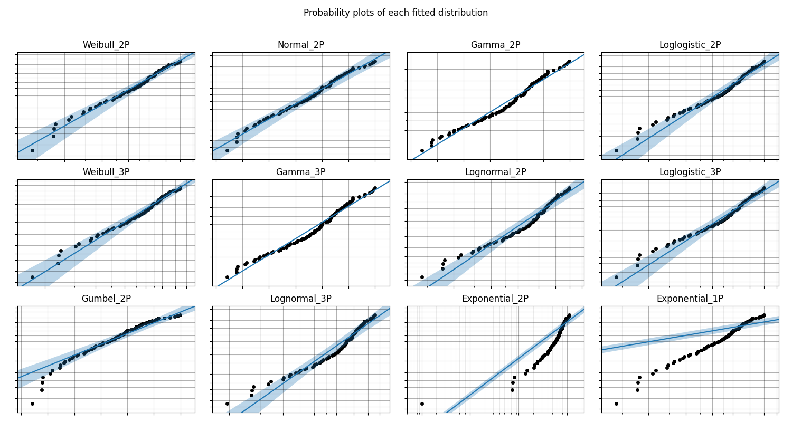
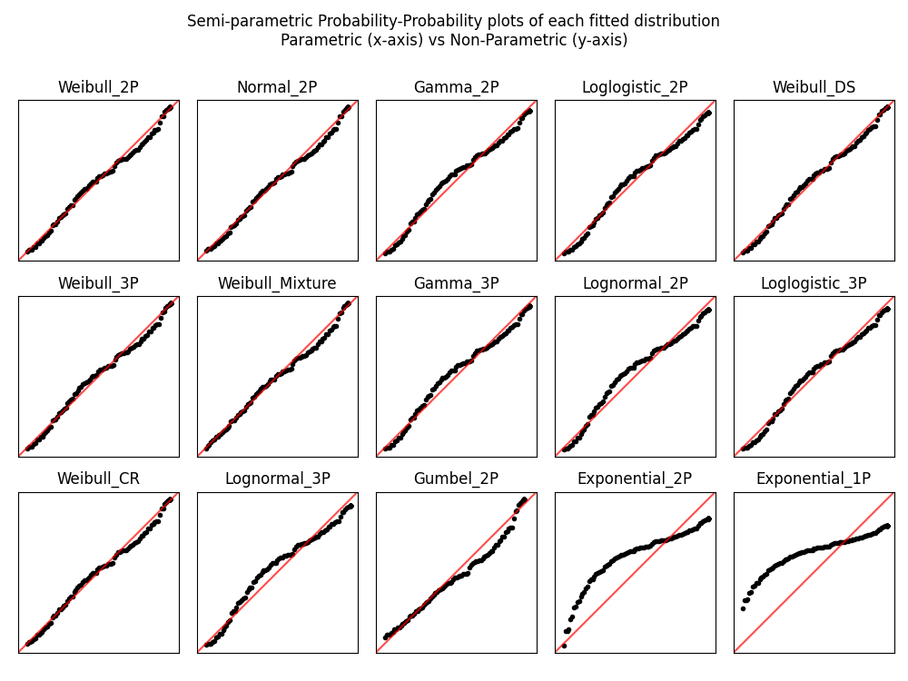

.. image:: images/logo.png

-------------------------------------

Fitting all available distributions to data
'''''''''''''''''''''''''''''''''''''''''''

To fit all of the `distributions available <https://reliability.readthedocs.io/en/latest/Fitting%20a%20specific%20distribution%20to%20data.html>`_ in ``reliability``, is a similar process to fitting a specific distribution. The user needs to specify the failures and any right censored data. The Beta distribution will only be fitted if you specify data that is in the range 0 to 1. The selection of what can be fitted is all done automatically based on the data provided. Manual exclusion of certain datasets is also possible.

Inputs:

-   failures - an array or list of the failure times.
-   right_censored - an array or list of the right censored failure times.
-   sort_by - goodness of fit test to sort results by. Must be either 'BIC','AIC', or 'AD'. Default is BIC.
-   exclude - list or array of strings specifying which distributions to exclude. Default is None. Options are Weibull_2P, Weibull_3P, Normal_2P, Gamma_2P, Loglogistic_2P, Gamma_3P, Lognormal_2P, Lognormal_3P, Loglogistic_3P, Gumbel_2P, Exponential_2P, Exponential_1P, Beta_2P
-   show_histogram_plot - True/False. Defaults to True. Will show the PDF and CDF of the fitted distributions along with a histogram of the failure data.
-   show_PP_plot - True/False. Defaults to True. Provides a comparison of parametric vs non-parametric fit using a `semiparametric Probability-Probability (PP) plot <https://reliability.readthedocs.io/en/latest/Probability-Probability%20plots.html#semiparametric-probability-probability-plot>`_ for each fitted distribution.
-   show_probability_plot - True/False. Defaults to True. Provides a `probability plot <https://reliability.readthedocs.io/en/latest/Probability%20plots.html>`_ of each of the fitted distributions.
-   print_results - True/False. Defaults to True. Will show the results of the fitted parameters and the goodness of fit tests in a dataframe.

Outputs:

-   results - a dataframe of the fitted distributions and their parameters, along with the AICc, BIC and AD goodness of fit statistics. This is sorted automatically to provide the best fit first. Use the sort_by='BIC' to change the sort between AICc, BIC, and AD. Default sort is BIC. print_results controls whether this is printed. In displaying these results, the pandas dataframe is designed to use the common greek letter parametrisations rather than the scale, shape, location, threshold parametrisations which can become confusing for some distributions.
-   a plot of the PDF and CDF of each fitted distribution along with a histogram of the failure data. The legend is not in any particular order.
-   a probability plot of each of the fitted distributions.
-   a semi-parametric probability-probability plot of parametric vs non-parametric distribution (a better fit is will lie on the red diagonal).
-   best_distribution - a distribution object created based on the parameters of the best fitting distribution. The best distribution is created as a distribution object that can be used like any of the other `distribution <https://reliability.readthedocs.io/en/latest/Creating%20and%20plotting%20distributions.html>`_ objects. See the examples below for how this can be used.
-   best_distribution_name - the name of the best fitting distribution. E.g. 'Weibull_3P'
-   parameters and goodness of fit tests for each fitted distribution. For example, the Weibull_3P distribution values are: Weibull_3P_alpha, Weibull_3P_beta, Weibull_3P_gamma, Weibull_3P_BIC, Weibull_3P_AICc, Weibull_3P_AD.

Confidence intervals are shown on the plots but they are not reported for each of the fitted parameters as this would be a large number of outputs. If you need the confidence intervals for the fitted parameters you can repeat the fitting using just a specific distribution and the results will include the confidence intervals.

In this first example, we will use *Fit_Everything* on some data and will return only the dataframe of results. Note that we are actively supressing the 3 plots that would normally be shown to provide graphical goodness of fit indications.

.. code:: python

    from reliability.Fitters import Fit_Everything
    data = [4,4,2,4,7,4,1,2,7,1,4,3,6,6,6,3,2,3,4,3,2,3,2,4,6,5,5,2,4,3] # created using Weibull_Distribution(alpha=5,beta=2), and rounded to nearest int
    Fit_Everything(failures=data, show_histogram_plot=False, show_probability_plot=False, show_PP_plot=False)

    '''
                       Alpha      Beta     Gamma       Mu     Sigma    Lambda        AICc         BIC        AD
    Distribution                                                                                               
    Weibull_2P       4.21932   2.43761                                         117.696224  120.054175  1.048046
    Gamma_2P        0.816685   4.57132                                         118.404666  120.762616  1.065917
    Normal_2P                                     3.73333   1.65193            119.697592  122.055543  1.185387
    Lognormal_2P                                  1.20395  0.503621            120.662122  123.020072  1.198573
    Lognormal_3P                               0  1.20395  0.503621            123.140754  123.020072  1.198573
    Weibull_3P       3.61252   2.02388  0.530239                               119.766821  123.047337  1.049479
    Loglogistic_2P   3.45096   3.48793                                         121.089046  123.446996  1.056100
    Loglogistic_3P   3.45096   3.48793         0                               123.567678  126.848194  1.056100
    Exponential_2P                         0.999                      0.36572  124.797704  127.155654  2.899050
    Gamma_3P         3.49645  0.781773    0.9999                               125.942453  129.222968  3.798788
    Exponential_1P                                                   0.267857  141.180947  142.439287  4.710926
    '''

In this second example, we will create some right censored data and use *Fit_Everything*. All outputs are shown, and the best fitting distribution is accessed and printed.

.. code:: python

    from reliability.Fitters import Fit_Everything
    from reliability.Distributions import Weibull_Distribution
    from reliability.Other_functions import make_right_censored_data
    
    raw_data = Weibull_Distribution(alpha=12, beta=3).random_samples(100, seed=2)  # create some data
    data = make_right_censored_data(raw_data, threshold=14)  # right censor the data
    results = Fit_Everything(failures=data.failures, right_censored=data.right_censored)  # fit all the models
    print('The best fitting distribution was', results.best_distribution_name, 'which had parameters', results.best_distribution.parameters)
    
    '''
                      Alpha     Beta     Gamma       Mu     Sigma     Lambda        AICc         BIC         AD
    Distribution                                                                                               
    Weibull_2P      11.2773  3.30301                                          488.041154  493.127783  44.945028
    Normal_2P                                   10.1194   3.37466             489.082213  494.168842  44.909765
    Gamma_2P        1.42315  7.21352                                          490.593729  495.680358  45.281749
    Loglogistic_2P  9.86245  4.48433                                          491.300512  496.387141  45.200181
    Weibull_3P      10.0786  2.85825   1.15083                                489.807329  497.372839  44.992658
    Gamma_3P        1.42315  7.21352         0                                492.720018  500.285528  45.281749
    Lognormal_2P                                2.26524  0.406436             495.693518  500.780147  45.687381
    Lognormal_3P                      0.883941  2.16125  0.465752             500.938298  500.780147  45.687381
    Loglogistic_3P  9.86245  4.48433         0                                493.426801  500.992311  45.200181
    Exponential_2P                     2.82802                      0.121869  538.150905  543.237534  51.777617
    Exponential_1P                                                 0.0870022  594.033742  596.598095  56.866106
    
    The best fitting distribution was Weibull_2P which had parameters [11.27730642  3.30300716  0.        ]
    '''

.. image:: images/Fit_everything_histogram_plot_V6.png

All plots are ordered based on the goodness of fit order of the results. For the histogram this is reflected in the order of the legend. For the probability plots and PP plots, these are ordered left to right and top to bottom.

The histogram is scaled based on the amount of censored data. If your censored data is all above your failure data then the histogram bars should line up well with the fitted distributions (assuming you have enough data). However, if your censored data is not always greater than the max of your failure data then the heights of the histogram bars will be scaled down and the plot may look incorrect. This is to be expected as the histogram is only a plot of the failure data and the totals will not add to 100% if there is censored data.

.. note:: The confidence intervals shown on the probability plots are not available for Gamma_2P, Gamma_3P, or Beta_2P. This library is being actively developed the remaining confidence intervals will be added soon.
