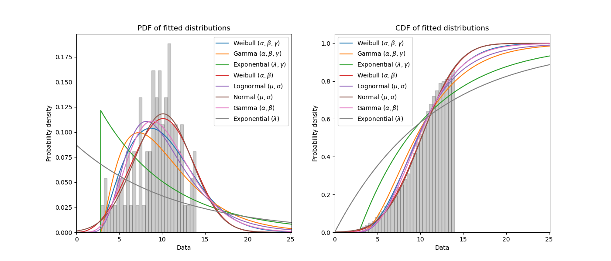
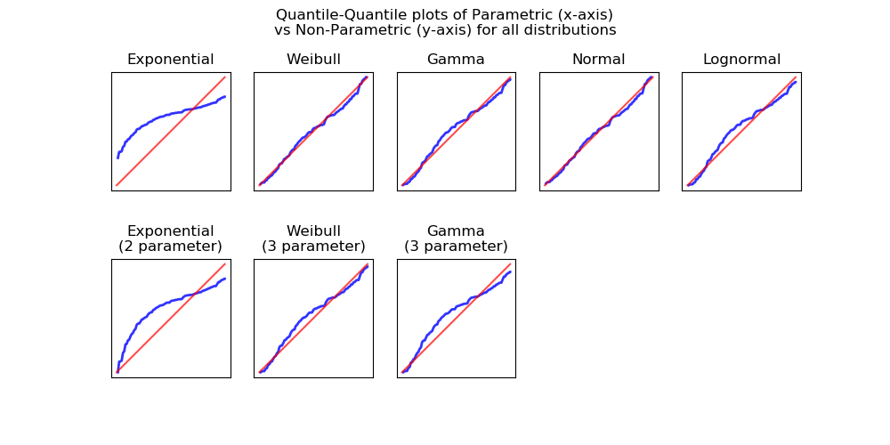

.. _code_directive:

.. image:: images/logo.png

-------------------------------------

Fitting all available distributions to data
'''''''''''''''''''''''''''''''''''''''''''

To fit all of the `distributions available <https://reliability.readthedocs.io/en/latest/Fitting%20a%20specific%20distribution%20to%20data.html>`_ in ``reliability``, is a similar process to fitting a specific distribution. The user needs to specify the failures and any right or left censored data. Based on what is specified, the Fit_Everything function will fit what can be fitted. For example, if you specify data that is in the range {0,1} and does not contain left censored data, then Fit_Everything will fit all of the distributions implemented, however if you specify failure data and left censored data then Fit_Everything will not fit a Beta distribution or any of the location shifted distributions. Selection of what can be fitted is all done automatically based on the data provided.

Fit_Everything has 3 outputs which are all displayed by default. These outputs are:

-   a dataframe of the fitted distributions and their parameters, along with the AICc and BIC goodness of fit statistics. This is sorted automatically to provide the best fit first. Use the sort_by='BIC' to change the sort between AICc and BIC. Default sort is BIC.
-   a plot of the PDF and CDF of each fitted distribution along with a histogram of the failure data. The legend is not in any particular order.
-   a quantile plot of parametric vs non-parametric (a better fit is will lie on the red diagonal).

Fit_Everything will also return an object with all of the parameters and goodness of fit scores so you can access them later. The best distribution is created as a distribution object that can be used like any of the other `distribution <https://reliability.readthedocs.io/en/latest/Creating%20and%20plotting%20distributions.html>`_ objects. See the examples below for how this can be used.

In this first example, we will use Fit_Everything on some data and will return only the dataframe of results.

.. code:: python

    from reliability.Fitters import Fit_Everything
    data = [4,4,2,4,7,4,1,2,7,1,4,3,6,6,6,3,2,3,4,3,2,3,2,4,6,5,5,2,4,3] # this data was created from alpha=5, beta=2, and rounded to nearest int
    Fit_Everything(data, show_plot=False, show_quantile_plot=False)

    '''
                           Alpha     Beta  Gamma       Mu     Sigma    Lambda     AICc      BIC
    Distribution                                                                            
    Weibull_2P            4.21932   2.4376                                      117.696  120.054
    Gamma_2P             0.816685  4.57132                                      118.405  120.763
    Normal_2P                                      3.73333   1.65193            119.698  122.056
    Lognormal_2P                                   1.20395  0.503621            120.662   123.02
    Exponential_                                1                      0.36452  122.693  123.952
    Weibull_3P            2.92572  1.35444  0.991                               121.671  124.029
    Gamma_3P              2.20842  1.24221  0.991                               124.168  126.526
    Exponential_1P                                                    0.267857  141.181  142.439
    '''

In this second example, we will create some right censored data and use Fit_Everything. All outputs are shown, and the best fitting distribution is accessed and printed.

.. code:: python

    from reliability.Fitters import Fit_Everything
    from reliability.Distributions import Weibull_Distribution
    import numpy as np
    #create some failures and right censored data
    np.random.seed(2) #this is just for repeatability for this tutorial
    uncensored_data = Weibull_Distribution(alpha=12, beta=3).random_samples(100)
    failures = []
    censored = []
    for item in uncensored_data:
        if item >=14:
            censored.append(14)
        else:
            failures.append(item)
    #fit everything
    results = Fit_Everything(failures=failures,right_censored=censored)
    print('The best fitting distribution was',results.best_distribution_name,'which had parameters',results.best_distribution.parameters)

More to come
