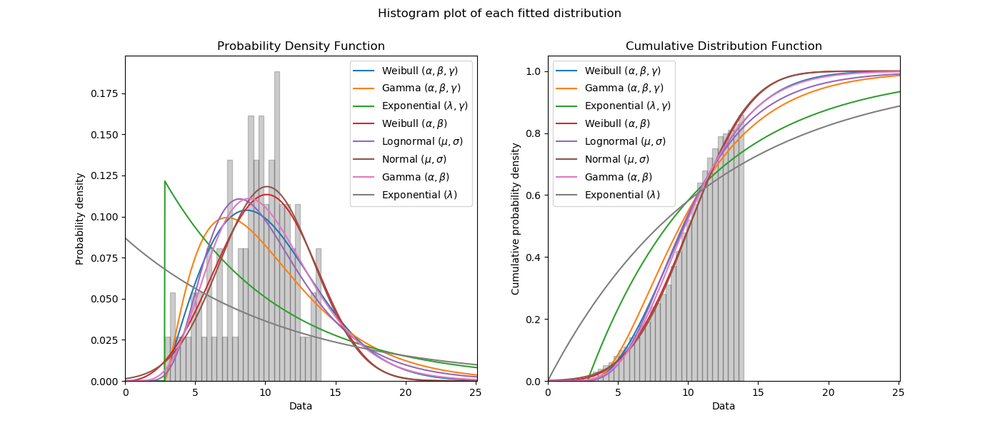
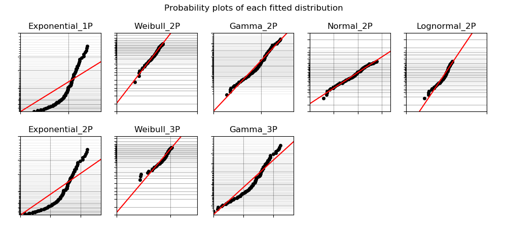
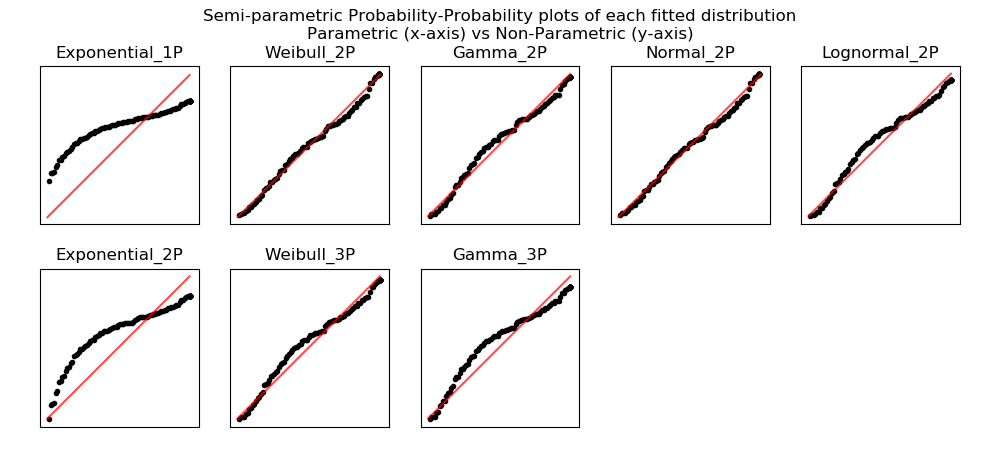

.. image:: images/logo.png

-------------------------------------

Fitting all available distributions to data
'''''''''''''''''''''''''''''''''''''''''''

To fit all of the `distributions available <https://reliability.readthedocs.io/en/latest/Fitting%20a%20specific%20distribution%20to%20data.html>`_ in ``reliability``, is a similar process to fitting a specific distribution. The user needs to specify the failures and any right or left censored data. Based on what is specified, the Fit_Everything function will fit what can be fitted. For example, if you specify data that is in the range {0,1} and does not contain left censored data, then Fit_Everything will fit all of the distributions implemented, however, if you specify failure data and left censored data then Fit_Everything will not fit a Beta distribution or any of the location shifted distributions. Selection of what can be fitted is all done automatically based on the data provided.

Inputs:

-   failures - an array or list of the failure times.
-   left_censored - an array or list of the left failure times.
-   right_censored - an array or list of the right failure times.
-   sort_by - goodness of fit test to sort results by. Must be either 'BIC' or 'AIC'. Default is BIC.
-   show_histogram_plot - True/False. Defaults to True. Will show the PDF and CDF of the fitted distributions along with a histogram of the failure data.
-   show_PP_plot - True/False. Defaults to True unless there is left censored data in which case Kaplan-Meier cannot be applied. Provides a comparison of parametric vs non-parametric fit using a `semiparametric Probability-Probability (PP) plot <https://reliability.readthedocs.io/en/latest/Probability-Probability%20plots.html#semiparametric-probability-probability-plot>`_ for each fitted distribution.
-   show_probability_plot - True/False. Defaults to True. Provides a `probability plot <https://reliability.readthedocs.io/en/latest/Probability%20plots.html>`_ of each of the fitted distributions.
-   print_results - True/False. Defaults to True. Will show the results of the fitted parameters and the goodness of fit tests in a dataframe.

Outputs:

-   results - a dataframe of the fitted distributions and their parameters, along with the AICc and BIC goodness of fit statistics. This is sorted automatically to provide the best fit first. Use the sort_by='BIC' to change the sort between AICc and BIC. Default sort is BIC. print_results controls whether this is printed. In displaying these results, the pandas dataframe is designed to use the common greek letter parametrisations rather than the scale, shape, location, threshold parametrisations which can become confusing for some distributions.
-   a plot of the PDF and CDF of each fitted distribution along with a histogram of the failure data. The legend is not in any particular order.
-   a probability plot of parametric vs non-parametric (a better fit is will lie on the red diagonal).
-   best_distribution - a distribution object created based on the parameters of the best fitting distribution. The best distribution is created as a distribution object that can be used like any of the other `distribution <https://reliability.readthedocs.io/en/latest/Creating%20and%20plotting%20distributions.html>`_ objects. See the examples below for how this can be used.
-   best_distribution_name - the name of the best fitting distribution. E.g. 'Weibull_3P'
-   parameters and goodness of fit tests for each fitted distribution. For example, the Weibull_3P distribution values are: Weibull_3P_alpha, Weibull_3P_beta, Weibull_3P_gamma, Weibull_3P_BIC, Weibull_3P_AICc.

Confidence intervals for each of the fitted parameters are not reported by ``Fitters.Fit_Everything`` as this would be a large number of outputs. If you need the confidence intervals for the fitted parameters you can repeat the fitting using just a specific distribution and the results will include the confidence intervals. Whilst Minitab uses the Anderson-Darling statistic for the goodness of fit, it is generally recognised that AICc and BIC are more accurate measures as they take into account the number of parameters in the distribution.

In this first example, we will use Fit_Everything on some data and will return only the dataframe of results.

.. code:: python

    from reliability.Fitters import Fit_Everything
    data = [4,4,2,4,7,4,1,2,7,1,4,3,6,6,6,3,2,3,4,3,2,3,2,4,6,5,5,2,4,3] # created using Weibull_Distribution(alpha=5,beta=2), and rounded to nearest int
    Fit_Everything(failures=data, show_histogram_plot=False, show_probability_plot=False, show_PP_plot=False)

    '''
                           Alpha     Beta  Gamma       Mu     Sigma    Lambda     AICc      BIC
    Distribution                                                                            
    Weibull_2P            4.21932   2.4376                                      117.696  120.054
    Gamma_2P             0.816685  4.57132                                      118.405  120.763
    Normal_2P                                      3.73333   1.65193            119.698  122.056
    Lognormal_2P                                   1.20395  0.503621            120.662   123.02
    Exponential_                                1                      0.36452  122.693  123.952
    Weibull_3P            2.92572  1.35444  0.991                               121.671  124.029
    Gamma_3P              2.20842  1.24221  0.991                               124.168  126.526
    Exponential_1P                                                    0.267857  141.181  142.439
    '''

In this second example, we will create some right censored data and use Fit_Everything. All outputs are shown, and the best fitting distribution is accessed and printed.

.. code:: python

    from reliability.Fitters import Fit_Everything
    from reliability.Distributions import Weibull_Distribution
    import numpy as np
    #create some failures and right censored data
    np.random.seed(2) #this is just for repeatability for this tutorial
    uncensored_data = Weibull_Distribution(alpha=12, beta=3).random_samples(100)
    failures = []
    censored = []
    for item in uncensored_data:
        if item >=14:
            censored.append(14)
        else:
            failures.append(item)
    #fit everything
    results = Fit_Everything(failures=failures,right_censored=censored)
    print('The best fitting distribution was',results.best_distribution_name,'which had parameters',results.best_distribution.parameters)
    
    '''
                      Alpha     Beta    Gamma       Mu     Sigma     Lambda     AICc      BIC
    Distribution                                                                             
    Weibull_2P      11.2773  3.30293                                         488.041  493.128
    Normal_2P                                  10.1192    3.3742             489.082  494.169
    Gamma_2P        1.42315  7.21352                                         490.594   495.68
    Lognormal_2P                               2.26518  0.406349             495.694   500.78
    Weibull_3P       8.2661  2.00287  2.82002                                496.887  501.974
    Gamma_3P        3.21732  2.38197  2.82002                                508.779  513.866
    Exponential_2P                    2.82902                      0.121715  536.287  538.852
    Exponential_1P                                                0.0870033  594.034  596.598
    
    The best fitting distribution was Weibull_2P which had parameters [11.27727274  3.30293237  0.        ]
    '''

The histogram is scaled based on the amount of censored data. If your censored data is all above or below your failure data then the histogram bars should line up well with the fitted distributions (assuming you have enough data). However, if your censored data is not always greater or less than the max and min of your failure data then the heights of the histogram bars will be scaled down and the plot won't look right. This is to be expected as the histogram is only a plot of the failure data and the totals will not add to 100% if there is censored data.
