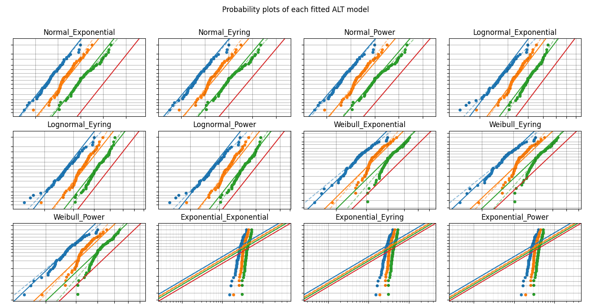
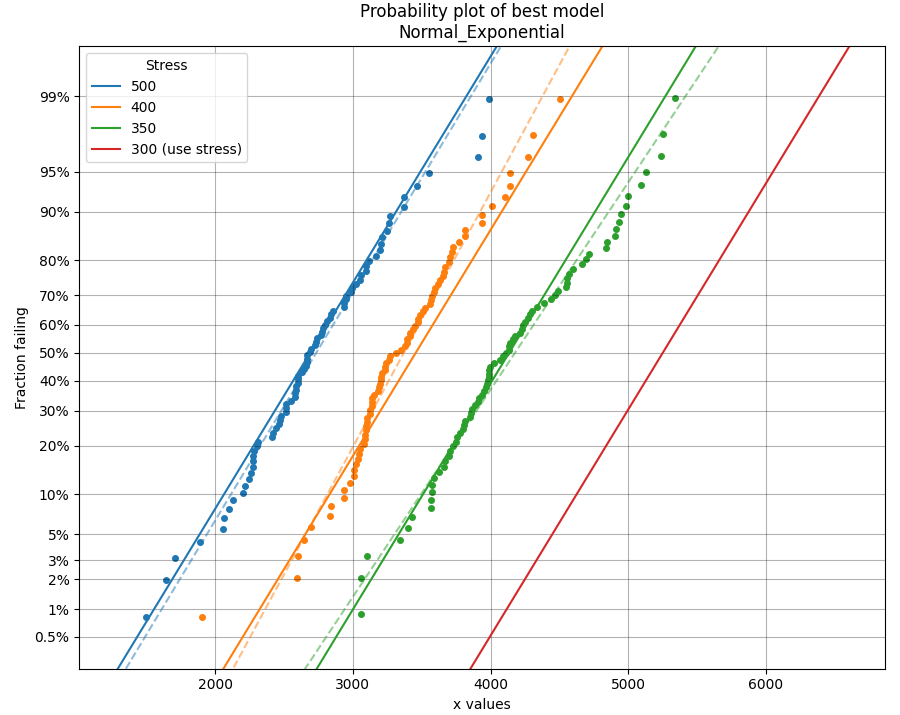

.. image:: images/logo.png

-------------------------------------

Fitting all available models to ALT data
''''''''''''''''''''''''''''''''''''''''

Just as the function `Fitters.Fit_Everything` provides users with a quick way to `fit all available distributions <https://reliability.readthedocs.io/en/latest/Fitting%20all%20available%20distributions%20to%20data.html>`_ to their dataset, we can do a similar thing using `ALT_fitters.Fit_Everything_ALT` to fit all of the ALT models to an ALT dataset.

There are 24 ALT models available within `reliability`; 12 single stress models and 12 dual stress models. `Fit_Everything_ALT` will automatically fit the single stress or dual stress models based on whether the input includes single or dual stress data. Manual exclusion of certain models is also possible using the `exclude` argument. From the results, the models are sorted based on their goodness of fit test results, where the smaller the goodness of fit value, the better the fit of the model to the data.

Inputs:

-    failures - an array or list of the failure times (this does not need to be sorted).
-    failure_stress_1 - an array or list of the corresponding stresses (such as temperature or voltage) at which each failure occurred. This must match the length of failures as each failure is tied to a failure stress.
-    failure_stress_2 - an array or list of the corresponding stresses (such as temperature or voltage) at which each failure occurred. This must match the length of failures as each failure is tied to a failure stress. Optional input. Providing this will trigger the use of dual stress models. Leaving this empty will trigger the use of single stress models.
-    right_censored - an array or list of the right failure times (this does not need to be sorted). Optional Input.
-    right_censored_stress_1 - an array or list of the corresponding stresses (such as temperature or voltage) at which each right_censored data point was obtained. This must match the length of right_censored as each right_censored value is tied to a right_censored stress.
-    right_censored_stress_2 - an array or list of the corresponding stresses (such as temperature or voltage) at which each right_censored data point was obtained. This must match the length of right_censored as each right_censored value is tied to a right_censored stress. Conditionally optional input. This must be provided if failure_stress_2 is provided.
-    use_level_stress - The use level stress at which you want to know the mean life. Optional input. This must be a list [stress_1,stress_2] if failure_stress_2 is provided.
-    print_results - True/False. Default is True
-    show_probability_plot - True/False. Default is True. Provides a probability plot of each of the fitted ALT model.
-    show_best_distribution_probability_plot - True/False. Defaults to True. Provides a probability plot in a new figure of the best ALT model.
-    CI - confidence interval for estimating confidence limits on parameters. Must be between 0 and 1. Default is 0.95 for 95% CI.
-    optimizer - 'TNC', 'L-BFGS-B', 'powell'. Default is 'TNC'. These are all bound constrained methods. If the bound constrained method fails, nelder-mead will be used. If nelder-mead fails the initial guess (using least squares) will be returned with a warning.
-    sort_by - goodness of fit test to sort results by. Must be 'BIC','AICc', or 'Log-likelihood'. Default is BIC.
-    exclude - list or array of strings specifying which distributions to exclude. Default is None. Options are:

     -   Weibull_Exponential
     -   Weibull_Eyring
     -   Weibull_Power
     -   Weibull_Dual_Exponential
     -   Weibull_Power_Exponential
     -   Weibull_Dual_Power
     -   Lognormal_Exponential
     -   Lognormal_Eyring
     -   Lognormal_Power
     -   Lognormal_Dual_Exponential
     -   Lognormal_Power_Exponential
     -   Lognormal_Dual_Power
     -   Normal_Exponential
     -   Normal_Eyring
     -   Normal_Power
     -   Normal_Dual_Exponential
     -   Normal_Power_Exponential
     -   Normal_Dual_Power
     -   Exponential_Exponential
     -   Exponential_Eyring
     -   Exponential_Power
     -   Exponential_Dual_Exponential
     -   Exponential_Power_Exponential
     -   Exponential_Dual_Power

Outputs:

-    results - the dataframe of results. Fitted parameters in this dataframe may be accessed by name. See below example.
-    best_model_name - the name of the best fitting ALT model. E.g. 'Weibull_Exponential'. See above list for exclude.
-    best_model_at_use_stress - a distribution object created based on the parameters of the best fitting ALT model at the use stress. This is only provided if the use_level_stress is provided. This is because use_level_stress is required to find the scale parameter.
-    excluded_models - a list of the models which were excluded. This will always include at least half the models since only single stress OR dual stress can be fitted depending on the data.
-    parameters and goodness of fit results for each fitted model. For example, the Weibull_Exponential model values are:
     
     -   Weibull_Exponential_a
     -   Weibull_Exponential_b
     -   Weibull_Exponential_beta
     -   Weibull_Exponential_BIC
     -   Weibull_Exponential_AICc
     -   Weibull_Exponential_loglik

Example 1
---------

In this first example, we will use `Fit_Everything_ALT` on some data that is generated using the function `make_ALT_data`. We can then compare the fitted results to the input parameters used to create the data. `Fit_Everything_ALT` produces two plots; a grid of all the fitted models (usually 12 models unless you have excluded some) and a larger plot of the best fitting model's probability plot. These are shown by default, so using plt.show() is not required to display the plots.

.. code:: python

     from reliability.Other_functions import make_ALT_data
     from reliability.ALT_fitters import Fit_Everything_ALT

     ALT_data = make_ALT_data(distribution='Normal',life_stress_model='Exponential',a=500,b=1000,sigma=500,stress_1=[500,400,350],number_of_samples=100,fraction_censored=0.2,seed=1)
     model = Fit_Everything_ALT(failures=ALT_data.failures, failure_stress_1=ALT_data.failure_stresses, right_censored=ALT_data.right_censored, right_censored_stress_1=ALT_data.right_censored_stresses, use_level_stress=300)
     
     '''
     Results from Fit_Everything_ALT:
     Analysis method: Maximum Likelihood Estimation (MLE)
     Failures / Right censored: 240/60 (20% right censored) 

                    ALT_model           a       b        c        n    beta    sigma  Log-likelihood    AICc     BIC
           Normal_Exponential     501.729 985.894                            487.321        -1833.41 3672.89 3683.93
                Normal_Eyring      88.928         -13.9268                   490.833        -1835.23 3676.53 3687.56
                 Normal_Power 4.77851e+06                    -1.205          491.757        -1835.68 3677.45 3688.48
        Lognormal_Exponential     502.086 974.987                           0.151077        -1840.03 3686.14 3697.17
             Lognormal_Eyring     84.8059         -13.9272                  0.151992        -1841.54 3689.16 3700.19
              Lognormal_Power 4.43489e+06                  -1.19428         0.152211        -1841.89 3689.87  3700.9
          Weibull_Exponential     445.079 1206.61                    7.1223                 -1849.68 3705.44 3716.47
               Weibull_Eyring     28.2064         -14.1399          7.05022                 -1851.94 3709.96 3720.99
                Weibull_Power 4.43489e+06                  -1.18188 6.92681                 -1854.25 3714.57  3725.6
      Exponential_Exponential     492.845  1118.8                                           -2214.88  4433.8 4441.16
           Exponential_Eyring     74.9261         -14.0665                                  -2214.93 4433.91 4441.27
            Exponential_Power 4.23394e+06                  -1.16747                         -2214.94 4433.93  4441.3 

     At the use level stress of 300, the Normal_Exponential model has a mean life of 5249.98339
     '''

Example 2
---------

This will be written soon...
