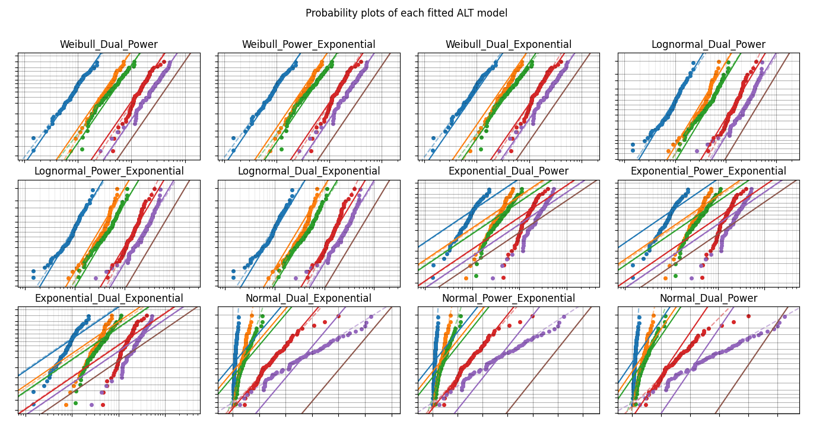
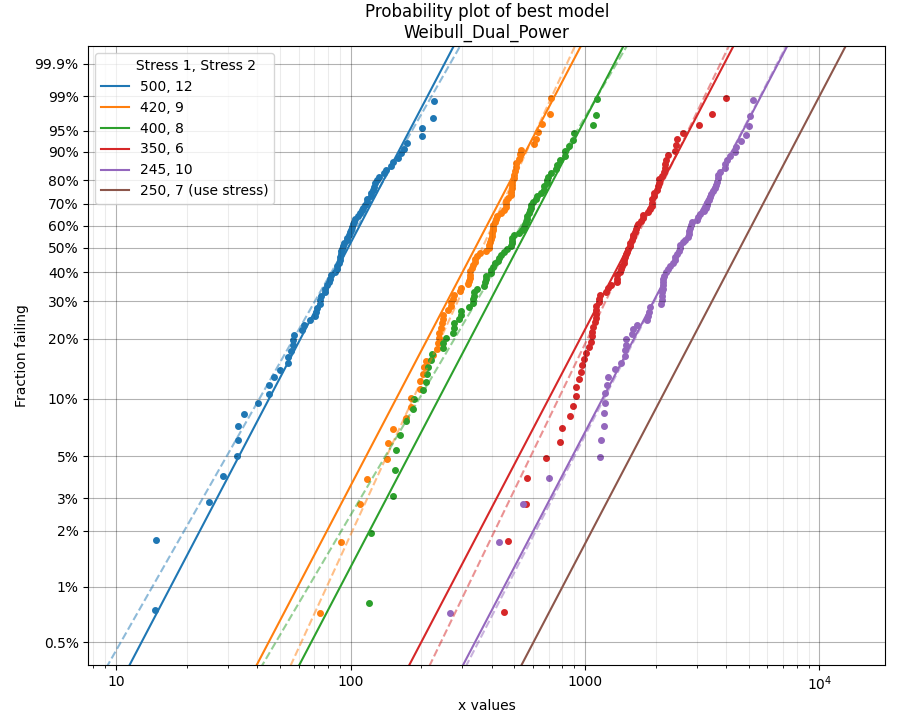

.. image:: images/logo.png

-------------------------------------

Fitting all available models to ALT data
''''''''''''''''''''''''''''''''''''''''

Just as the function `Fitters.Fit_Everything` provides users with a quick way to `fit all available distributions <https://reliability.readthedocs.io/en/latest/Fitting%20all%20available%20distributions%20to%20data.html>`_ to their dataset, we can do a similar thing using `ALT_fitters.Fit_Everything_ALT` to fit all of the ALT models to an ALT dataset.

There are 24 ALT models available within `reliability`; 12 single stress models and 12 dual stress models. `Fit_Everything_ALT` will automatically fit the single stress or dual stress models based on whether the input includes single or dual stress data. Manual exclusion of certain models is also possible using the `exclude` argument. From the results, the models are sorted based on their goodness of fit test results, where the smaller the goodness of fit value, the better the fit of the model to the data.

Inputs:

-    failures - an array or list of the failure times (this does not need to be sorted).
-    failure_stress_1 - an array or list of the corresponding stresses (such as temperature or voltage) at which each failure occurred. This must match the length of failures as each failure is tied to a failure stress.
-    failure_stress_2 - an array or list of the corresponding stresses (such as temperature or voltage) at which each failure occurred. This must match the length of failures as each failure is tied to a failure stress. Optional input. Providing this will trigger the use of dual stress models. Leaving this empty will trigger the use of single stress models.
-    right_censored - an array or list of the right failure times (this does not need to be sorted). Optional Input.
-    right_censored_stress_1 - an array or list of the corresponding stresses (such as temperature or voltage) at which each right_censored data point was obtained. This must match the length of right_censored as each right_censored value is tied to a right_censored stress.
-    right_censored_stress_2 - an array or list of the corresponding stresses (such as temperature or voltage) at which each right_censored data point was obtained. This must match the length of right_censored as each right_censored value is tied to a right_censored stress. Conditionally optional input. This must be provided if failure_stress_2 is provided.
-    use_level_stress - The use level stress at which you want to know the mean life. Optional input. This must be a list [stress_1,stress_2] if failure_stress_2 is provided.
-    print_results - True/False. Default is True
-    show_probability_plot - True/False. Default is True. Provides a probability plot of each of the fitted ALT model.
-    show_best_distribution_probability_plot - True/False. Defaults to True. Provides a probability plot in a new figure of the best ALT model.
-    CI - confidence interval for estimating confidence limits on parameters. Must be between 0 and 1. Default is 0.95 for 95% CI.
-    optimizer - 'TNC', 'L-BFGS-B', 'powell'. Default is 'TNC'. These are all bound constrained methods. If the bound constrained method fails, nelder-mead will be used. If nelder-mead fails the initial guess (using least squares) will be returned with a warning.
-    sort_by - goodness of fit test to sort results by. Must be 'BIC','AICc', or 'Log-likelihood'. Default is BIC.
-    exclude - list or array of strings specifying which distributions to exclude. Default is None. Options are:

     -   Weibull_Exponential
     -   Weibull_Eyring
     -   Weibull_Power
     -   Weibull_Dual_Exponential
     -   Weibull_Power_Exponential
     -   Weibull_Dual_Power
     -   Lognormal_Exponential
     -   Lognormal_Eyring
     -   Lognormal_Power
     -   Lognormal_Dual_Exponential
     -   Lognormal_Power_Exponential
     -   Lognormal_Dual_Power
     -   Normal_Exponential
     -   Normal_Eyring
     -   Normal_Power
     -   Normal_Dual_Exponential
     -   Normal_Power_Exponential
     -   Normal_Dual_Power
     -   Exponential_Exponential
     -   Exponential_Eyring
     -   Exponential_Power
     -   Exponential_Dual_Exponential
     -   Exponential_Power_Exponential
     -   Exponential_Dual_Power

Outputs:

-    results - the dataframe of results. Fitted parameters in this dataframe may be accessed by name. See below example.
-    best_model_name - the name of the best fitting ALT model. E.g. 'Weibull_Exponential'. See above list for exclude.
-    best_model_at_use_stress - a distribution object created based on the parameters of the best fitting ALT model at the use stress. This is only provided if the use_level_stress is provided. This is because use_level_stress is required to find the scale parameter.
-    excluded_models - a list of the models which were excluded. This will always include at least half the models since only single stress OR dual stress can be fitted depending on the data.
-    parameters and goodness of fit results for each fitted model. For example, the Weibull_Exponential model values are:
     
     -   Weibull_Exponential_a
     -   Weibull_Exponential_b
     -   Weibull_Exponential_beta
     -   Weibull_Exponential_BIC
     -   Weibull_Exponential_AICc
     -   Weibull_Exponential_loglik

Example 1
---------

In this first example, we will use `Fit_Everything_ALT` on some data that is generated using the function `make_ALT_data`. We can then compare the fitted results to the input parameters used to create the data. `Fit_Everything_ALT` produces two plots; a grid of all the fitted models (usually 12 models unless you have excluded some) and a larger plot of the best fitting model's probability plot. These are shown by default, so using plt.show() is not required to display the plots.

.. code:: python

    from reliability.Other_functions import make_ALT_data
    from reliability.ALT_fitters import Fit_Everything_ALT
    
    ALT_data = make_ALT_data(distribution='Normal',life_stress_model='Exponential',a=500,b=1000,sigma=500,stress_1=[500,400,350],number_of_samples=100,fraction_censored=0.2,seed=1)
    Fit_Everything_ALT(failures=ALT_data.failures, failure_stress_1=ALT_data.failure_stresses, right_censored=ALT_data.right_censored, right_censored_stress_1=ALT_data.right_censored_stresses, use_level_stress=300)
     
    '''
    Results from Fit_Everything_ALT:
    Analysis method: Maximum Likelihood Estimation (MLE)
    Failures / Right censored: 240/60 (20% right censored) 
    
                  ALT_model           a       b        c        n    beta    sigma  Log-likelihood    AICc     BIC optimizer
         Normal_Exponential     510.328 973.822                            486.137        -1832.21 3670.51 3681.54       TNC
              Normal_Eyring     97.5819         -13.9143                   489.775        -1834.07 3674.22 3685.25       TNC
               Normal_Power 5.47181e+06                  -1.22605           490.81        -1834.59 3675.26 3686.29       TNC
      Lognormal_Exponential     511.939 960.359                           0.148961        -1838.87 3683.82 3694.85       TNC
           Lognormal_Eyring     93.8622          -13.914                  0.149853        -1840.35 3686.78 3697.81       TNC
            Lognormal_Power 5.12115e+06                  -1.21668         0.150092        -1840.74 3687.57  3698.6       TNC
        Weibull_Exponential     452.154 1196.63                   7.06525                 -1852.39 3710.87  3721.9       TNC
             Weibull_Eyring     35.0269         -14.1323           6.9927                  -1854.7 3715.47  3726.5       TNC
              Weibull_Power 5.56179e+06                  -1.21792 6.85258                 -1857.75 3721.58 3732.61  L-BFGS-B
    Exponential_Exponential     503.344 1098.06                                           -2216.57 4437.17 4444.54       TNC
         Exponential_Eyring     85.4578         -14.0477                                  -2216.62 4437.27 4444.64       TNC
          Exponential_Power 5.56179e+06                  -1.21159                         -2216.63  4437.3 4444.66  L-BFGS-B 
    
    At the use level stress of 300, the Normal_Exponential model has a mean life of 5336.48499
    '''

.. image:: images/Fit_everything_ALT_example1_grid.png

.. image:: images/Fit_everything_ALT_example1_single.png

Example 2
---------

In this second example, we will repeat what we saw in Example 1, but this time we will use a dual stress dataset generated using a Weibull_Dual_Power model.

.. code:: python

    from reliability.Other_functions import make_ALT_data
    from reliability.ALT_fitters import Fit_Everything_ALT

    ALT_data = make_ALT_data(distribution='Weibull', life_stress_model='Dual_Power', c=1e15, m=-4, n=-2, beta=2.5, stress_1=[500, 400, 350, 420, 245], stress_2=[12, 8, 6, 9, 10], number_of_samples=100, fraction_censored=0.2, seed=1)
    Fit_Everything_ALT(failures=ALT_data.failures, failure_stress_1=ALT_data.failure_stresses_1, failure_stress_2=ALT_data.failure_stresses_2, right_censored=ALT_data.right_censored, right_censored_stress_1=ALT_data.right_censored_stresses_1,right_censored_stress_2=ALT_data.right_censored_stresses_2, use_level_stress=[250,7])
    
    '''
    Results from Fit_Everything_ALT:
    Analysis method: Maximum Likelihood Estimation (MLE)
    Failures / Right censored: 400/100 (20% right censored) 
    
                        ALT_model       a       b           c        m        n    beta    sigma  Log-likelihood    AICc     BIC optimizer
               Weibull_Dual_Power                 1.46794e+15 -4.09472 -1.89863 2.49644                 -2815.87 5639.82 5656.59       TNC
        Weibull_Power_Exponential 1348.44             2675.53          -2.33209 2.49569                 -2816.33 5640.73 5657.51       TNC
         Weibull_Dual_Exponential 1362.97 18.8418     1.79306                   2.45183                 -2822.88 5653.84 5670.62       TNC
             Lognormal_Dual_Power                 1.47649e+15 -4.12473 -1.92408         0.510416        -2841.82 5691.72  5708.5       TNC
      Lognormal_Power_Exponential 1358.86                2217          -2.36348         0.510473        -2841.93 5691.93 5708.71       TNC
       Lognormal_Dual_Exponential 1378.59 19.2034     1.30704                           0.514815        -2845.56  5699.2 5715.98       TNC
           Exponential_Dual_Power                 1.76808e+15 -4.13272 -1.89779                         -3007.17  6020.4 6032.99       TNC
    Exponential_Power_Exponential 1361.03             2510.92          -2.33605                         -3007.29 6020.62 6033.22       TNC
     Exponential_Dual_Exponential 1378.66 18.9113     1.63804                                           -3008.35 6022.75 6035.34       TNC
          Normal_Dual_Exponential 1174.43 14.8298     5.00316                            604.207        -3172.69 6353.45 6370.23       TNC
         Normal_Power_Exponential 1203.19             1954.03          -1.99859          604.571        -3173.15 6354.38 6371.16       TNC
                Normal_Dual_Power                 1.13695e+15 -4.08012 -1.94369          450.658        -3256.12 6520.32 6537.09  L-BFGS-B 
    
    At the use level stress of 250, 7, the Weibull_Dual_Power model has a mean life of 4912.81077
    '''

Example 3
---------

In this third example, we will look at how to extract specific parameters from the output. This example uses a dataset from `reliability.Datasets`. The plots are turned off for this example.

.. code:: python

    from reliability.Datasets import ALT_temperature
    from reliability.ALT_fitters import Fit_Everything_ALT

    model = Fit_Everything_ALT(failures=ALT_temperature().failures, failure_stress_1=ALT_temperature().failure_stresses, right_censored=ALT_temperature().right_censored, right_censored_stress_1=ALT_temperature().right_censored_stresses,show_probability_plot=False,show_best_distribution_probability_plot=False)
    print('The Lognormal_Power model parameters are:\n a:',model.Lognormal_Power_a,'\n n:',model.Lognormal_Power_n,'\n sigma:',model.Lognormal_Power_sigma)
     
    '''
    Results from Fit_Everything_ALT:
    Analysis method: Maximum Likelihood Estimation (MLE)
    Failures / Right censored: 35/102 (74.45255474452554% right censored) 
    
                  ALT_model           a       b        c        n    beta    sigma  Log-likelihood    AICc     BIC optimizer
            Lognormal_Power 1.21036e+10                  -3.64018         0.961968        -339.183 684.546 693.126       TNC
           Lognormal_Eyring     142.294         -9.94803                  0.976603        -339.835 685.851  694.43  L-BFGS-B
      Lognormal_Exponential     197.357 134.732                           0.986886        -340.144 686.468 695.047       TNC
              Weibull_Power 2.52681e+10                  -3.73732 1.44776                  -340.39  686.96  695.54       TNC
          Exponential_Power 3.08769e+12                  -4.85419                         -343.274 690.639 696.389       TNC
             Weibull_Eyring     151.091         -10.1367          1.42117                 -341.206 688.592 697.171       TNC
         Exponential_Eyring     211.096         -9.31393                                  -343.795 691.679  697.43       TNC
    Exponential_Exponential     266.147 71.2215                                           -343.991 692.071 697.821       TNC
        Weibull_Exponential     208.334 157.573                   1.39983                 -341.591 689.363 697.942       TNC
              Normal_Eyring     37.0335         -11.7653                   2464.82        -353.919 714.018 722.598  L-BFGS-B
         Normal_Exponential     89.9058 855.015                            2439.04        -354.496 715.172 723.751  L-BFGS-B
               Normal_Power      772496                  -1.48137          2464.97        -465.464 937.109 945.688  L-BFGS-B 
    
    The Lognormal_Power model parameters are:
     a: 12103627516.445246 
     n: -3.6401834647746396 
     sigma: 0.9619680090329055
    '''
