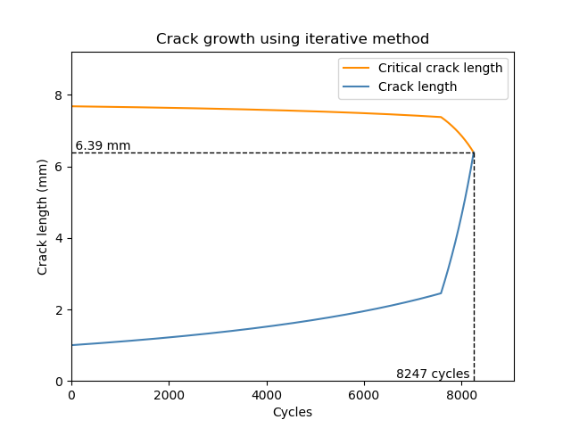

.. image:: images/logo.png

-------------------------------------

Fracture mechanics
''''''''''''''''''

Fracture mechanics is an approach to fatigue analysis that involves calculating the number of cycles until failure of a component that is undergoing cyclic loading. We are generally interested in two values; the number of cycles needed to initiate a crack, and the number of cycles to grow the crack to a certain size (usually the size for brittle fracture to occur). The fracture mechanics functions described below are useful for solving typical fatigue problems given to students. Unfortunately, the limitation of these functions is that they are only applicable to thin plates with through-thickness cracks. As soon as you encounter a component that is not a thin plate, then the formulas required for analysis will be different from those used below. This is part of what makes fracture mechanics such a complex topic that is better handled by purpose-built fatigue analysis software such as `Altair Hyperlife <https://www.altair.com/hyperlife/>`_. Even in the relatively simple thin flat plate geometry, there are many complications that make fracture mechanics a challenging subject. These include variable amplitude loading, surface roughness, frequency effect, environmental effects (temperature, corrosion) and other miscellaneous factors. Solving fracture mechanics problems for flat plates can still provide engineers with an appreciation for how fatigue operates and the factors affecting fatigue so that they can incorporate these lessons learned into their work.

Most textbooks (including Probabilistic Physics of Failure Approach to Reliability (2017) which was used to design the functions below) apply a few simplifications for solving crack growth problems. These simplifications involve an assumption that the stress in the component is constant, that the geometry factor is constant, and that the crack length to cause failure (which has the geometry factor in its formula) is constant. These simplifications are necessary for hand calculations, but in reality we know that they all must change as the crack length grows which necessitates an iterative calculation. Both the simplified and iterative methods are included in the crack growth function. Also included in both functions is the ability to solve these problems for notched components by providing the appropriate correction factors for the notched geometry.

Crack initiation
----------------

The function ``fracture_mechanics_crack_initiation`` uses the material properties, the local cross-sectional area, and force applied to the component to determine how many cycles until crack initiation (of a 1 mm crack). Units should always be in MPa (and mm^2 for area). This function may be used for an un-notched or notched component. If the component is un-notched, the parameters q and Kt may be left as their default values of 1.

While there are formulas to find the parameters q and Kt, these formulas have not been included here so that the function is reasonably generic to different materials and geometries. Resources for finding some of these parameters if they are not given to you:

q = 1/(1+a/r) Where r is the notch radius of curvature (in mm), and a is 0.025*(2070/Su). Su is the ultimate strength in MPa. This only applies to high strength steels where Su>550MPa.

Kt can be found from the `eFatigue website <https://www.efatigue.com/constantamplitude/stressconcentration/>`_ which has an online calculator that will provide you with the appropriate Kt for your notched geometry.

Inputs:

- P - Force applied on the component [units of MPa]
- A - Cross sectional area of the component (at the point of crack initiation) [units of mm^2]
- Sy - Yield strength of the material [units of MPa]
- E - Elastic modulus (Young's modulus) [units of MPa]
- K - Strength coefficient of the material
- n - Strain hardening exponent of the material
- b - Elastic strain exponent of the material
- c - Plastic strain exponent of the material
- sigma_f - Fatigue strength coefficient of the material
- epsilon_f - Fatigue strain coefficient of the material
- q - Notch sensitivity factor. (default is 1 for no notch)
- Kt - stress concentration factor. (default is 1 for no notch)
- mean_stress_correction_method - must be either ‘morrow’, ’modified_morrow’, or ‘SWT'. Default is 'modified_morrow' as this is the same as the uncorrected Coffin-Manson relationship when mean stress is zero.

Outputs:

- The results will be printed to the console if print_results is True
- sigma_max
- sigma_min
- sigma_mean
- epsilon_max
- epsilon_min
- epsilon_mean
- cycles_to_failure

Example 1
---------

In the following example we will provide the function with the appropriate inputs for our problem (taken from Example 2.8 in Probabilistic Physics of Failure Approach to Reliability (2017)). The mean_stress_correction_method is changed to 'SWT' and the results will be printed to the console.

.. code:: python

  from reliability.PoF import fracture_mechanics_crack_initiation
  fracture_mechanics_crack_initiation(P=0.15, A=5*80, Kt=2.41, q=0.9857, Sy=690, E=210000, K=1060, n=0.14, b=-0.081, c=-0.65, sigma_f=1160, epsilon_f=1.1,mean_stress_correction_method='SWT')

  '''
  A crack of 1 mm will be formed after: 2919.91 cycles ( 5839.82 reversals )
  Stresses in the component: Min = -506.7291 MPa , Max = 506.7291 MPa , Mean = -5.684341886080802e-14 MPa.
  Strains in the component: Min = -0.0075 , Max = 0.0075 , Mean = 8.673617379884035e-19
  Mean stress correction method used: SWT
  '''

Crack growth
------------

The function ``fracture_mechanics_crack_growth`` uses the principles of fracture mechanics to find the number of cycles required to grow a crack from an initial length until a final length.
The final length (a_final) may be specified, but if not specified then a_final will be set as the critical crack length (a_crit) which causes failure due to rapid fracture.
This function performs the same calculation using two methods: similified and iterative.
The simplified method assumes that the geometry factor (f(g)), the stress (S_net), and the critical crack length (a_crit) are constant. This method is the way most textbooks show these problems solved as they can be done by hand in a few steps.
The iterative method does not make those assumptions and as a result, the parameters f(g), S_net and a_crit must be recalculated based on the current crack length at every cycle.

This function is applicable only to thin plates with a through thickness edge crack or a centre crack (which is to be specified using the parameter crack_type). You may also use this function for notched components (edge notches only, not centre holes) by specifying the parameters Kt and D which are based on the geometry of the notch. For any notched components, this method assumes the notched component has a "shallow notch" where the notch depth (D) is much less than the plate width (W). The value of Kt for notched components may be found on the `eFatigue website <https://www.efatigue.com/constantamplitude/stressconcentration/>`_. In the case of notched components, the local stress concentration from the notch will often cause slower crack growth. In these cases, the crack length is calculated in two parts (stage 1 and stage 2) which can clearly be seen on the plot using the iterative method (as shown in the example below).

Inputs:

- Kc - fracture toughness
- Kt - stress concentration factor (default is 1 for no notch).
- D - depth of the notch (mm) (default is None for no notch). A notched component is assumed to be doubly-notched (symmetric notches on both sides so that no bending occurs)
- C - material constant (sometimes referred to as A)
- m - material constant (sometimes referred to as n). This value must not be 2.
- P - external load on the material (MPa)
- t - plate thickness (mm)
- W - plate width (mm)
- a_initial - initial crack length (mm) (default is 1 mm)
- a_final - final crack length (mm) - default is None in which case a_final is assumed to be a_crit (length at failure). It is useful to be able to enter a_final in cases where there are different loading regimes over time.
- crack_type - must be either 'edge' or 'center'. Default is 'edge'. The geometry factor used for each of these in the simplified method is f(g) = 1.12 for edge and f(g) = 1.0 for center. The iterative method calculates these values exactly using a_initial and W (plate width).
- print_results - True/False. Default is True
- show_plot - True/False. Default is True.

Outputs:

- If print_results is True, all outputs will be printed with a description of the process.
- If show_plot is True, the crack growth plot will be shown for the iterative method.
- Nf_stage_1_simplified (in the case of single stage calculations this will be zero)
- Nf_stage_2_simplified
- Nf_total_simplified
- final_crack_length_simplified
- transition_length_simplified
- Nf_stage_1_iterative (in the case of single stage calculations this will be zero)
- Nf_stage_2_iterative
- Nf_total_iterative
- final_crack_length_iterative
- transition_length_iterative

Example 2
---------

In the following example, a crack of 1mm is grown to failure. The function determines that the notch (described by Kt and D) causes a local stress concentration which initially slows the propogation of the crack until the crack reaches the transition length. Once past the transition length, the crack grows much faster and results in brittle fracture of the material. This change in crack growth rate is evident on the plot from the iterative method. The reason for the different transition lengths between the simplified and iterative methods is that the simplified method uses 1.12 for the geometry factor whereas the iterative method finds the geometry factor using the local geometry (using W and D).

.. code:: python

  from reliability.PoF import fracture_mechanics_crack_growth
  import matplotlib.pyplot as plt
  fracture_mechanics_crack_growth(Kc=66,C=6.91*10**-12,m=3,P=0.15,W=100,t=5,Kt=2.41,D=10)
  plt.show()

  '''
  SIMPLIFIED METHOD (keeping f(g), S_max, and a_crit as constant):
  Crack growth was found in two stages since the transition length ( 2.08 mm ) due to the notch, was greater than the initial crack length ( 1 mm ).
  Stage 1 (a_initial to transition length): 6802 cycles
  Stage 2 (transition length to a_final): 1133 cycles
  Total cycles to failure: 7935 cycles.
  Critical crack length to cause failure was found to be: 7.86 mm.

  ITERATIVE METHOD (recalculating f(g), S_max, and a_crit for each cycle):
  Crack growth was found in two stages since the transition length ( 2.45 mm ) due to the notch, was greater than the initial crack length ( 1 mm ).
  Stage 1 (a_initial to transition length): 7576 cycles
  Stage 2 (transition length to a_final): 671 cycles
  Total cycles to failure: 8247 cycles.
  Critical crack length to cause failure was found to be: 6.39 mm.
  '''

**References:**

- Probabilistic Physics of Failure Approach to Reliability (2017), by M. Modarres, M. Amiri, and C. Jackson. pp. 37-57
