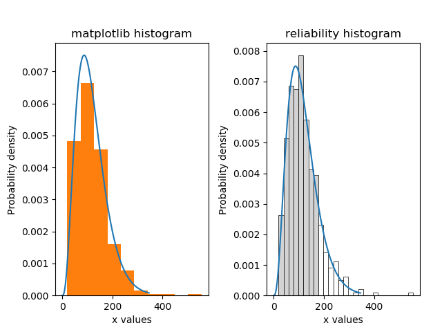

.. image:: images/logo.png

-------------------------------------

Histogram
'''''''''

This function plots a histogram using the matplotlib histogram (plt.hist()), but adds some additional features. Default formatting is improved, the number of bins is optimized by default, and there is an option to shade the bins white above a chosen threshold. If you would like to specify the number of bins rather than having the optimal number calculated, then the bins argument allows this.

Inputs:

-   data - the data to plot. Array or list.
-   white_above - bins above this value will be shaded white
-   bins - array of bin edges or string in ['auto','fd','doane','scott','stone','rice','sturges','sqrt']. Default is 'auto'. See `numpy <https://numpy.org/doc/stable/reference/generated/numpy.histogram_bin_edges.html>`_ for more information on bin edges.
-   density - True/False. Default is True. Always use True if plotting with a probability distribution.
-   cumulative - True/False. Default is False. Use False for PDF and True for CDF.
-   kwargs - plotting kwargs for the histogram (color, alpha, etc.)

The following example shows the difference between the appearance of the default histogram in matplotlib, and the histogram in reliability.

.. code:: python

    from reliability.Distributions import Gamma_Distribution
    from reliability.Fitters import Fit_Gamma_2P
    from reliability.Other_functions import make_right_censored_data, histogram
    import matplotlib.pyplot as plt

    a = 30
    b = 4
    threshold = 180  # this is used when right censoring the data
    dist = Gamma_Distribution(alpha=30, beta=4)
    raw_data = dist.random_samples(500, seed=2)  # create some data. Seeded for repeatability
    data = make_right_censored_data(raw_data, threshold=threshold)  # right censor the data
    gf = Fit_Gamma_2P(failures=data.failures,right_censored=data.right_censored,show_probability_plot=False,print_results=False)
    
    plt.subplot(121)
    gf.distribution.PDF()
    plt.hist(raw_data, density=True) # default histogram from matplotlib
    plt.title('matplotlib histogram')
    
    plt.subplot(122)
    gf.distribution.PDF()
    histogram(raw_data, white_above=threshold) # histogram from reliability - better formatting, optimal bin width by default, white_above option
    plt.title('reliability histogram')
    
    plt.subplots_adjust(right=0.95, wspace=0.38)
    plt.show()

