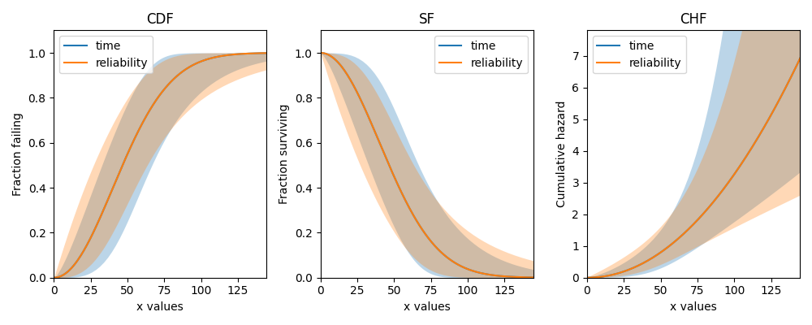

.. image:: images/logo.png

-------------------------------------

How are the confidence intervals calculated
'''''''''''''''''''''''''''''''''''''''''''

There confidence intervals on the model parameters, and confidence intervals on the plots.
The confidence intervals on the plots use the confidence intervals on the model parameters in the procedure that is explained in the second section of this document.
Before reading this document, you should have a reasonable understanding of how `Maximum Likelihood Estimation (MLE) works <https://reliability.readthedocs.io/en/latest/How%20does%20Maximum%20Likelihood%20Estimation%20work.html>`_ and also understand what `partial derivatives <https://www.derivative-calculator.net/>`_ are.

Confidence intervals on the parameters
""""""""""""""""""""""""""""""""""""""

Once the model parameters have been found (whether by Least Squares Estimation or Maximum Likelihood Estimation), we can use these parameters along with the data and the log-likelihood function, to calculate the hessian matrix.
We can use autograd.differential_operators.hessian to calculate the hessian matrix, which is a square matrix of partial derivatives.
The inverse of the hessian matrix gives us the covariance matrix, which contains the numbers we need for finding the confidence intervals.
The covariance matrix is a matrix containing the variance of the parameters along the diagonal, and the covariance of the parameters outside of the diagonal.
The size of the covariance matrix will match the number of parameters.
For the Weibull Distribution (with parameters :math:`\alpha` and :math:`\beta`), the covariance matrix looks like this:

.. math::

    \begin{bmatrix}
    Var(\alpha) & Cov(\alpha,\beta)\\
    Cov(\alpha,\beta) & Var(\beta)
    \end{bmatrix}

To find the confidence intervals on the parameters, we need the parameters, the standard error :math:`\left(\sqrt{variance}\right)`, and the desired confidence interval. For this example, we will use the default of 95% confidence (two sided).
The formulas for the confidence intervals on the parameters have two forms, depending on whether they are strictly positive (like :math:`\alpha` and :math:`\beta` are for the Weibull Distribution) or unbounded (like :math:`\mu` is for the Normal Distribution).

For strictly positive parameters, the formula is:

:math:`X_{lower} = \hat{X} . {\rm e}^{-Z.\frac{\hat{X}_{SE}}{\hat{X}}}`

:math:`X_{upper} = \hat{X} . {\rm e}^{+Z.\frac{\hat{X}_{SE}}{\hat{X}}}`

For unbounded parameters (which can be positive or negative), the formula is:

:math:`X_{lower} = \hat{X} - Z.\hat{X}_{SE}`

:math:`X_{upper} = \hat{X} + Z.\hat{X}_{SE}`

Where:

- Z = Standard Normal Distribution Quantile of :math:`\frac{1 - CI}{2}`. This can be calculated using ``-scipy.stats.norm.ppf((1 - CI) / 2)``. For CI = 0.95, Z = 1.95996. If finding a 1 sided interval, don't divide by 2 in the formula.

- :math:`\hat{X}_{SE}` = The standard error :math:`\left(\sqrt{Var(\hat{X})}\right)`.

- :math:`X_{lower}` = The lower confidence bound on the parameter based on the specified confidence interval (CI). 

- :math:`X_{upper}` = The upper confidence bound on the parameter based on the specified confidence interval (CI).

If you would like to calculate these values yourself, you can check your result with `reliability` like this:

.. code:: python

    from reliability.Fitters import Fit_Weibull_2P
    import scipy.stats as ss
    import numpy as np
    
    CI = 0.8
    data = [43, 81, 41, 44, 52, 99, 64, 25, 41, 7]
    fit = Fit_Weibull_2P(failures=data, CI=CI, show_probability_plot=False, print_results=False)
    
    Z = -ss.norm.ppf((1 - CI) / 2)
    print('Z =', Z)
    print('alpha =',fit.alpha)
    print('alpha_SE =',fit.alpha_SE)
    alpha_upper = fit.alpha * (np.exp(Z * (fit.alpha_SE / fit.alpha)))
    print('alpha_upper from formula =',alpha_upper)
    print('alpha_upper from Fitter =',fit.alpha_upper)

    '''
    Z = 1.2815515655446004
    alpha = 55.842280377094696
    alpha_SE = 9.098820692892856
    alpha_upper from formula = 68.8096875640737
    alpha_upper from Fitter = 68.8096875640737
    '''

There are a few exceptions to the above formulas for confidence intervals on the parameters. For three parameter distributions (such as Weibull_3P), the mathematics somewhat breaks down, requiring a minor modification.
The bounds for :math:`\alpha` and :math:`\beta` are calculated using the Weibull_2P log-likelihood function and the bounds on :math:`\gamma` are calculated using the Weibull_3P log-likelihood function.
This method is used by `reliability` and reliasoft's Weibull++ software.

In the case of the Exponential Distribution, the covariance matrix is a 1 x 1 matrix containing just :math:`Var(\lambda)`.
The upper and lower bounds on :math:`\lambda` are found using the formula above for strictly positive parameters.

Some matrices are non-invertable due to their values. While rare, if it occurs for the hessian matrix, it means that the inverse of the hessian matrix cannot be calculated so the covariance matrix is not able to be obtained.
In such cases, a warning will be printed by `reliability`, the standard errors will be set to 0 and the upper and lower bounds of the parameters will match the parameters.

Confidence intervals on the plots
"""""""""""""""""""""""""""""""""

The confidence intervals on the plots (usually called confidence bounds) are available for the CDF, SF, and CHF. It is not possible to calculate confidence intervals for the PDF or HF.
There are two types of confidence bounds, these are bounds on time (Type I) and bounds on reliability (Type II). Depending on the amount of data, these bounds may be almost the same (for large sample sizes) or quite different (for small sample sizes).
The following example shows the differences in these bounds for the CDF, SF, and CHF.

.. code:: python

    from reliability.Fitters import Fit_Weibull_2P
    import matplotlib.pyplot as plt
    
    data = [43, 81, 41, 44, 52, 99, 64, 25, 41, 7]
    fit = Fit_Weibull_2P(failures=data, show_probability_plot=False, print_results=False)
    
    plt.figure(figsize=(10,4))
    
    plt.subplot(131)
    fit.distribution.CDF(CI_type='time',label='time')
    fit.distribution.CDF(CI_type='reliability',label='reliability')
    plt.title('CDF')
    plt.legend()
    
    plt.subplot(132)
    fit.distribution.SF(CI_type='time',label='time')
    fit.distribution.SF(CI_type='reliability',label='reliability')
    plt.title('SF')
    plt.legend()
    
    plt.subplot(133)
    fit.distribution.CHF(CI_type='time',label='time')
    fit.distribution.CHF(CI_type='reliability',label='reliability')
    plt.title('CHF')
    plt.legend()
    
    plt.tight_layout()
    plt.show()

For larger values of CI (the default is 0.95), the distance between the solid line and the confidence bounds will increase.

Due to the relationship between the CDF, SF, and CHF, we only need to calculate the confidence bounds on the SF and we can use a few simple `transformations <https://reliability.readthedocs.io/en/latest/Equations%20of%20supported%20distributions.html#relationships-between-the-five-functions>`_ to obtain the bounds for the CDF and CHF.

Bounds on time
--------------

The formulas for the confidence bounds on time (T) for the Weibull Distribution can be obtained as follows:

Begin with the equation for the SF: :math:`\qquad R = {\rm e}^{-(\frac{T}{\alpha })^ \beta }`

Linearize the equation: :math:`\qquad ln(-ln(R)) = \beta.(\ln(T)-ln(\alpha))`

Rearrange to make T the subject: :math:`\qquad ln(T) = \frac{1}{\beta}ln(-ln(R))+ln(\alpha)`

Substitute :math:`u = ln(T)`: :math:`\qquad u = \frac{1}{\beta}ln(-ln(R))+ln(\alpha)`

The upper and lower bounds on :math:`u` are:

:math:`u_U = \hat{u} + Z.\sqrt{Var(\hat{u})}`.

:math:`u_L = \hat{u} - Z.\sqrt{Var(\hat{u})}`.

You'll notice that this is the same formula for the bounds on the parameters (when unbounded) provided in the previous section. The formula for Z is also listed in the previous section.

Here's the tricky part. We need to find :math:`Var(\hat{u})`. The formula for this comes from something called the `Delta Method <https://en.wikipedia.org/wiki/Delta_method#Alternative_form>`_ which states that:

:math:`\operatorname{Var} \left(h_r \right) = \sum_i \left( \frac{\partial h_r}{\partial B_i} \right)^2 \operatorname{Var}\left( B_i \right) +  \sum_i \sum_{j \neq i} \left( \frac{ \partial h_r }{ \partial B_i } \right) \left( \frac{ \partial h_r }{ \partial B_j } \right) \operatorname{Cov}\left( B_i, B_j \right)`

Applying this to :math:`u = \frac{1}{\beta}ln(-ln(R))+ln(\alpha)` gives:

.. math::

    \begin{align}
    \operatorname{Var} \left(u \right) & = \left( \frac{\partial u}{\partial \beta} \right)^2 \operatorname{Var}\left( \beta \right)\\
                                       & + \left( \frac{\partial u}{\partial \alpha} \right)^2 \operatorname{Var}\left( \alpha \right)\\
                                       & + 2\left( \frac{ \partial u }{ \partial \beta } \right) \left( \frac{ \partial u }{ \partial \alpha } \right) \operatorname{Cov}\left( \alpha, \beta \right)\\
                                       & = \left( -\frac{1}{\beta^2} ln(-ln(R)) \right)^2 \operatorname{Var}\left( \beta \right)\\
                                       & + \left( \frac{1}{\alpha} \right)^2 \operatorname{Var} \left( \alpha \right)\\
                                       & + 2 \left( -\frac{1}{\beta^2} ln(-ln(R)) \right) \left( \frac{1}{\alpha} \right) \operatorname{Cov} \left( \alpha, \beta \right)\\
                                       & = \frac{1}{\beta^4} \left( ln(-ln(R)) \right)^2 \operatorname{Var}\left( \beta \right)\\
                                       & + \frac{1}{\alpha^2} \operatorname{Var} \left( \alpha \right)\\
                                       & + 2 \left(-\frac{1}{\beta^2} \right) \left(\frac{ln(-ln(R))}{\alpha} \right) \operatorname{Cov} \left(\alpha, \beta \right)
    \end{align}

Since we made the substitution :math:`u = ln(T)`, we can obtain the upper and lower bounds on T using the reverse of this substitution:

:math:`T_U = {\rm e}^{u_U}`

:math:`T_L = {\rm e}^{u_L}`

The result we have produced will accept a value from the SF (a reliability between 0 and 1) and output the corresponding upper and lower times.
It tells us that we can be 95% certain that the system reliability (R) will be reached somewhere between :math:`T_L` and :math:`T_U` (if CI=0.95).

Bounds on reliability
---------------------

Beginning with the linearized equation for the SF: :math:`\qquad ln(-ln(R)) = \beta.(\ln(T)-ln(\alpha))`

We make :math:`R` the subject, which it already is (yay!) so no rearranging needed.

Now substitute :math:`u = ln(-ln(R))`: :math:`\qquad u = \beta.(\ln(T)-ln(\alpha))`

As with the bounds on time, the bounds on reliability in terms of :math:`u` are:

:math:`u_U = \hat{u} + Z.\sqrt{Var(\hat{u})}`.

:math:`u_L = \hat{u} - Z.\sqrt{Var(\hat{u})}`.

This time we have a different formula for :math:`\operatorname{Var} \left(u \right)`. Using the delta method on :math:`u = \beta.(\ln(T)-ln(\alpha))` we can derive the following expression:

.. math::

    \begin{align}
    \operatorname{Var} \left(u \right) & = \left( \frac{\partial u}{\partial \beta} \right)^2 \operatorname{Var}\left( \beta \right)\\
                                       & + \left( \frac{\partial u}{\partial \alpha} \right)^2 \operatorname{Var}\left( \alpha \right)\\
                                       & + 2\left( \frac{ \partial u }{ \partial \beta } \right) \left( \frac{ \partial u }{ \partial \alpha } \right) \operatorname{Cov}\left( \alpha, \beta \right)\\
                                       & = \left(ln(T) - ln(\alpha) \right)^2 \operatorname{Var}\left( \beta \right)\\
                                       & + \left(-\frac{\beta}{\alpha} \right)^2 \operatorname{Var}\left( \alpha \right)\\
                                       & + 2 \left(ln(T)-ln(\alpha) \right) \left(-\frac{\beta}{\alpha} \right) \operatorname{Cov} \left(\alpha, \beta \right)
    \end{align}

Once we have the full expression for :math:`u` we need to make the reverse substitution:

:math:`R_U = {\rm e}^{-{\rm e}}^{u_U}`

:math:`R_L = {\rm e}^{-{\rm e}}^{u_L}`

The result we have produced will accept any time value (T) and will output the bounds on reliability (R) between 0 and 1 at that corresponding time.
It tells us that we can be 95% certain that the reliability of the system lies between :math:`R_L` and :math:`R_U` (if CI=0.95) at the specified time.

How are the confidence bounds calculated using Python
-----------------------------------------------------

The above derivations are tedious and become extremely difficult for more complicated equations (such as the Gamma Distribution).
Within `reliability` the linearized forms of the SF (in terms of time and reliability) are specified, and then the partial derivatives are calculated using autograd.jacobian.
In code (for bounds on time) it looks like this:

.. code:: python

    # weibull SF rearranged for t with v = ln(t)
    def v(R, alpha, beta):
        return (1 / beta) * anp.log(-anp.log(R)) + anp.log(alpha)

    dv_da = jacobian(v, 1)  # derivative w.r.t. alpha
    dv_db = jacobian(v, 2)  # derivative w.r.t. beta

    def var_v(self, u):  # u is reliability
        return (
            dv_da(u, self.alpha, self.beta) ** 2 * self.alpha_SE ** 2
            + dv_db(u, self.alpha, self.beta) ** 2 * self.beta_SE ** 2
            + 2 * dv_da(u, self.alpha, self.beta) * dv_db(u, self.alpha, self.beta) * self.Cov_alpha_beta
        )

     # v is ln(t) and Y is reliability
     v_lower = v(Y, self.alpha, self.beta) - Z * (var_v(self, Y) ** 0.5)
     v_upper = v(Y, self.alpha, self.beta) + Z * (var_v(self, Y) ** 0.5)

     # transform back from v = ln(t)
     t_lower = np.exp(v_lower)
     t_upper = np.exp(v_upper)

There are several other intricacies to getting Python to do this correctly, such as where to incorporate :math:`\gamma` for location shifted distributions, how to distribute the points so they look smooth, how to correct for things (like reversals in the bounds) that are mathematically correct but practically (in the world of reliability engineering) incorrect, and how to correctly transform the bounds on the SF to get the bounds on the CDF or CHF.

More information and formulas are available in the following references from reliawiki:

- `Differences Between Type I (Time) and Type II (Reliability) Confidence Bounds <https://www.weibull.com/hotwire/issue17/relbasics17.htm>`_
- `Confidence Bounds <http://reliawiki.org/index.php/Confidence_Bounds>`_
- `The Weibull Distribution <http://reliawiki.org/index.php/The_Weibull_Distribution#Bounds_on_Reliability_2>`_