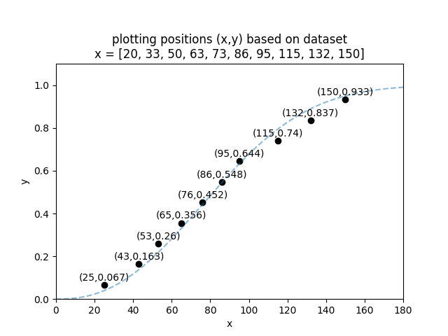
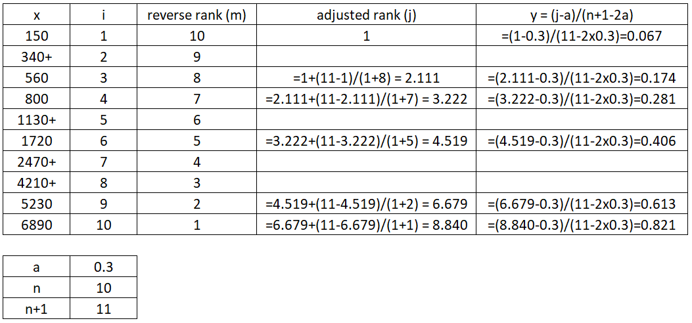
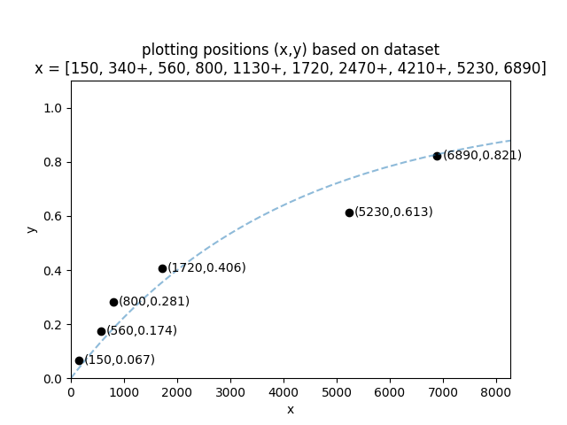
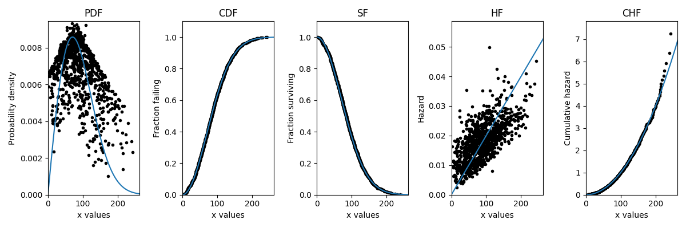

.. image:: images/logo.png

-------------------------------------

How are the plotting positions calculated
'''''''''''''''''''''''''''''''''''''''''

When we want to fit a probability distribution to a dataset (such as failure times), there are a variety of methods we can use.
The most popular of these methods are Least Squares estimation (LS) and Maximum Likelihood Estimation (MLE).
As a prerequisite to Least Squares Estimation, we need an estimate of the CDF (y-values) for a given dataset (x-values).
Once we have both the x-values and the y-values we can plot the points (x,y) on a graph.
These are called the plotting positions.

There are a variety of different algorithms for obtaining the plotting positions, but the most popular is the rank adjustment method which will be described in detail below.
To introduce the algorithm, we will start with complete data (ie. no censoring) and then we will see how the algorithm needs to be modified when we have censored data.

Rank adjustment for complete data
"""""""""""""""""""""""""""""""""

The plotting positions algorithm for complete data is as follows:

1. sort the data in ascending order
2. create a column (i) for the rank from 1 to n.
3. estimate the CDF using :math:`y=\frac{i-a}{n+1-2a}`.

Where "n" is the number of items (len(x)) and "a" is the heuristic constant. For this example we will let a = 0.3 which will give Benard's approximation of the median rank plotting positions (the default in most software). Other heuristics are discussed below.
Something you may notice about the formula for y is that it is independent of x. You will always obtain the same y values for any array of x values of the same length.

Let's do an example using the dataset x = [25, 43, 53, 65, 76, 86, 95, 115, 132, 150]

.. image:: images/plotting_positions_1.PNG

We can now plot the x and y values to obtain the plotting positions as shown in the image below.
The dashed blue line is a Weibull_2P distribution that has been fitted to the data.
This is just for illustrative purposes to show that the empirical CDF (the calculated y-values) and the CDF of the fitted model should roughly align.

Rank adjustment for censored data
"""""""""""""""""""""""""""""""""

The algorithm above provides the rank (i) simply by using the item number (1 to n) when the x-values are sorted.
When we have right censored data, the ranks need to be adjusted using a few modifications to the original algorithm.
The rank adjustment algorithm for right censored data is as follows:

1. sort the data in ascending order
2. create a column (i) for the rank from 1 to n.
3. create a column (m) of the reverse rank from n to 1.
4. calculate the adjusted rank as :math:`j_i = j_{i-1}+\frac{n+1-j_{i-1}}{1+m}`. If the first item is a failure, then the adjusted rank of the first failure is j_1 = 1. If the first item is not a failure, the the adjusted rank of the first failure is :math:`j_1=\frac{\textrm{number of leading censored values}}{n - 1}`. Leave the rows with censored items blank.
5. estimate the CDF using :math:`y=\frac{j-a}{n+1-2a}`.

Let's do an example using the dataset x = [150, 340+, 560, 800, 1130+, 1720, 2470+, 4210+, 5230, 6890]. In this dataset the values with + are right censored.

You can check this using Python like this:

.. code:: python

    from reliability.Probability_plotting import plotting_positions
    failures = [150,560,800,1720,5230,6890]
    right_censored = [340,1130,2470,4210]
    x,y=plotting_positions(failures=failures,right_censored=right_censored)

    print('x =',x)
    print('y =',y)

    '''
    x = [ 150  560  800 1720 5230 6890]
    y = [0.06730769 0.1741453  0.28098291 0.40562678 0.61336657 0.82110636]
    '''

We can now plot the x and y values to obtain the plotting positions as shown in the image below.
The dashed blue line is an Exponential_1P distribution that has been fitted to the data.
This is just for illustrative purposes to show that the empirical CDF (the calculated y-values) and the CDF of the fitted model should roughly align.
Note that only the failures are plotted as the right censored data does not have an empirical estimate for the CDF.

Plotting heuristics
"""""""""""""""""""

The plotting positions alogrithm uses the formula :math:`y=\frac{i-a}{n+1-2a}`.
We can set the heuristic constant "a" to be any value from 0 to 1 and we will get different estimates.
Some of these are better than others, but the most popular is a = 0.3 (Benard's approximation of the median ranks (typically just called "median rank")) as this is generally the most accurate.

Published literature has been produced on the following Heuristics:

+-------------------------------+---------------+
| Method                        | Heuristic (a) |
+===============================+===============+
| Blom                          | 0.375         |
+-------------------------------+---------------+
| Benard (Median)               | 0.3           |
+-------------------------------+---------------+
| Hazen (Modified Kaplan Meier) | 0.5           |
+-------------------------------+---------------+
| Herd-Johnson (Mean)           | 0             |
+-------------------------------+---------------+
| Modal                         | 1             |
+-------------------------------+---------------+
| Beard	                        | 0.31          |
+-------------------------------+---------------+
| Gringorten	                | 0.44          |
+-------------------------------+---------------+
| Larsen	                | 0.567         |
+-------------------------------+---------------+
| One-Third                     | 1/3           |
+-------------------------------+---------------+
| Cunane	                | 0.4           |
+-------------------------------+---------------+

There is another modification to the :math:`y=\frac{i-a}{n+1-2a}` formula to make it :math:`y=\frac{i-a}{n+b}` which allows "b" to be independent of "a".
The Kaplan Meier method uses this formula with a=0 and b=0 (making it :math:`y=\frac{i}{n}`).
The `Filliben estimate <https://en.wikipedia.org/wiki/Q%E2%80%93Q_plot#Filliben's_estimate>`_ also uses this method with further modifications to the first and last items of the CDF.

The formula of :math:`y=\frac{i-a}{n+1-2a}` is not the only way to obtain plotting positions. There are other methods involving `Beta and F distributions <https://www.reliawiki.com/index.php/Parameter_Estimation#Beta_and_F_Distributions_Approach>`_.

Within reliability, the heuristic constant "a" is accepted for all the probability plots as well as in the `Nonparametric.RankAdjustment <https://reliability.readthedocs.io/en/latest/Rank%20Adjustment.html>`_ method. The median ranks method is generally the default for most software (including in Reliasoft and MINITAB).

Transformations for PDF, SF, HF, CHF
""""""""""""""""""""""""""""""""""""

The algorithms described above provide the empirical estimate of the CDF.
With some simple `transformations <https://reliability.readthedocs.io/en/latest/Equations%20of%20supported%20distributions.html#relationships-between-the-five-functions>`_ it is possible to obtain the empirical estimate of the SF and CHF.
Less commonly (but still mathematically possible) we can obtain the empirical estimate of the PDF and HF.
As you can see in the image below, the PDF and HF do not form smooth curves due to the need to take the derivative of a non-continuous function.
The following example illustrates how plot_points can be used to generate a scatterplot of the plotting positions for any of the five functions.
The Weibull distribution used to generate the data is also overlayed for comparison.

.. code:: python

    from reliability.Distributions import Weibull_Distribution
    from reliability.Probability_plotting import plot_points
    import matplotlib.pyplot as plt
    
    dist = Weibull_Distribution(alpha=100,beta=2)
    data = dist.random_samples(1000,seed=1)
    
    functions = ['PDF','CDF','SF','HF','CHF']
    i = 0
    for function in functions:
        plt.subplot(151+i)
        if function == 'PDF':
            dist.PDF()
        elif function == 'CDF':
            dist.CDF()
        elif function == 'SF':
            dist.SF()
        elif function == 'HF':
            dist.HF()
        elif function == 'CHF':
            dist.CHF()
        plot_points(failures=data,func=function)
        plt.title(function)
        i+=1
    plt.gcf().set_size_inches(12,4)
    plt.tight_layout()
    plt.show()

If you find any errors, think this needs to be explained better, or have any suggestions for improvements, please email me (alpha.reliability@gmail.com).
