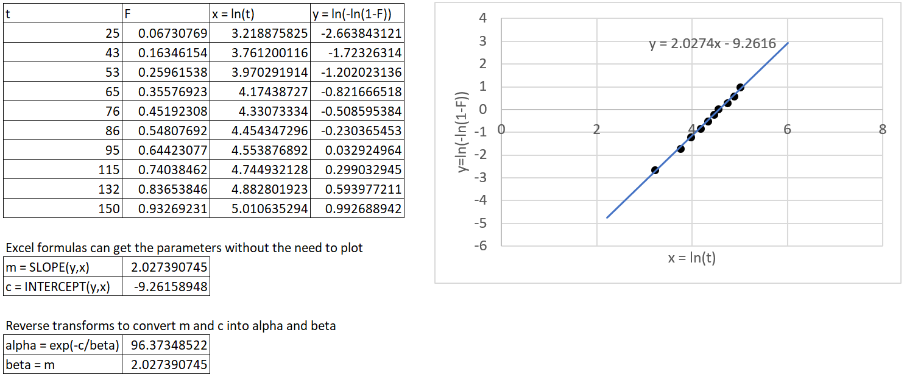
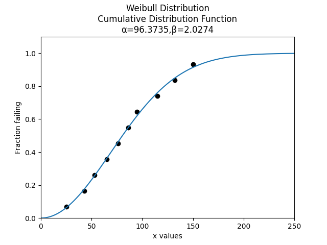
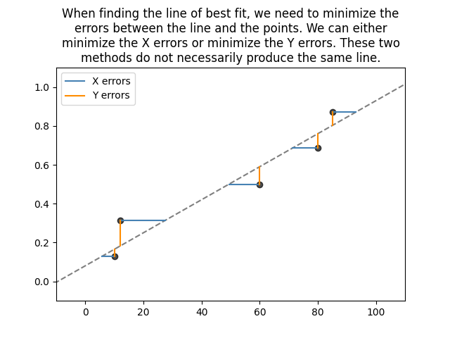
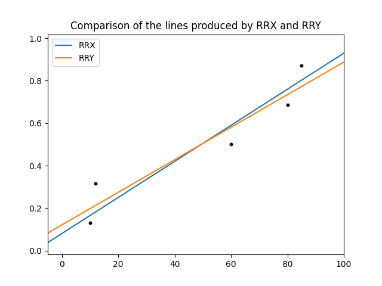
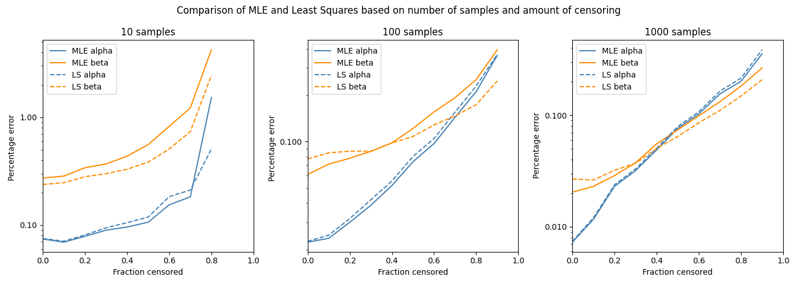

.. image:: images/logo.png

-------------------------------------

How does Least Squares Estimation work
''''''''''''''''''''''''''''''''''''''

Least Squares Estimation is a method of fitting a probability distribution to a set of data.
It works by transforming the CDF (by linearizing the equation) and then using least squares estimation to find the parameters of the line of best fit for the linearized data.
We then perform the reverse transform (un-linearizing the linearized CDF) to obtain the parameters of the probability distribution which we were interested in fitting.

Least Squares Estimation (henceforth referred to as Least Squares) is also known as the method of probability plotting because we can either transform the data or transform the plot in order to get a straight line.
Transforming the plot results in a probability plot, hence the name "method of probability plotting".
There is not really any plotting necessary as it can all be done with equations, but when plotted the equations provide an excellent visual illustration of the process.

In addition to Least Squares, there are several other methods to obtain the parameters of a probability distribution including Maximum Likelihood Estimation (MLE), Method of Moments, Mean Square Error, and Maximum Product of Spacings Estimation.
The most popular methods are Least Squares and MLE which are both implemented in `reliability`.
Users seeking to use the other methods listed will find them as part of the `Surpyval <https://surpyval.readthedocs.io/en/latest/Parametric%20Estimation.html>`_ library.

The least squares algorithm
"""""""""""""""""""""""""""

We can either transform the data (using the same transform required to linearize the CDF) or we can transform the plot (into a probability plot).
The probability plotting method involves special `probability paper <https://www.weibull.com/GPaper/>`_, the line of best fit is typically done by hand, and the process of extracting the parameters is very rough.
Many decades ago, when computers were not readily available, the probability plotting method was the most popular way to estimate distribution parameters.
All probability plots that software presents to you are done by transforming the data and displaying the result on the probability plot.
The explainations that follow all involve transformation of the data and examples with Excel and Python to find the line of best fit.

The least squares algorithm is as follows:

1. Obtain the plotting positions (y-values) for a given dataset (x-values).
2. Transform the x and y plotting positions based on the transformations necessary to linearize the CDF (described below).
3. Use simple linear regression to fit a line (see the section below on RRX and RRY) and extract the parameters of the line.
4. Convert the parameters of the fitted line to the parameters of the probability distribution using the inverse transform for the CDF (the reverse of step 2).

This algorithm is best explained with an example. For this example we will use least squares estimation to fit a Weibull Distribution to the following dataset x = [25, 43, 53, 65, 76, 86, 95, 115, 132, 150].
We firstly need the plotting positions. In Python this is done as:

.. code:: python
    
    from reliability.Probability_plotting import plotting_positions
    data = [25, 43, 53, 65, 76, 86, 95, 115, 132, 150]
    t,F = plotting_positions(failures=data)
    print('t =',t)
    print('F =',F)
    
    '''
    t = [ 25.  43.  53.  65.  76.  86.  95. 115. 132. 150.]
    F = [0.06730769 0.16346154 0.25961538 0.35576923 0.45192308 0.54807692 0.64423077 0.74038462 0.83653846 0.93269231]
    '''

We now need to find the transforms required to linearize the CDF.

:math:`F=1-exp\left(-\left(\frac{t}{\alpha}\right)^\beta\right)`

:math:`-ln(1-F)=\left(\frac{t}{\alpha}\right)^\beta`

:math:`ln(-ln(1-F))=\beta.ln(t)-\beta.ln(\alpha)`

The above equation takes the form :math:`y = m.x+c`. So the transforms for x and y are:

:math:`x = ln(t)`

:math:`y = ln(-ln(1-F))`

Once we fit the straight line to the transformed data, we will need the reverse transforms:

:math:`\beta = m`

:math:`c = -\beta.ln(\alpha)` which becomes :math:`\alpha=exp\left(-\frac{c}{\beta}\right)`

The table below shows the transformed data (from t and F into x and y) and a plot in Excel with the line of best fit.
It also shows alpha and beta which are obtained using the reverse transforms described above.

Here's how to do the same thing in Python, using numpy.polyfit for the line of best fit.

.. code:: python

    from reliability.Probability_plotting import plotting_positions
    import numpy as np
    
    data = [25, 43, 53, 65, 76, 86, 95, 115, 132, 150]
    
    # plotting positions
    t,F = plotting_positions(failures=data)
    print('t =',t)
    print('F =',F)
    
    # forward transform
    x = np.log(t)
    y = np.log(-np.log(1-F))
    m, c = np.polyfit(x, y, 1)
    print('m =',m)
    print('c =',c)
    
    # reverse transform
    beta = m
    alpha = np.exp(-c/beta)
    print('alpha =',alpha)
    print('beta =',beta)

    '''
    t = [ 25.  43.  53.  65.  76.  86.  95. 115. 132. 150.]
    F = [0.06730769 0.16346154 0.25961538 0.35576923 0.45192308 0.54807692 0.64423077 0.74038462 0.83653846 0.93269231]
    m = 2.02739072618974
    c = -9.261589398516517
    alpha = 96.37348533880761
    beta = 2.02739072618974
    '''

Let's plot the Weibull Distribution that we have fitted alongside the data.

.. code:: python

    from reliability.Distributions import Weibull_Distribution
    from reliability.Probability_plotting import plot_points
    import matplotlib.pyplot as plt
    
    data = [25, 43, 53, 65, 76, 86, 95, 115, 132, 150]
    alpha = 96.37348533880761
    beta = 2.02739072618974
    
    plot_points(failures=data,marker='o')
    Weibull_Distribution(alpha=alpha,beta=beta).CDF()
    plt.show()

If you have right censored data, the only thing that will change will be the plotting positions.
If you use different software to find the parameters of the line of best fit, the results may differ slightly.
This is because finding the line of best fit involves an optimizer and different optimizers work differently.
The RRX and RRY difference (discussed below) will also cause discrepancies in the results if each of the software packages you are using do not use the same approach.

RRX and RRY
"""""""""""

Least squares is sometimes known as Rank Regression on X (RRX) or Rank Regression on Y (RRY).
These two names are simply the two possible ways of fitting a line to the data.
We can minimize the sum of the squared errors on X or we can minimize the sum of the squared errors on Y as shown below.

You might think that it doesn't matter, but these two methods can give very different results, particularly if there is a small dataset.
Most software (including MINITAB, Excel and numpy) use RRY. Reliasoft's Weibull++ gives the options for RRX or RRY, as does `reliability` in all of the fitters.

To illustrate the difference between RRX and RRY we can use one of the functions inside reliability.Utils which accepts RRX_or_RRY as an argument.

.. code:: python

    from reliability.Probability_plotting import plotting_positions
    from reliability.Utils import linear_regression
    import matplotlib.pyplot as plt
    
    data = [10,12,60,80,85]
    t,F = plotting_positions(failures=data)
    
    RRX_m, RRX_c = linear_regression(x=t,y=F,RRX_or_RRY="RRX",show_plot=True,label='RRX')
    RRY_m, RRY_c = linear_regression(x=t,y=F,RRX_or_RRY="RRY",show_plot=True,label='RRY')
    plt.legend()
    plt.title('Comparison of the lines produced by RRX and RRY')
    plt.show()

Non-linear least squares
""""""""""""""""""""""""

In the first example above, the CDF of the Weibull Distribution was able to be linearized without too much trouble into the form y=m.x+c.
Some distributions cannot be linearized. These include 3 parameter distributions (such as Weibull_3P) and distributions involving special functions (such as the Gamma and Beta Distributions).
I encourage you to try this yourself using the equations for the CDF available `here <https://reliability.readthedocs.io/en/latest/Equations%20of%20supported%20distributions.html>`_.
The Normal (and Lognormal) distributions can be linearized quite easily because there is an algorithm to compute the Normal CDF :math:`(\Phi)` as well as its inverse :math:`(\Phi^{-1})`.

When the equation of the CDF cannot be linearized, we can use non-linear least squares (NLLS).
The NLLS algorithm still seeks to minimize the sum of the square errors (usually the errors on Y), but it does not use the linear regression formula and can therefore work on any function.
You can see this in action inside Excel when you chose a higher order polynomial for the line of best fit.
To achieve this complicated fitting process, `reliability` calls `scipy.optimize.curve_fit <https://docs.scipy.org/doc/scipy/reference/generated/scipy.optimize.curve_fit.html>`_ to find the parameters of the distribution directly.
There is no forward and reverse transform required, just the appropriate setup of scipy's curve_fit.
The hardest part (and one possible source of failure) is obtaining a reasonable initial guess for the optimizer to begin.
There are several different ways in which `relibility` obtains an initial guess, depending on the function being fitted.

Is MLE better than Least Squares
""""""""""""""""""""""""""""""""

Sometimes yes, but sometimes no. It really depends on the distribution, the amount of data, and the amount of censoring.
Least squares is computationally easier so it was invented first and remains popular today as it is easier for students to learn and can be faster for computers if doing a lot of calculations.
MLE is the default method for most reliability engineering software including Weibull++, MINITAB, `reliability`, and many others.
For most cases, MLE is generally regarded as more accurate.

The best way to check whether MLE or Least squares is more accurate is through a Monte-Carlo simulation.
In the following code, we will draw some random parameters (alpha and beta) to create a Weibull Distribution.
In this simulation alpha is between 1 and 1000, while beta is between 0.5 and 10.
We will then draw some random data from the Weibull distribution. This is done 3 times (10 samples, 100 samples, 1000 samples).
We will right censor a fraction of the data (from 0 (no censoring) to 0.9 (90% censored)).
Then we will fit a distribution to the random data using MLE and LS.
The percentage error in the parameters (alpha and beta) is calculated and plotted.
The following code performs this simulation 1000 times for each fraction censored.
The code took about 45 minutes to run as it is fitting around 60K distributions (1000 trials x 10 fraction censored increments x 2 methods (MLE and LS) x 3 groups of samples).

.. code:: python

    import numpy as np
    from reliability.Distributions import Weibull_Distribution
    from reliability.Fitters import Fit_Weibull_2P
    from tqdm import tqdm
    from reliability.Other_functions import make_right_censored_data
    import matplotlib.pyplot as plt
    from matplotlib.ticker import ScalarFormatter
    
    def MLE_or_LS(trials,number_of_samples):
    
        fraction_censored = [0,0.1,0.2,0.3,0.4,0.5,0.6,0.7,0.8,0.9]
    
        MLE_alpha_error_mean_array = []
        MLE_beta_error_mean_array = []
        LS_alpha_error_mean_array = []
        LS_beta_error_mean_array = []
    
        for frac in tqdm(fraction_censored):
    
            MLE_alpha_error_array = []
            MLE_beta_error_array = []
            LS_alpha_error_array = []
            LS_beta_error_array = []
            for trial in range(trials):
                alpha = (np.random.randint(1,1000,1)+np.random.rand())[0] # alpha between 1 and 1000
                beta = (np.random.randint(50,900,1)/100+np.random.rand())[0] # beta between 0.5 and 10
                true_dist = Weibull_Distribution(alpha=alpha,beta=beta)
                raw_samples = true_dist.random_samples(number_of_samples=number_of_samples)
                samples = make_right_censored_data(data=raw_samples,fraction_censored=frac)
    
                if len(np.unique(samples.failures))>1:
                    MLE = Fit_Weibull_2P(failures=samples.failures,right_censored=samples.right_censored,show_probability_plot=False,print_results=False,method='MLE')
                    MLE_alpha = MLE.distribution.alpha
                    MLE_beta = MLE.distribution.beta
                    MLE_alpha_error_array.append(abs(alpha-MLE_alpha)/alpha)
                    MLE_beta_error_array.append(abs(beta-MLE_beta)/beta)
    
                    LS = Fit_Weibull_2P(failures=samples.failures,right_censored=samples.right_censored,show_probability_plot=False,print_results=False,method='LS')
                    LS_alpha = LS.distribution.alpha
                    LS_beta = LS.distribution.beta
                    LS_alpha_error_array.append(abs(alpha-LS_alpha)/alpha)
                    LS_beta_error_array.append(abs(beta-LS_beta)/beta)
    
            MLE_alpha_error_mean_array.append(np.average(MLE_alpha_error_array))
            MLE_beta_error_mean_array.append(np.average(MLE_beta_error_array))
            LS_alpha_error_mean_array.append(np.average(LS_alpha_error_array))
            LS_beta_error_mean_array.append(np.average(LS_beta_error_array))
    
    
        plt.plot(fraction_censored,MLE_alpha_error_mean_array,label='MLE alpha',color='steelblue')
        plt.plot(fraction_censored,MLE_beta_error_mean_array,label='MLE beta',color='darkorange')
        plt.plot(fraction_censored,LS_alpha_error_mean_array,label='LS alpha',color='steelblue',linestyle='--')
        plt.plot(fraction_censored,LS_beta_error_mean_array,label='LS beta',color='darkorange',linestyle='--')
        plt.yscale('log')
        plt.xlim(0,1)
        plt.gca().yaxis.set_major_formatter(ScalarFormatter())
        plt.legend()
        plt.xlabel('Fraction censored')
        plt.ylabel('Percentage error')
    
    trials = 10
    plt.figure(figsize=(14,5))
    plt.subplot(131)
    MLE_or_LS(trials=trials, number_of_samples=10)
    plt.title('10 samples')
    
    plt.subplot(132)
    MLE_or_LS(trials=trials, number_of_samples=100)
    plt.title('100 samples')
    
    plt.subplot(133)
    MLE_or_LS(trials=trials, number_of_samples=1000)
    plt.title('1000 samples')
    plt.suptitle('Comparison of MLE and Least Squares based on number of samples and amount of censoring')
    plt.tight_layout()
    plt.show()

The y-axis is a log plot of the percentage error, so where you see 1 that means it is 100% in error (eg. correct value of 2, predicted value of 4).
The fraction censored ranges from 0 to 0.9, except for the 10 sample case as a minimum of 2 samples are needed to fit the distribution making 0.8 the maximum possible fraction censored.
From the above plots we can see a few things:

- The percentage error in beta is much higher than the percentage error in alpha for smaller sample sizes, but about the same for large sample sizes.
- Both MLE and LS perform very similarly in terms of their percentage error.
- Least squares is generally better than MLE for small sample sizes, while MLE is generally better than Least squares for large sample sizes.
- MLE tends to have more error in the beta parameter than Least squares, and less error in the alpha parameter than least squares. A correction method exists for this, though it is not currently implemented in `reliability`.

The trends we see in the above plot may differ if we chose another distribution, different ranges for the parameters, or different numbers of samples.

If you find any errors, think this needs to be explained better, or have any suggestions for improvements, please email me (alpha.reliability@gmail.com).
