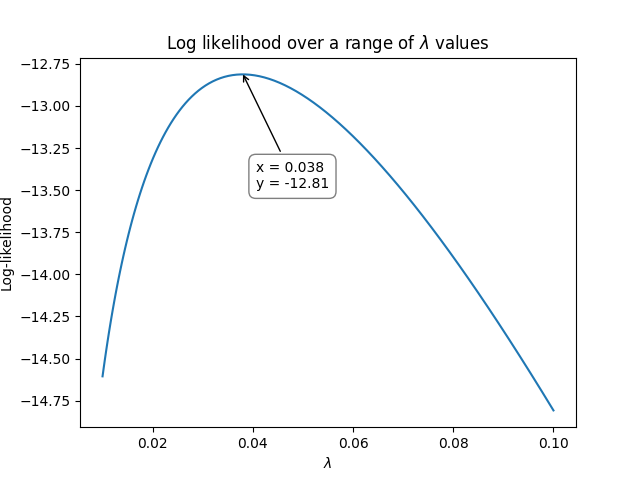

.. image:: images/logo.png

-------------------------------------

How does Maximum Likelihood Estimation work
'''''''''''''''''''''''''''''''''''''''''''

Maximum Likelihood Estimation (MLE) is a method of estimating the parameters of a model using a set of data.
While MLE can be applied to many different types of models, this article will explain how MLE is used to fit the parameters of a probability distribution for a given set of failure and right censored data.

MLE works by calculating the probability of occurrence for each data point (we call this the likelihood) for a model with a given set of parameters.
These probabilities are summed for all the data points.
We then use an optimizer to change the parameters of the model in order to maximise the sum of the probabilities.
This is easiest to understand with an example which is provided below.

There are two major challenges with MLE. These are the need to use an optimizer (making hand calculations almost impossible for distributions with more than one parameter), and the need for a relatively accurate initial guess for the optimizer.
The initial guess for MLE is typically provided using `Least Squares Estimation <https://reliability.readthedocs.io/en/latest/How%20does%20Least%20Squares%20Estimation%20work.html>`_.
A variety of `optimizers <https://reliability.readthedocs.io/en/latest/Optimizers.html>`_ are suitable for MLE, though some may perform better than others so trying a few is sometimes the best approach.

There are several advantages of MLE which make it the standard method for fitting probability distributions in most software.
These are that MLE does not need the equation to be linearizable (which is needed in Least Squares Estimation) so any equation can be modeled.
The other advantage of MLE is that unlike Least Squares Estimation which uses the plotting positions and does not directly use the right censored data, MLE uses the failure data and right censored data directly, making it more suitable for heavily censored datasets.

The MLE algorithm
"""""""""""""""""

The MLE algorithm is as follows:

1. Obtain an initial guess for the model parameters (typically done using least squares estimation).
2. Calculate the probability of occurrence of each data point (f(t) for failures, R(t) for right censored, F(t) for left censored).
3. Multiply the probabilities (or sum their logarithms which is much more computationally efficient).
4. Use an optimizer to change the model parameters and repeat steps 2 and 3 until the total probability is maximized.

As mentioned in step 2, different types of data need to be handled differently:

+------------------------+-----------------------------------------------------------------+
| Type of observation    | Likelihood function                                             |
+========================+=================================================================+
| Failure data           | :math:`L_i(\theta|t_i)=f(t_i|\theta)`                           |
+------------------------+-----------------------------------------------------------------+
| Right censored data    | :math:`L_i(\theta|t_i)=R(t_i|\theta)`                           |
+------------------------+-----------------------------------------------------------------+
| Left censored data     | :math:`L_i(\theta|t_i)=F(t_i|\theta)`                           |
+------------------------+-----------------------------------------------------------------+
| Interval censored data | :math:`L_i(\theta|t_i)=F(t_i^{RI}|\theta) - F(t_i^{LI}|\theta)` |
+------------------------+-----------------------------------------------------------------+

In words, the first equation above means "the likelihood of the parameters (:math:`\theta`) given the data (:math:`t_i`) is equal to the probability of failure (:math:`f(t)`) evaluated at each time :math:`t_i` with that given set of parameters (:math:`\theta`)".
The equations for the PDF (:math:`f(t)`), CDF (:math:`F(t)`), and SF (:math:`R(t)`) for each distribution is provided `here <https://reliability.readthedocs.io/en/latest/Equations%20of%20supported%20distributions.html>`_. 

Once we have the likelihood (:math:`L_i` ) for each data point, we need to combine them. This is done by multiplying them together (think of this as an AND condition).
If we just had failures and right censored data then the equation would be:

:math:`L(\theta|D) = \prod_{i=1}^{n} f_i(t_i^{\textrm{failures}}|\theta) \times R_i(t_i^{\textrm{right censored}}|\theta)`

In words this means that "the likelihood of the parameters of the model (:math:`\theta`) given the data (D) is equal to the product of the values of the PDF (:math:`f(t)`) with the given set of parameters (:math:`\theta`) evaluated at each failure (:math:`t_i^{\textrm{failures}}`), multiplied by the product of the values of the SF (:math:`R(t)`) with the given set of parameters (:math:`\theta`) evaluated at each right censored value (:math:`t_i^{\textrm{right censored}}`)".

Since probabilities are between 0 and 1, multiplying many of these results in a very small number.
A loss precision occurs because computers can only store so many decimals. Multiplication is also slower than addition for computers.
To overcome this problem, we can use a logarithm rule to add the log-likelihoods rather than multiply the likelihoods.
We just need to take the log of the likelihood function (the PDF for failure data and the SF for right censored data), evaluate the probability, and sum the values.
The parameters that will maximize the log-likelihood function are the same parameters that will maximize the likelihood function.

An example using the Exponential Distribution
"""""""""""""""""""""""""""""""""""""""""""""

Let's say we have some failure times: t = [27, 64, 3, 18, 8]

We need an initial estimate for time model parameter (:math:`\lambda`) which we would typically get using Least Squares Estimation. For this example, lets start with 0.1 as our first guess for :math:`\lambda`.

For each of these values, we need to calculate the value of the PDF (with the given value of :math:`\lambda`).

Exponential PDF:     :math:`f(t) = \lambda {\rm e}^{-\lambda t}`

Exponential Log-PDF: :math:`ln(f(t)) = ln(\lambda)-\lambda t`

Now we substitute in :math:`\lambda=0.1` and :math:`t = [27, 64, 3, 18, 8]`

.. math::

    \begin{align}
    & L(\lambda=0.1|t=[27, 64, 3, 18, 8]) = \\
    & \qquad (ln(0.1)-0.1 \times 27) + (ln(0.1)-0.1 \times 64) + (ln(0.1)-0.1 \times 3)\\
    & \qquad + (ln(0.1)-0.1 \times 18) + (ln(0.1)-0.1 \times 8)\\
    & = -23.512925
    \end{align}

Here's where the optimization part comes in. We need to vary :math:`\lambda` until we maximize the log-likelihood.
The following graph shows how the log-likelihood varies as :math:`\lambda` varies.

.. image:: images/LL_range.png

This was produced using the following Python code:

.. code:: python

    import matplotlib.pyplot as plt
    import numpy as np
    
    data = np.array([27, 64, 3, 18, 8])
    
    lambda_array = np.geomspace(0.01, 0.1, 100)
    LL = []
    for L in lambda_array:
        loglik = np.log(L)-L*data
        LL.append(loglik.sum())
    
    plt.plot(lambda_array, LL)
    plt.xlabel('$\lambda$')
    plt.ylabel('Log-likelihood')
    plt.title('Log likelihood over a range of $\lambda$ values')
    plt.show()

The optimization process can be done in Python (using `scipy.optimize.minimize <https://docs.scipy.org/doc/scipy/reference/generated/scipy.optimize.minimize.html>`_) or in Excel (using `Solver <https://www.wikihow.com/Use-Solver-in-Microsoft-Excel>`_), or a variety of other software packages.
Optimization becomes a bit more complicated when there are two or more parameters that need to be optimized simultaneously (such as in a Weibull Distribution).

So, using the above method, we see that the maximum for the log-likelihood occurred when :math:`\lambda` was around 0.041 at a log-likelihood of -20.89.
We can check the value using `reliability` as shown below which achieves an answer of :math:`\lambda = 0.0416667` at a log-likelihood of -20.8903:

.. code:: python

    from reliability.Fitters import Fit_Exponential_1P

    data = [27, 64, 3, 18, 8]
    Fit_Exponential_1P(failures=data,show_probability_plot=False)

    '''
    Results from Fit_Exponential_1P (95% CI):
    Analysis method: Maximum Likelihood Estimation (MLE)
    Optimizer: TNC
    Failures / Right censored: 5/0 (0% right censored) 
    
    Parameter  Point Estimate  Standard Error  Lower CI  Upper CI
       Lambda       0.0416667       0.0186339 0.0173428  0.100105
     1/Lambda              24         10.7331   9.98947   57.6607 
    
    Goodness of fit    Value
     Log-likelihood -20.8903
               AICc  45.1139
                BIC    43.39
                 AD  2.43793 
    '''

Another example using the Exponential Distribution with censored data
"""""""""""""""""""""""""""""""""""""""""""""""""""""""""""""""""""""

Lets use a new dataset that includes both failures and right censored values.

failures = [17, 5, 12] and right_censored = [20, 25]

Once again, we need an initial estimate for the model parameters, and for that we would typically use Least Squares Estimation.
For the purposes of this example, we will again use an initial guess of :math:`\lambda = 0.1`.

For each of the failures, we need to calculate the value of the PDF, and for each of the right censored values, we need to calculate the value of the SF (with the given value of :math:`\lambda`).

Exponential PDF:     :math:`f(t) = \lambda {\rm e}^{-\lambda t}`

Exponential Log-PDF: :math:`ln(f(t)) = ln(\lambda)-\lambda t`

Exponential SF:     :math:`R(t) = {\rm e}^{-\lambda t}`

Exponential Log-SF: :math:`ln(R(t)) = -\lambda t`

Now we substitute in :math:`\lambda=0.1`, :math:`t_{\textrm{failures}} = [17, 5, 12]`, and :math:`t_{\textrm{right censored}} = [20, 25]`.

.. math::

    \begin{align}
    & L(\lambda=0.1|t_{\textrm{failures}}=[17,5,12] {\textrm{ and }}t_{\textrm{right censored}}=[20, 25]) = \\
    & \qquad (ln(0.1)-0.1 \times 17) + (ln(0.1)-0.1 \times 5) + (ln(0.1)-0.1 \times 12)\\
    & \qquad + (-0.1 \times 20) + (-0.1 \times 25)\\
    & = -14.8077528
    \end{align}

Note that the last two terms are the right censored values. Their contribution to the log-likelihood is added in the same way that the contribution from each of the failures is added, except that right censored values use the the log-SF.

As with the previous example, we again need to use optimization to vary :math:`\lambda` until we maximize the log-likelihood.
The following graph shows how the log-likelihood varies as :math:`\lambda` varies.

This was produced using the following Python code:

.. code:: python

    import matplotlib.pyplot as plt
    import numpy as np
    
    failures = np.array([17,5,12])
    right_censored = np.array([20, 25])
    
    lambda_array = np.geomspace(0.01, 0.1, 100)
    LL = []
    for L in lambda_array:
        loglik_failures = np.log(L)-L*failures
        loglik_right_censored =  -L*right_censored
        LL.append(loglik_failures.sum() + loglik_right_censored.sum())
    
    plt.plot(lambda_array, LL)
    plt.xlabel('$\lambda$')
    plt.ylabel('Log-likelihood')
    plt.title('Log likelihood over a range of $\lambda$ values')
    plt.show()

So, using the above method, we see that the maximum for the log-likelihood occurred when :math:`\lambda` was around 0.038 at a log-likelihood of -12.81.
We can check the value using `reliability` as shown below which achieves an answer of :math:`\lambda = 0.0379747` at a log-likelihood of -12.8125:

.. code:: python

    from reliability.Fitters import Fit_Exponential_1P

    failures = [17,5,12]
    right_censored = [20, 25]
    Fit_Exponential_1P(failures=failures, right_censored=right_censored, show_probability_plot=False)

    '''
    Results from Fit_Exponential_1P (95% CI):
    Analysis method: Maximum Likelihood Estimation (MLE)
    Optimizer: TNC
    Failures / Right censored: 3/2 (40% right censored) 
    
    Parameter  Point Estimate  Standard Error  Lower CI  Upper CI
       Lambda       0.0379747       0.0219247 0.0122476  0.117743
     1/Lambda         26.3333         15.2036   8.49306   81.6483 
    
    Goodness of fit    Value
     Log-likelihood -12.8125
               AICc  28.9583
                BIC  27.2345
                 AD  19.3533 
    '''

An example using the Weibull Distribution
"""""""""""""""""""""""""""""""""""""""""

Because it requires optimization, MLE is only practical using software if there is more than one parameter in the distribution.
The rest of the process is the same, but instead of the likelihood plot (the curves shown above) being a line, for 2 parameters it would be a surface, as shown in the example below.

We'll use the same dataset as in the previous example with failures = [17,5,12] and right_censored = [20, 25].

We also need an estimate for the parameters of the Weibull Distribution. We will use :math:`\alpha=15` and :math:`\beta=2`

For each of the failures, we need to calculate the value of the PDF, and for each of the right censored values, we need to calculate the value of the SF (with the given value of :math:`\lambda`).

Weibull PDF:     :math:`f(t) = \frac{\beta}{\alpha}\left(\frac{t}{\alpha}\right)^{(\beta-1)}{\rm e}^{-(\frac{t}{\alpha })^ \beta }`

Weibull Log-PDF: :math:`ln(f(t)) = ln\left(\frac{\beta}{\alpha}\right)+(\beta-1).ln\left(\frac{t}{\alpha}\right)-(\frac{t}{\alpha })^ \beta`

Weibull SF:     :math:`R(t) = {\rm e}^{-(\frac{t}{\alpha })^ \beta }`

Weibull Log-SF: :math:`ln(R(t)) = -(\frac{t}{\alpha })^ \beta`

Now we substitute in :math:`\alpha=15`, :math:`\beta=2`, :math:`t_{\textrm{failures}} = [17, 5, 12]`, and :math:`t_{\textrm{right censored}} = [20, 25]` to the log-PDF and log-SF.

.. math::

    \begin{align}
    & L(\alpha=15,\beta=2|t_{\textrm{failures}}=[17,5,12] {\textrm{ and }}t_{\textrm{right censored}}=[20, 25]) = \\
    & \qquad ln\left(\frac{2}{15}\right)+(2-1).ln\left(\frac{17}{15}\right)-\left(\frac{17}{15}\right)^2\\
    & \qquad + ln\left(\frac{2}{15}\right)+(2-1).ln\left(\frac{5}{15}\right)-\left(\frac{5}{15}\right)^2\\
    & \qquad + ln\left(\frac{2}{15}\right)+(2-1).ln\left(\frac{12}{15}\right)-\left(\frac{12}{15}\right)^2\\
    & \qquad + \left(-\left(\frac{20}{15}\right)^2\right)\\
    & \qquad + \left(-\left(\frac{25}{15}\right)^2\right)\\
    & = -13.8324
    \end{align}

As with the previous example, we again need to use optimization to vary :math:`\alpha` and :math:`\beta` until we maximize the log-likelihood.
The following 3D surface plot shows how the log-likelihood varies as :math:`\alpha` and :math:`\beta` are varied. The maximum log-likelihood is shown as a scatter point on the plot.

.. image:: images/LL_range3.png

This was produced using the following Python code:

.. code:: python

    import matplotlib.pyplot as plt
    from mpl_toolkits.mplot3d import Axes3D
    import numpy as np
    
    
    failures = np.array([17,5,12])
    right_censored = np.array([20, 25])
    
    points = 50
    alpha_array = np.linspace(15, 45, points)
    beta_array = np.linspace(0.8,3,points)
    
    A,B = np.meshgrid(alpha_array, beta_array)
    
    LL = np.empty((len(alpha_array),len(beta_array)))
    for i, alpha in enumerate(alpha_array):
        for j, beta in enumerate(beta_array):
            loglik_failures = np.log(beta/alpha)+(beta-1)*np.log(failures/alpha)-(failures/alpha)**beta
            loglik_right_censored = -(right_censored/alpha)**beta
            LL[i][j] = loglik_failures.sum()+loglik_right_censored.sum()
    
    LL_max = LL.max()
    idx = np.where(LL==LL_max)
    alpha_fit = alpha_array[idx[0]][0]
    beta_fit = beta_array[idx[1]][0]
    
    fig = plt.figure()
    ax = fig.add_subplot(111, projection='3d')
    ax.plot_surface(A,B,LL.transpose(),cmap="coolwarm",linewidth=1,antialiased=True,alpha=0.7,zorder=0)
    ax.set_xlabel(r'$\alpha$')
    ax.set_ylabel(r'$\beta$')
    ax.set_zlabel('Log-likelihood')
    ax.scatter([alpha_fit],[beta_fit],[LL_max],color='k',zorder=1)
    text_string = str(r'$\alpha=$'+str(round(alpha_fit,2))+'\n'+r'$\beta=$'+str(round(beta_fit,2))+'\nLL='+str(round(LL_max,2)))
    ax.text(x=alpha_fit,y=beta_fit,z=LL_max+0.1,s=text_string)
    ax.computed_zorder = False
    plt.title(r'Log-likelihood over a range of $\alpha$ and $\beta$ values')
    plt.show()

So, using the above method, we see that the maximum for the log-likelihood (shown by the scatter point) occurred when :math:`\alpha` was around 22.96 and :math:`\beta` was around 1.56 at a log-likelihood of -12.48.
Once again, we can check the value using `reliability` as shown below which achieves an answer of :math:`\alpha = 23.0653` and :math:`\beta = 1.57474` at a log-likelihood of -12.4823.
The trickiest part about MLE is the optimization step, which is discussed briefly in the next section.

.. code:: python

    from reliability.Fitters import Fit_Weibull_2P
    failures = [17,5,12]
    right_censored = [20, 25]
    Fit_Weibull_2P(failures=failures,right_censored=right_censored,show_probability_plot=False)

    '''
    Results from Fit_Weibull_2P (95% CI):
    Analysis method: Maximum Likelihood Estimation (MLE)
    Optimizer: TNC
    Failures / Right censored: 3/2 (40% right censored) 
    
    Parameter  Point Estimate  Standard Error  Lower CI  Upper CI
        Alpha         23.0653         8.76119   10.9556   48.5604
         Beta         1.57474        0.805575  0.577786    4.2919 
    
    Goodness of fit    Value
     Log-likelihood -12.4823
               AICc  34.9647
                BIC  28.1836
                 AD  19.2756
    '''

How does the optimization routine work in Python
""""""""""""""""""""""""""""""""""""""""""""""""

Optimization is a complex field of study, but thankfully there are several software packages where optimizers are built into (relatively) easy-to-use tools.
Excel's `Solver <https://www.educba.com/excel-solver-tool/>`_ is a perfect example of an easy to use optimizer, and it is capable of changing multiple cells so it can be used to fit the Weibull Distribution.
In this section, we will look at how optimization can be done in Python using `scipy.optimize.minimize <https://docs.scipy.org/doc/scipy/reference/generated/scipy.optimize.minimize.html>`_.

Scipy requires four primary inputs:

- An objective function that should be minimized
- An initial guess
- The optimization routine to use
- Bounds on the solution

The objective function is the log-likelihood function as we used in the previous examples.
For the initial guess, we use `least squares estimation <https://reliability.readthedocs.io/en/latest/How%20does%20Least%20Squares%20Estimation%20work.html>`_.
The optimization routine is a string that tells scipy which optimizer to use. There are several options, but `reliability` only uses four bounded `optimizers <https://reliability.readthedocs.io/en/latest/Optimizers.html>`_, which are 'TNC', 'L-BFGS-B', 'powell', and 'nelder-mead'.
The bounds on the solution are things like specifying :math:`\alpha>0` and :math:`\beta>0`. Bounds are not essential, but they do help a lot with stability (preventing the optimizer from failing).

Another important point to highlight is that when using an optimizer for the log-likelihood function in Python, it is more computationally efficient to find the point of minimum slope (which is the same as the peak of the log-likelihood function).
The slope is evaluated using the gradient (:math:`\nabla`), which is done using the Python library `autograd <https://github.com/HIPS/autograd/blob/master/docs/tutorial.md>`_ using the `value_and_grad <https://github.com/HIPS/autograd/blob/master/autograd/differential_operators.py#L132>`_ function.
This process is quite mathematically complicated, but `reliability` does all of this internally and as a user you do not need to worry too much about how the optimizer works.
The most important thing to understand is that as part of MLE, an optimizer is trying to maximize the log-likelihood by varying the parameters of the model.
Sometimes the optimizer will be unsuccessful or will give a poor solution. In such cases, you should try another optimizer, or ask `reliability` to try all optimizers by specifying optimizer='best'.
