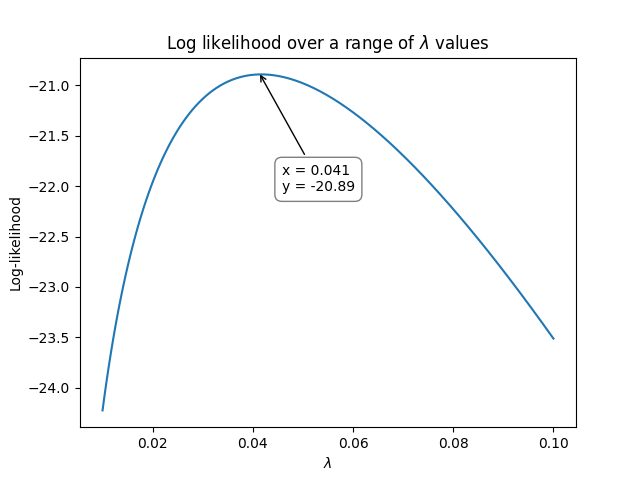
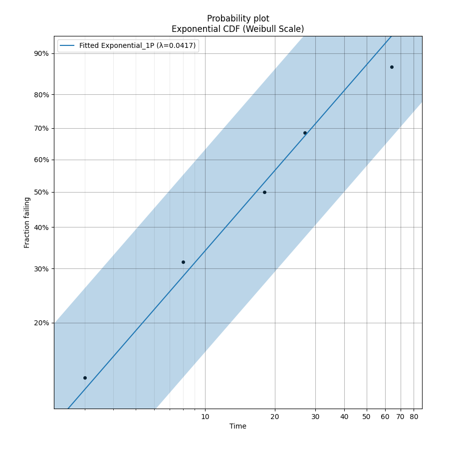

.. image:: images/logo.png

-------------------------------------

How does Maximum Likelihood Estimation work
'''''''''''''''''''''''''''''''''''''''''''

Maximum Likelihood Estimation (MLE) is a method of estimating the parameters of a model using a set of data.
While MLE can be applied to many different types of models, this article will explain how MLE is used to fit the parameters of a probability distribution for a given set of failure and right censored data.

MLE works by calculating the probability of occurrence for each data point (we call this the likelihood) for a model with a given set of parameters.
These probabilities are summed for all the data points.
We then use an optimizer to change the parameters of the model in order to maximise the sum of the probabilities.
This is easiest to understand with an example which is provided below.

There are two major challenges with MLE. These are the need to use an optimizer (making hand calculations almost impossible for distributions with more than one parameter), and the need for a relatively accurate initial guess for the optimizer.
The initial guess for MLE is typically provided using `Least Squares Estimation <https://reliability.readthedocs.io/en/latest/How%20does%20Least%20Squares%20Estimation%20work.html>`_.
A variety of `optimizers <https://reliability.readthedocs.io/en/latest/Optimizers.html>`_ are suitable for MLE, though some may perform better than others so trying a few is sometimes the best approach.

There are several advantages of MLE which make it the standard method for fitting probability distributions in most software.
These are that MLE does not need the equation to be linearizable (which is needed in Least Squares Estimation) so any equation can be modeled.
The other advantage of MLE is that unlike Least Squares Estimation which uses the plotting positions and does not directly use the right censored data, MLE uses the failure data and right censored data directly, making it more suitable for heavily censored datasets.

The MLE algorithm
"""""""""""""""""

The MLE algorithm is as follows:

1. Obtain an initial guess for the model parameters (typically done using least squares estimation).
2. Calculate the probability of occurrence of each data point (f(t) for failures, R(t) for right censored, F(t) for left censored).
3. Multiply the probabilities (or sum their logarithms which is must more computationally efficient)
4. Use an optimizer to change the model parameters and repeat steps 2 and 3 until the total probability is maximized.

As mentioned in step 2, different types of data need to be handled differently:

+------------------------+-----------------------------------------------------------------+
| Type of observation    | Likelihood function                                             |
+========================+=================================================================+
| Failure data           | :math:`L_i(\theta|t_i)=f(t_i|\theta)`                           |
+------------------------+-----------------------------------------------------------------+
| Right censored data    | :math:`L_i(\theta|t_i)=R(t_i|\theta)`                           |
+------------------------+-----------------------------------------------------------------+
| Left censored data     | :math:`L_i(\theta|t_i)=F(t_i|\theta)`                           |
+------------------------+-----------------------------------------------------------------+
| Interval censored data | :math:`L_i(\theta|t_i)=F(t_i^{RI}|\theta) - F(t_i^{LI}|\theta)` |
+------------------------+-----------------------------------------------------------------+

In words, the first equation above means "the likelihood of the parameters (:math:`\theta`) given the data (:math:`t_i`) is equal to the probability of failure (:math:`f(t)`) evaluated at each time :math:`t_i` with that given set of parameters (:math:`\theta`).

Once we have the likelihood (:math:`L_i` ) for each data point, we need to combine them. This is done by multiplying them together (think of this as an AND condition).
If we just had failures and right censored data then the equation would be:

:math:`L(\theta|D) = \prod_{i=1}^{n} f_i(t_i^{\textrm{failures}}|\theta) \times R_i(t_i^{\textrm{right censored}}|\theta)`

In words this means that the likelihood of the parameters of the model (:math:`\theta`) given the data (D) is equal to the product of the values of the PDF (:math:`f(t)`) with the given set of parameters (:math:`\theta`) evaluated at each failure (:math:`t_i^{\textrm{failures}}`), multiplied by the product of the values of the SF (:math:`R(t)`) with the given set of parameters (:math:`\theta`) evaluated at each right censored value (:math:`t_i^{\textrm{right censored}}`).

Since probabilities are between 0 and 1, multiplying many of these results in a very small number.
A loss precision occurs because computers can only store so many decimals. Multiplication is also slower than addition for computers.
To overcome this problem, we can use a logarithm rule to add the log-likelihoods rather than multiply the likelihoods.
We just need to take the log of the likelihood function (the PDF for failure data and the SF for right censored data), evaluate the probability, and sum the values.
The parameters that will maximize the log-likelihood function are the same parameters that will maximize the likelihood function.

An example using the Exponential Distribution
"""""""""""""""""""""""""""""""""""""""""""""

Let's say we have some failure times: t = [27, 64, 3, 18, 8]

We need an initial estimate for time model parameter (:math:`\lambda`) which we would typically get using Least Squares Estimation. For this example, lets start with 0.1 as our first guess for :math:`\lambda`.

For each of these values, we need to calculate the value of the PDF (with the given value of :math:`\lambda`).

Exponential PDF:     :math:`f(t) = \lambda {\rm e}^{-\lambda t}`

Exponential Log-PDF: :math:`ln(f(t)) = ln(\lambda)-\lambda t`

Now we substitute in :math:`\lambda=0.1` and :math:`t = [27, 64, 3, 18, 8]`

:math:`L(\lambda=0.1|t=[27, 64, 3, 18, 8]) = (ln(0.1)-0.1 \times 27) + (ln(0.1)-0.1 \times 64) + (ln(0.1)-0.1 \times 3) + (ln(0.1)-0.1 \times 18) + (ln(0.1)-0.1 \times 8) = -23.512925`

Here's where the optimization part comes in. We need to vary :math:`\lambda` until we maximize the log-likelihood.
The following graph shows how the log-likelihood varies as :math:`\lambda` varies.

This was produced using the following Python code:

.. code:: python

    import matplotlib.pyplot as plt
    import numpy as np
    
    data = np.array([27, 64, 3, 18, 8])
    
    lambda_array = np.geomspace(0.01, 0.1, 100)
    LL = []
    for l in lambda_array:
        loglik = np.log(l)-l*data
        LL.append(loglik.sum())
    
    plt.plot(lambda_array, LL)
    plt.xlabel('$\lambda$')
    plt.ylabel('Log-likelihood')
    plt.title('Log likelihood over a range of $\lambda$ values')
    plt.show()

The optimization process can be done in Python (using scipy) or in Excel (using Solver), or a variety of other software packages. It could even be done by hand, though this is not only tedious, but also limited to single parameter distributions. 
In the next section, we will look at how the optimization process becomes much harder when there are 2 or more parameters that need to be optimized simultaneously.

So, using the above method, we see that the maximum for the log-likelihood occurred when :math:`\lambda` was around 0.041 at a log-likelihood of -20.89.
We can check the value using `reliability` as shown below which achieves an answer of :math:`\lambda = 0.0416667` at a log-likelihood of -20.8903:

.. code:: python

    from reliability.Fitters import Fit_Exponential_1P
    import matplotlib.pyplot as plt

    data = [27, 64, 3, 18, 8]
    Fit_Exponential_1P(failures=data)
    plt.show()

    '''
    Results from Fit_Exponential_1P (95% CI):
    Analysis method: Maximum Likelihood Estimation (MLE)
    Optimizer: TNC
    Failures / Right censored: 5/0 (0% right censored) 
    
    Parameter  Point Estimate  Standard Error  Lower CI  Upper CI
       Lambda       0.0416667       0.0186339 0.0173428  0.100105
     1/Lambda              24         10.7331   9.98947   57.6607 
    
    Goodness of fit    Value
     Log-likelihood -20.8903
               AICc  45.1139
                BIC    43.39
                 AD  2.43793 
    '''

Another example using the Exponential Distribution with censored data
"""""""""""""""""""""""""""""""""""""""""""""""""""""""""""""""""""""

Lets use a new dataset that includes both failures and right censored values.

failures = []
right_censored = []

Once again, we need an initial estimate for the model parameters, and for that we would typically use Least Squares Estimation.
For the purposes of this example, we will use an initial guess of :math:`\lambda = 0.5`.

The rest of this will be writted soon.

An example using the Weibull Distribution
"""""""""""""""""""""""""""""""""""""""""

The rest of this will be writted soon.
