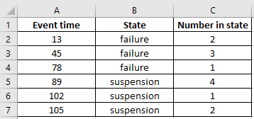
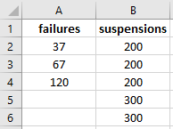
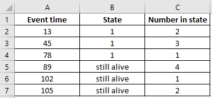

.. image:: images/logo.png

-------------------------------------

Importing data from Excel
'''''''''''''''''''''''''

The module Convert_data contains three functions for importing data from Microsoft Excel (.xlsx files) into Python and converting that data into the structure of a Python object for further use. These functions are:

- xlsx_to_XCN
- xlsx_to_FNRN
- xlsx_to_FR

Each of the three data formats has an acceptable reduced form as follows:

- XCN reduced form is XC and all rows are assumed to have a quantity of 1
- FNRN reduced form is FN and it is assumed that there is no right censored data
- FR reduced form is F and it is assumed that there is no right censored data

.. admonition:: API Reference

   For inputs and outputs see the `API reference <https://reliability.readthedocs.io/en/latest/API/Convert_data.html>`_.

These three functions should be used only for data in their respective format (XCN, FNRN, FR). This means that the columns of the xlsx file should be in the same order as the name of the data format. For example, xlsx_to_XCN is expecting to receive an xlsx file with 3 columns corresponding to X, C, and N. If these are in a different order they may be misinterpreted or trigger an error. You should correct the column order in the xlsx file before importing into Python.

All of the three conversion functions contain the following methods:

-   print() - this will print a dataframe of the data in the output format to the console
-   write_to_xlsx() - this will export the data in the output format to an xlsx file at the specified path. Ensure you specify the path string preceeded by r to indicate raw text. For example: write_to_xlsx(path=r'C:/Users/Current User/Desktop/mydata.xlsx'). If the file already exists in the destination folder, the user will be asked (Y/N) whether they want to overwrite the existing file. If they input N then specified filename will have (new) added to the end.

**Why use different formats**

There are advantages and disadvantages of each of these formats depending on the data being represented. Most importantly, we need an easy way of converting data between these formats as different software may store and receive data in different formats.

- XCN - This format is the default in most commercial software including Reliasoft and Minitab. The sequence of XCN and the names may change between different software, but the format is essentially the same. Within `reliability` the XCN format may be reduced to XC (and all items are assumed to have quantity of 1). Some other software accepts the further reduced form of X (where there are no censored items and all items have a quantity of 1). If you have only failure data that is not grouped, then you should use the FR format as FR has a reduced form of F which is equivalent to X from XCN.
- FNRN - This format is not used as a data entry format for `reliability` or any commercial software (that the author has used), but is still a valid format which combines aspects of the XCN and FR formats together. FNRN is used internally within reliability as part of the MLE algorithms.
- FR - This is the standard data entry format for `reliability`. The FR format is the most simple, but for data with many repeated values it is not as efficient at representing the data in a table as FNRN or XCN. Python has no problems with long arrays so the FR format is chosen as the data entry format for its simplicity.

For more information on these three data formats as well as how to convert data between the different formats, please see the section on `Converting data between different formats <https://reliability.readthedocs.io/en/latest/Converting%20data%20between%20different%20formats.html>`_.

Example 1
---------

In the example below, a screenshot of the data from Excel is shown along with the import process and an example of the print method. The censoring codes are automatically recognised. See `Example 3 <https://reliability.readthedocs.io/en/latest/Importing%20data%20from%20Excel.html#example-3>`_ for how to modify the censor code recognition process.

.. code:: python

    from reliability.Convert_data import xlsx_to_XCN
    data = xlsx_to_XCN(path=r'C:\Users\Current User\Desktop\XCN.xlsx')
    print(data.X)
    print(data.C)
    print(data.N)
    data.print()
    
    '''
    [ 13.  45.  78.  89. 102. 105.]
    ['F' 'F' 'F' 'C' 'C' 'C']
    [2 3 1 4 1 2]
    Data (XCN format)
    event time censor code  number of events
            13           F                 2
            45           F                 3
            78           F                 1
            89           C                 4
           102           C                 1
           105           C                 2 
    '''

Example 2
---------

The use of xlsx_to_FNRN and xlsx_to_FR are very similar to that shown above. This example shows the use of xlsx_to_FR.

.. code:: python

    from reliability.Convert_data import xlsx_to_FR
    data = xlsx_to_FR(path=r'C:\Users\Current User\Desktop\FR.xlsx')
    print(data.failures)
    print(data.right_censored)
    data.print()
    
    '''
    [ 37.  67. 120.]
    [200 200 200 300 300]
    Data (FR format)
    failures  right censored
          37             200
          67             200
         120             200
                         300
                         300 
    '''

Example 3
---------

In this example we will again use xlsx_to_XCN, however this time the censoring codes need customizing. The xlsx file uses 1 in the second column for failures (note that the defaults recognise 0 as failure and 1 as right censored) and 'still alive' for the right censored items ('still alive' is not part of the recognised defaults). If we do not specify these custom censoring codes, the failures will be misinterpreted as right censored items and the 'still alive' items will return an error as this code is not recognised. To resolve this we must set the censor_code_in_xlsx and failure_code_in_xlsx arguments. Furthermore we want the XCN data object in Python to use 'S' instead of 'C' for the censored items. We do this by setting the censor_code_in_XCN argument. If we wanted to change the failure code from 'F' to something else we could similarly use the argument failure_code_in_XCN.

.. code:: python
    
    from reliability.Convert_data import xlsx_to_XCN
    data = xlsx_to_XCN(path=r'C:\Users\Current User\Desktop\XCN.xlsx', censor_code_in_xlsx='still alive', failure_code_in_xlsx=1, censor_code_in_XCN='S')
    print(data.X)
    print(data.C)
    print(data.N)
    data.print()
    
    '''
    [ 13.  45.  78.  89. 102. 105.]
    ['F' 'F' 'F' 'S' 'S' 'S']
    [2 3 1 4 1 2]
    Data (XCN format)
    event time censor code  number of events
            13           F                 2
            45           F                 3
            78           F                 1
            89           S                 4
           102           S                 1
           105           S                 2
    '''
