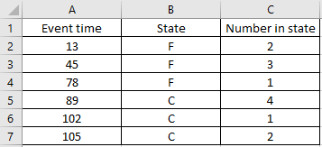

.. image:: images/logo.png

-------------------------------------

Importing data from Excel
'''''''''''''''''''''''''

The module Convert_data contains three functions for importing data from Microsoft Excel (.xlsx files) into Python and converting that data into the structure of a Python object for further use. These functions are:

- Convert_data.xlsx_to_XCN
- Convert_data.xlsx_to_FNRN
- Convert_data.xlsx_to_FR

These three functions should be use for data in their respective format (XCN, FNRN, FR). Note that the columns of the xlsx file should be in the same order as the name of the data format. For example, xlsx_to_XCN is expecting to receive an xlsx file with 3 columns corresponding to X, C, and N. If these are in a different order they may be misinterpreted or trigger an error. Each of the three data formats has a reduced form as follows:

- XCN reduced form is XC and all rows are assumed to have a quantity of 1
- FNRN reduced form is FN and it is assumed that there is no right censored data
- FR reduced form is F and it is assumed that there is no right censored data

For more information on data formats with examples, please see .....

**xlsx_to_XCN**

Inputs:

-   path - the filepath for the xlsx file. Note that you MUST prefix this with r to specify it is raw text. eg. path=r'C:/documents/myfile.xlsx'
-   censor_code_in_xlsx - specify the censor code you have used if it does not appear in the defaults. Default censor codes that will be recognised (not case sensitive): 'R', 'RC', 'RIGHT CENS', 'RIGHT CENSORED', 'C', 'CENSORED', 'CENS', 'S', 'SUSP', 'SUSPENSION', 'SUSPENDED', 'UF', 'UNFAILED', 'UNFAIL', 'NF', 'NO FAIL', 'NO FAILURE', 'NOT FAILED', 1
-   failure_code_in_xlsx - specify the failure code you have used if it does not appear in the defaults. Default failure codes that will be recognised (not case sensitive): 'F', 'FAIL', 'FAILED', 0
-   censor_code_in_XCN - specify the censor code to be used in XCN format. Default is 'C'
-   failure_code_in_XCN - specify the failure code to be used in XCN format. Default is 'F'
 
Outputs:
-   X - event time
-   C - censor code
-   N - number of events at each event time

Methods:
-   print() - this will print a dataframe of the data in XCN format to the console
-   write_to_xlsx() - this will export the data in XCN format to an xlsx file at the specified path.

**xlsx_to_FNRN**

Inputs:

-   path - the filepath for the xlsx file. Note that you must prefix this with r to specify it as raw text. eg. path=r'C:/documents/myfile.xlsx' 

Outputs:

-   failures
-   num_failures
-   right_censored
-   num_right_censored

Methods:

-   print() - this will print a dataframe of the data in FNRN format to the console
-   write_to_xlsx() - this will export the data in FNRN format to an xlsx file at the specified path.

**xlsx_to_FR**

Inputs:

-   path - the filepath for the xlsx file. Note that you must prefix this with r to specify it as raw text. eg. path=r'C:/documents/myfile.xlsx' 

Outputs:

-   failures
-   right_censored

Methods:

-   print() - this will print a dataframe of the data in FR format to the console
-   write_to_xlsx() - this will export the data in FR format to an xlsx file at the specified path.

Example 1
---------

In the example below, a screenshot of the data from Excel is shown along with the import process and an example of the print method.

.. code:: python

    from reliability.Convert_data import xlsx_to_XCN
    data = xlsx_to_XCN(path=r'C:\Users\Matthew Reid\Desktop\XCN.xlsx')
    print(data.X)
    print(data.C)
    print(data.N)
    data.print()
    
    '''
    [ 13.  45.  78.  89. 102. 105.]
    ['F' 'F' 'F' 'C' 'C' 'C']
    [2 3 1 4 1 2]
    Data (XCN format)
    event time censor code  number of events
            13           F                 2
            45           F                 3
            78           F                 1
            89           C                 4
           102           C                 1
           105           C                 2 
    '''
