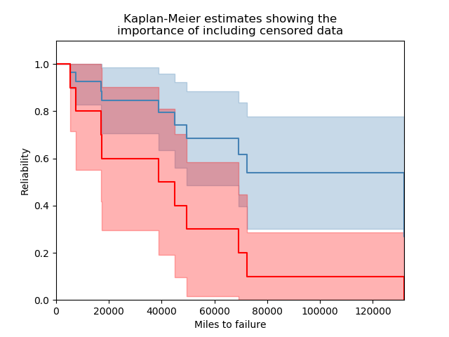

.. _code_directive:

.. image:: images/logo.png

-------------------------------------

Kaplan-Meier estimate of reliability
''''''''''''''''''''''''''''''''''''

The Kaplan-Meier estimator provides a method by which to estimate the survival function (reliability function) of a population without assuming that the data comes from a particular distribution. Due to the lack of parameters required in this model, it is a non-parametric method of obtaining the survival function. With a few simple transformations, the survival function (SF) can be used to obtain the cumulative hazard function (CHF) and the cumulative distribution function (CDF). It is not possible to obtain a useful version of the probability density function (PDF) or hazard function (HF) as this would require the differentiation of the CDF and CHF respectively, which results in a very spikey plot due to the non-continuous nature of these plots.

The Kaplan-Meier estimator is very similar in result (but quite different in method) to the `Nelson-Aalen estimator <https://reliability.readthedocs.io/en/latest/Nelson-Aalen%20estimate%20of%20reliability.html>`_. While neither has been proven to be more accurate than the other, the Kaplan-Meier estimator is generally more popular as a non-parametric means of estimating the SF.

The Kaplan-Meier estimator can only be used with failure and right censored data. Left censored data is not supported. If you require support for left censored data, use the Turnbull Empirical Distribution Function (by B.W. Turnbull) which is available in R and Minitab. The Kaplan-Meier estimator can be accessed from ``reliability.Nonparametric.KaplanMeier``.

Inputs:

-   failures - an array or list of failure times.
-   right_censored - an array or list of right censored failure times. Defaults to None.
-   show_plot - True/False. Default is True. Plots the SF.
-   print_results - True/False. Default is True. Will display a pandas dataframe of results in the console.
-   plot_CI - shades the upper and lower confidence interval
-   CI - confidence interval between 0 and 1. Default is 0.95 for 95% CI.

outputs:

-   results - dataframe of results
-   KM - list of Kaplan-Meier column from results dataframe. This column is the non parametric estimate of the Survival Function (reliability function).
-    xvals - the x-values to plot the stepwise plot as seen when show_plot=True
-    SF - survival function stepwise values (these differ from the KM values as there are extra values added in to make the plot into a step plot)
-    CDF - cumulative distribution function stepwise values
-    CHF - cumulative hazard function stepwise values
-    SF_lower - survival function stepwise values for lower CI
-    SF_upper - survival function stepwise values for upper CI
-    CDF_lower - cumulative distribution function stepwise values for lower CI
-    CDF_upper - cumulative distribution function stepwise values for upper CI
-    CHF_lower - cumulative hazard function stepwise values for lower CI
-    CHF_upper - cumulative hazard function stepwise values for upper CI

Other plotting keywords (such as color, label, linestyle, etc.) are accepted and used on the point estimate line. The color of the confidence intervals is matched automatically to the point estimate line, but no other keywords are carried across to the confidence interval plot as it is only a shaded region.

In this first example, we will provide Kaplan-Meier with a list of failure times and right censored times. By leaving everything else unspecified, the plot will be shown with the confidence intervals shaded. We will layer this first Kaplan-Meier plot with a second one using just the failure data. As can be seen in the example below, the importance of including censored data is paramount to obtain an accurate estimate of the reliability, because without it the population's survivors are not included so the reliability will appear much lower than it truly is.

.. code:: python

    from reliability.Nonparametric import KaplanMeier
    import matplotlib.pyplot as plt
    f = [5248, 7454, 16890, 17200, 38700, 45000, 49390, 69040, 72280, 131900]
    rc = [3961, 4007, 4734, 6054, 7298, 10190, 23060, 27160, 28690, 37100, 40060, 45670, 53000, 67000, 69630, 77350, 78470, 91680, 105700, 106300, 150400]
    KaplanMeier(failures=f, right_censored=rc, label='Failures + right censored', color='steelblue')
    KaplanMeier(failures=f, label='Failures only', color='red')
    plt.title('Kaplan-Meier estimates showing the\nimportance of including censored data')
    plt.xlabel('Miles to failure')
    plt.show()

In this second example, we will create some data from a Weibull distribution, and then right censor the data above our chosen threshold. We will then fit a Weibull_2P distribution to the censored data, and also obtain the Kaplan-Meier estimate of this data. Using the results from the Kaplan-Meier estimate, we will plot the CDF, SF, CHF, for both the Weibull and Kaplan-Meier results. Note that the default plot from KaplanMeier will only give you the SF, but the results object provides everything you need to reconstruct the SF plot yourself, as will as what we need to do the same with CDF and CHF.

.. code:: python

    from reliability.Distributions import Weibull_Distribution
    from reliability.Fitters import Fit_Weibull_2P
    from reliability.Nonparametric import KaplanMeier
    import matplotlib.pyplot as plt
    import numpy as np
    np.random.seed(1) #this is for repeatability in this tutorial
    dist = Weibull_Distribution(alpha=5,beta=2) #create a distribution
    data_raw = dist.random_samples(100) #get some data from the distribution

    #censor the data above our chosen threshold
    fail=[]
    cens = []
    threshold = 9
    for item in data_raw:
        if item>threshold:
            cens.append(threshold)
        else:
            fail.append(item)

    #fit the Weibull_2P and KaplanMeier
    wb = Fit_Weibull_2P(failures=fail,right_censored=cens)
    fitted_dist = Weibull_Distribution(alpha=wb.alpha,beta=wb.beta)
    results = KaplanMeier(failures=fail,right_censored=cens,show_plot=False,print_results=False)
    xvals = np.linspace(0,threshold,1000)
    plt.figure(figsize=(12,5))

    #plot the CDF
    plt.subplot(131)
    plt.plot(results.xvals,results.CDF,label='Kaplan-Meier')
    plt.fill_between(results.xvals,results.CDF_lower,results.CDF_upper,color='steelblue',alpha=0.3)
    fitted_dist.CDF(label='Parametric',xvals=xvals)
    plt.title('CDF')
    plt.legend()

    #plot the SF
    plt.subplot(132)
    plt.plot(results.xvals,results.SF,label='Kaplan-Meier')
    plt.fill_between(results.xvals,results.SF_lower,results.SF_upper,color='steelblue',alpha=0.3)
    fitted_dist.SF(label='Parametric',xvals=xvals)
    plt.title('SF')
    plt.legend()

    #plot the CHF
    plt.subplot(133)
    plt.plot(results.xvals,results.CHF,label='Kaplan-Meier')
    fitted_dist.CHF(label='Parametric',xvals=xvals)
    plt.fill_between(results.xvals,results.CHF_lower,results.CHF_upper,color='steelblue',alpha=0.3)
    plt.title('CHF')
    plt.legend()
    plt.show()

.. image:: images/KM_all3functions.png
