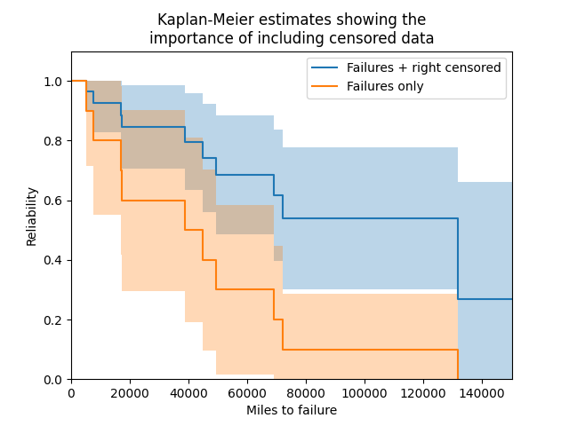
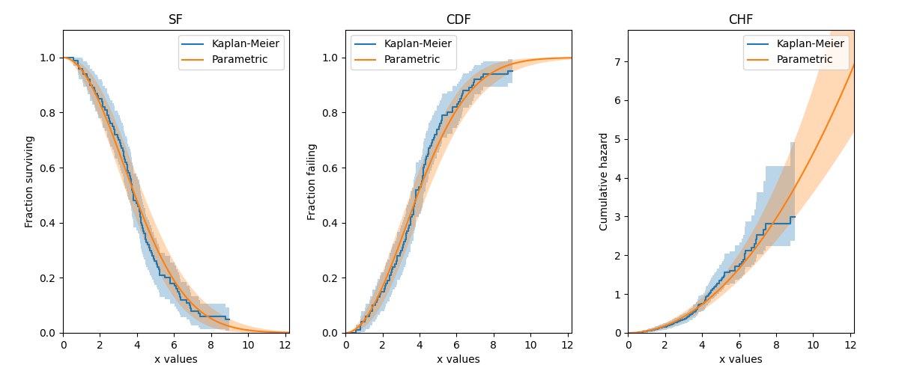

.. image:: images/logo.png

-------------------------------------

Kaplan-Meier
''''''''''''

.. admonition:: API Reference

   For inputs and outputs see the `API reference <https://reliability.readthedocs.io/en/latest/API/Nonparametric/KaplanMeier.html>`_.

The Kaplan-Meier estimator provides a method by which to estimate the survival function (reliability function) of a population without assuming that the data comes from a particular distribution. Due to the lack of parameters required in this model, it is a non-parametric method of obtaining the survival function. With a few simple transformations, the survival function (SF) can be used to obtain the cumulative hazard function (CHF) and the cumulative distribution function (CDF). It is not possible to obtain a useful version of the probability density function (PDF) or hazard function (HF) as this would require the differentiation of the CDF and CHF respectively, which results in a very spikey plot due to the non-continuous nature of these plots.

The Kaplan-Meier estimator is very similar in result (but quite different in method) to the `Nelson-Aalen estimator <https://reliability.readthedocs.io/en/latest/Nelson-Aalen.html>`_ and `Rank Adjustment estimator <https://reliability.readthedocs.io/en/latest/Rank%20Adjustment.html>`_. While none of the three has been proven to be more accurate than the others, the Kaplan-Meier estimator is generally more popular as a non-parametric means of estimating the SF. Confidence intervals are provided using the `Greenwood method <https://support.minitab.com/en-us/minitab/18/help-and-how-to/modeling-statistics/reliability/how-to/nonparametric-distribution-analysis-right-censoring/methods-and-formulas/estimation-methods/#confidence-intervals>`_ with Normal approximation.

The Kaplan-Meier estimator can be used with both complete and right censored data. This function can be accessed from `reliability.Nonparametric.KaplanMeier`.

Example 1
---------

In this first example, we will provide Kaplan-Meier with a list of failure times and right censored times. By leaving everything else unspecified, the plot will be shown with the confidence intervals shaded. We will layer this first Kaplan-Meier plot with a second one using just the failure data. As can be seen in the example below, the importance of including censored data is paramount to obtain an accurate estimate of the reliability, because without it the population's survivors are not included so the reliability will appear much lower than it truly is.

.. code:: python

    from reliability.Nonparametric import KaplanMeier
    import matplotlib.pyplot as plt
    f = [5248, 7454, 16890, 17200, 38700, 45000, 49390, 69040, 72280, 131900]
    rc = [3961, 4007, 4734, 6054, 7298, 10190, 23060, 27160, 28690, 37100, 40060, 45670, 53000, 67000, 69630, 77350, 78470, 91680, 105700, 106300, 150400]
    KaplanMeier(failures=f, right_censored=rc, label='Failures + right censored')
    KaplanMeier(failures=f, label='Failures only')
    plt.title('Kaplan-Meier estimates showing the\nimportance of including censored data')
    plt.xlabel('Miles to failure')
    plt.legend()
    plt.show()
    
    '''
    Results from KaplanMeier (95% CI):
     Failure times  Censoring code (censored=0)  Items remaining  Kaplan-Meier Estimate  Lower CI bound  Upper CI bound
              3961                            0               31                      1               1               1
              4007                            0               30                      1               1               1
              4734                            0               29                      1               1               1
              5248                            1               28               0.964286        0.895548               1
              6054                            0               27               0.964286        0.895548               1
              7298                            0               26               0.964286        0.895548               1
              7454                            1               25               0.925714        0.826513               1
             10190                            0               24               0.925714        0.826513               1
             16890                            1               23               0.885466         0.76317               1
             17200                            1               22               0.845217        0.705334        0.985101
             23060                            0               21               0.845217        0.705334        0.985101
             27160                            0               20               0.845217        0.705334        0.985101
             28690                            0               19               0.845217        0.705334        0.985101
             37100                            0               18               0.845217        0.705334        0.985101
             38700                            1               17               0.795499        0.633417         0.95758
             40060                            0               16               0.795499        0.633417         0.95758
             45000                            1               15               0.742465        0.560893        0.924037
             45670                            0               14               0.742465        0.560893        0.924037
             49390                            1               13               0.685353         0.48621        0.884496
             53000                            0               12               0.685353         0.48621        0.884496
             67000                            0               11               0.685353         0.48621        0.884496
             69040                            1               10               0.616817        0.396904        0.836731
             69630                            0                9               0.616817        0.396904        0.836731
             72280                            1                8               0.539715        0.300949        0.778481
             77350                            0                7               0.539715        0.300949        0.778481
             78470                            0                6               0.539715        0.300949        0.778481
             91680                            0                5               0.539715        0.300949        0.778481
            105700                            0                4               0.539715        0.300949        0.778481
            106300                            0                3               0.539715        0.300949        0.778481
            131900                            1                2               0.269858               0        0.662446
            150400                            0                1               0.269858               0        0.662446 

    Results from KaplanMeier (95% CI):
     Failure times  Censoring code (censored=0)  Items remaining  Kaplan-Meier Estimate  Lower CI bound  Upper CI bound
              5248                            1               10                    0.9        0.714061               1
              7454                            1                9                    0.8        0.552082               1
             16890                            1                8                    0.7        0.415974        0.984026
             17200                            1                7                    0.6        0.296364        0.903636
             38700                            1                6                    0.5        0.190102        0.809898
             45000                            1                5                    0.4       0.0963637        0.703636
             49390                            1                4                    0.3       0.0159742        0.584026
             69040                            1                3                    0.2               0        0.447918
             72280                            1                2                    0.1               0        0.285939
            131900                            1                1                      0               0               0 
    '''
    

Example 2
---------

In this second example, we will create some data from a Weibull distribution, and then right censor the data above our chosen threshold. We will then fit a Weibull_2P distribution to the censored data, and also obtain the Kaplan-Meier estimate of this data. Using the results from the Fit_Weibull_2P and the Kaplan-Meier estimate, we will plot the CDF, SF, and CHF, for both the Weibull and Kaplan-Meier results. Note that the default plot from KaplanMeier will only give you the SF, but the results object provides everything you need to reconstruct the SF plot yourself, as well as what we need to plot the CDF and CHF.

.. code:: python

    from reliability.Distributions import Weibull_Distribution
    from reliability.Fitters import Fit_Weibull_2P
    from reliability.Nonparametric import KaplanMeier
    from reliability.Other_functions import make_right_censored_data
    import matplotlib.pyplot as plt

    dist = Weibull_Distribution(alpha=5, beta=2)  # create a distribution
    raw_data = dist.random_samples(100, seed=2)  # get some data from the distribution. Seeded for repeatability
    data = make_right_censored_data(raw_data, threshold=9)
    wbf = Fit_Weibull_2P(failures=data.failures, right_censored=data.right_censored, show_probability_plot=False, print_results=False)  # Fit the Weibull_2P

    # Create the subplots and in each subplot we will plot the parametric distribution and obtain the Kaplan Meier fit.
    # Note that the plot_type is being changed each time
    plt.figure(figsize=(12, 5))
    plt.subplot(131)
    KaplanMeier(failures=data.failures, right_censored=data.right_censored, plot_type='SF', print_results=False, label='Kaplan-Meier')
    wbf.distribution.SF(label='Parametric')
    plt.legend()
    plt.title('SF')
    plt.subplot(132)
    KaplanMeier(failures=data.failures, right_censored=data.right_censored, plot_type='CDF', print_results=False, label='Kaplan-Meier')
    wbf.distribution.CDF(label='Parametric')
    plt.legend()
    plt.title('CDF')
    plt.subplot(133)
    KaplanMeier(failures=data.failures, right_censored=data.right_censored, plot_type='CHF', print_results=False, label='Kaplan-Meier')
    wbf.distribution.CHF(label='Parametric')
    plt.legend()
    plt.title('CHF')
    plt.subplots_adjust(left=0.07, right=0.95, top=0.92, wspace=0.25)  # format the plot layout
    plt.show()

