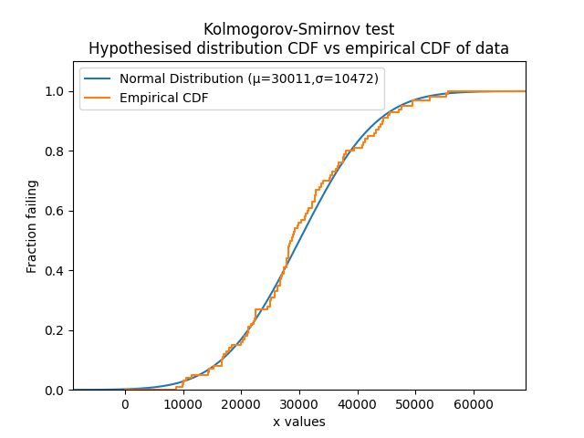

.. image:: images/logo.png

-------------------------------------

Kolmogorov-Smirnov test
''''''''''''''''''''''''

.. note:: This function will be available in version 0.5.3 which is currently unreleased.

This function will be written soon...

Inputs:

Outputs:

In the example below

.. code:: python

    from reliability.Reliability_testing import KStest
    
    '''

.. note:: This function will be available in version 0.5.3 which is currently unreleased.
