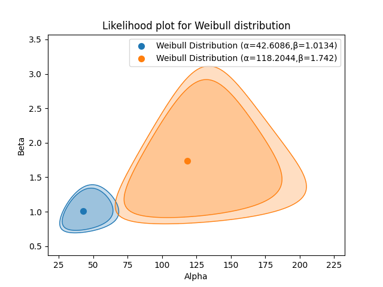

.. image:: images/logo.png

-------------------------------------

Likelihood plot
'''''''''''''''

The likelihood plot provides a graphical representation of the confidence bounds on the parameters of a distribution at a particular confidence interval.
When multiple distributions (of the same type) are plotted together, it is possible to determine whether there is a statistically significant difference between them by looking at whether their likelihood plots overlap.

Please note that it is not possible to overlay the likelihood plots of different types of distributions (e.g. Weibull and Normal) on the same plot because the axes must match.

The likelihood plot is only implemented for 2P distributions (Weibull, Normal, Lognormal, Gamma, Gumbel, Loglogistic, Beta) that are not location shifted. To compare two Exponential_1P distributions, simply look for overlap on the confidence bounds on the lambda parameter.

.. admonition:: API Reference

   For inputs and outputs see the `API reference <https://reliability.readthedocs.io/en/latest/API/Reliability_testing/likelihood_plot.html>`_.

In the example below we have two datasets that are from two different design iterations of the same component. We want to know if the new design really is better than the old design. The parameters of the distribution certainly seem different, but is there a statistically significant difference between the distributions? To find out we need to plot the confidence bounds on the parameters. This is done at the 90% and 95% confidence levels.

The resulting plot shows that there is no overlap at the 90% confidence level, but there is a small overlap at the 95% confidence level. From this plot we can say that we are 90% confident that the new design is better than the old one, but at the 95% confidence level, there is not a statistically significant difference between the two designs.

.. code:: python

	from reliability.Reliability_testing import likelihood_plot
	import matplotlib.pyplot as plt

	old_design = [2, 9, 23, 38, 67, 2, 11, 28, 40, 76, 3, 17, 33, 45, 90, 4, 17, 34, 55, 115, 6, 19, 34, 56, 126, 9, 21, 37, 57, 197]
	new_design = [15, 116, 32, 148, 61, 178, 67, 181, 75, 183]
	likelihood_plot(distribution="Weibull", failures=old_design, CI=[0.9, 0.95])
	likelihood_plot(distribution="Weibull", failures=new_design, CI=[0.9, 0.95])
	plt.show()

This example uses the same data as the `example from reliawiki <https://www.reliawiki.com/index.php/Contour_Plot_Example>`_.
