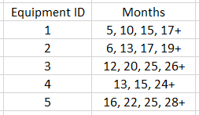
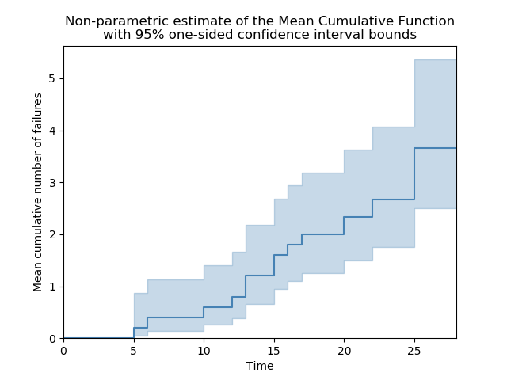
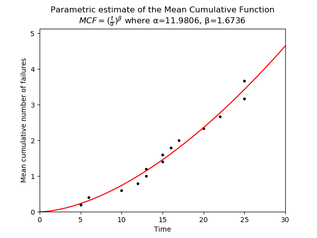
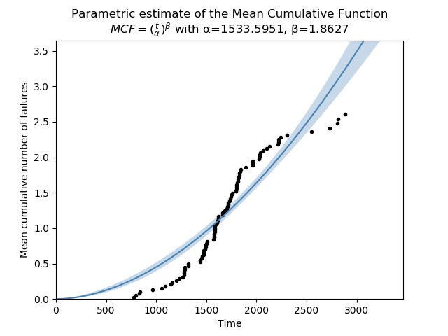

.. image:: images/logo.png

-------------------------------------

Mean cumulative function
''''''''''''''''''''''''
 
The Mean Cumulative Function (MCF) is a cumulative history function that shows the cumulative number of recurrences of an event, such as repairs over time. In the context of repairs over time, the value of the MCF can be thought of as the average number of repairs that each system will have undergone after a certain time. It is only applicable to repairable systems and assumes that each event (repair) is identical. For the non-parametric MCF it does not assume that each system's MCF is identical, but this assumption is made for the parametric MCF.

The shape of the MCF is a key indicator that shows whether the systems are improving, worsening, or staying the same over time. If the MCF is concave down (appearing to level out) then the system is improving. A straight line (constant increase) indicates it is staying the same. Concave up (getting steeper) shows the system is worsening as repairs are required more frequently as time progresses.

Obtaining the MCF from failure times is an inherently non-parametric process (similar to Kaplan-Meier), but once the values are obtained, a model can be fitted to obtain the parametric estimate of the MCF. Each of these two approaches is described below as they are performed by seperate functions within reliability.Repairable_systems.

Note that in some textbooks and academic papers the Mean Cumulative Function is also referred to as the Cumulative Intensity Function (CIF). These are two names for the same thing. If the shape of your MCF is more of an S than a single smooth curve, you may have a change in operating condition or in the repair effectiveness factor. This can be dealt with by splitting the MCF into segments, however, such models are more complex and are generally only found in academic `literature <http://www.math.wm.edu/~leemis/1991mgmtsci.pdf>`_.

Non-parametric MCF
------------------

The non-parametric estimate of the MCF provides both the estimate of the MCF and the confidence bounds at a particular time. The procedure to obtain the non-parametric MCF is outlined `here <http://reliawiki.org/index.php/Recurrent_Event_Data_Analysis#Example:_Mean_Cumulative_Function>`_. The confidence bounds are the one-sided bounds as this was chosen to align with the method used by Reliasoft.

Inputs:

-   data - the repair times for each system. Format this as a list of lists. eg. data=[[4,7,9],[3,8,12]] would be the data for 2 systems. The largest time for each system is assumed to be the retirement time and is treated as a right censored value. If the system was retired immediately after the last repair then you must include a repeated value at the end as this will be used to indicate a right censored value. eg. A system that had repairs at 4, 7, and 9 then was retired after the last repair would be entered as data = [4,7,9,9] since the last value is treated as a right censored value. If you only have data from 1 system you may enter the data in a single list as data = [3,7,12] and it will be nested within another list automatically.
-   print_results - prints the table of MCF results (state, time, MCF_lower, MCF, MCF_upper, variance)
-   CI - Confidence interval. Default is 0.95 for 95% CI (one sided).
-   show_plot - if True the plot will be shown. Default is True. Use plt.show() to show it.
-   plot_CI - the plot will include the confidence intervals. Default is True.

Outputs:

-   If print_results is True, a table of the results will be printed showing state, time, MCF_lower, MCF, MCF_upper, variance. In this table state is F for failure or C for right censored (retirement).
-   If show_plot is True, the MCF plot will be shown.
-   results - this is a dataframe of the results that are printed. It includes the blank lines for censored values
-   time - this is the time column from results. Blank lines for censored values are removed
-   MCF - this is the MCF column from results. Blank lines for censored values are removed
-   variance - this is the Variance column from results. Blank lines for censored values are removed
-   lower - this is the MCF_lower column from results. Blank lines for censored values are removed
-   upper - this is the MCF_upper column from results. Blank lines for censored values are removed

The following example is taken from an `example <http://reliawiki.org/index.php/Recurrent_Event_Data_Analysis>`_ provided by Reliasoft. The failure times and retirement times (retirement time is indicated by +) of 5 systems are:

.. code:: python

    from reliability.Repairable_systems import MCF_nonparametric
    import matplotlib.pyplot as plt
    times = [[5, 10, 15, 17], [6, 13, 17, 19], [12, 20, 25, 26], [13, 15, 24], [16, 22, 25, 28]]
    MCF_nonparametric(data=times)
    plt.show()

    '''
    Mean Cumulative Function results (95.0% CI)
           time  MCF_lower      MCF MCF_upper  variance
    state                                              
    F         5  0.0459299      0.2  0.870893     0.032
    F         6    0.14134      0.4   1.13202     0.064
    F        10   0.256603      0.6   1.40294     0.096
    F        12   0.383374      0.8   1.66939     0.128
    F        13   0.517916        1   1.93081      0.16
    F        13   0.658169      1.2   2.18789     0.192
    F        15   0.802848      1.4   2.44131     0.224
    F        15   0.951092      1.6   2.69164     0.256
    F        16    1.10229      1.8   2.93935     0.288
    F        17    1.25598        2   3.18478      0.32
    C        17                                        
    C        19                                        
    F        20    1.49896  2.33333   3.63215  0.394074
    F        22    1.74856  2.66667   4.06684  0.468148
    C        24                                        
    F        25    2.12259  3.16667   4.72431  0.593148
    F        25     2.5071  3.66667   5.36255  0.718148
    C        26                                        
    C        28                                        
    '''

Parametric MCF
--------------

The estimates of the parametric MCF are obtained using MCF_nonparametric as this is the procedure required to obtain the points for the plot. To these points a Non-Homogeneous Poisson Process (NHPP) parametric model is fitted of the form:

:math:`MCF(t) = (\frac{t}{\alpha})^{\beta}`

You may notice that this looks identical to the `Weibull CHF <https://reliability.readthedocs.io/en/latest/Equations%20of%20supported%20distributions.html#weibull-distribution>`_, but despite this similarity, they are entirely different functions and the alpha and beta parameters from the MCF cannot be applied to a Weibull distribution for fitting the repair times or repair interarrival times.

The purpose of fitting a parametric model is to obtain the shape parameter (β) which indicates the long term health of the system/s. If the MCF is concave down (β<1) then the system is improving. A straight line (β=1) indicates it is staying the same. Concave up (β>1) shows the system is worsening as repairs are required more frequently as time progresses.

Many methods exist for fitting the model to the data. Within reliability, scipy.optimize.curve_fit is used which returns the covariance matrix and allows for the confidence intervals to be calculated using the appropriate `formulas <https://support.minitab.com/en-us/minitab/18/help-and-how-to/modeling-statistics/reliability/how-to/parametric-growth-curve/methods-and-formulas/mean-cumulative-function-mcf-and-failure-rate-rocof/>`_.

Inputs:

-   data - the repair times for each system. Format this as a list of lists. eg. data=[[4,7,9],[3,8,12]] would be the data for 2 systems. The largest time for each system is assumed to be the retirement time and is treated as a right censored value. If the system was retired immediately after the last repair then you must include a repeated value at the end as this will be used to indicate a right censored value. eg. A system that had repairs at 4, 7, and 9 then was retired after the last repair would be entered as data = [4,7,9,9] since the last value is treated as a right censored value. If you only have data from 1 system you may enter the data in a single list as data = [3,7,12] and it will be nested within another list automatically.
-   CI - the confidence interval. Default is 0.95 for 95% CI.
-   print_results - prints the fitted parameters (alpha and beta) of the parametric MCF model.
-   show_plot - if True the plot will be shown. Default is True. Use plt.show() to show it.
-   plot_CI - True/False. Plots the confidence intervals. Default is True.

Outputs:

-   If print_results is True, the model parameters will be printed along with a brief diagnosis of the long term health of the system based on the beta parameter.
-   time - this is the times (x values) from the scatter plot. This value is calculated using MCF_nonparametric.
-   MCF - this is the MCF (y values) from the scatter plot. This value is calculated using MCF_nonparametric.
-   alpha - the calculated alpha parameter
-   beta - the calculated beta parameter
-   alpha_SE - the standard error in the alpha parameter
-   beta_SE - the standard error in the beta parameter
-   cov_alpha_beta - the covariance between the parameters
-   alpha_upper - the upper CI estimate of the parameter
-   alpha_lower - the lower CI estimate of the parameter
-   beta_upper - the upper CI estimate of the parameter
-   beta_lower - the lower CI estimate of the parameter
-   results - a dataframe of the results (point estimate, standard error, Lower CI and Upper CI for each parameter)

The following example uses the same data as the MCF_nonparametric example provided above. From the output we can clearly see that the system is degrading over time as repairs are needed more frequently.

.. code:: python

    from reliability.Repairable_systems import MCF_parametric
    import matplotlib.pyplot as plt
    times = [[5, 10, 15, 17], [6, 13, 17, 19], [12, 20, 25, 26], [13, 15, 24], [16, 22, 25, 28]]
    MCF_parametric(data=times)
    plt.show()

    '''
    Mean Cumulative Function Parametric Model (95% CI):
    MCF = (t/α)^β
               Point Estimate  Standard Error   Lower CI   Upper CI
    Parameter                                                      
    Alpha           11.980590        0.401372  11.219187  12.793666
    Beta             1.673622        0.094654   1.498017   1.869813
    Since Beta is greater than 1, the system repair rate is WORSENING over time.
    '''

The parametric model that is fitted to the MCF is not always an appropriate model. The example below shows data from a collection of systems, some of which are improving and some are worsening. The net effect is an S-shaped MCF. The power model used by MCF_parametric is not able to accurately follow an S-shaped dataset. In this case, the MCF_nonparametric model is more appropriate, though there are some other parametric models (discussed in the first paragraph) which may be useful to model this dataset.

.. code:: python

    from reliability.Repairable_systems import MCF_parametric
    from reliability.Datasets import MCF_2
    import matplotlib.pyplot as plt

    times = MCF_2().times
    MCF_parametric(data=times, print_results=False)
    plt.show()

