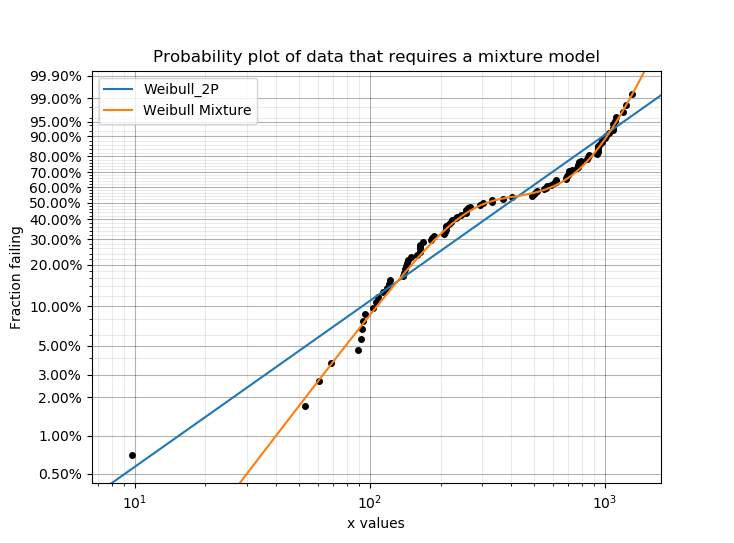
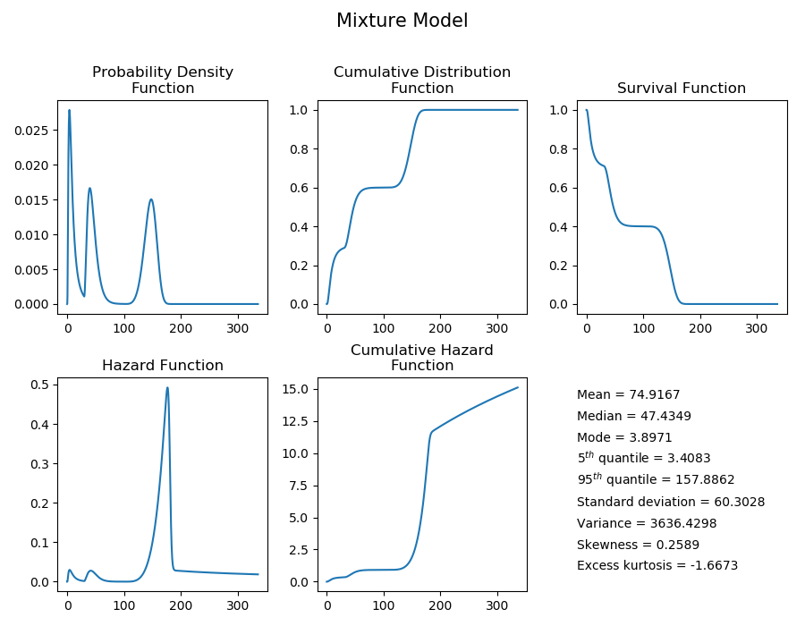
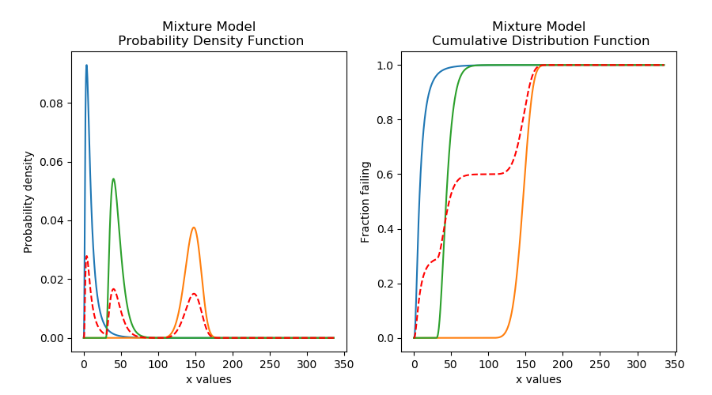
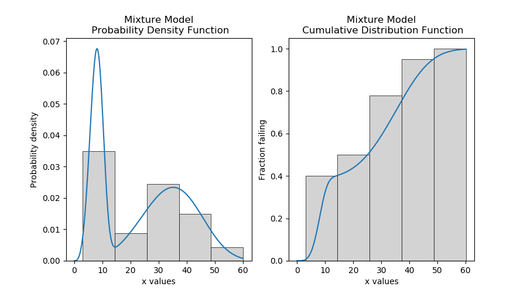
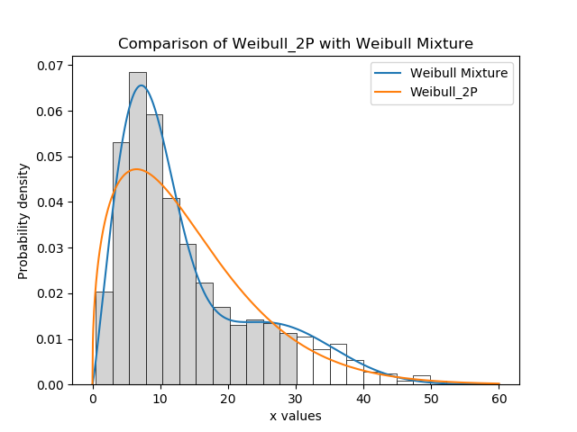

.. image:: images/logo.png

-------------------------------------

Mixture models
''''''''''''''

.. note:: This documentation is valid for Version 0.5.2 which is currently unreleased.

What are mixture models?
========================

Mixture models are a combination of two or more distributions added together to create a distribution that has a shape with more flexibility than a single distribution. Each of the mixture's components must be multiplied by a proportion, and the sum of all the proportions is equal to 1. The mixture is generally written in terms of the PDF, but since the CDF is the integral (cumulative sum) of the PDF, we can equivalently write the Mixture model in terms of the PDF or CDF. For a mixture model with 2 distributions, the equations are shown below:

:math:`{PDF}_{mixture} = p\times{PDF}_1 + (1-p)\times{PDF}_2`

:math:`{CDF}_{mixture} = p\times{CDF}_1 + (1-p)\times{CDF}_2`

:math:`{SF}_{mixture} = 1-{CDF}_{mixture}`

:math:`{CHF}_{mixture} = -ln({SF}_{mixture})`

To obtain the hazard function (HF), we must find the derivative of the CHF. This is easiest to do numerically since the formula for the mixture model can get quite complex as more distributions are added.

Mixture models are useful when there is more than one failure mode that is generating the failure data. This can be recognised by the shape of the PDF and CDF being outside of what any single distribution can accurately model. On a probability plot, a mixture of failure modes can be identified by bends or S-shapes in the data that you might otherwise expect to be linear. An example of this is shown in the image below. You should not use a mixture model just because it can fit almost anything really well, but you should use a mixture model if you suspect that there are multiple failure modes contributing to the failure data you are observing. To judge whether a mixture model is justified, look at the goodness of fit criterion (AICc or BIC) which penalises the score based on the number of parameters in the model. The closer the goodness of fit criterion is to zero, the better the fit.

See also `competing risk models <https://reliability.readthedocs.io/en/latest/Competing%20risk%20models.html>`_ for another method of combining distributions using the product of the SF rather than the sum of the CDF.

Creating a mixture model
========================

Within ``reliability.Distributions`` is the Mixture_Model. This class accepts an array or list of distribution objects created using the reliability.Distributions module (available distributions are Exponential, Weibull, Normal, Lognormal, Gamma, Beta). There is no limit to the number of components you can add to the mixture, but is is generally preferable to use as few as are required to fit the data appropriately (typically 2 or 3). In addition to the distributions, you can specify the proportions contributed by each distribution in the mixture. These proportions must sum to 1. If not specified the proportions will be set as equal for each component.

As this process is additive for the survival function, and may accept many distributions of different types, the mathematical formulation quickly gets complex.
For this reason, the algorithm combines the models numerically rather than empirically so there are no simple formulas for many of the descriptive statistics (mean, median, etc.). Also, the accuracy of the model is dependent on xvals. If the xvals array is small (<100 values) then the answer will be "blocky" and inaccurate. The variable xvals is only accepted for PDF, CDF, SF, HF, and CHF. The other methods (like random samples) use the default xvals for maximum accuracy. The default number of values generated when xvals is not given is 1000. Consider this carefully when specifying xvals in order to avoid inaccuracies in the results.

The API is similar to the other probability distributions (Weibull, Normal, etc.) and has the following inputs and methods:

Inputs:

-    distributions - a list or array of probability distributions used to construct the model
-    proportions - how much of each distribution to add to the mixture. The sum of proportions must always be 1.

Methods:

-    name - 'Mixture'
-    name2 - 'Mixture using 3 distributions'
-    mean
-    median
-    mode
-    variance
-    standard_deviation
-    skewness
-    kurtosis
-    excess_kurtosis
-    b5 - The time where 5% have failed. Same as quantile(0.05)
-    b95 - The time where 95% have failed. Same as quantile(0.95)
-    plot() - plots all functions (PDF,CDF,SF,HF,CHF)
-    PDF() - plots the probability density function
-    CDF() - plots the cumulative distribution function
-    SF() - plots the survival function (also known as reliability function)
-    HF() - plots the hazard function
-    CHF() - plots the cumulative hazard function
-    quantile() - Calculates the quantile (time until a fraction has failed) for a given fraction failing. Also known as b life where b5 is the time at which 5% have failed.
-    inverse_SF() - the inverse of the Survival Function. This is useful when producing QQ plots.
-    mean_residual_life() - Average residual lifetime of an item given that the item has survived up to a given time. Effectively the mean of the remaining amount (right side) of a distribution at a given time.
-    stats() - prints all the descriptive statistics. Same as the statistics shown using .plot() but printed to console.
-    random_samples() - draws random samples from the distribution to which it is applied.

The following example shows how the Mixture_Distribution object can be created, visualised and used.

.. code:: python

    from reliability.Distributions import Lognormal_Distribution, Gamma_Distribution, Weibull_Distribution, Mixture_Model
    import matplotlib.pyplot as plt

    # create the mixture model
    d1 = Lognormal_Distribution(mu=2, sigma=0.8)
    d2 = Weibull_Distribution(alpha=50, beta=5, gamma=100)
    d3 = Gamma_Distribution(alpha=5, beta=3, gamma=30)
    mixture_model = Mixture_Model(distributions=[d1, d2, d3], proportions=[0.3, 0.4, 0.3])

    # plot the 5 functions using the plot() function
    mixture_model.plot()

    # plot the PDF and CDF()
    plot_components = True
    plt.figure(figsize=(9, 5))
    plt.subplot(121)
    mixture_model.PDF(plot_components=plot_components, color='red', linestyle='--')
    plt.subplot(122)
    mixture_model.CDF(plot_components=plot_components, color='red', linestyle='--')
    plt.subplots_adjust(left=0.1, right=0.95)
    plt.show()

    # extract the mean of the distribution
    print('The mean of the distribution is:', mixture_model.mean)
    
    '''
    The mean of the distribution is: 74.91674657035722
    '''

Fitting a mixture model
=======================

Within ``reliability.Fitters`` is Fit_Weibull_Mixture. This function will fit a weibull mixture model consisting of 2 x Weibull_2P distributions (this does not fit the gamma parameter). Just as with all of the other distributions in ``reliability.Fitters``, right censoring is supported, though care should be taken to ensure that there still appears to be two groups when plotting only the failure data. A second group cannot be made from a mostly or totally censored set of samples.

Whilst some failure modes may not be fitted as well by a Weibull distribution as they may be by another distribution, it is unlikely that a mixture of data from two distributions (particularly if they are overlapping) will be fitted noticeably better by other types of mixtures than would be achieved by a Weibull mixture. For this reason, other types of mixtures are not implemented.
 
Inputs:

-   failures - an array or list of the failure data. There must be at least 4 failures, but it is highly recommended to use another model if you have less than 20 failures.
-   right_censored - an array or list of right censored data
-   print_results - True/False. This will print results to console. Default is True
-   CI - confidence interval for estimating confidence limits on parameters. Must be between 0 and 1. Default is 0.95 for 95% CI.
-   show_probability_plot - True/False. This will show the probability plot with the fitted mixture CDF. Default is True.
 
Outputs:

-   alpha_1 - the fitted Weibull_2P alpha parameter for the first (left) group
-   beta_1 - the fitted Weibull_2P beta parameter for the first (left) group
-   alpha_2 - the fitted Weibull_2P alpha parameter for the second (right) group
-   beta_2 - the fitted Weibull_2P beta parameter for the second (right) group
-   proportion_1 - the fitted proportion of the first (left) group
-   proportion_2 - the fitted proportion of the second (right) group. Same as 1-proportion_1
-   alpha_1_SE - the standard error on the parameter
-   beta_1_SE - the standard error on the parameter
-   alpha_2_SE - the standard error on the parameter
-   beta_2_SE - the standard error on the parameter
-   proportion_1_SE - the standard error on the parameter
-   alpha_1_upper - the upper confidence interval estimate of the parameter
-   alpha_1_lower - the lower confidence interval estimate of the parameter
-   beta_1_upper - the upper confidence interval estimate of the parameter
-   beta_1_lower - the lower confidence interval estimate of the parameter
-   alpha_2_upper - the upper confidence interval estimate of the parameter
-   alpha_2_lower - the lower confidence interval estimate of the parameter
-   beta_2_upper - the upper confidence interval estimate of the parameter
-   beta_2_lower - the lower confidence interval estimate of the parameter
-   proportion_1_upper - the upper confidence interval estimate of the parameter
-   proportion_1_lower - the lower confidence interval estimate of the parameter
-   loglik - Log Likelihood (as used in Minitab and Reliasoft)
-   loglik2 - LogLikelihood*-2 (as used in JMP Pro)
-   AICc - Akaike Information Criterion
-   BIC - Bayesian Information Criterion
-   results - a dataframe of the results (point estimate, standard error, Lower CI and Upper CI for each parameter)

In this first example, we will create some data using two Weibull distributions and then combine the data using np.hstack. We will then fit the Weibull mixture model to the combined data and will print the results and show the plot. As the input data is made up of 40% from the first group, we expect the proportion to be around 0.4.

.. code:: python

    from reliability.Fitters import Fit_Weibull_Mixture
    from reliability.Distributions import Weibull_Distribution
    from reliability.Other_functions import histogram
    import numpy as np
    import matplotlib.pyplot as plt
    
    # create some failures from two distributions
    group_1 = Weibull_Distribution(alpha=10, beta=3).random_samples(40, seed=2)
    group_2 = Weibull_Distribution(alpha=40, beta=4).random_samples(60, seed=2)
    all_data = np.hstack([group_1, group_2])  # combine the data
    results = Fit_Weibull_Mixture(failures=all_data) #fit the mixture model

    # this section is to visualise the histogram with PDF and CDF
    # it is not part of the default output from the Fitter
    plt.figure(figsize=(9, 5))
    plt.subplot(121)
    histogram(all_data)
    results.distribution.PDF(xmin=0, xmax=60)
    plt.subplot(122)
    histogram(all_data, cumulative=True)
    results.distribution.CDF(xmin=0, xmax=60)

    plt.show()

    '''
    Results from Fit_Weibull_Mixture (95% CI):
                  Point Estimate  Standard Error   Lower CI   Upper CI
    Parameter                                                         
    Alpha 1             8.654923        0.394078   7.916006   9.462815
    Beta 1              3.910594        0.509724   3.028959   5.048845
    Alpha 2            38.097040        1.411773  35.428112  40.967028
    Beta 2              3.818227        0.421366   3.075574   4.740207
    Proportion 1        0.388206        0.050264   0.295325   0.489987
    Log-Likelihood: -375.9906311550037
    '''

.. image:: images/Weibull_Mixture_V3.png

In this second example, we will compare how well the Weibull Mixture performs vs a single Weibull_2P. Firstly, we generate some data from two Weibull distributions, combine the data, and right censor it above our chosen threshold. Next, we will fit the Mixture and Weibull_2P distributions. Then we will visualise the histogram and PDF of the fitted mixture model and Weibull_2P distributions. The goodness of fit measure is used to check whether the mixture model is really a much better fit than a single Weibull_2P distribution (which it is due to the lower BIC).

.. code:: python
  
    from reliability.Fitters import Fit_Weibull_Mixture, Fit_Weibull_2P
    from reliability.Distributions import Weibull_Distribution
    from reliability.Other_functions import histogram, make_right_censored_data
    import numpy as np
    import matplotlib.pyplot as plt

    # create some failures and right censored data
    group_1 = Weibull_Distribution(alpha=10, beta=2).random_samples(700, seed=2)
    group_2 = Weibull_Distribution(alpha=30, beta=3).random_samples(300, seed=2)
    all_data = np.hstack([group_1, group_2])
    data = make_right_censored_data(all_data, threshold=30)

    # fit the Weibull Mixture and Weibull_2P
    mixture = Fit_Weibull_Mixture(failures=data.failures, right_censored=data.right_censored, show_probability_plot=False, print_results=False)
    single = Fit_Weibull_2P(failures=data.failures, right_censored=data.right_censored, show_probability_plot=False, print_results=False)
    print('Weibull_Mixture BIC:', mixture.BIC, '\nWeibull_2P BIC:', single.BIC) # print the goodness of fit measure

    # plot the Mixture and Weibull_2P
    histogram(all_data, white_above=30)
    xvals = np.linspace(0, 60, 1000)
    mixture.distribution.PDF(label='Weibull Mixture',xvals=xvals)
    single.distribution.PDF(label='Weibull_2P',xvals=xvals)
    plt.title('Comparison of Weibull_2P with Weibull Mixture')
    plt.legend()
    plt.show()

    '''
    Weibull_Mixture BIC: 6432.417425636481 
    Weibull_2P BIC: 6511.51175959736
    '''

.. note:: This documentation is valid for Version 0.5.2 which is currently unreleased.
