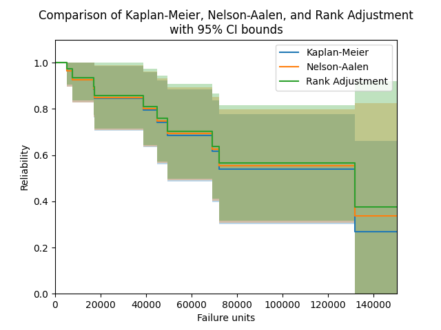

.. image:: images/logo.png

-------------------------------------

Nelson-Aalen
''''''''''''

The Nelson-Aalen estimator provides a method by which to estimate the hazard function of a population without assuming that the data comes from a particular distribution. From the hazard function, the Nelson-Aalen method obtains the cumulative hazard function, which is then used to obtain the survival function. Due to the lack of parameters required in this model, it is a non-parametric method of obtaining the survival function. As with the Kaplan-Meier estimator, once we have the survival function (SF), then we also have the cumulative hazard function (CHF) and the cumulative distribution function (CDF). It is not possible to obtain a useful version of the probability density function (PDF) or hazard function (HF). While the hazard function is obtained directly by the Nelson-Aalen method, it is a useless function on its own as it is a very spikey plot due to the non-continuous nature of the hazard. It is only when we smooth the results out using the cumulative hazard function that we obtain some utility from the results.

The Nelson-Aalen estimator is very similar in result (but quite different in method) to the `Kaplan-Meier estimator <https://reliability.readthedocs.io/en/latest/Kaplan-Meier.html>`_ and `Rank Adjustment estimator <https://reliability.readthedocs.io/en/latest/Rank%20Adjustment.html>`_. While none of the three have been proven to be more accurate than the others, the Kaplan-Meier estimator is generally more popular as a non-parametric means of estimating the SF. Confidence intervals are provided using the Greenwood method with Normal approximation.

The Nelson-Aalen estimator can be used with both complete and right censored data. This function can be accessed from ``reliability.Nonparametric.NelsonAalen``.

Inputs:

-   failures - an array or list of failure times.
-   right_censored - an array or list of right censored failure times. Defaults to None.
-   show_plot - True/False. Default is True. Plots the SF.
-   print_results - True/False. Default is True. Will display a pandas dataframe of results in the console.
-   plot_CI - shades the upper and lower confidence interval
-   CI - confidence interval between 0 and 1. Default is 0.95 for 95% CI.
-   plot_type - SF, CDF, or CHF. Default is SF.

Outputs:

-    results - dataframe of results
-    NA - list of Nelson-Aalen column from results dataframe. This column is the non parametric estimate of the Survival Function (reliability function).
-    xvals - the x-values to plot the stepwise plot as seen when show_plot=True
-    SF - survival function stepwise values (these differ from the NA values as there are extra values added in to make the plot into a step plot)
-    CDF - cumulative distribution function stepwise values
-    CHF - cumulative hazard function stepwise values
-    SF_lower - survival function stepwise values for lower CI
-    SF_upper - survival function stepwise values for upper CI
-    CDF_lower - cumulative distribution function stepwise values for lower CI
-    CDF_upper - cumulative distribution function stepwise values for upper CI
-    CHF_lower - cumulative hazard function stepwise values for lower CI
-    CHF_upper - cumulative hazard function stepwise values for upper CI

Other plotting keywords (such as color, label, linestyle, etc.) are accepted and used on the point estimate line. The color of the confidence intervals is matched automatically to the point estimate line, but no other keywords are carried across to the confidence interval plot as it is only a shaded region.

Example 1
---------

In the example below, we will compare the results from the Nelson-Aalen estimator with the results from the Kaplan-Meier estimator and Rank Adjustment estimator. We will also extract the column of point estimates from the results and print these for each method in a dataframe.

.. code:: python

    from reliability.Nonparametric import KaplanMeier, NelsonAalen, RankAdjustment
    import matplotlib.pyplot as plt
    import pandas as pd
    
    failures = [5248, 7454, 16890, 17200, 38700, 45000, 49390, 69040, 72280, 131900]
    censored = [3961, 4007, 4734, 6054, 7298, 10190, 23060, 27160, 28690, 37100, 40060, 45670, 53000, 67000, 69630, 77350, 78470, 91680, 105700, 106300, 150400]
    KM = KaplanMeier(failures=failures, right_censored=censored, label='Kaplan-Meier', print_results=False)
    NA = NelsonAalen(failures=failures, right_censored=censored, label='Nelson-Aalen', print_results=False)
    RA = RankAdjustment(failures=failures, right_censored=censored, label='Rank Adjustment', print_results=False)
    
    plt.title('Comparison of Kaplan-Meier, Nelson-Aalen, and Rank Adjustment\nwith 95% CI bounds')
    plt.legend()
    
    # print a table of the SF estimates for each method
    data = {'Kaplan-Meier': KM.KM, 'Nelson-Aalen': NA.NA, 'Rank Adjustment': RA.RA}
    df = pd.DataFrame(data, columns=['Kaplan-Meier', 'Nelson-Aalen', 'Rank Adjustment'])
    print(df)
    
    plt.show()

  '''
      Kaplan-Meier  Nelson-Aalen  Rank Adjustment
  0       1.000000      1.000000         1.000000
  1       1.000000      1.000000         1.000000
  2       1.000000      1.000000         1.000000
  3       0.964286      0.964916         0.974412
  4       0.964286      0.964916         0.974412
  5       0.964286      0.964916         0.974412
  6       0.925714      0.927081         0.936568
  7       0.925714      0.927081         0.936568
  8       0.885466      0.887637         0.897146
  9       0.845217      0.848193         0.857724
  10      0.845217      0.848193         0.857724
  11      0.845217      0.848193         0.857724
  12      0.845217      0.848193         0.857724
  13      0.845217      0.848193         0.857724
  14      0.795499      0.799738         0.809542
  15      0.795499      0.799738         0.809542
  16      0.742465      0.748161         0.758348
  17      0.742465      0.748161         0.758348
  18      0.685353      0.692768         0.703498
  19      0.685353      0.692768         0.703498
  20      0.685353      0.692768         0.703498
  21      0.616817      0.626842         0.638675
  22      0.616817      0.626842         0.638675
  23      0.539715      0.553186         0.566650
  24      0.539715      0.553186         0.566650
  25      0.539715      0.553186         0.566650
  26      0.539715      0.553186         0.566650
  27      0.539715      0.553186         0.566650
  28      0.539715      0.553186         0.566650
  29      0.269858      0.335524         0.374582
  30      0.269858      0.335524         0.374582
  '''

Further examples are provided in the documentation for the `Kaplan-Meier estimator <https://reliability.readthedocs.io/en/latest/Kaplan-Meier.html>`_ as this function is written to work exactly the same way as the Nelson-Aalen estimator.
