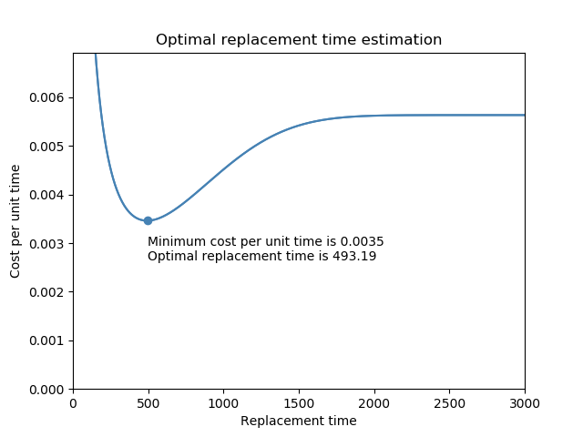

.. image:: images/logo.png

-------------------------------------

Optimal replacement time
''''''''''''''''''''''''

When conducting maintenance planning, we must optimise the frequency of preventative maintenance (PM) for the minimum overall cost. If PM is conducted too frequently then we will have high costs, but if not conducted often enough then failures will result and we incur the higher cost of corrective maintenance (CM). Depending on the underlying failure distribution, it is possible to model these costs for a range of PM intervals, with the lowest cost per unit time resulting from the optimal replacement time. This function calculates the cost per unit time to determine how cost varies with replacement time. The cost model can be used for HPP (ie. the maintenance makes the system "as good as new") or Power Law NHPP (ie. the maintenance makes the system "as good as old"). The default is for "as good as new". Currently, this model is only implemented to use the Weibull distribution as the underlying failure distribution.

Inputs:

-   cost_PM - cost of preventative maintenance (must be smaller than cost_CM)
-   cost_CM - cost of corrective maintenance (must be larger than cost_PM)
-   weibull_alpha - scale parameter of the underlying Weibull distribution
-   weibull_beta - shape parameter of the underlying Weibull distribution. Should be greater than 1 otherwise conducting PM is not economical.
-   q - restoration factor. q=1 is Power Law NHPP (as good as old), q=0 is HPP (as good as new). Default is q=0 (as good as new).
-   show_plot - True/False. Defaults to True. Other plotting keywords are also accepted and used.
-   print_results - True/False. Defaults to True

Outputs:

-   [ORT, min_cost] - the optimal replacement time and minimum cost per unit time in an array
-   Plot of cost model if show_plot is set to True. Use plt.show() to display it.
-   Printed results if print_results is set to True.

In the example below, we provide the cost of preventative maintenance (cost_PM), and the cost of corrective maintenance (cost_CM), as well as the weibull parameters of the failure distribution. Leaving the default outputs, we obtain a plot of the cost per unit time and the printed results. This example is based of the example provided on the `reliasoft article <http://www.reliawiki.org/index.php/Optimum_Replacement_Time_Example>`_.

.. code:: python

    from reliability.Repairable_systems import optimal_replacement_time
    import matplotlib.pyplot as plt
    optimal_replacement_time(cost_PM=1, cost_CM=5, weibull_alpha=1000, weibull_beta=2.5,q=0)
    plt.show()

    '''
    Cost model assuming as good as new replacement (q=0):
    The minimum cost per unit time is 0.0035 
    The optimal replacement time is 493.19
    '''

