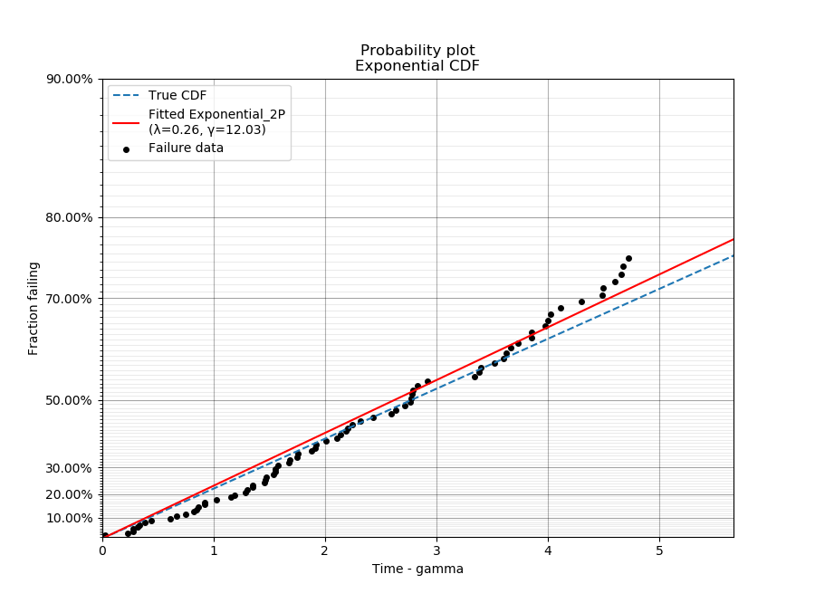

.. image:: images/logo.png

-------------------------------------

Probability plots
'''''''''''''''''

Proabability plots are a general term for several different plotting techniques. One of these techniques is a graphical method for comparing two data sets and includes `probability-probability <https://reliability.readthedocs.io/en/latest/Probability-Probability%20plots.html>`_ (PP) plots and `quantile-quantile <https://reliability.readthedocs.io/en/latest/Quantile-Quantile%20plots.html>`_ (QQ) plots. The second plotting technique is used for assessing the goodness of fit of a distribution by plotting the empirical CDF of the failures against their failure time and scaling the axes in such as way that the distribution appears linear. This method allows the reliability analyst to fit the distribution parameters using a simple "least squares" fitting method for a straight line and was popular before computers were capable of calculating the MLE estimates of the parameters. While we do not typically favour the use of least squares as a fitting method, we can still use probability plots to assess the goodness of fit.
The module ``reliability.Probability_plotting`` contains functions for each of the six distributions supported in ``reliability``. These functions are:

- Weibull_probability_plot
- Normal_probability_plot
- Lognormal_probability_plot
- Gamma_probability_plot
- Beta_probability_plot
- Exponential_probability_plot

There is also a function to obtain the plotting positions as well as the functions for custom axes scaling. These are explained more in the help file and will not be discussed further here.

Within each of the above probability plotting functions you may enter failure data as well as left or right censored data (either but not both). For those distributions that have a function in ``reliability.Fitters`` for fitting location shifted distributions (Weibull_3P, Gamma_3P, Exponential_2P), you can explicitly tell the probability plotting function to fit the gamma parameter using fit_gamma=True. By default the gamma parameter is not fitted. Fitting the gamma parameter will also change the x-axis to time-gamma such that everything will appear linear. An example of this is shown in the second example below.

Inputs:

- failures - the array or list of failure times
- right_censored - the array or list of right censored failure times
- left_censored - the array or list of left censored failure times
- fit_gamma - this is only included for Weibull, Gamma, and Exponential probability plots. Specify fit_gamma=True to fit the location shifted distribution.

Outputs:

- The plot is the only output. Use plt.show() to show it.

In the example below we generate some samples from a Normal Distribution and provide these to the probability plotting function. It is also possible to overlay other plots of the CDF as is shown by the dashed line.

.. code:: python

    from reliability.Distributions import Normal_Distribution
    from reliability.Probability_plotting import Normal_probability_plot
    import matplotlib.pyplot as plt
    dist = Normal_Distribution(mu=50,sigma=10)
    dist.CDF(linestyle='--',label='True CDF') #this is the actual distribution provided for comparison
    failures = dist.random_samples(100)
    Normal_probability_plot(failures=failures) #generates the probability plot
    plt.show()
    
.. image:: images/Normal_probability_plot.png

In this second example, we will fit an Exponential distribution to some right censored data. To create this data, we will draw it from an exponentail distribution that has a location shift of 12. Once again, the true CDF has also been plotted to provide the comparison. Note that the x-axis is time-gamma as it is necessary to subtract gamma from the x-plotting positions if we want the plot to appear linear.

.. code:: python

    from reliability.Distributions import Exponential_Distribution
    from reliability.Probability_plotting import Exponential_probability_plot
    import matplotlib.pyplot as plt
    dist = Exponential_Distribution(Lambda=0.25,gamma=12)
    Exponential_Distribution(Lambda=0.25).CDF(linestyle='--',label='True CDF') #we can't plot dist because it will be location shifted
    raw_data = dist.random_samples(100) #draw some random data from an exponential distribution
    #right censor the data at 17
    failures = []
    censored = []
    for item in raw_data:
        if item > 17:
            censored.append(17)
        else:
            failures.append(item)
    Exponential_probability_plot(failures=failures,right_censored=censored,fit_gamma=True) #do the probability plot. Note that we have specified to fit gamma
    plt.show()

