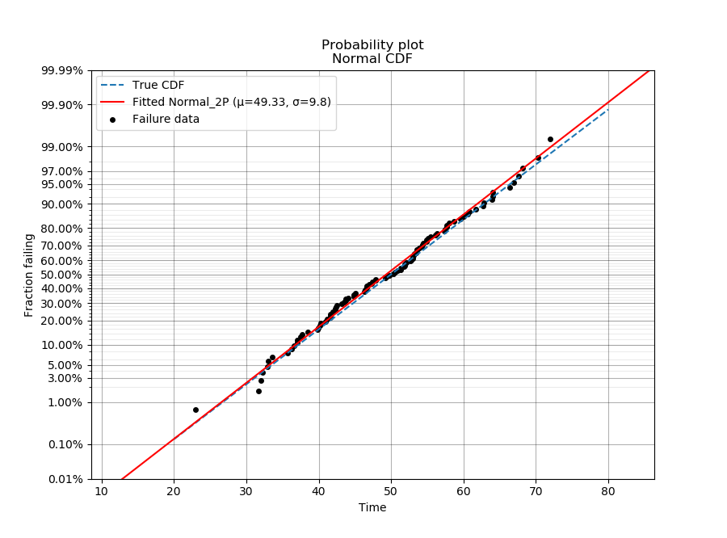
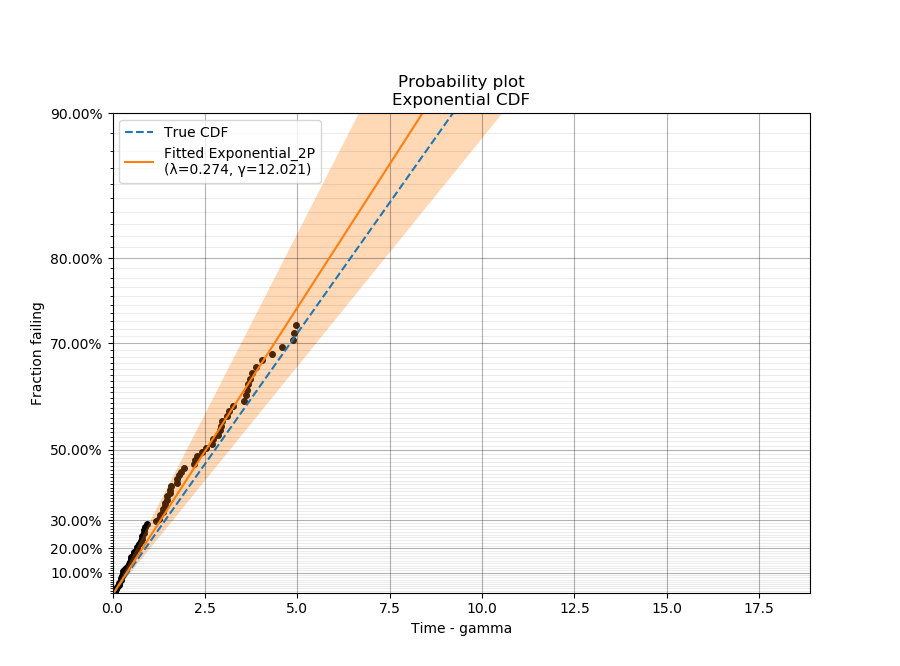
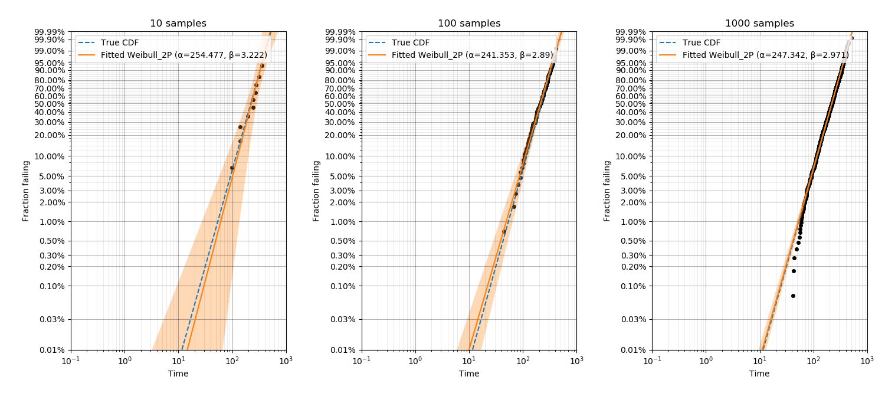
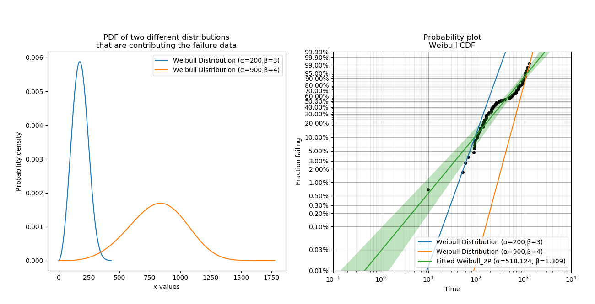
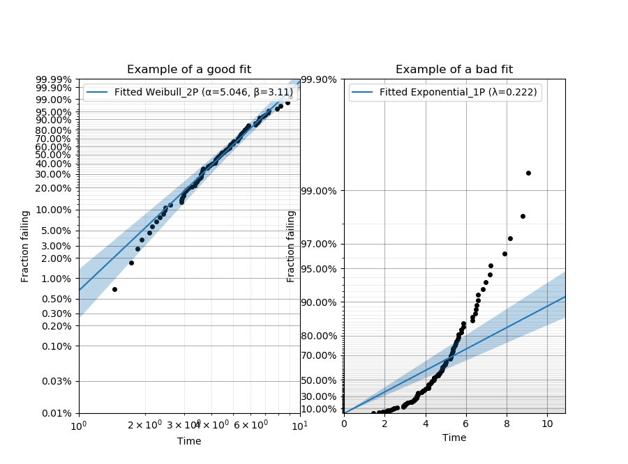

.. image:: images/logo.png

-------------------------------------

Probability plots
'''''''''''''''''

Proabability plots are a general term for several different plotting techniques. One of these techniques is a graphical method for comparing two data sets and includes `probability-probability <https://reliability.readthedocs.io/en/latest/Probability-Probability%20plots.html>`_ (PP) plots and `quantile-quantile <https://reliability.readthedocs.io/en/latest/Quantile-Quantile%20plots.html>`_ (QQ) plots. The second plotting technique is used for assessing the goodness of fit of a distribution by plotting the empirical CDF of the failures against their failure time and scaling the axes in such as way that the distribution appears linear. This method allows the reliability analyst to fit the distribution parameters using a simple "least squares" fitting method for a straight line and was popular before computers were capable of calculating the MLE estimates of the parameters. While we do not typically favour the use of least squares as a fitting method, we can still use probability plots to assess the goodness of fit.
The module ``reliability.Probability_plotting`` contains functions for each of the six distributions supported in ``reliability``. These functions are:

- Weibull_probability_plot
- Normal_probability_plot
- Lognormal_probability_plot
- Gamma_probability_plot
- Beta_probability_plot
- Exponential_probability_plot
- Exponential_probability_plot_Weibull_Scale

There is also a function to obtain the plotting positions as well as the functions for custom axes scaling. These are explained more in the help file and will not be discussed further here.

Within each of the above probability plotting functions you may enter failure data as well as right censored data. For those distributions that have a function in ``reliability.Fitters`` for fitting location shifted distributions (Weibull_3P, Gamma_3P, Lognormal_3P, Exponential_2P), you can explicitly tell the probability plotting function to fit the gamma parameter using fit_gamma=True. By default the gamma parameter is not fitted. Fitting the gamma parameter will also change the x-axis to time-gamma such that everything will appear linear. An example of this is shown in the second example below.

Note that the Beta and Gamma probability plots have their y-axes scaled based on the distribution's parameters so you will find that when you overlay two gamma or two beta distributions on the same gamma or beta probability paper, one will be a curved line if they have different shape parameters. This is unavoidable due to the nature of gamma and beta probability paper and is the reason why you will never find a hardcopy of such paper and also the reason why these distributions are not used in ALT probability plotting.

Inputs:

- failures - the array or list of failure times
- right_censored - the array or list of right censored failure times
- fit_gamma - this is only included for Weibull, Gamma, Lognormal, and Exponential probability plots. Specify fit_gamma=True to fit the location shifted distribution.
- h1 and h2 - these are the heuristic constants for plotting positions of the form (k-h1)/(n+h2). Default is h1=0.3,h2=0.4 which is the median rank method (same as in Minitab). You can specify any heuristic that follows this form. For more heuristics, see `wikipedia <https://en.wikipedia.org/wiki/Q%E2%80%93Q_plot#Heuristics>`_.
- show_fitted_distribution - True/False. If True, the fitted distribution will be plotted on the probability plot. Defaults to True. If you want a probability plot with just the data points and no line for the distribution then set this to False.
- plotting keywords are also accepted where relevant and they are mostly applied to the fitted distribution line. The exception to this is for color which defaults to red line and black points but if specified the chosen color will be applied to both line and points. This is useful when overlaying multiple datasets on a single probability plot.
- keyword arguments for the plot are accepted (eg. color, linestyle, marker)

Outputs:

- The plot is the only output. Use plt.show() to show it.

In the example below we generate some samples from a Normal Distribution and provide these to the probability plotting function. It is also possible to overlay other plots of the CDF as is shown by the dashed line.

.. code:: python

    from reliability.Distributions import Normal_Distribution
    from reliability.Probability_plotting import Normal_probability_plot
    import matplotlib.pyplot as plt
    dist = Normal_Distribution(mu=50,sigma=10)
    dist.CDF(linestyle='--',label='True CDF') #this is the actual distribution provided for comparison
    failures = dist.random_samples(100)
    Normal_probability_plot(failures=failures) #generates the probability plot
    plt.show()
    

In this second example, we will fit an Exponential distribution to some right censored data. To create this data, we will draw it from an Exponential distribution that has a location shift of 12. Once again, the true CDF has also been plotted to provide the comparison. Note that the x-axis is time-gamma as it is necessary to subtract gamma from the x-plotting positions if we want the plot to appear linear.

.. code:: python

    from reliability.Distributions import Exponential_Distribution
    from reliability.Probability_plotting import Exponential_probability_plot
    import matplotlib.pyplot as plt
    from reliability.Other_functions import make_right_censored_data

    dist = Exponential_Distribution(Lambda=0.25, gamma=12)
    raw_data = dist.random_samples(100, seed=42)  # draw some random data from an exponential distribution
    data = make_right_censored_data(raw_data, threshold=17)  # right censor the data at 17
    Exponential_Distribution(Lambda=0.25).CDF(linestyle='--', label='True CDF')  # we can't plot dist because it will be location shifted
    Exponential_probability_plot(failures=data.failures, right_censored=data.right_censored, fit_gamma=True)  # do the probability plot. Note that we have specified to fit gamma
    plt.show()

.. note:: The confidence intervals appear on the Exponential plot above but not in the Normal probability plot in the first example. This is because the confidence intervals are only available for the Exponential (1P and 2P) and Weibull (2P and 3P) fitters. This library is in active development and over the next few months the confidence intervals will be added to the Normal and Lognormal Fitters followed by the Gamma and Beta Fitters.

In this third example, we will see how probability plotting can be used to highlight the importance of getting as much data as possible. This code performs a loop in which increasing numbers of samples are used for fitting a Weibull distribution and the accuracy of the results (shown both in the legend and by comparison with the True CDF) increases with the number of samples.

.. code:: python

    from reliability.Distributions import Weibull_Distribution
    from reliability.Probability_plotting import Weibull_probability_plot
    import matplotlib.pyplot as plt

    dist = Weibull_Distribution(alpha=250, beta=3)
    for i, x in enumerate([10, 100, 1000]):
        plt.subplot(131 + i)
        dist.CDF(linestyle='--', label='True CDF')
        failures = dist.random_samples(x, seed=42)  # take 10, 100, 1000 samples
        Weibull_probability_plot(failures=failures)  # this is the probability plot
        plt.title(str(str(x) + ' samples'))
    plt.gcf().set_size_inches(15, 7)  # adjust the figuresize after creation. Necessary to do it after as it it automatically ajdusted within probability_plot
    plt.subplots_adjust(left=0.08, right=0.98, top=0.92, wspace=0.35)  # formatting for the figure layout
    plt.show()

In this fourth example, we will take a look at the special case of the Exponential probability plot using the Weibull Scale. This plot is essentially a Weibull probability plot, but the fitting and plotting functions are Exponential. The reason for plotting an Exponential distribution on Weibull probability paper is to achieve parallel lines for different Lambda parameters rather than having the lines radiating from the origin as we see in the Exponential probability plot on Exponential probability paper. This has applications in ALT probability plotting. An example of the differences between the plots are shown below. Remember that the alpha parameter from the Weibull distribution is equivalent to 1/Lambda from the Exponential distribution and a Weibull distribution with Beta = 1 is the same as an exponential distribution.

.. code:: python

    from reliability.Distributions import Exponential_Distribution
    from reliability.Probability_plotting import Exponential_probability_plot, Weibull_probability_plot, Exponential_probability_plot_Weibull_Scale
    import matplotlib.pyplot as plt

    data1 = Exponential_Distribution(Lambda=1 / 10, gamma=5).random_samples(50, seed=42)  # should give Lambda = 0.01 OR Weibull alpha = 10
    data2 = Exponential_Distribution(Lambda=1 / 100, gamma=5).random_samples(50, seed=42)  # should give Lambda = 0.001 OR Weibull alpha = 100
    plt.subplot(131)
    Exponential_probability_plot(failures=data1, fit_gamma=True)
    Exponential_probability_plot(failures=data2, fit_gamma=True)
    plt.subplot(132)
    Weibull_probability_plot(failures=data1, fit_gamma=True)
    Weibull_probability_plot(failures=data2, fit_gamma=True)
    plt.subplot(133)
    Exponential_probability_plot_Weibull_Scale(failures=data1, fit_gamma=True)
    Exponential_probability_plot_Weibull_Scale(failures=data2, fit_gamma=True)
    plt.gcf().set_size_inches(15, 7)
    plt.show()

.. image:: images/expon_weibull_scale_V2.png

In this final example, we take a look at how a probability plot can show us that there's something wrong with our assumption of a single distribution. To generate the data, the random samples are drawn from two different distributions which are shown in the left image. In the right image, the scatterplot of failure times is clearly non-linear. The red line is the attempt to fit a single Weibull_2P distribution and this will do a poor job of modelling the data. Also note that the points of the scatterplot do not fall on the True CDF of each distribution. This is because the median rank method of obtaining the plotting positions does not work well if the failure times come from more than one distribution. If you see a pattern like this, try a `mixture model <https://reliability.readthedocs.io/en/latest/Weibull%20mixture%20models.html>`_. Always remember that cusps, corners, and doglegs indicate a mixture of failure modes.

.. code:: python

    from reliability.Probability_plotting import Weibull_probability_plot
    import matplotlib.pyplot as plt
    import numpy as np

    dist_1 = Weibull_Distribution(alpha=200, beta=3)
    dist_2 = Weibull_Distribution(alpha=900, beta=4)
    plt.subplot(121)  # this is for the PDFs of the 2 individual distributions
    dist_1.PDF(label=dist_1.param_title_long)
    dist_2.PDF(label=dist_2.param_title_long)
    plt.legend()
    plt.title('PDF of two different distributions\nthat are contributing the failure data')
    plt.subplot(122)  # this will be the probability plot
    dist_1_data = dist_1.random_samples(50, seed=1)
    dist_2_data = dist_2.random_samples(50, seed=1)
    all_data = np.hstack([dist_1_data, dist_2_data])  # combine the failure data into one array
    dist_1.CDF(label=dist_1.param_title_long)  # plot each individual distribution for comparison
    dist_2.CDF(label=dist_2.param_title_long)
    Weibull_probability_plot(failures=all_data)  # do the probability plot
    plt.gcf().set_size_inches(13, 7)  # adjust the figuresize after creation. Necessary to do it after as it it automatically ajdusted within probability_plot
    plt.subplots_adjust(left=0.08, right=0.96)  # formatting the layout
    plt.legend(loc='lower right')
    plt.show()

What does a probability plot show me?
-------------------------------------

A probability plot shows how well your data is modelled by a particular distribution. By scaling the axes in such a way that the fitted distribution's CDF appears to be a straight line, we can judge whether the empirical CDF of the failure data (the black dots) are in agreement with the CDF of the fitted distribution. Ideally we would see that all of the black dots would lie on the straight line but most of the time this is not the case. A bad fit is evident when the line or curve formed by the black dots is deviating significantly from the straight line. We can usually tolerate a little bit of deviation at the tails of the distribution but the majority of the black dots should follow the line. A historically popular test was the `'fat pencil test' <https://support.minitab.com/en-us/minitab/18/help-and-how-to/statistics/basic-statistics/supporting-topics/normality/normal-probability-plots-and-the-fat-pencil-test/>`_ which suggested that if a fat pencil could cover the majority of the data points then the fit was probably suitable. Such a method makes no mention of the size of the plot window which could easily affect the result so it is best to use your own judgement and experience. This approach is not a substitute for statistical inference so it is often preferred to use quantitative measures for goodness of fit such as AICc and BIC. Despite being an imprecise measure, probability plots remain popular among reliability engineers and in reliability engineering software.

.. code:: python

    from reliability.Probability_plotting import Weibull_probability_plot, Exponential_probability_plot
    from reliability.Distributions import Weibull_Distribution
    import matplotlib.pyplot as plt
    
    data = Weibull_Distribution(alpha=5,beta=3).random_samples(100)
    plt.subplot(121)
    Weibull_probability_plot(failures=data)
    plt.title('Example of a good fit')
    plt.subplot(122)
    Exponential_probability_plot(failures=data)
    plt.title('Example of a bad fit')
    plt.show()

