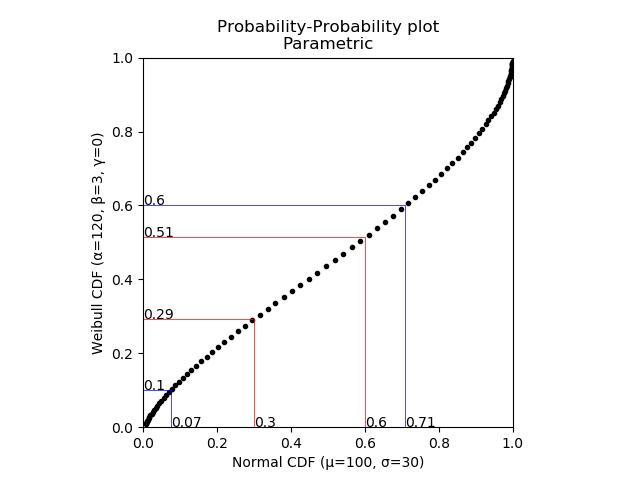
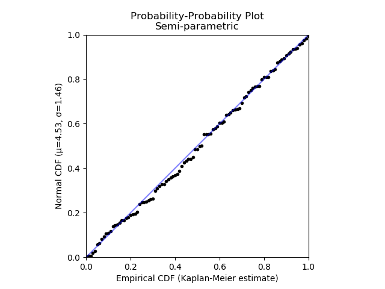

.. image:: images/logo.png

-------------------------------------

Probability-Probability plots
'''''''''''''''''''''''''''''

This section contains two different styles of probability-probability plots. These are the fully parametric probability-probability plot (``reliability.Probability_plotting.PP_plot_parametric``) and the semi-parametric probability-probability plot (``reliability.Probability_plotting.PP_plot_semiparametric``). These will be described separately below. A probability-probability (PP) plot is made by plotting the fraction failing (CDF) of one distribution vs the fraction failing (CDF) of another distribution. In the semiparametric form, when we only have the failure data and one hypothesised distribution, the CDF for the data can be obtained non-parametrically to generate an Empirical CDF.

Parametric Probability-Probability plot
---------------------------------------

To generate this plot we simply plot the CDF of one distribution vs the CDF of another distribution. If the distributions are very similar, the points will lie on the 45 degree diagonal. Any deviation from this diagonal indicates that one distribution is leading or lagging the other. Fully parametric PP plots are rarely used as their utility is limited to providing a graphical comparison of the similarity between two CDFs. To aide this comparison, the PP_plot_parametric function accepts x and y quantile lines that will be traced across to the other distribution.

Inputs:

-   X_dist - a probability distribution. The CDF of this distribution will be plotted along the X-axis.
-   Y_dist - a probability distribution. The CDF of this distribution will be plotted along the Y-axis.
-   y_quantile_lines - starting points for the trace lines to find the X equivalent of the Y-quantile. Optional input. Must be list or array.
-   x_quantile_lines - starting points for the trace lines to find the Y equivalent of the X-quantile. Optional input. Must be list or array.
-   show_diagonal_line - True/False. Default is False. If True the diagonal line will be shown on the plot.

Outputs:

-   The PP_plot is the only output. Use plt.show() to show it.

In the example below, we generate two parametric distributions and compare them using a PP plot. We are interested in the differences at specific quantiles so these are specified and the plot traces them across to the opposing distribution.

.. code:: python

    from reliability.Probability_plotting import PP_plot_parametric
    from reliability.Distributions import Weibull_Distribution,Normal_Distribution
    import matplotlib.pyplot as plt
    Field = Normal_Distribution(mu=100,sigma=30)
    Lab = Weibull_Distribution(alpha=120,beta=3)
    PP_plot_parametric(X_dist=Field, Y_dist=Lab, x_quantile_lines=[0.3, 0.6], y_quantile_lines=[0.1, 0.6])
    plt.show()

Semiparametric Probability-Probability plot
-------------------------------------------

A semiparametric PP plot is still a probability-probability plot, but since we only have one parametric distribution to give us the CDF, we must use the failure data to obtain the non-parametric estimate of the empirical CDF. To create a semiparametric PP plot, we must provide the failure data and the non-parametric method ('KM','NA','RA' for Kaplan-Meier, Nelson-Aalen, and Rank Adjustment respectively) to estimate the empirical CDF, and we must also provide the parametric distribution for the parametric CDF. The failure units (times, cycles, rounds fired, strength units, etc.) are the limiting values here so the parametric CDF is only calculated at the failure units since that is the result we get from the empirical CDF. Note that the empirical CDF also accepts X_data_right_censored just as KaplanMeier, NelsonAalen and RankAdjustment will also accept right censored data. If the fitted distribution is a good fit the PP plot will follow the 45 degree diagonal line. Assessing goodness of fit in a graphical way is the main purpose of this type of plot. The `Fit_everything <https://reliability.readthedocs.io/en/latest/Fitting%20all%20available%20distributions%20to%20data.html>`_ function also uses a semiparametric PP plot to show the goodness of fit in a graphical way.

Inputs:

-   X_data_failures - the failure times in an array or list. The empirical CDF of this data will be plotted along the X-axis.
-   X_data_right_censored - the right censored failure times in an array or list. This is an optional input.
-   Y_dist - a probability distribution. The CDF of this distribution will be plotted along the Y-axis.
-   method - 'KM', 'NA', or 'RA' for Kaplan-Meier, Nelson-Aalen, or Rank Adjustment. Default is 'KM'
-   show_diagonal_line - True/False. Default is True. If True the diagonal line will be shown on the plot.

Outputs:

-   The PP_plot is the only output. Use plt.show() to show it.

In the example below, we create 100 random samples from a Weibull distribution. We hypothesise that a Normal distribution may fit this data well so we fit the Normal distribution and then plot the CDF of the fitted distribution against the empirical CDF (obtained using the Kaplan-Meier estimate). We see that the plot follows the 45 degree diagonal quite well so we may consider that the fitted Normal distribution is reasonably good at describing this data. Ideally, this comparison should be made against other distributions as well and the graphical results are often hard to tell apart which is why we often use quantitative goodness of fit measures like AICc and BIC.

.. code:: python

    from reliability.Probability_plotting import PP_plot_semiparametric
    from reliability.Fitters import Fit_Normal_2P
    from reliability.Distributions import Weibull_Distribution
    import matplotlib.pyplot as plt
    data = Weibull_Distribution(alpha=5,beta=3).random_samples(100)
    dist = Fit_Normal_2P(failures=data,show_probability_plot=False,print_results=False).distribution
    PP_plot_semiparametric(X_data_failures=data,Y_dist=dist)
    plt.show()

To see how semiparametric PP plots compare with semiparametric QQ plots as a graphical goodness of fit test, please see the second example in the section on `comparing PP plots with QQ plots <https://reliability.readthedocs.io/en/latest/Quantile-Quantile%20plots.html#comparing-pp-plots-with-qq-plots>`_.
