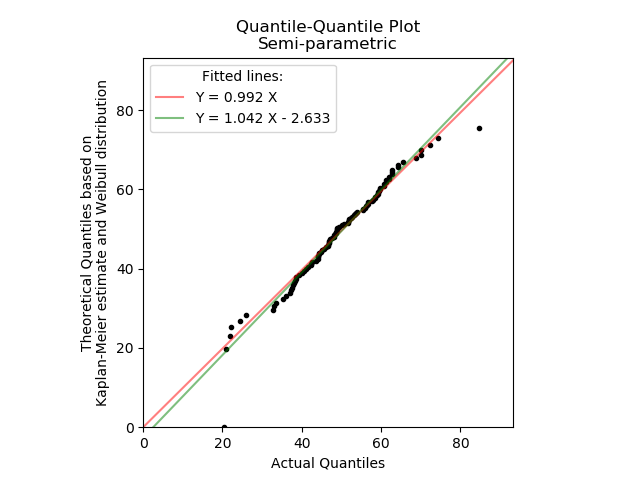
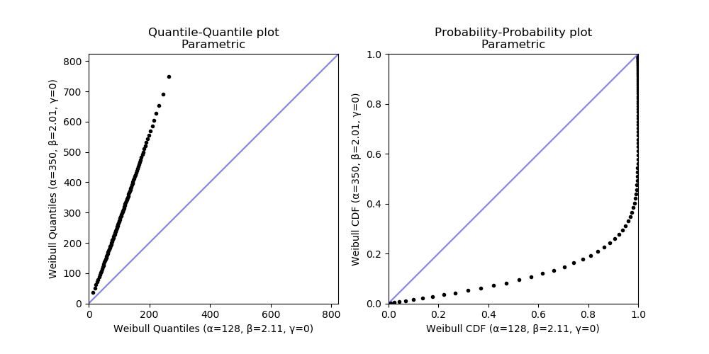
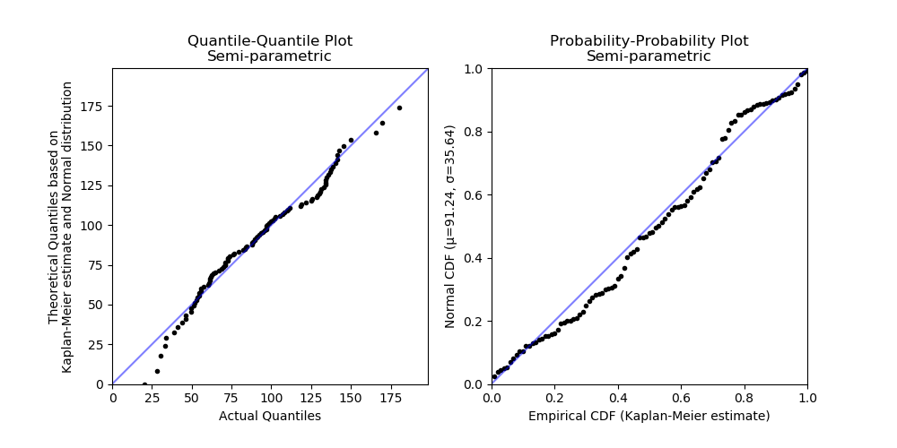

.. image:: images/logo.png

-------------------------------------

Quantile-Quantile plots
'''''''''''''''''''''''

This section contains two different styles of quantile-quantile plots. These are the fully parametric quantile-quantile plot (``reliability.Other_functions.QQ_plot_parametric``) and the semi-parametric quantile-quantile plot (``reliability.Other_functions.QQ_plot_semiparametric``). These will be described separately below. A quantile-quantile (QQ) plot is made by plotting failure units vs failure units for shared quantiles. A quantile is the fraction failing (ranging from 0 to 1).

Parametric Quantile-Quantile plot
---------------------------------

To generate this plot we calculate the failure units (these may be units of time, strength, cycles, landings, rounds fired, etc.) at which a certain fraction has failed (0.01,0.02,0.03...0.99). We do this for each distribution so we have an array of failure units and then we plot these failure units against eachother. The time (or any other failure unit) at which a given fraction has failed is found using the inverse survival function. If the distributions are similar in shape, then the QQ plot should be a reasonably straight line (but not necessarily a 45 degree line). By plotting the failure times at equal quantiles for each distribution we can obtain a conversion between the two distributions. Such conversions are useful for accelerated life testing (ALT) to easily convert field time to test time.

Inputs:

-   X_dist - a probability distribution. The failure times at given quantiles from this distribution will be plotted along the X-axis.
-   Y_dist - a probability distribution. The failure times at given quantiles from this distribution will be plotted along the Y-axis.
-   show_fitted_lines - True/False. Default is True. These are the Y=mX and Y=mX+c lines of best fit.
-   show_diagonal_line - True/False. Default is False. If True the diagonal line will be shown on the plot.

Outputs:

-   The QQ_plot will always be output. Use plt.show() to show it.
-   [m,m1,c1] - these are the values for the lines of best fit. m is used in Y=mX, and m1 and c1 are used in Y=m1X+c1

In the example below, we have determined that the field failures follow a Weibull distribution (α=350, β=2.01) with time represented in months. By using an accelerated life test we have replicated the failure mode and Weibull shape parameter reasonably closely and the Lab failures follow a Weibull distribution (α=128, β=2.11) with time measured in hours. We would like to obtain a simple Field-to-Lab conversion for time so we know how much lab time is required to simulate 10 years of field time. The QQ plot will automatically provide the equations for the lines of best fit. If we use the Y=mX equation we see that Field(months)=2.757×Lab(hours). Therefore, to simulate 10 years of field time (120 months) we need to run the accelerated life test for approximately 43.5 hours in the Lab.

.. code:: python

    from reliability.Other_functions import QQ_plot_parametric
    Field = Weibull_Distribution(alpha=350,beta=2.01)
    Lab = Weibull_Distribution(alpha=128,beta=2.11)
    QQ_plot_parametric(X_dist=Lab, Y_dist=Field)
    plt.show()
    
.. image:: images/QQparametric.png

Semiparametric Quantile-Quantile plot
-------------------------------------

This plot is still a Quantile-Quantile plot (plotting failure units vs failure units for shared quantiles), but instead of using two parametric distributions, we use the failure data directly as one set of quantiles. We then estimate what the quantiles of the parametric distribution would be and plot the parametric (theoretical) failure units against the actual failure units.
To generate this plot we begin with the failure units (these may be units of time, strength, cycles, landings, etc.). We then obtain an emprical CDF using either Kaplan-Meier or Nelson-Aalen. The empirical CDF gives us the quantiles we will use to equate the actual and theoretical failure times. Once we have the empirical CDF, we use the inverse survival function of the specified distribution to obtain the theoretical failure units and then plot the actual and theoretical failure units together. The primary purpose of this plot is as a graphical goodness of fit test. If the specified distribution is a good fit to the data then the QQ plot should be a reasonably straight line along the diagonal.

Inputs:

-   X_data_failures - the failure times in an array or list. These will be plotted along the X-axis.
-   X_data_right_censored - the right censored failure times in an array or list. Optional input.
-   Y_dist - a probability distribution. The quantiles of this distribution will be plotted along the Y-axis.
-   method - 'KM' or 'NA' for Kaplan-Meier or Nelson-Aalen. Default is 'KM'
-   show_fitted_lines - True/False. Default is True. These are the Y=mX and Y=mX+c lines of best fit.
-   show_diagonal_line - True/False. Default is False. If True the diagonal line will be shown on the plot.

Outputs:

-   The QQ_plot will always be output. Use plt.show() to show it.
-   [m,m1,c1] - these are the values for the lines of best fit. m is used in Y=mX, and m1 and c1 are used in Y=m1X+c1

In the example below, we generate 100 random samples from a Normal distribution. We then fit a Weibull_2P distribution to this data and using QQ_plot_semiparametric we compare the actual quantile (the original data) with the theoretical quantiles (from the fitted distribution). The lines of best fit are automatically provided and the Y=0.992X shows the relationship is very close to perfect with only some deviation around the tails of the distribution. The final example on this page compares a QQ_plot_semiparametric with a PP_plot_semiparametric for the same dataset to show the differences between the two.

.. code:: python

    from reliability.Other_functions import QQ_plot_semiparametric
    from reliability.Fitters import Fit_Weibull_2P
    DATA = Normal_Distribution(mu=50,sigma=12).random_samples(100)
    wbf = Fit_Weibull_2P(failures=DATA)
    dist = Weibull_Distribution(alpha=wbf.alpha,beta=wbf.beta)
    QQ_plot_semiparametric(X_data_failures=DATA,Y_dist=dist)
    plt.show()
    

Comparing PP plots with QQ plots
--------------------------------

In this example we compare a QQ_plot_parametric with a PP_plot_parametric for the same pair of distributions. Normally, it is not practical to compare the output of the two plots as they are so vastly different and are used for different purposes, but the comparison is provided for the reader's understanding. The differences between these plots are so significant because one is the time at which the fraction has failed (the Quantile) and the other is the fraction failing (the CDF). Parametric PP plots are not very common as their only use is in providing a graphical understanding of the differences between the CDFs of two distributions, such as how one lags or leads the other at various times. See `Probability-Probability plots <https://reliability.readthedocs.io/en/latest/Probability-Probability%20plots.html#parametric-probability-probability-plot>`_ for more detail on the uses of parametric PP plots.

.. code:: python

    from reliability.Other_functions import QQ_plot_parametric, PP_plot_parametric
    Field = Weibull_Distribution(alpha=350,beta=2.01)
    Lab = Weibull_Distribution(alpha=128,beta=2.11)
    plt.figure(figsize=(10,5))
    plt.subplot(121)
    QQ_plot_parametric(X_dist=Lab, Y_dist=Field,show_diagonal_line=True,show_fitted_lines=False)
    plt.subplot(122)
    PP_plot_parametric(X_dist=Lab, Y_dist=Field,show_diagonal_line=True)
    plt.show()

In this example we compare a QQ_plot_semiparametric with a PP_plot_semiparametric for the same dataset. Both plots are intended to be used as graphical goodness of fit tests. In a PP plot we get a lot of resolution in the center of the distributions, but less at the tails, whereas the QQ plot gives very good resolution at the tails, but less in the center. Because most data analysts are more concerned about the extremes (tails) of a distribution, QQ plots are the more commonly used plot between the two.

.. code:: python

    from reliability.Other_functions import PP_plot_semiparametric, QQ_plot_semiparametric
    from reliability.Fitters import Fit_Normal_2P
    DATA = Weibull_Distribution(alpha=100,beta=3).random_samples(100) #create some data
    nf = Fit_Normal_2P(failures=DATA) #fit a normal distribution
    dist = Normal_Distribution(mu=nf.mu,sigma=nf.sigma) #generate the Normal distribution using the fitted parameters
    plt.figure(figsize=(10,5))
    plt.subplot(121)
    QQ_plot_semiparametric(X_data_failures=DATA,Y_dist=dist,show_fitted_lines=False,show_diagonal_line=True)
    plt.subplot(122)
    PP_plot_semiparametric(X_data_failures=DATA,Y_dist=dist)
    plt.show()

