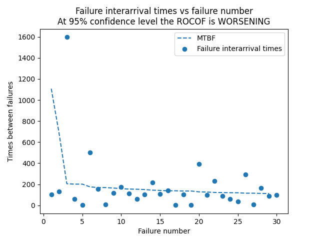

.. image:: images/logo.png

-------------------------------------

ROCOF
'''''

Rate of occurrence of failures (ROCOF) is used to model the trend (constant, increasing, decreasing) in the failure interarrival times. For a repairable system, we want the ROCOF to be improving (failure interarrival times to be increasing). As failure times can often appear quite random, it is necessary to conduct a statistical test to determine if there is a statistically significant trend, and if there is a trend we can then model that trend using a Power Law NHPP. The test for statistical significance is the Laplace test which compares the Laplace test statistic (U) with the z value (z_crit) from the standard Normal Distribution. If there is a statistically significant trend, the parameters of the model (Lambda_hat and Beta_hat) are calculated. By default the results are printed and a plot of the failure interarrival times and MTBF is plotted.

Inputs:

-   times_between_failures - these are the failure interarrival times.
-   failure_times - these are the actual failure times.
   .. note::
       1. You can specify either times_between_failures OR failure_times but not both. Both options are provided for convenience so the conversion between the two is done automatically. failure_times should be the same as np.cumsum(times_between_failures).
       2. The repair times are assumed to be negligible. If the repair times are not negligibly small then you will need to manually adjust your input (failure_times or times_between_failures) to factor in the actual repair times.
-   test_end - use this to specify the end of the test if the test did not end at the time of the last failure.
-   CI - the confidence interval for the Laplace test. Default is 0.95 for 95% CI.
-   show_plot - True/False. Default is True. Plotting keywords are also accepted (eg. color, linestyle).
-   print_results - True/False. Default is True

Outputs:

-   U - The Laplace test statistic
-   z_crit - (lower,upper) bound on z value. This is based on the CI.
-   trend - 'improving','worsening','constant'. This is based on the comparison of U with z_crit
-   Beta_hat - the Beta parameter for the NHPP Power Law model. Only calculated if the trend is not constant.
-   Lambda_hat - the Lambda parameter for the NHPP Power Law model. Only calculated if the trend is not constant.
-   ROCOF - the Rate of Occurrence Of Failures. Only calculated if the trend is constant. If trend is not constant then ROCOF changes over time in accordance with Beta_hat and Lambda_hat.
-   printed results. Only printed if print_results is True.
-   plotted results. Only plotted if plot_results is True. Use plt.show() to display it.

In the example below, we provide the failure interarrival times. The function will run the Laplace test using the default 95% confidence interval and then, when a trend is found, it will plot the MTBF based on the calculated NHPP Power Law model. MTBF = 1/ROCOF. This example is based on Example 5.11 (p275) from Reliability Engineering and Risk analysis listed in the `recommended resources <https://reliability.readthedocs.io/en/latest/Recommended%20resources.html>`_.

.. code:: python

   from reliability.Repairable_systems import ROCOF
   import matplotlib.pyplot as plt
   t = [104,131,1597,59,4,503,157,6,118,173,114,62,101,216,106,140,1,102,3,393,96,232,89,61,37,293,7,165,87,99]
   ROCOF(times_between_failures=t)
   plt.show()

   '''
   Results from ROCOF analysis:
   Laplace test results: U = 2.409, z_crit = (-1.96,+1.96)
   At 95% confidence level the ROCOF is WORSENING. Assume NHPP.
   ROCOF assuming NHPP has parameters: Beta_hat = 1.588 , Lambda_hat = 3.703e-05
   '''
    

