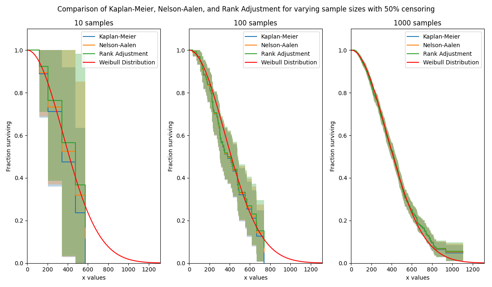
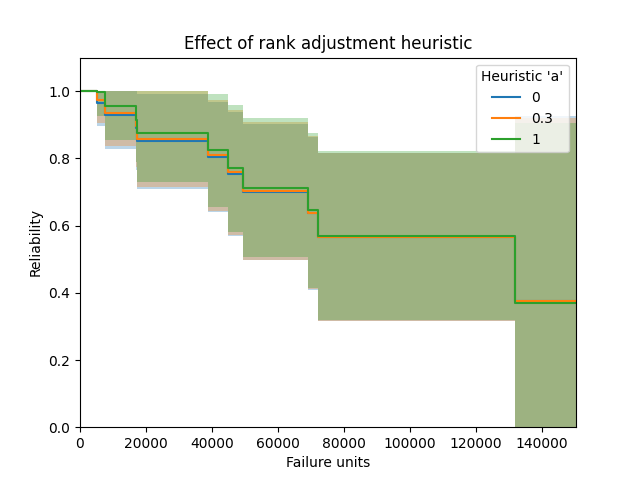

.. image:: images/logo.png

-------------------------------------

Rank Adjustment
'''''''''''''''

The Rank Adjustment estimator provides a method by which to estimate the survival function (reliability function) of a population without assuming that the data comes from a particular distribution. Due to the lack of parameters required in this model, it is a non-parametric method of obtaining the survival function. With a few simple transformations, the survival function (SF) can be used to obtain the cumulative hazard function (CHF) and the cumulative distribution function (CDF). It is not possible to obtain a useful version of the probability density function (PDF) or hazard function (HF) as this would require the differentiation of the CDF and CHF respectively, which results in a very spikey plot due to the non-continuous nature of these plots.

The Rank Adjustment estimator is very similar in result (but quite different in method) to the `Kaplan-Meier estimator <https://reliability.readthedocs.io/en/latest/Kaplan-Meier.html>`_ and `Nelson-Aalen estimator <https://reliability.readthedocs.io/en/latest/Nelson-Aalen.html>`_. While none of the three has been proven to be more accurate than the others, the Kaplan-Meier estimator is generally more popular as a non-parametric means of estimating the SF. Confidence intervals are provided using the `Greenwood method <https://support.minitab.com/en-us/minitab/18/help-and-how-to/modeling-statistics/reliability/how-to/nonparametric-distribution-analysis-right-censoring/methods-and-formulas/estimation-methods/#confidence-intervals>`_ with Normal approximation.

The Rank Adjustment estimator can be used with both complete and right censored data. This function can be accessed from `reliability.Nonparametric.RankAdjustment`. The Rank-adjustment algorithm is the same as is used in Probability_plotting.plotting_positions to obtain the y-values for the scatter plot. As with plotting_positions, the heuristic constant "a" is accepted, with the default being 0.3 for median ranks.

Inputs:

-   failures - an array or list of failure times. Sorting is automatic so times do not need to be provided in any order.
-   right_censored - an array or list of right censored failure times. Defaults to None.
-   show_plot - True/False. Default is True. Plots the CDF, SF, or CHF as specified by plot_type.
-   plot_type - 'SF', 'CDF', or 'CHF'. Default is 'SF'.
-   print_results - True/False. Default is True. Will display a pandas dataframe in the console.
-   plot_CI - shades the upper and lower confidence interval
-   CI - confidence interval between 0 and 1. Default is 0.95 for 95% CI.
-   a - the heuristic constant for plotting positions of the form (k-a)/(n+1-2a). Default is a=0.3 which is the median rank method (same as the default in Minitab). Must be in the range 0 to 1. For more heuristics, see `Wikipedia <https://en.wikipedia.org/wiki/Q%E2%80%93Q_plot#Heuristics>`_.

Outputs:

-   results - dataframe of results for the SF
-   RA - list of rank-adjustment column from results dataframe. This column is the non parametric estimate of the Survival Function (reliability function).
-   xvals - the x-values to plot the stepwise plot as seen when show_plot=True
-   SF - survival function stepwise values (these differ from the RA values as there are extra values added in to make the plot into a step plot)
-   CDF - cumulative distribution function stepwise values
-   CHF - cumulative hazard function stepwise values
-   SF_lower - survival function stepwise values for lower CI
-   SF_upper - survival function stepwise values for upper CI
-   CDF_lower - cumulative distribution function stepwise values for lower CI
-   CDF_upper - cumulative distribution function stepwise values for upper CI
-   CHF_lower - cumulative hazard function stepwise values for lower CI
-   CHF_upper - cumulative hazard function stepwise values for upper CI

Other plotting keywords (such as color, label, linestyle, etc.) are accepted and used on the point estimate line. The color of the confidence intervals is matched automatically to the point estimate line, but no other keywords are carried across to the confidence interval plot as it is only a shaded region.

Example 1
---------

In this first example, we will see how Rank Adjustment compares with Kaplan-Meier and Nelson-Aalen for a large censored dataset. The plots show these three methods arrive at a similar result, with Kaplan-Meier giving the lowest estimate of the survival function, followed by Nelson-Aalen, and finally Rank-Adjustment. Note that this is when the median ranks are used in the Rank Adjustment heuristic. As sample size is increased, the differences between the three methods reduces.

.. code:: python

    import matplotlib.pyplot as plt
    from reliability.Other_functions import make_right_censored_data
    from reliability.Nonparametric import KaplanMeier, NelsonAalen, RankAdjustment
    from reliability.Distributions import Weibull_Distribution
    
    dist = Weibull_Distribution(alpha=500, beta=2)
    
    plt.figure(figsize=(12, 7))
    samples = [10, 100, 1000]
    for i, s in enumerate(samples):
        raw_data = dist.random_samples(number_of_samples=s, seed=42)
        data = make_right_censored_data(data=raw_data, fraction_censored=0.5, seed=42)  # this will multiply-censor 50% of the data
        plt.subplot(131 + i)
        KaplanMeier(failures=data.failures, right_censored=data.right_censored, print_results=False, show_plot=True, label='Kaplan-Meier')
        NelsonAalen(failures=data.failures, right_censored=data.right_censored, print_results=False, show_plot=True, label='Nelson-Aalen')
        RankAdjustment(failures=data.failures, right_censored=data.right_censored, print_results=False, show_plot=True, label='Rank Adjustment')
        dist.SF(label='Weibull Distribution', color='red')
        plt.title(str(str(s) + ' samples'))
        plt.legend()
    plt.suptitle('Comparison of Kaplan-Meier, Nelson-Aalen, and Rank Adjustment for varying sample sizes with 50% censoring')
    plt.tight_layout()
    plt.show()
    

Example 2
---------

In this second example we will look at the effect of the plotting heuristic "a". The default heuristic used is 0.3 which gives the median ranks, but there are many `other heuristics <https://en.wikipedia.org/wiki/Q%E2%80%93Q_plot#Heuristics>`_ available by varying a from 0 to 1. Here we will look at the effect of setting "a" to be 0, 0.3, and 1. The effect is fairly minimal, though there is a small difference (which reduces as sample size increases) leading to the use of different heuristics. The median ranks (a=0.3) is most popular and is the default in most reliability engineering software for obtaining the plotting positions.

.. code:: python

    from reliability.Nonparametric import RankAdjustment
    import matplotlib.pyplot as plt
    
    f = [5248, 7454, 16890, 17200, 38700, 45000, 49390, 69040, 72280, 131900]
    rc = [3961, 4007, 4734, 6054, 7298, 10190, 23060, 27160, 28690, 37100, 40060, 45670, 53000, 67000, 69630, 77350, 78470, 91680, 105700, 106300, 150400]
    a_trials = [0, 0.3, 1]
    for a in a_trials:
        RankAdjustment(failures=f, right_censored=rc, print_results=False, a=a, label=str(a))
    plt.legend(title="Heuristic 'a'")
    plt.title('Effect of rank adjustment heuristic')
    plt.show()

