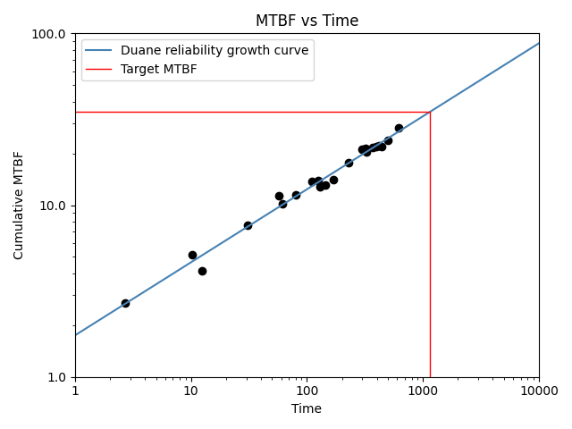
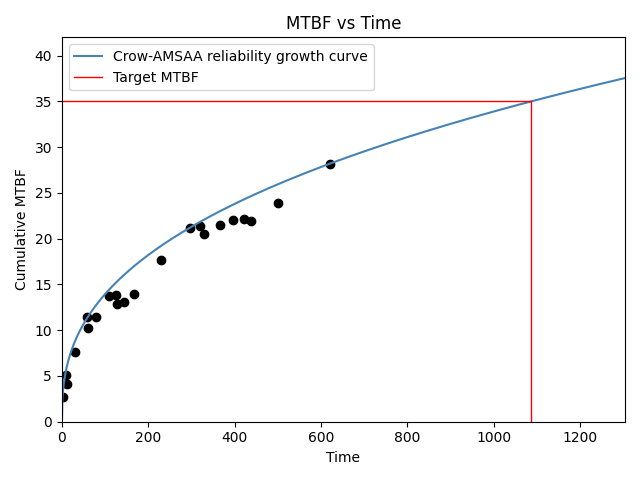
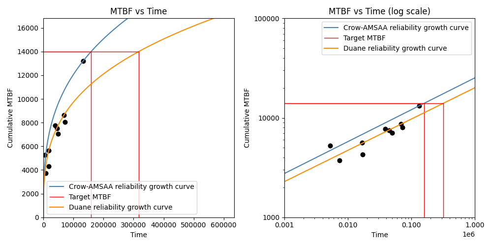

.. image:: images/logo.png

-------------------------------------

Reliability growth
''''''''''''''''''

The reliability of a non-repairable component always decreases with time, but for repairable systems the term "reliability growth" refers to the process of gradual product improvement through the elimination of design deficiencies.
In repairable systems, reliability growth is observable through an increase in the interarrival times of failures.
Reliability growth is applicable to all levels of design decomposition from complete systems down to components.
The maximum achieveable reliability is locked in by design, so reliability growth above the design reliability is only possible through design changes.
It may be possible to achieve some reliability growth through other improvements (such as optimizing the maintenance program) though these improvements will only help the system to achieve its design reliability.

The function `Repairable_systems.reliability_growth` fits a model to the failure times so that the growth (or deterioration) of the mean time between failures (MTBF) can be predicted.
The two models available within `reliability` are the Duane model and the Crow-AMSAA model.

In both the Duane and Crow-AMSAA models, the input is a list of failure times (actual times not interarrival times).
The point estimate for the cumulative MTBF is calculated as :math:`\frac{\textrm{failure times}}{\textrm{failure numbers}}`.
This produces the scatter plot shown in the plots below.

The smooth curve shows the model (Duane or Crow-AMSAA) that is fitted to the data. The forumlation of these models is explained below.

Duane model
"""""""""""

The algorithm to fit the model is as follows:

1. accept an input of the failures times and sort the times in ascending order. Let the largest time be :math:`T`.
2. create an array of failure numbers from :math:`1` to :math:`n`.
3. calculate :math:`MTBF_{cumulative} = \frac{\textrm{failure times}}{\textrm{failure numbers}}`. This is the scatter points seen on the plot.
4. Convert to log space: :math:`x = ln(\textrm{failure times})` and :math:`y = ln(MTBF_{cumulative})`
5. fit a straight line (:math:`y=m . x + c`) to the data to get the model parameters.
6. extract the model parameters from the parameters of the straight line, such that :math:`\alpha = m` and :math:`b = exp(c)`

This gives us the model parameters of :math:`b` and :math:`\alpha`. The formulas for the other reported values are:

:math:`DMTBF_C = b.(T^{\alpha})`. This is the demonstrated MTBF (cumulative) and is reported in the results as DMTBF_C.

:math:`DFI_C = \frac{1}{DMTBF_C}`. This is the demonstrated failure intensity (cumulative) and is reported in the results as DFI_C.

:math:`DFI_I = DFI_C . (1 - \alpha)`. This is the demonstrated failure intensity (instantaneous) and is reported in the results as DFI_I.

:math:`DMTBF_I = \frac{1}{DFI_I}`. This is the demonstrated MTBF (instantaneous) and is reported in the results as DMTBF_I.

:math:`A = \frac{1}{b}`. This is reported in the results as A.

The time to reach the target MTBF is calculated as :math:`t_{target} = \left( \frac{\textrm{target MTBF}}{b} \right)^{\frac{1}{\alpha}}`

For more information see `reliawiki <http://reliawiki.org/index.php/Duane_Model>`_.

Crow-AMSAA model
""""""""""""""""

The algorithm to fit the model is as follows:

1. accept an input of the failures times and sort the times in ascending order. Let the largest time be :math:`T`.
2. create an array of failure numbers from :math:`1` to :math:`n`.
3. calculate :math:`MTBF_{cumulative} = \frac{\textrm{failure times}}{\textrm{failure numbers}}`. This is the scatter points seen on the plot.
4. calculate :math:`\beta = \frac{n}{n . ln(T) - \sum ln(\textrm{failure times})}`
5. calculate :math:`\lambda = \frac{n}{T^{\beta}}`

This gives us the model parameters :math:`\beta` and :math:`\lambda`. The formulas for the other reported values are:

:math:`growth rate = 1 - \beta`. This is reported in the results as growth_rate.

:math:`DMTBF_I = \frac{1}{\lambda . \beta . T^{\beta - 1}}`. This is the demonstrated MTBF (instantaneous) and is reported in the results as DMTBF_I.

:math:`DFI_I = \frac{1}{DMTBF_I}`. This is the demonstrated failure intensity (instantaneous) and is reported in the results as DFI_I.

:math:`DMTBF_C = \frac{T^{1 - \beta}}{\lambda}`. This is the demonstrated MTBF (cumulative) and is reported in the results as DMTBF_C.

:math:`DFI_C = \frac{1}{DMTBF_C}`. This is the demonstrated failure intensity (cumulative) and is reported in the results as DFI_C.

The time to reach the target MTBF is calculated as :math:`t_{target} = \left(\frac{1}{\lambda . \textrm{target_MTBF}} \right)^ \frac{1}{\beta - 1}`

For more information see `reliawiki <http://reliawiki.org/index.php/Crow-AMSAA_(NHPP)>`_.

.. admonition:: API Reference

   For inputs and outputs see the `API reference <https://reliability.readthedocs.io/en/latest/API/Repairable_systems/reliability_growth.html>`_.

Example 1
"""""""""

In this first example, we import a dataset and fit the Duane model. Log_scale is set to True (which only affects the plot). The target MTBF is 35 which will give us the time to reach the target MTBF based on the model.

.. code:: python

    from reliability.Repairable_systems import reliability_growth
    from reliability.Datasets import system_growth
    import matplotlib.pyplot as plt
    reliability_growth(times=system_growth().failures, model="Duane", target_MTBF=35, log_scale=True)
    plt.show()

    '''
    Duane reliability growth model parameters:
    Alpha: 0.42531
    A: 0.57338
    Demonstrated MTBF (cumulative): 26.86511
    Demonstrated MTBF (instantaneous): 46.74719
    Demonstrated failure intensity (cumulative): 0.037223
    Demonstrated failure intensity (instantaneous): 0.021392
    Time to reach target MTBF: 1154.77862
    '''

Example 2
"""""""""

In this second example, we are using the same failure times as the example above, but now we are fitting the Crow-AMSAA model. The MTBF plot is in linear scale since log_scale has not been specified and it defaults to False.
Once again, the target MTBF of 35 is specified and the results tell us the time to reach this target.

.. code:: python

    from reliability.Repairable_systems import reliability_growth
    from reliability.Datasets import system_growth
    import matplotlib.pyplot as plt

    reliability_growth(times=system_growth().failures, model="Crow-AMSAA", target_MTBF=35)
    plt.show()

    '''
    Crow-AMSAA reliability growth model parameters:
    Beta: 0.61421
    Lambda: 0.42394
    Growth rate: 0.38579
    Demonstrated MTBF (cumulative): 28.18182
    Demonstrated MTBF (instantaneous): 45.883
    Demonstrated failure intensity (cumulative): 0.035484
    Demonstrated failure intensity (instantaneous): 0.021795
    Time to reach target MTBF: 1087.18769
    '''

Example 3
"""""""""

In this third example, we will compare the two models in both linear space (left plot) and log space (right plot).
The fit of the Duane model through the points seems much better than is achieved by the Crow-AMSAA model, though this depends on the dataset.
The Crow-AMSAA model places a strong emphasis on the last data point and will always ensure the model passes through this point.
Depending on whether the last data point sits above or below the average will affect whether the Crow-AMSAA model is more optimistic (higher) or pessimistic (lower) in its prediction of the achieved MTBF than that which is predicted by the Duane model.

.. code:: python

    from reliability.Repairable_systems import reliability_growth
    from reliability.Datasets import automotive
    import matplotlib.pyplot as plt
    
    plt.figure(figsize=(10,5))
    plt.subplot(121)
    reliability_growth(times=automotive().failures, model="Crow-AMSAA", target_MTBF=14000)
    reliability_growth(times=automotive().failures, model="Duane", target_MTBF=14000,color='darkorange')
    plt.subplot(122)
    reliability_growth(times=automotive().failures, model="Crow-AMSAA", target_MTBF=14000,print_results=False,log_scale=True)
    reliability_growth(times=automotive().failures, model="Duane", target_MTBF=14000,color='darkorange',print_results=False,log_scale=True)
    plt.title('MTBF vs Time (log scale)')
    plt.show()

    '''
    Crow-AMSAA reliability growth model parameters:
    Beta: 0.67922
    Lambda: 0.0033282
    Growth rate: 0.32078
    Demonstrated MTBF (cumulative): 13190
    Demonstrated MTBF (instantaneous): 19419.22019
    Demonstrated failure intensity (cumulative): 7.5815e-05
    Demonstrated failure intensity (instantaneous): 5.1495e-05
    Time to reach target MTBF: 158830.62457
    
    Duane reliability growth model parameters:
    Alpha: 0.3148
    A: 0.0038522
    Demonstrated MTBF (cumulative): 10620.71841
    Demonstrated MTBF (instantaneous): 15500.20608
    Demonstrated failure intensity (cumulative): 9.4156e-05
    Demonstrated failure intensity (instantaneous): 6.4515e-05
    Time to reach target MTBF: 317216.14347
    '''

.. note:: The function ``reliability_growth`` was completely rewritten in v0.8.0 to match the method used by Reliasoft. Prior to v0.8.0, only the Duane model was available, and the values returned were for a model with a completely different parameterisation.
