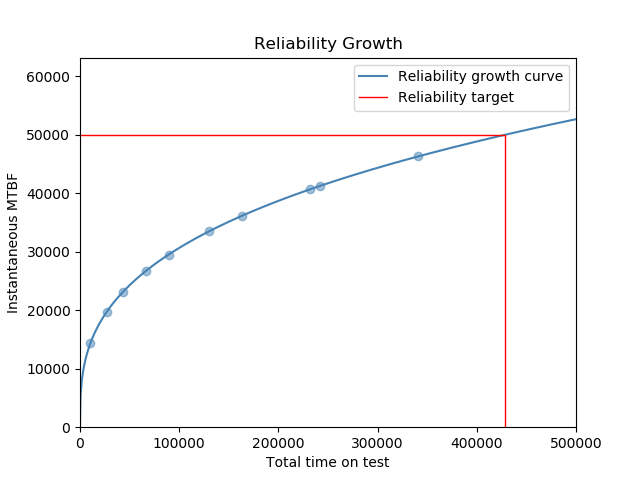

.. image:: images/logo.png

-------------------------------------

Reliability growth
''''''''''''''''''

Reliability growth occurs involves gradual product improvement through the elimination of design deficiencies. In repairable systems, reliability growth is observable through an increase in the interarrival times of failures. Reliability growth is applicable to all levels of design decomposition from complete systems down to components.

The Duane method of modeling reliability growth involves the use of the total time on test [t] (we may also use distance, cycles, etc.) when the failure occurred and the sequence of the failure [N]. The cumulative mean time between failures (MTBF) is t/N. By plotting ln(t) vs ln(t/N) we obtain a straight line which is used to model the instantaneous MTBF in the form (t^(1-beta))/(lambda*beta). The function ``reliability_growth`` accepts the failure times and performs this model fitting to obtain the parameters lambda and beta, as well as produce the reliability growth plot. It is often of interest to know how much total time on test we need to meet a target MTBF. This can be found analytically and is included in this function.

Inputs:

-   times - array of list of failure times
-   xmax - xlim to plot up to. Default is 1.5*max(times)
-   target_MTBF - specify the target MTBF to obtain the total time on test required to reach it.
-   show_plot - True/False. Defaults to True. Other keyword arguments (such as color, title, etc) are also accepted and used.
-   print_results - True/False. Defaults to True.
    
Outputs:

-   [Lambda, beta, time_to_target] - Array of results. Time to target is only returned if target_MTBF is specified.
-   If show_plot is True, it will plot the reliability growth. Use plt.show() to show the plot.
-   If print_results is True, it will print a summary of the fitted parameters and time to target MTBF (if target is specified).

In the example below, we supply the total time on test when each failure occurred, and we also supply the target_MTBF as 50000 so that we can find out how much total time on test will be needed to reach the target MTBF.

.. code:: python

    from reliability.Other_functions import reliability_growth
    import matplotlib.pyplot as plt
    times = [10400,26900,43400,66400,89400,130400,163400,232000,242000,340700]
    out = reliability_growth(times=times,target_MTBF=50000,label='Reliability growth curve',xmax=500000)
    plt.legend()
    plt.show()
    
    '''
    Reliability growth model parameters:
    lambda: 0.002355878294089656 
    beta: 0.6638280053477188
    Time to reach target MTBF: 428131.18039448344
    '''

