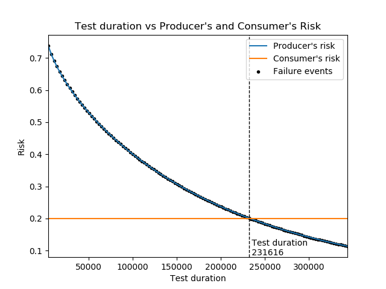

.. image:: images/logo.png

-------------------------------------

Reliability test duration
'''''''''''''''''''''''''

This function is an extension of the `reliability_test_planner <https://reliability.readthedocs.io/en/latest/Reliability%20test%20planner.html>`_ which allows users to calculate the required duration for a reliability test to achieve the specified producers and consumers risks. This is done based on the specified MTBF (mean time between failure) required and MTBF design (the MTBF that the manufacturer believes the system has been designed to).

This type of determination must be made when organisations looking to test an item are uncertain of how much testing is required, but they know the amount of risk they are willing to accept as well as the MTBF required and the MTBF to which the item has been designed.

Inputs:

-   MTBF_required - the required MTBF that the equipment must demonstrate during the test.
-   MTBF_design - the design target for the MTBF that the producer aims to achieve.
-   consumer_risk - the risk the consumer is accepting. This is the probability that a bad product will be accepted as a good product by the consumer.
-   producer_risk - the risk the producer is accepting. This is the probability that a good product will be rejected as a bad product by the consumer.
-   one_sided - default is True. The risk is analogous to the confidence interval, and the confidence interval can be one sided or two sided.
-   time_terminated - default is True. whether the test is time terminated or failure terminated. Typically it will be time terminated if the required test duration is sought.
-   show_plot - True/False. Default is True. This will create a plot of the risk vs test duration. Use plt.show() to show it.
-   print_results - True/False. Default is True. This will print the results to the console.

Outputs:

-   test duration
-   If print_results is True, all the variables will be printed to the console.
-   If show_plot is True a plot of producer's and consumer's risk Vs test duration will be generated. Use plt.show() to display it.

Example 1
*********

In the example below the consumer requires a vehicle to achieve an MTBF of 2500km and is willing to accept 20% risk that they accept a bad item when they should have rejected it. The producer has designed the vehicle to have an MTBF of 3000km and they are willing to accept 20% risk that the consumer rejects a good item when they should have accepted it. How many kilometres should the reliability test be? Using the function we find the test needs to be 231616 km. Note that this duration is the total time on test and may be split across several vehicles. See the discussion points below on whether to split the test duration up among multiple vehicles.

.. code:: python

    from reliability.Reliability_testing import reliability_test_duration
    import matplotlib.pyplot as plt
    reliability_test_duration(MTBF_required=2500, MTBF_design=3000, consumer_risk=0.2, producer_risk=0.2)
    plt.show()
    
    '''
    Reliability Test Duration Solver for time-terminated test:
    Required test duration: 231615.79491309822
    Specified consumer's risk: 0.2
    Specified producer's risk: 0.2
    Specified MTBF required by the consumer: 2500
    Specified MTBF designed to by the producer: 3000
    '''

Splitting the test up among several vehicles has both positives and negatives as follows:

**Advantages of testing on only a few vehicles**

- We can observe the failure behaviour later in life. If we tested 50 vehices to 4632km each then we are unlikely to observe failures that typically occur after 50000km.
- It costs us less in vehicles since each vehicle has some of its life consumed during the testing.
- We may not have many items available for testing, particularly if it is a prototype that is yet to enter full production.
- We may not have many test facilities available so keeping the number of vehicles to a small number is often limited by the availability of the test facilities.

**Advantages of splitting the testing up between many vehicles**

- It is more representative of the population since all the testing on a single vehicle may not be accurate if that one vehicle is above or below average quality compared to the rest of the vehicles.
- Testing can be done faster which also means less cost on testing facilities. Reliability testing is often something that Project managers will put pressure on to cut if the project is falling behind schedule so using more vehicles may be a way to get the same amount of reliability testing done faster.

How does the algorithm work?
****************************

The underlying method is as follows:

Step 1) Begin with failures = 1. This will be iterated later.

Step 2) Using the function `Reliability_testing.reliability_test_planner <https://reliability.readthedocs.io/en/latest/Reliability%20test%20planner.html>`_, we set CI = 1-consumer_risk, MTBF = MTBF_required to solve for the test_duration that is achieved by this test. This is the test duration required if there was 1 failure which would give the specified MTBF required and specified consumer's risk.

Step 3) We again use the function Reliability_testing.reliability_test_planner but this time we set MTBF = MTBF_design and use the test_duration as the output from step 2. Still keeping failures = 1 we are solving for the CI achieved. This is effectively the producer's risk for the given test_duration and number of failures.

Step 4) The answer is higher than the specified producer's risk, so we now repeat steps 2 and 3 by increasing the number of failures by 1 each iteration. This is continued until the producer's risk is below what was specified. We then go back 1 failure since is it standard that the producer's risk can't be below what was specified (or the consumer may think the producer is cheating by lowering their risk).

We now have a value for test_duration that will give our required outputs in both equations. We also happen to arrive at the number of failures, though this is not particularly relevant since it is just part of the solution process and the actual number of failures will be determined based on the conduct of the reliability test.

The plot that is produced by Reliability_testing.reliability_test_duration displays a scatter plot at each failure. Since the number of failures must be an integer, we get results for reliability test durations that go in steps. The result returned corresponds to the test_duration at the last failure before the producer's risk dropped below what was specified. Also note that if the consumer's risk is different from the producer's risk, the solution for test_duration will not occur near the point on the graph where producer's risk and consumer's risk are equal.
