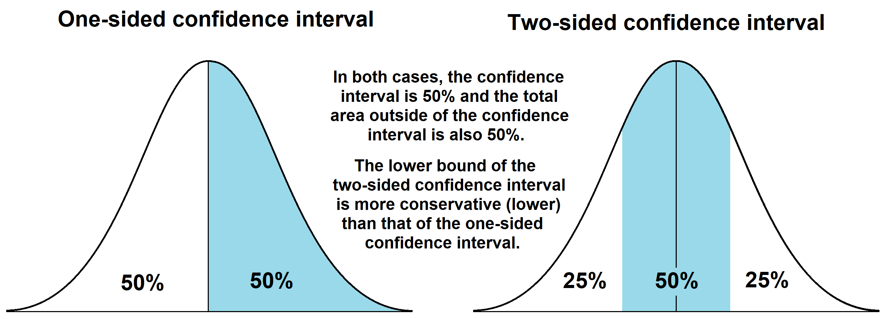

.. image:: images/logo.png

-------------------------------------

Reliability test planner
''''''''''''''''''''''''

A solver to determine the parameters of a reliability test when given 3 out of the 4 unknowns (lower confidence bound on MTBF, test duration, number of failures, confidence interval).

The underlying assumption is that the failures follow an exponential distribution (ie. failures occur randomly and the hazard rate does not change with age). Using this assumption, the The Chi-squared distribution is used to find the lower confidence bound on MTBF for a given test duration, number of failures, and specified confidence interval.:

:math:`MTBF = \frac{2T}{\chi^{2}\left((1-CI)/n,2F+p\right)}`

Where:

- MTBF = Mean time between failures (same as mean time to failure (MTTF) when the hazard rate is constant as it is here). Note that this is the lower confidence interval on MTBF. If you want the point estimate then specify CI=0.5 and two_sided=False.
- T = Test duration (this is the total time on test across all units being tested)
- CI = Confidence interval (the confidence interval to be used for the lower bound on the MTBF)
- F = number of failures during the test
- n = adjustment for one sided (n=1) or two sided (n=2) test
- p = adjustment for time terminated (p=2) or failure terminated (p=0) test

The above formula can be rearranged, or solved iteratively to determine any of these parameters when given the other 3. The user must specify any 3 out of the 4 variables (not including two_sided, print_results, or time_terminated) and the remaining variable will be calculated. Note the difference between the one-sided and two-sided confidence intervals which are specified using the input two_sided=True/False described below. A description of the difference between one-sided and two-sided confidence intervals is provided at the end of this page. The formula used defaults to a time_terminated test (where the test was stopped at a particular time which was not related to the number of failures). If the test was stopped after a particular number of failures (such as all items failing) then you must specify time_terminated=False to ensure the correct formula is used.

A similar calculator is available in the `reliability analytics toolkit <https://reliabilityanalyticstoolkit.appspot.com/confidence_limits_exponential_distribution>`_.

Inputs:

-   MTBF - mean time between failures. This is the lower confidence bound on the MTBF. Units given in same units as the test_duration.
-   number_of_failures - the number of failures recorded (or allowed) to achieve the MTBF. Must be an integer.
-   test_duration - the amount of time on test required (or performed) to achieve the MTBF. May also be distance, rounds fires, cycles, etc. Units given in same units as MTBF.
-   CI - the confidence interval at which the lower confidence bound on the MTBF is given. Must be between 0.5 and 1. For example, specify 0.95 for 95% confidence interval.
-   print_results - True/False. Default is True.
-   two_sided - True/False. Default is True. If set to False, the 1 sided confidence interval will be returned.
-   time_terminated - True/False. Default is True. If set to False, the formula for the failure-terminated test will be used.

Outputs:

-   If print_results is True, all the variables will be printed.
-   An output object is also returned with the same values as the inputs and the remaining value also calculated. This allows for any of the outputs to be called by name.

In the example below, we have a component that needs to perform with a MTBF of 500 hours (units are not important here as it may be days, cycles, rounds, etc.). We have been allocated 10000 hours of test time, and we want to know the number of failures permitted during the test to ensure we meet the MTBF to within an 80% confidence (two-sided).

.. code:: python

    #example 1
    from reliability.Other_functions import reliability_test_planner
    reliability_test_planner(test_duration=19520,CI=0.8,number_of_failures=7)
        
    '''
    Reliability Test Planner results for time-terminated test
    Solving for MTBF
    Test duration: 19520
    MTBF (lower confidence bound): 1658.3248534993454
    Number of failures: 7
    Confidence interval (2 sided):0.8
    '''
    
    #example 2
    output = reliability_test_planner(number_of_failures=6,test_duration=10000,CI=0.8, print_results=False)
    print(output.MTBF)
    
    '''
    949.4807763260345
    '''

One-sided vs two-sided confidence interval
==========================================

The below image illustrates the difference between one-sided and two-sided confidence interval. You can use either the one-sided or two-sided interval when you are seeking only the lower bound, but it is essential to understand that they will give very different results for the same CI. They will give equivalent results if the CI is set appropriately (eg. 90% one-sided is the same as 80% two-sided). If you are unsure which to use, the more conservative approach is to use the two-sided interval. If you want the point estimate, use the one-sided interval with a CI=0.5.

